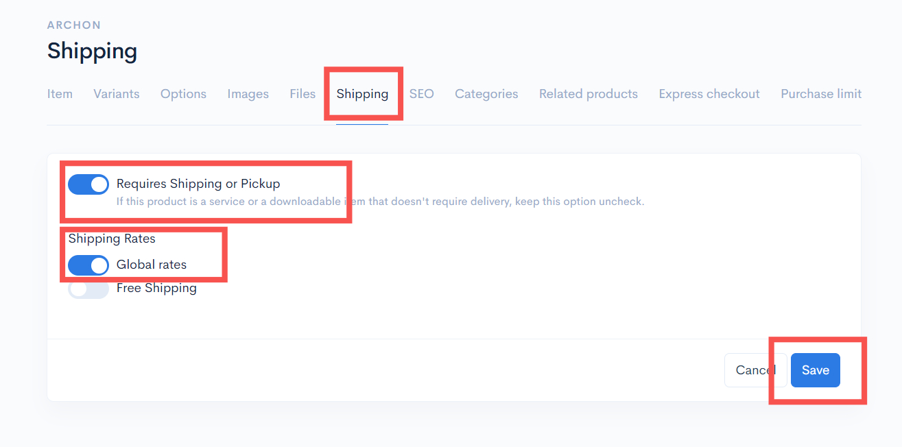
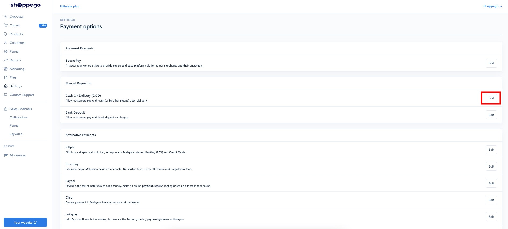
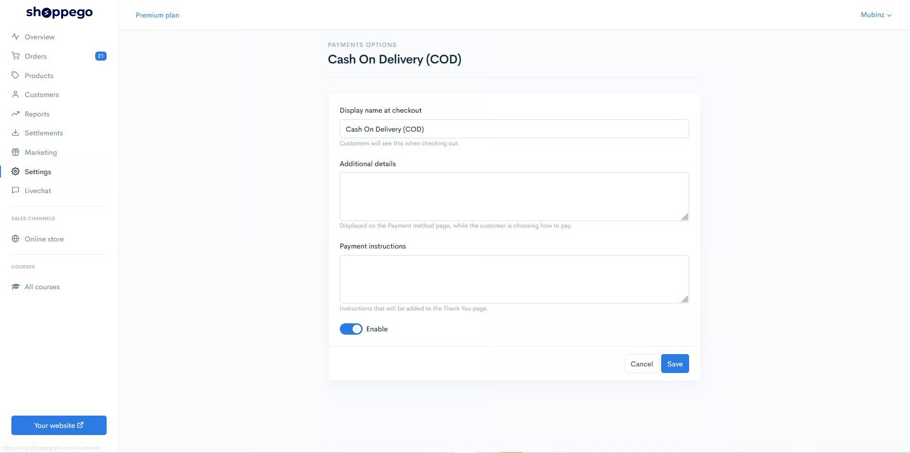
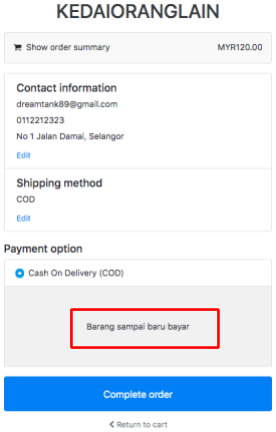
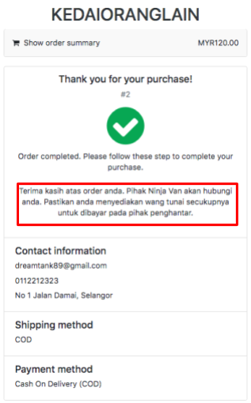
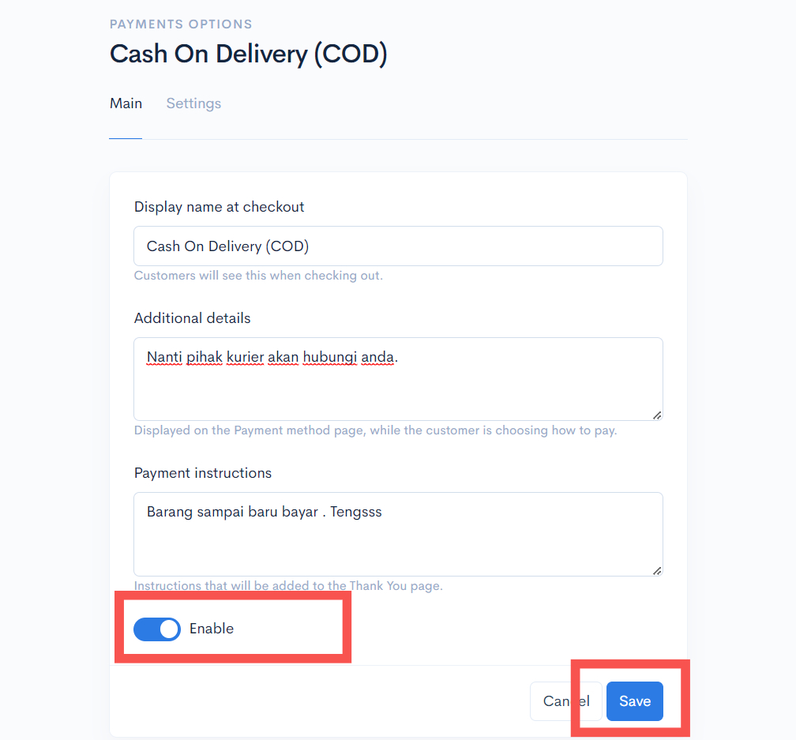

# COD payment

## Setting Global Rates&#x20;


\*\*<mark style="color:red;">**Attention**</mark>: Before you continue with this tutorial, make sure that your products are in the **Global Rates state**.


You can go to:

**Dashboard Overview -> Products -> Choose Your Product -> Edit -> Shipping -> Global Rates (On) / Requires Shipping or Pickup (On) -> Save.**

<figure><figcaption></figcaption></figure>

## Part 1: Setup COD Payment

1\. Log in to the Shoppego Dashboard -> **Settings**

2\. On the Settings page, click **Payment Options**

3\. On the Cash On Delivery (COD) option, click **Activate/Edit**

4\. Make sure the display is like the picture below. Enter the information in the space provided.

* Fill in the information in the **form of instructions, reminders, or information** on the "**Additional Details**" form.
* The information filled in this section will be displayed on the "**Checkout Page**" when the user wants to make a purchase.
* **For example "Barang sampai baru bayar".**

So this information will be displayed before the complete order.

This "**Payment Instruction**" form will be displayed on the "**Thank You**" page after the user clicks the "**Complete order**" button. See figure below.


\*\*<mark style="color:red;">**Attention**</mark>: Make sure the "**Enable"** box is marked and continue to press the "**Save**" button.


<figure><figcaption></figcaption></figure>
