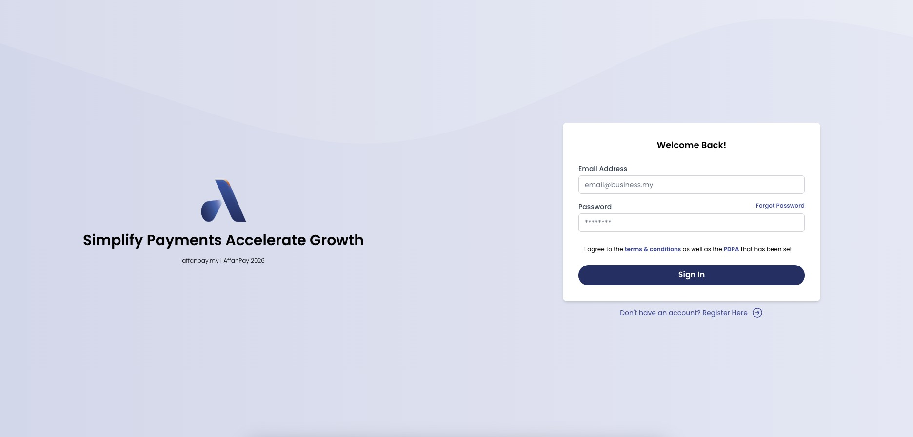
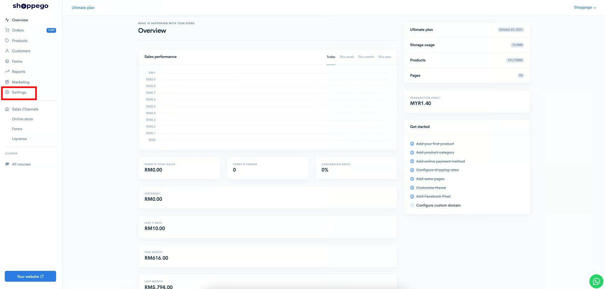
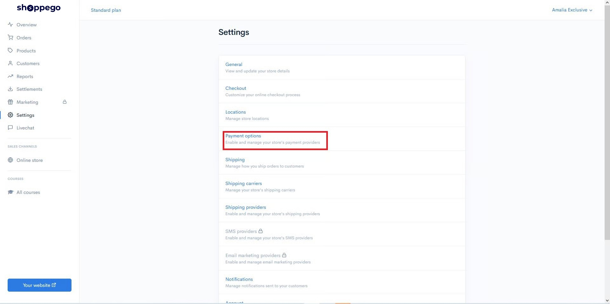
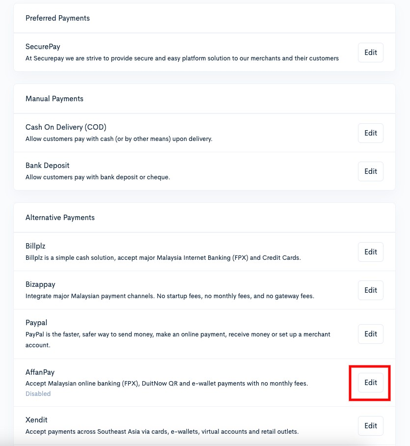
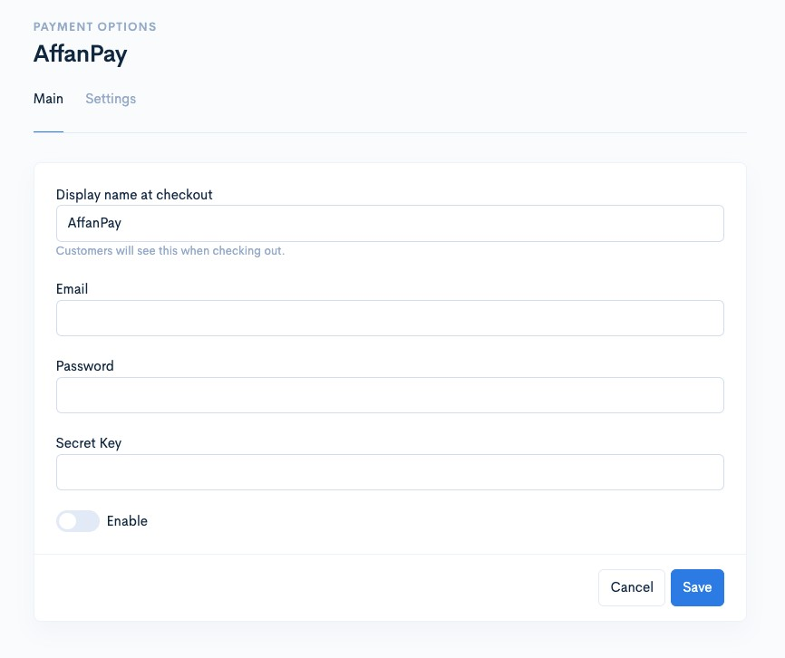
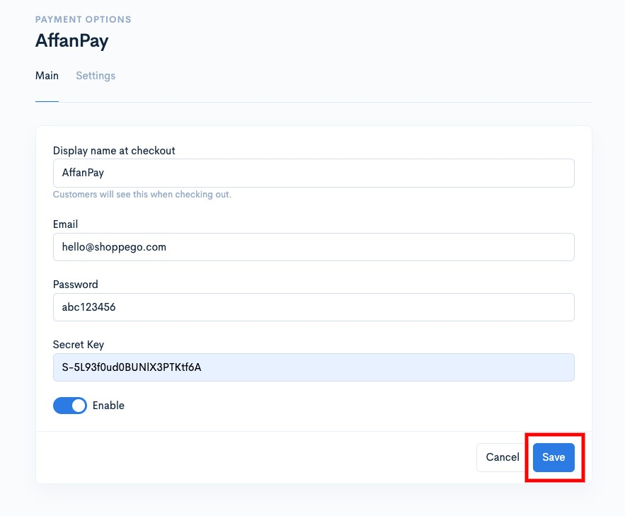

# AffanPay

To use AffanPay, please ensure that you have **first created** an **AffanPay account**.


You need to make sure you have:

* Possesses SSM/TIN
* Current bank account.



**Account verification, charges, and transaction funds are managed entirely by AffanPay.**


## On This Page:

* [Settings in AffanPay](affanpay.md#settings-in-affanpay)
* [Settings on Shoppego](affanpay.md#settings-on-shoppego)

## Settings in AffanPay


**Before following this tutorial, ensure that your AffanPay account has been verified and that you are not using a test account.**


To integrate payment gateway AffanPay with Shoppego, you need to get a **Secret Key**.\
\
If you haven't registered for an Affanpay account yet, you can use this link:\
[https://app.affanpay.my/register](https://app.affanpay.my/register)

### Get Secret Key

1. Log in to your AffanPay account.

<figure><figcaption></figcaption></figure>

2. Click on the **Settings > Developers** button/text. You will then be able to view your account's **Secret key**, which you can copy and enter into the Shoppego settings.

## Settings on Shoppego

1\. Log in to your Shoppego account.

2\. Click on **Settings**

3\. Click on **Payment options.**

4\. If you have not yet activated the payment option for AffanPay, click the "**Activate**" button under the "**Alternative Payments**" section for AffanPay. If you have already activated the payment option for AffanPay, click the "**Edit**" button.

5\. Next, the display shown below will appear, and you can fill in the information:

* **Display name at checkout : Enter the payment name you want (Example AffanPay)**
* **Email :** **Enter your AffanPay account email.**
* **Password : Enter your AffanPay account password.**
* **Secret Key : Enter the Secret Key for your AffanPay account that you just copied in the previous step.**

6\. After finishing, make sure you have clicked **Enable** and click the **Save** button.

After saving, you can attempt a purchase on your website to view the AffanPay payment option at checkout and verify the settings you just configured.
