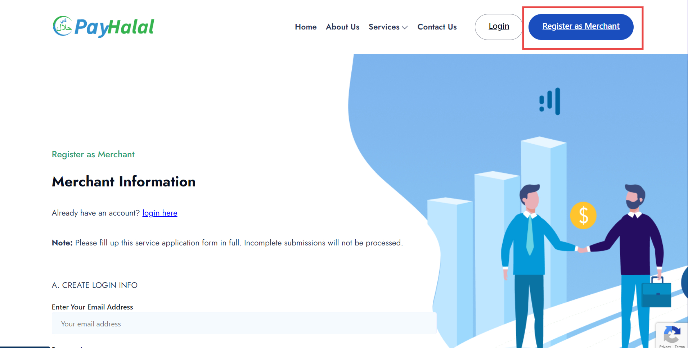

# Payhalal

## Payhalal Account Registration

Click on this link <https://payhalal.my/merchant-register> to start registering your Payhalal account.&#x20;


To begin registering your Payhalal Account, you must ensure you **do :**&#x20;

* **Have SSM**&#x20;
* **Current Bank Account.**&#x20;
  


**Account verification, fees, and transactional funds,** they are **fully managed by Payhalal.**


## Get all the required keys for the Payhalal account.

To connect **Payhalal** with the Shoppego website, you will be required several keys for the verification process. The keys needed are the **App key** and the **Secret key**.

To set up the Payhalal payment gateway, kindly follow these steps:&#x20;

1\. Login into your Payhalal account.

<figure><figcaption></figcaption></figure>

2\. Sign-in email and password used during registration.&#x20;

<figure><figcaption></figcaption></figure>

3\. Then, on the **Payhalal Dashboard**, you will see the menu on the sidebar. Click on **General**.

<figure><figcaption></figcaption></figure>

4\. After that, you need to go to the **Developer Tools** and **Create App** to get the **App Key** and the **Secret key**.&#x20;

<figure><figcaption></figcaption></figure>

5\. After that, you need to key in all the required information.

* App Name: You can put it as My App&#x20;
* Website: This is Optional (Not compulsory to be filled)

In the App setting section as below you need to make sure you **use the URL <https://subdomain> .myshoppegram.com of your Shoppego website which has been given for free by Shoppego during the registration of the Shoppego account**.

You can find your subdomain URL in the following section:\
Dashboard Overview Shoppego -> **Settings** -> **Custom domain** -> **Subdomain**

<figure><figcaption></figcaption></figure>

For example, **the subdomain link that you will use later is like this: <https://hartamas.myshoppegram.com>**. Make sure every available URL setting space uses the subdomain link and follows the given format. You can copy the link below and place it in the App you have created.

* Success URL : \
  <https://hartamas.myshoppegram.com/checkouts/payments/redirect/payhalal>
* Callback URL: <https://hartamas.myshoppegram.com/webhooks/payments/callback/checkouts/payhalal>
* Cancel URL: \
  [https://hartamas.myshoppegram.com/checkouts/payments/redirect/payhalal](https://kedaianda.com/checkouts/payments/redirect/payhalal)
* Return URL: \
  <https://hartamas.myshoppegram.com/checkouts/payments/redirect/payhalal>

<figure><figcaption></figcaption></figure>

6\. After you have done this, click **Save changes**.&#x20;

<figure><figcaption></figcaption></figure>

7\. Then, you will see several crucial data which are **App Key** and **Secret Key**. You can click on both icons highlighted in the red box to **view** and **copy the keys** to be put in the Shoppego settings.&#x20;

<figure><figcaption></figcaption></figure>

## **Shoppego Setting**

To set up the payment gateway **Payhalal** in Shoppego, you need to activate the payment gateway and insert both keys the **App key** and the **Secret Key** in your payment gateway setting.

1. Log in to your Shoppego account.

<figure><figcaption></figcaption></figure>

2\. Then, click on **Settings**, and click on the **Payment Options** section.

<figure><figcaption></figcaption></figure>

3\. You can click on **Activate** / **Edit** on the Payhalal payment gateway.

<figure><figcaption></figcaption></figure>

4\. After that, you will be required to key in **App Key** and **Secret Key** that have been copied from Payhalal.&#x20;


If you want to perform a **real transaction**, kindly <mark style="color:red;">**deactivate**</mark> the **Test Mode** toggle.&#x20;


<figure><figcaption></figcaption></figure>

## Website View Example

After completing the setup, you can try to do a transaction or a purchase on your Shoppego Website and view the result for yourself.&#x20;

1. You can choose the Payhalal payment option as your payment gateway.

<figure><figcaption></figcaption></figure>

Congratulations! Now setup for your Payhalal is ready and successful!
