# Stripe

To use Stripe please make sure you have **created a Stripe** account first.


**Account verification, fees, and transactional funds,** they are **fully managed by Stripe.**



The minimum transaction amount for Stripe is at least RM2.00


## Get an API key on Stripe

1\. Stripe account registration can be done at: [https://dashboard.stripe.com/register](https://dashboard.stripe.com/register)

2\. To get the **live key** you can find it on the dashboard or just click this link: [https://dashboard.stripe.com/login?redirect=%2Faccount%2Fapikeys](https://dashboard.stripe.com/login?redirect=%2Faccount%2Fapikeys)

3\. Once you get the **Publishable key** and **Secret key** you can save the key for setting in Shoppego.

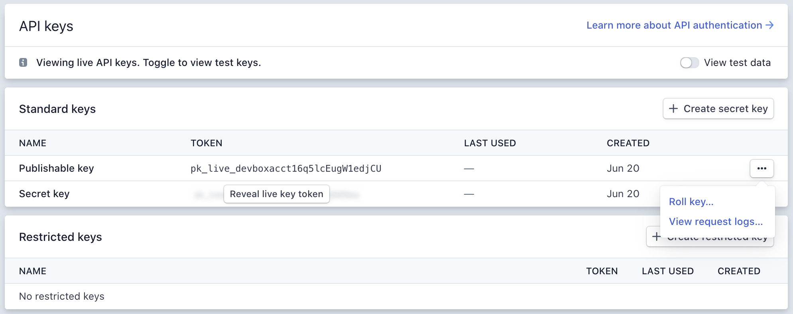

## Webhooks settings at Stripe

There are **2 types of webhooks** that you need to enter in the webhooks settings of your Stripe account, namely:\
1\. [https://hartamas.myshoppegram.co\&#x6D;\*\*/webhooks/payments/callback/checkouts/stripe\*\*\\\\](https://hartamas.myshoppegram.co&/#x6D;**/webhooks/payments/callback/checkouts/stripe**\\\\) 2. [https://hartamas.myshoppegram.co\&#x6D;\*\*/webhooks/payments/callback/typ\\\\\_offer/stripe](https://hartamas.myshoppegram.co&/#x6D;**/webhooks/payments/callback/typ\\\\_offer/stripe)\*\*

You are **required to replace the** [**https://hartamas.myshoppegram.com**](https://hartamas.myshoppegram.com) **with the URL** [**https://subdomain.myshoppegram.com**](https://subdomain.myshoppegram.com) **of your own website which has been given for free during the registration of your Shoppego account**.

You can find your subdomain URL in the following section:\
Dashboard Overview Shoppego -> **Settings** -> **Custom domain** -> **Subdomain**

<figure><figcaption></figcaption></figure>

You can refer to examples of setting webhooks below:

1. In the Stripe dashboard, you can click on the **Developers** -> **Webhooks** section. You can also click on this link directly: [https://dashboard.stripe.com/webhooks](https://dashboard.stripe.com/webhooks)

<figure>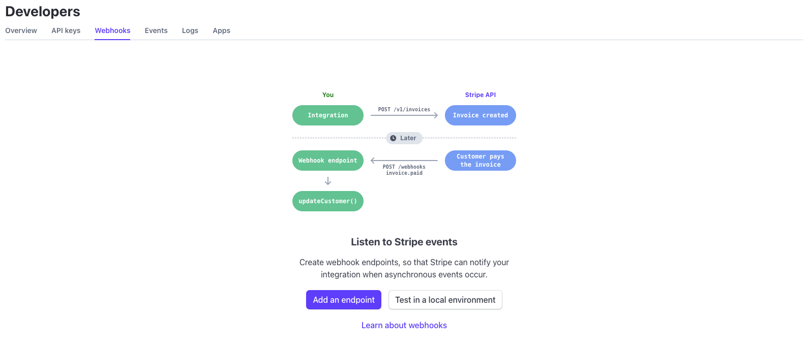<figcaption></figcaption></figure>

2. Next, you can click on **Add an endpoint/Add endpoint**

<figure>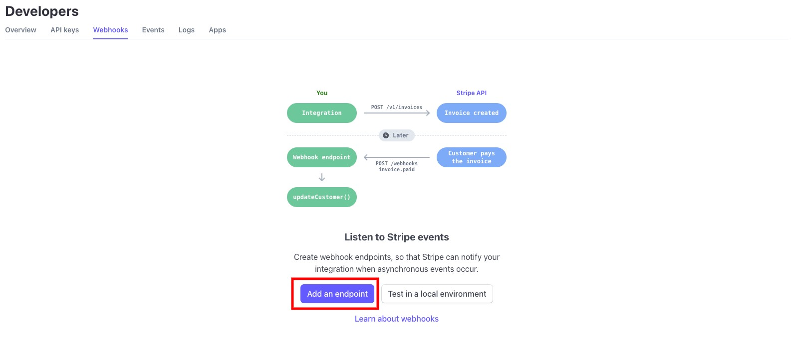<figcaption></figcaption></figure>

3. Next, you can **enter one of your unique webhooks store URLs in the Endpoint URL section**. For example here, we have entered this URL first: [https://hartamas.myshoppegram.com/webhooks/payments/callback/checkouts/stripe](https://hartamas.myshoppegram.com/webhooks/payments/callback/checkouts/stripe)

<figure>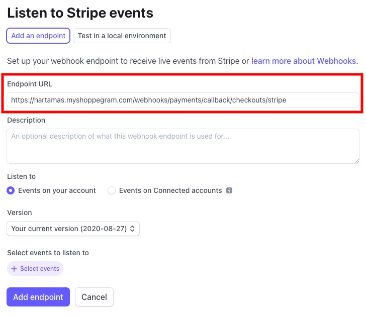<figcaption></figcaption></figure>

4. Then, you can **click on the Select events button**

<figure>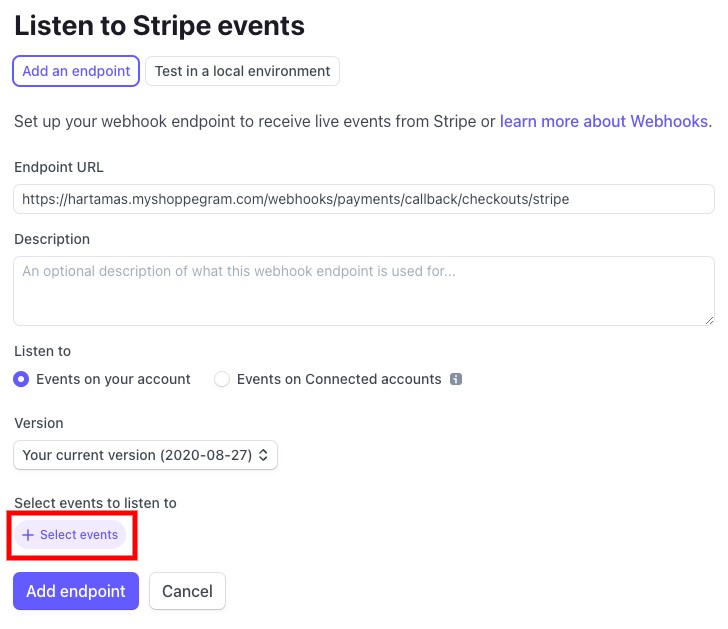<figcaption></figcaption></figure>

5. Once you can see the event selection display, you can **search for events** that have the name **Payment Intent** and you can **click on the event**.

<figure>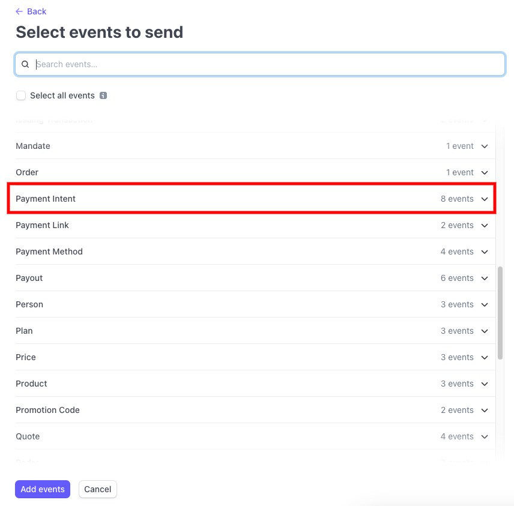<figcaption></figcaption></figure>

6. Then, you can **tick Select all Payment Intent events** first.

<figure>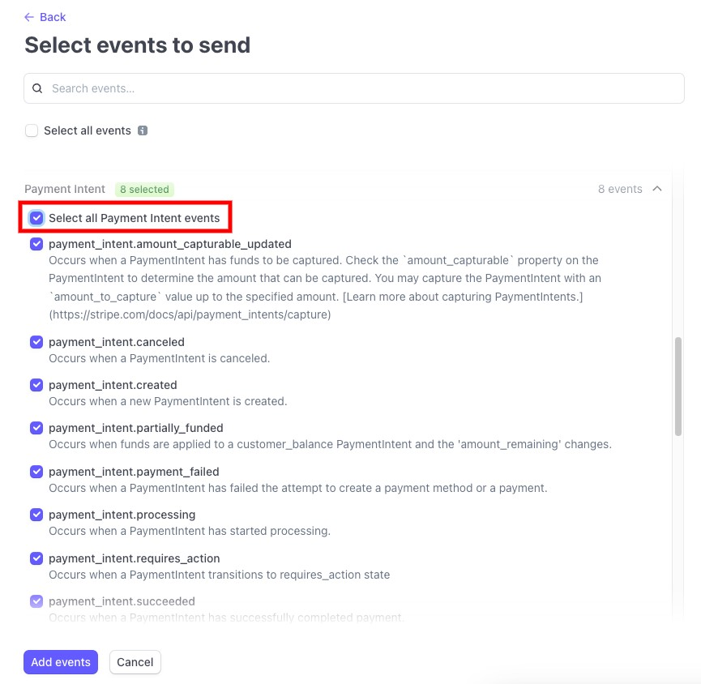<figcaption></figcaption></figure>

7. Next, you can **untick checkbox payment\_intent.amount\_capturable\_updated** and **payment\_intent.partially\_funded** settings

<figure>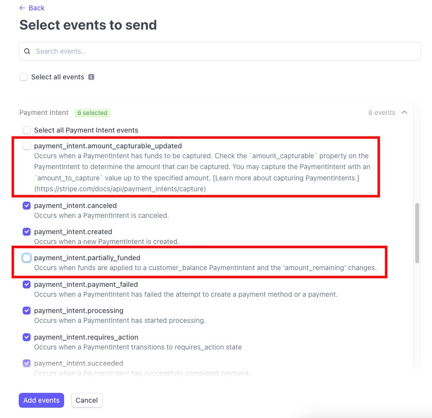<figcaption></figcaption></figure>

8. Once done, you can click on the **Add events button**

<figure>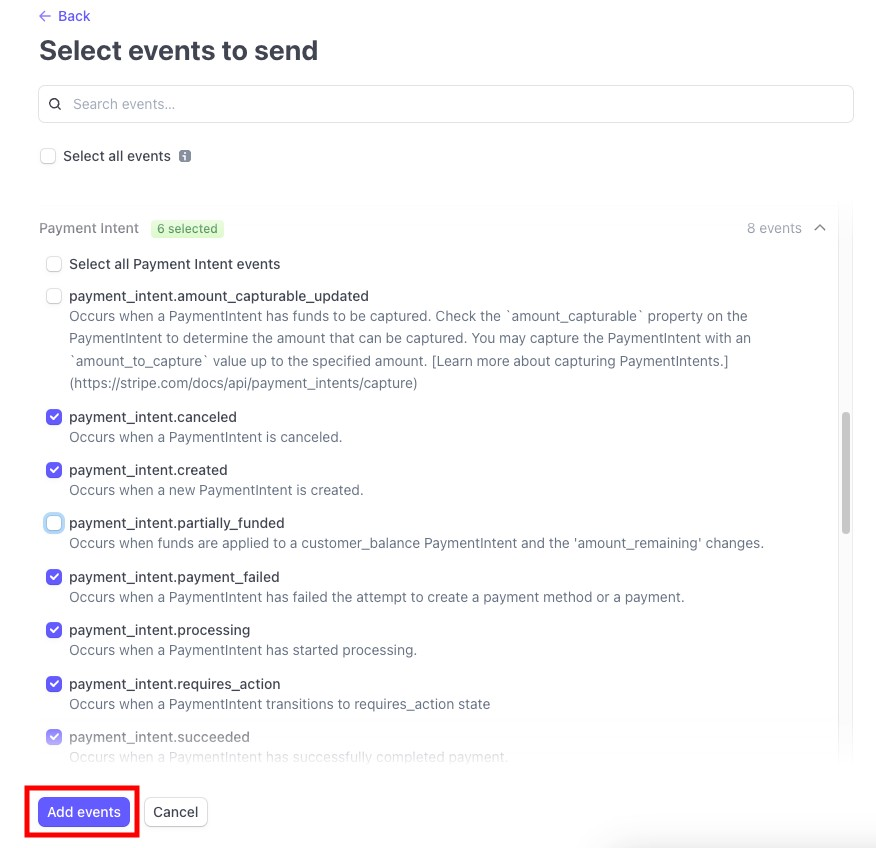<figcaption></figcaption></figure>

9. Once you make sure your settings are correct, you can click on the **Add endpoint button**

<figure>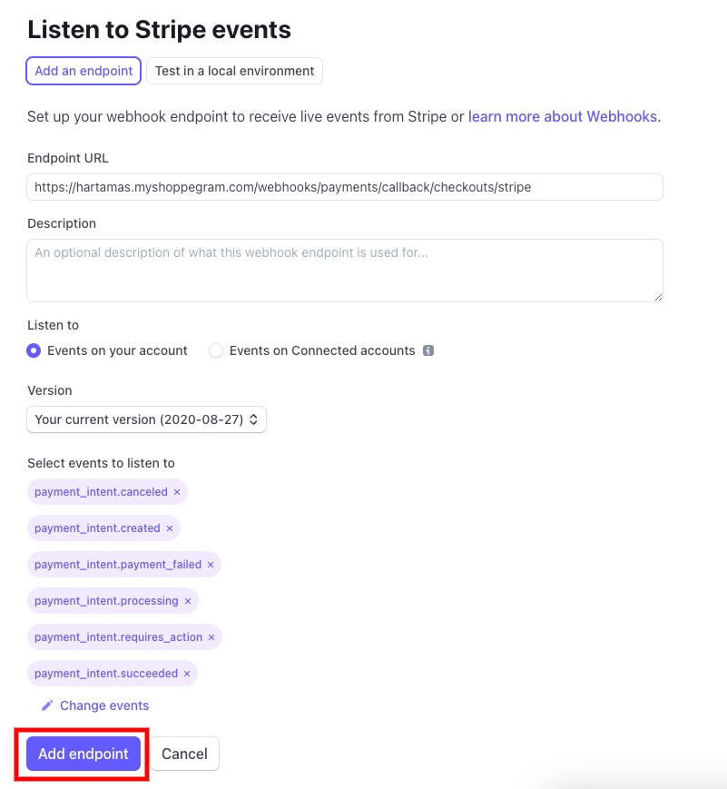<figcaption></figcaption></figure>

10. If you are taken to this page, you can simply click again on the **Webhooks** button

<figure>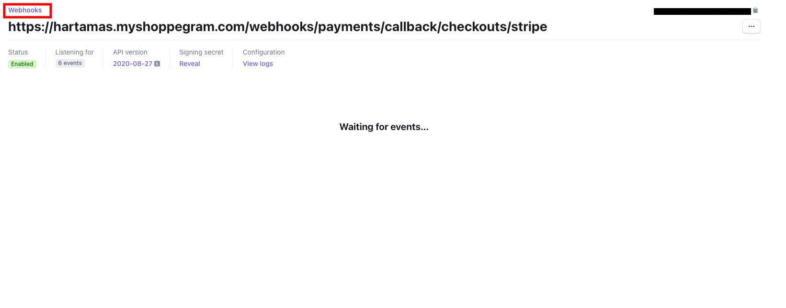<figcaption></figcaption></figure>

11. Later, you will be taken back to the Webhooks page and you can see the endpoint setting you just made earlier. Next, you can **repeat the steps above and enter the second endpoint/webhooks URL**.

<figure>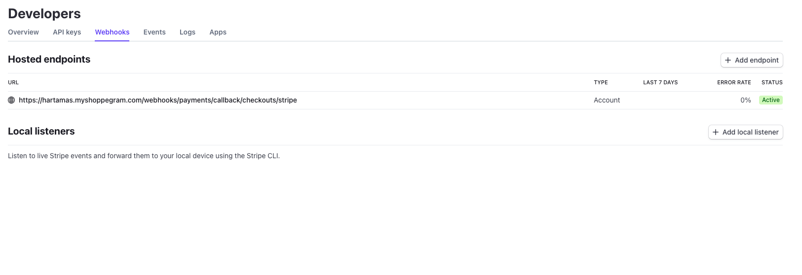<figcaption></figcaption></figure>

Once finished, you should have **2 endpoints/webhooks URL** as shown below:

<figure>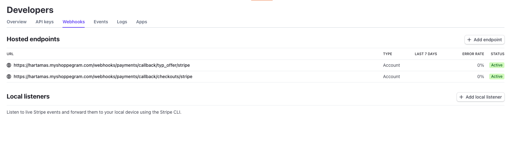<figcaption></figcaption></figure>

## Setup in Shoppego

1\. Log in to your Shoppego account.

2\. Click on **Settings**

3\. Click on **Payment options**

4\. If you have not enabled the payment option for Stripe. Click the **Activate** button in the Alternative Payments for Stripe section.

If you have enabled the payment option for Stripe, click the **Edit** button.

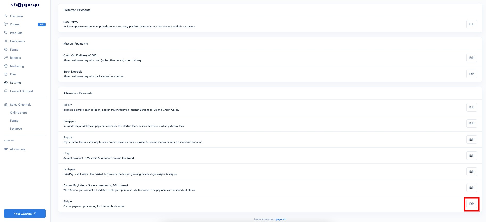

5\. Next will appear the display as below, you can fill in the information:

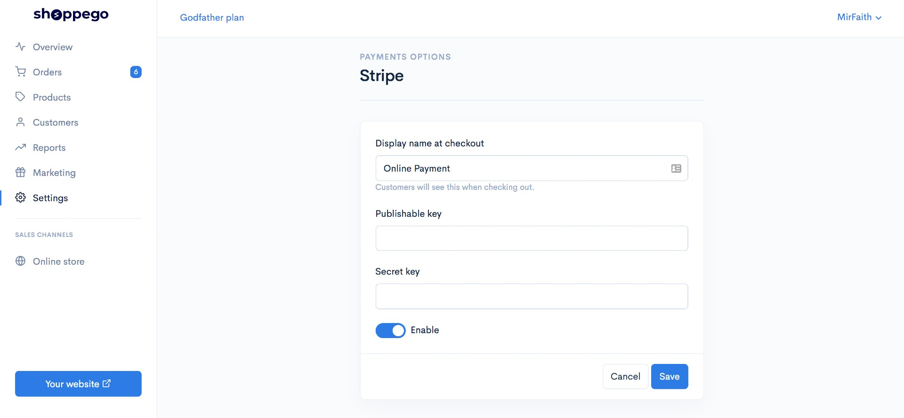

* **Display name at checkout: Enter the name of the payment you want (Example Online Payment)**
* **Publishable key: Enter the Publishable key you already got in your Stripe account.**
* **Secret key: Enter the Secret key you already got in your Stripe account.**

6\. Once done make sure you have clicked **Enable** and click the **Save** button.


If you want to perform a **real transaction**, kindly <mark style="color:red;">**deactivate**</mark> the **Test Mode** toggle


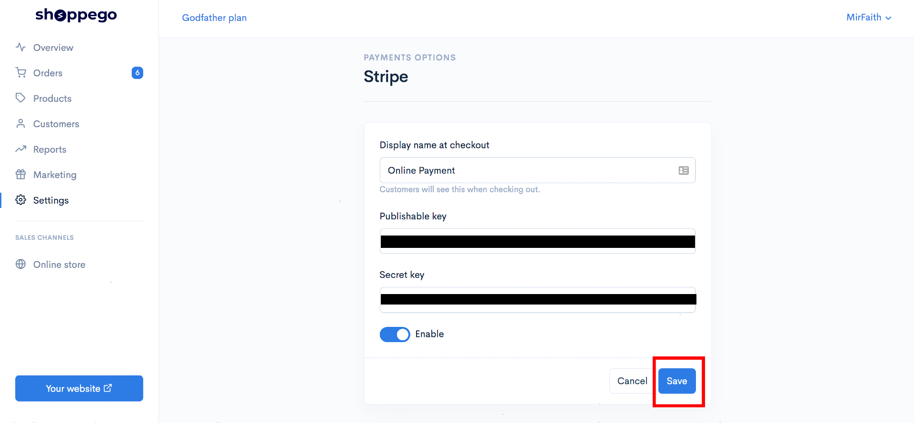

7\. After **Save** you can make a purchase attempt on your website to see the Stripe payment option during checkout for the setting that you just set just now.
