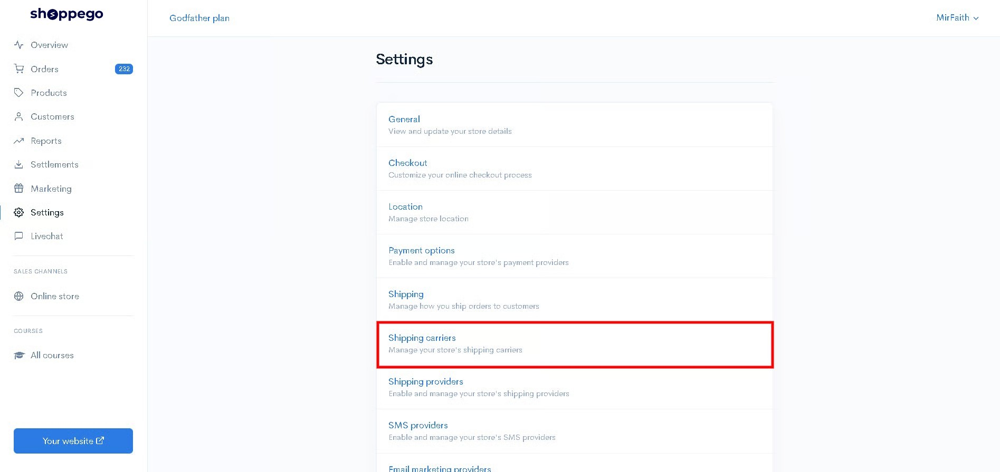
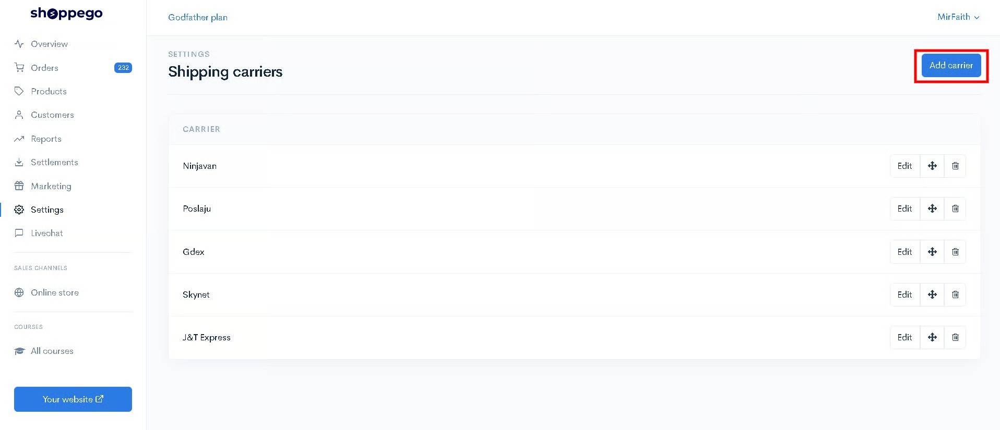
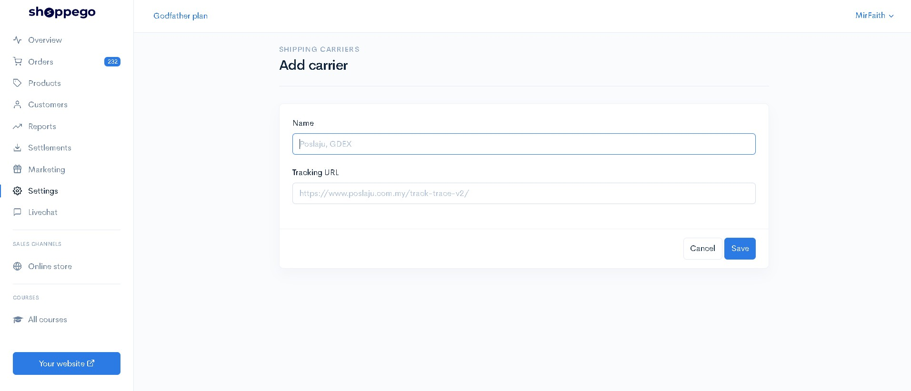
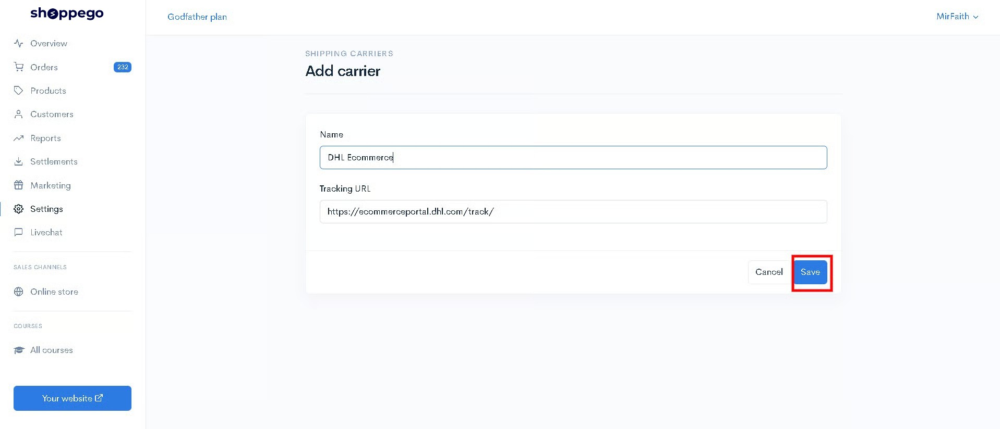
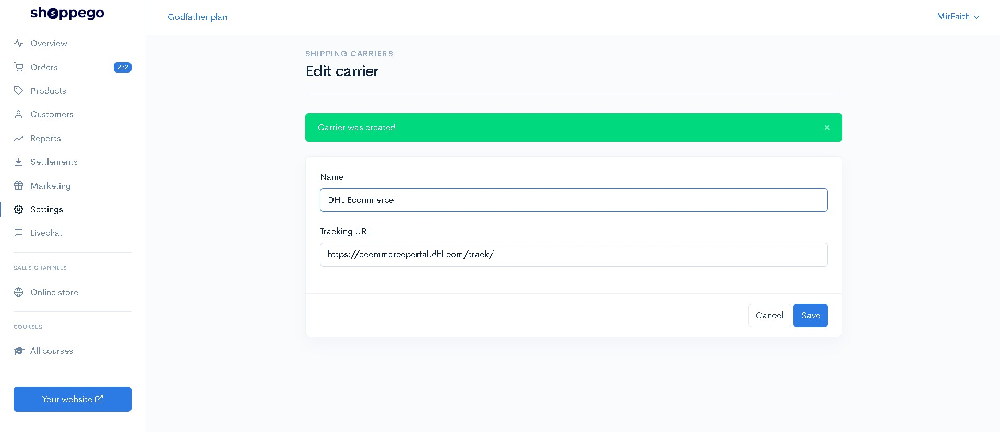

# Shipping Carriers

In Shoppego, you can set the shipping carrier that you use to facilitate the process of adding tracking URL for each order that you are ready for delivery.

### Setup 

1\. Log in to your Shoppego Dashboard account

2\. Click on **Settings**

3\. Click on **Shipping carriers**

4\. Click on **Add carrier**

5\. Next you will be asked to fill in the space provided as shown below.

<table data-header-hidden><thead><tr><th width="156"></th><th></th></tr></thead><tbody><tr><td><strong>Name</strong></td><td>Enter the name of your shipping carrier. For example, Poslaju and so on</td></tr><tr><td><strong>Tracking URL</strong></td><td>Enter a link for your customers to track their orders for the shipping carrier you use. You can get the link through your shipping carrier's website.</td></tr></tbody></table>

### Additional Information

For information on setting the Tracking URL, you can add the Custom variable that we have provided. For now, there is 1 custom variable that you can use in the Tracking URL:

| Custom Variable            | Explaination                                                                               |
| -------------------------- | ------------------------------------------------------------------------------------------ |
| **{{ tracking\_number }}** | The system will automatically enter the tracking number of the order in your tracking URL. |

6\. Once you enter the details you can click **Save**

Now your add carrier setup is successful.

