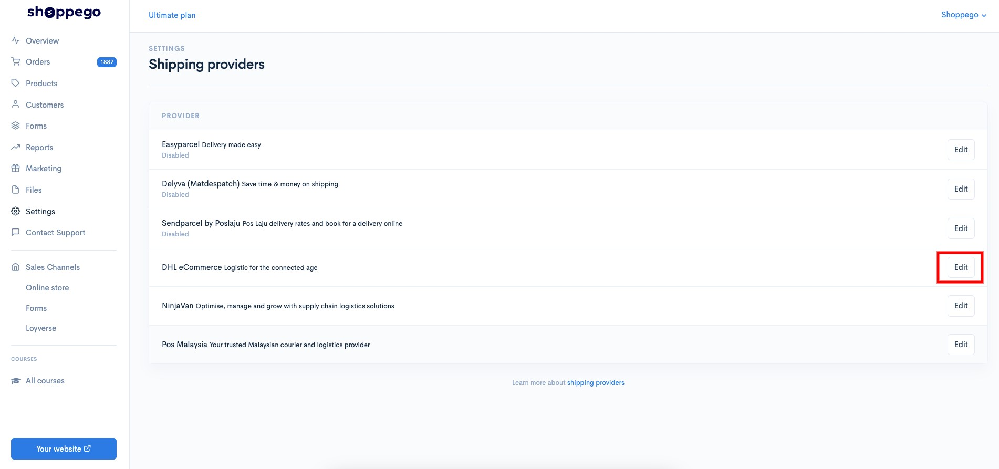
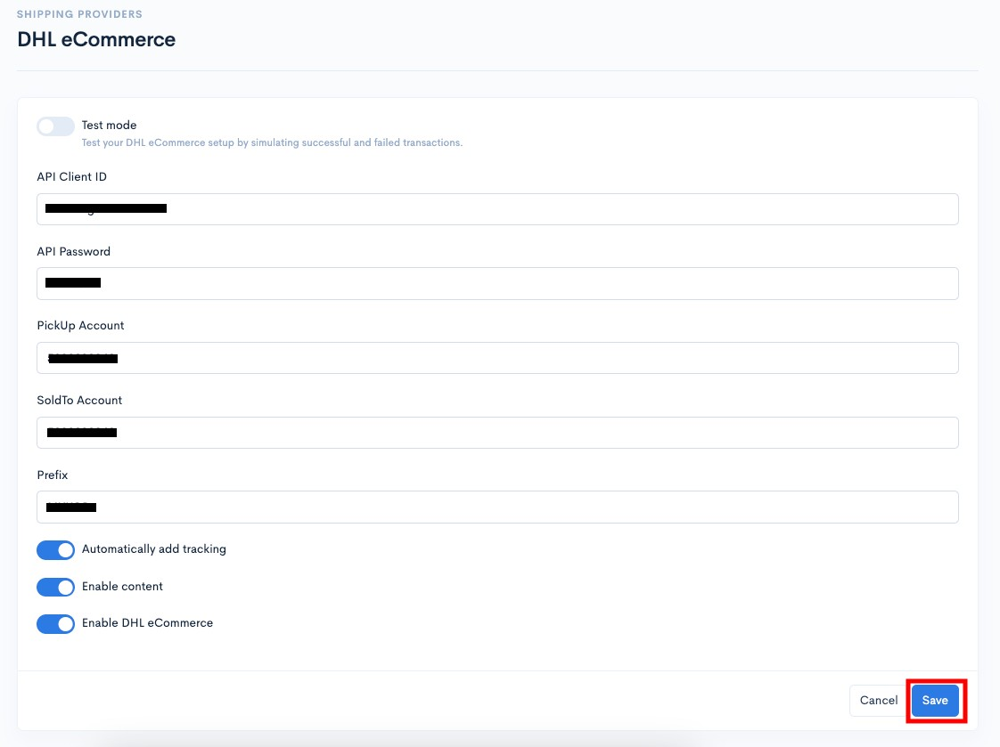
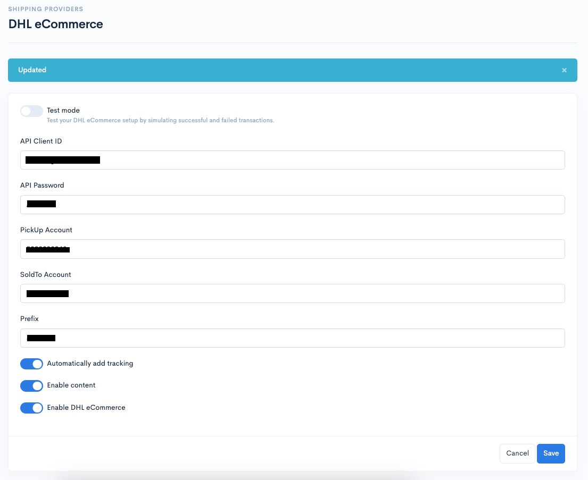
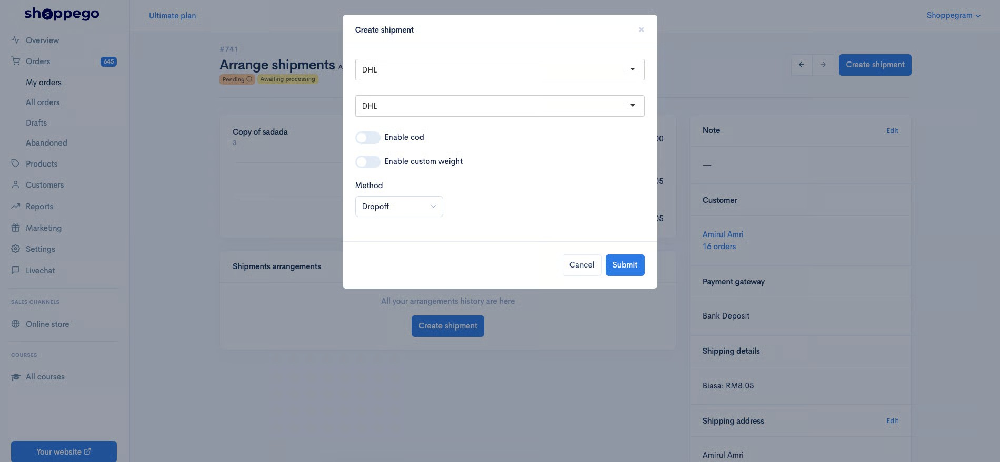
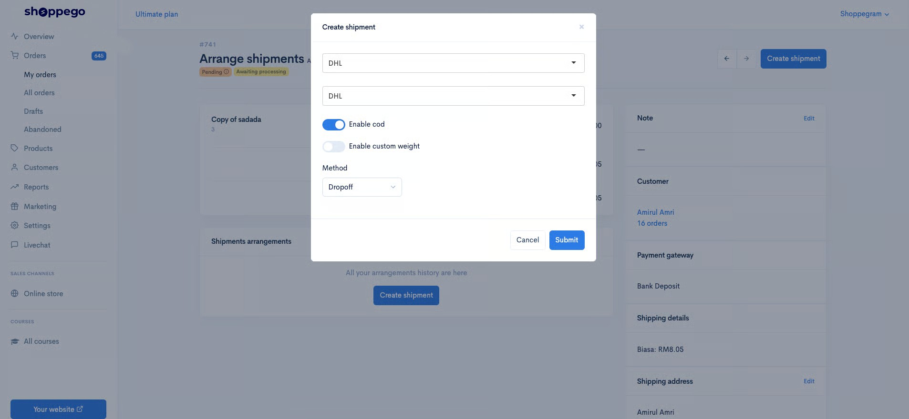
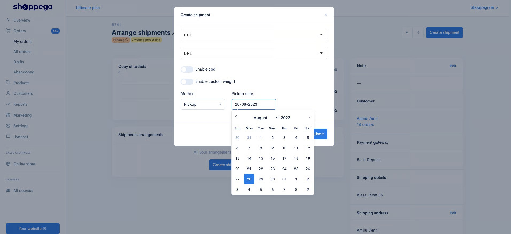
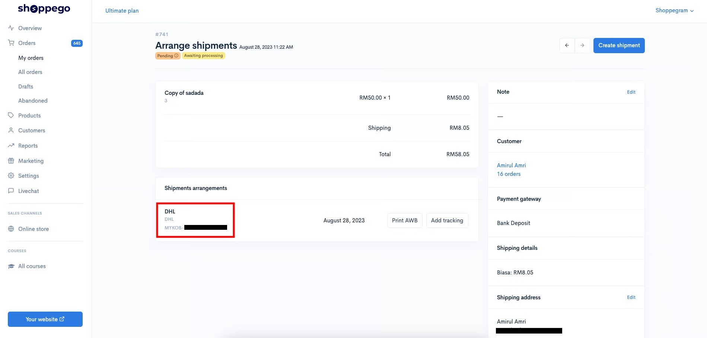

# DHL eCommerce


This function is available for **Premium** and **Ultimate plans** only.


For information, in order to set this integration, you need to have:

* API Client ID
* API Password
* PickUp Account
* SoldTo Account
* Prefix


**You can get all this information above by contacting your DHL eCommerce sales/account manager.**


Once you have all the information required for the integration, you can follow the steps below to set it up in your Shoppego account.

1. Log in to your Shoppego account.

<figure><figcaption></figcaption></figure>

2. Click on **Settings**

<figure><figcaption></figcaption></figure>

3. Click on **Shipping provider**

<figure><figcaption></figcaption></figure>

4. Click **Edit/Activate** on **shipping provider DHL eCommerce**

<figure><figcaption></figcaption></figure>

5. Then, you can enter all the information in the available space and click **Save**.

<table><thead><tr><th width="193">Field</th><th>Description</th></tr></thead><tbody><tr><td><strong>Test mode</strong></td><td>Uncheck this setting to make sure you can use shipping provider DHL eCommerce. This setting can be used if you are a developer.</td></tr><tr><td><strong>API</strong> <strong>Client ID</strong></td><td>You can enter the <strong>API Client ID</strong> that you have obtained from your DHL eCommerce sales/account manager.</td></tr><tr><td><strong>API</strong> <strong>Password</strong></td><td>You can enter the <strong>API</strong> <strong>Password</strong> that you have obtained from your DHL eCommerce sales/account manager.</td></tr><tr><td><strong>Pickup Account</strong></td><td>You can enter the <strong>Pickup Account</strong> that you have obtained from your DHL eCommerce sales/account manager.</td></tr><tr><td><strong>SoldTo Account</strong></td><td>You can enter the <strong>SoldTo Account</strong> that you have obtained from your DHL eCommerce sales/account manager.</td></tr><tr><td><strong>Prefix</strong></td><td>You can enter the <strong>Prefix</strong> that you have obtained from your DHL eCommerce sales/account manager.</td></tr><tr><td><strong>Automatically add tracking</strong></td><td>You can activate this toggle if you want to make sure that every order that is processed in bulk to arrange shipment will also have the tracking number you want added automatically. (Ultimate users only)</td></tr><tr><td><strong>Enable content</strong></td><td>You can activate this toggle to make sure the product details purchased by the customer are on the AWB order.</td></tr><tr><td><strong>Enable DHL</strong></td><td>You need to activate this toggle to make sure you can use this DHL eCommerce shipping provider.</td></tr></tbody></table>

<figure><figcaption></figcaption></figure>

6. Once completed, your DHL eCommerce shipping provider setting process is now successful.

<figure><figcaption></figcaption></figure>

## How to Fulfill an Order

Tutorial on how to manage orders to generate an Airway Bill on the DHL eCommerce platform without logging in and only using the Commerce platform.

1. Log in to the **Commerce Dashboard** -> **Orders** in the left panel.&#x20;

2. Select and **click** on the **order** you want to ship using DHL eCommerce and the display will appear as below. Click the **Arrange shipment** button.

3. Press the **blue Create Shipment** button in the right corner.

4\. Next a popup will come out, you can click on **Select Shipment Provider** and choose **DHL**. Then click on **Choose Services** and click on any courier service you want to use. The price has been determined according to the address on the order.

5\. Next click on the method and select **Dropoff** or **Pickup**.


**Method** :&#x20;

* **Dropoff -** You yourself will go to the nearest post office and send the goods.&#x20;
* **Pickup** - The courier will send a vehicle to pick up the items that have been ordered at the address that has been specified in your Location setting.
  


**\*\*Note**: If you use **Cash On Delivery (COD)**, make sure you have **turned on the Enable COD toggle**.


<figure><figcaption></figcaption></figure>


Usually, the **Pickup** Method will be chosen to make it easier for the sellers.


6. When the **Pickup Method** is selected, a **schedule** will be displayed for the pick-up date selection by the courier. Click on the date you want and then click the **Submit** button. Refer to the picture below.

<figure><figcaption></figcaption></figure>

7. After clicking the **Submit** button, your order will automatically get a tracking number as shown in the picture below.


**An Airwaybill (AWB)** against this order has already been **automatically generated** and you only **need to print this AWB**.


<figure><figcaption></figcaption></figure>

Once the **Add Shipment** process is done, check in the DHL Dashboard to make sure the information displayed is the same.
