# NinjaVan


This feature is available for **Premium** and **Ultimate** plans only.


To do this, you need to make sure that you already have your own NinjaVan account.

If you already have your own NinjaVan account, you can follow the steps below to set it up in your Shoppego account.

1. Log in to your Shoppego account.

<figure><figcaption></figcaption></figure>

2. Click on **Settings**

<figure><figcaption></figcaption></figure>

3. Click on **Shipping provider**

<figure><figcaption></figcaption></figure>

4. Click **Activate delivery provider** on **NinjaVan**.

<figure>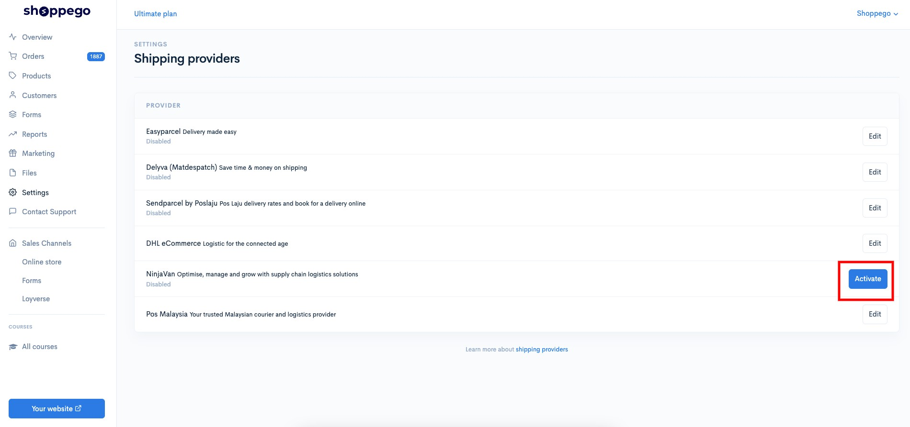<figcaption></figcaption></figure>

5. After that, you will be taken to the page as shown below and you can click **Install**

<figure>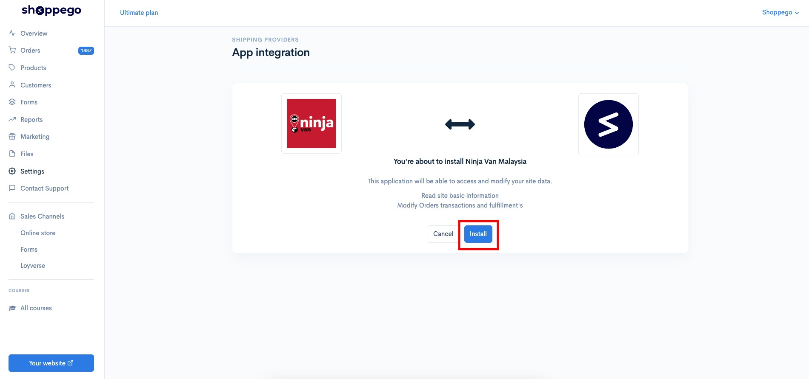<figcaption></figcaption></figure>

6. Next, you will be taken to the NinjaVan platform page and you will be asked to enter your **NinjaVan account login information**.

<figure>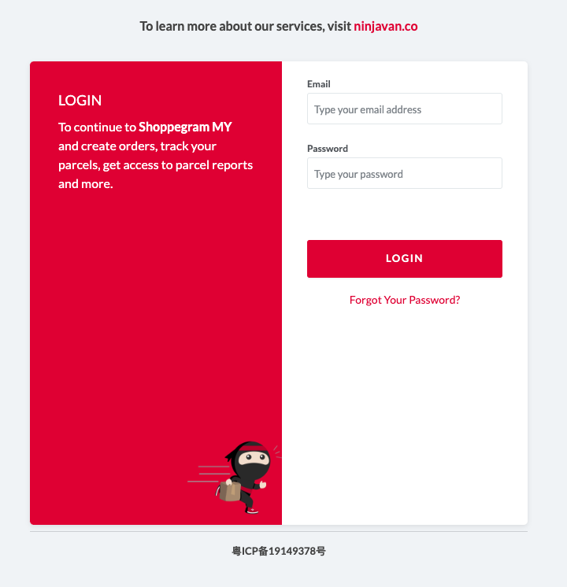<figcaption></figcaption></figure>

7. Once you have entered the requested information, you can click **Allow** as shown below.

<figure>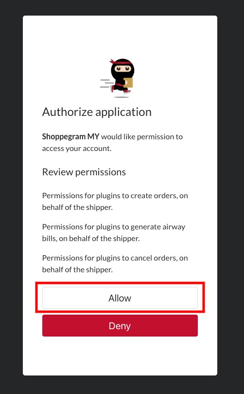<figcaption></figcaption></figure>

8. Once done, you can now review your NinjaVan shipping provider integration settings by clicking on the **Edit** button

<figure>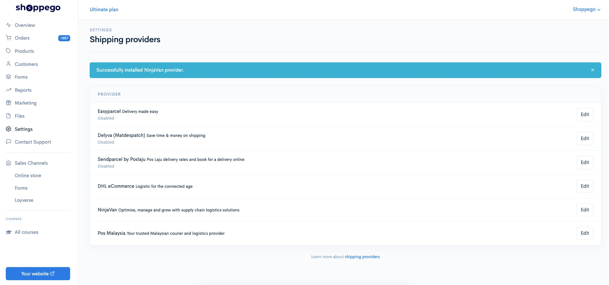<figcaption></figcaption></figure>

9. Then, you can check all the information in your NinjaVan shipping provider settings and click **Save**

<table><thead><tr><th width="193">Field</th><th>Description</th></tr></thead><tbody><tr><td><strong>Test mode</strong></td><td>Uncheck this setting to make sure you can use NinjaVan shipping provider. This setting can be used if you are a developer.</td></tr><tr><td><strong>Code</strong></td><td>Your NinjaVan account <strong>Code</strong>.</td></tr><tr><td><strong>Refresh Token</strong></td><td>Your NinjaVan account <strong>Refresh Token</strong>.</td></tr><tr><td><strong>Access Token</strong></td><td>Your NinjaVan account <strong>Access Token</strong>.</td></tr><tr><td><strong>Exchange Rate SG (S$)</strong></td><td>Your currency conversion rate <strong>to SGD</strong>.</td></tr><tr><td><strong>Exchange Rate PH (₱)</strong></td><td>Your currency conversion rate <strong>to Phillipines Peso</strong>.</td></tr><tr><td><strong>Enable content</strong></td><td>You can activate this toggle to make sure the details of the product purchased by the customer are on the AWB order.</td></tr><tr><td><strong>Enable NinjaVan</strong></td><td>You'll need to activate this toggle to make sure you can use NinjaVan's shipping provider.</td></tr></tbody></table>

<figure>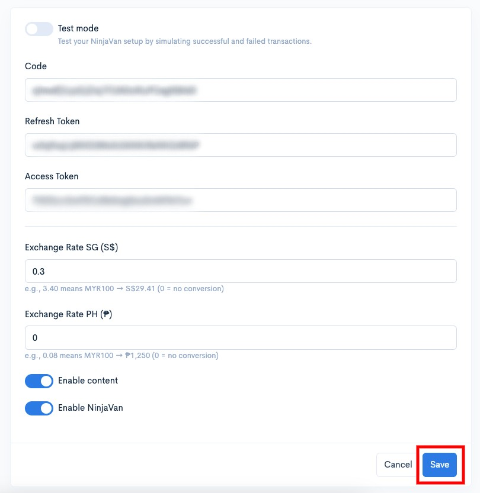<figcaption></figcaption></figure>

10. Now that you have completed the process of setting up your NinjaVan shipping provider, you are now successful.

<figure>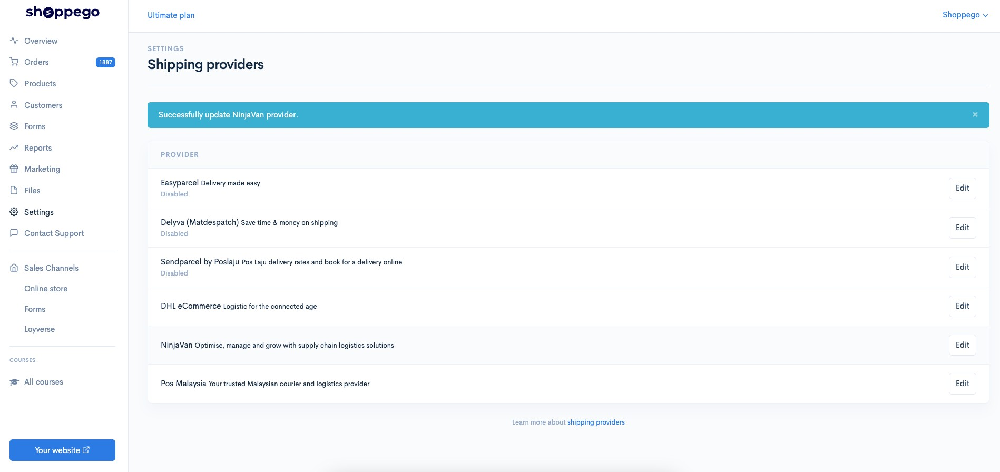<figcaption></figcaption></figure>

## How To Fulfill An Order

Tutorial setting in the section for how to manage orders to generate Airway bills on the NinjaVan platform without having to log in and only use the Commerce platform.

1. Log in to the **Commerce Dashboard** -> **Orders** in the left panel.

2. Select and **click** on **the order** you want to make delivery using NinjaVan and the display will come out as below. Click the **Arrange shipment** button.

3. Press the **Blue Create Shipment** button in the right corner.

4\. Next a popup will come out, you can click on **Select shipping Provider** and select **NinjaVan**. Then click on **Choose services** and click on any courier service you want to use. The price is determined according to the address on the order.

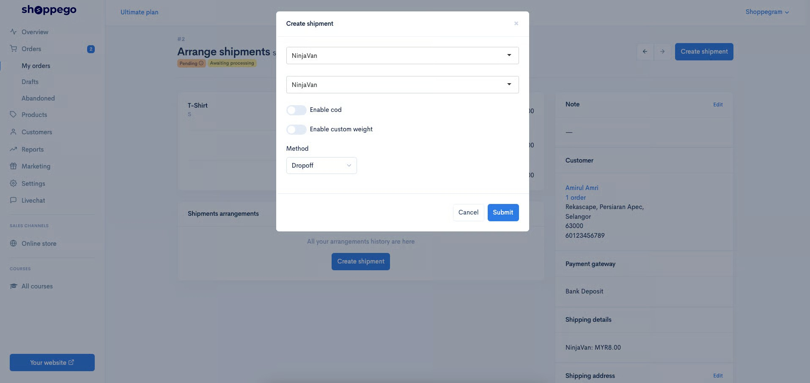

5\. Next click on method and select **Dropoff** or **Pickup**.


**Method** :&#x20;

* **Dropoff -** You yourself will go to the nearest post office and deliver the goods.&#x20;
* **Pickup** - The courier will send a vehicle to pick up the goods that have been ordered at the address specified in your Location setting.
  


**\*\*Note**: If you're using **Cash On Delivery (COD)**, make sure you have the **Enable COD** toggle turned on.


<figure>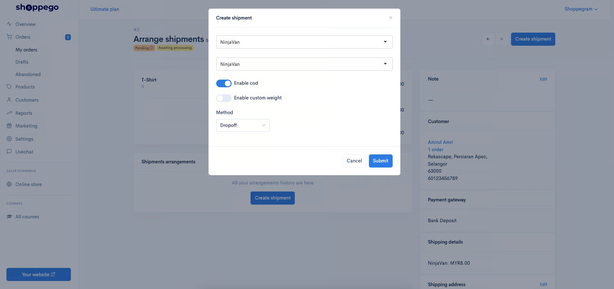<figcaption></figcaption></figure>


Usually, the **Pickup** Method will be chosen to make it easier for sellers.


6. When the **Pickup Method** is selected, **a table** will be displayed for The courier's pick-up date. Click on the date you want and then click the **Submit** button. Refer to the picture below.

<figure>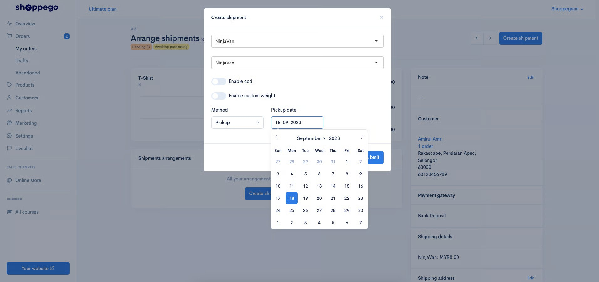<figcaption></figcaption></figure>

7. After clicking the **Submit** button, your order will automatically receive a tracking number as shown below.


An **AIRWAYBILL (AWB)** for this order has already been **generated automatically** and you only **need to print this AWB**.


<figure>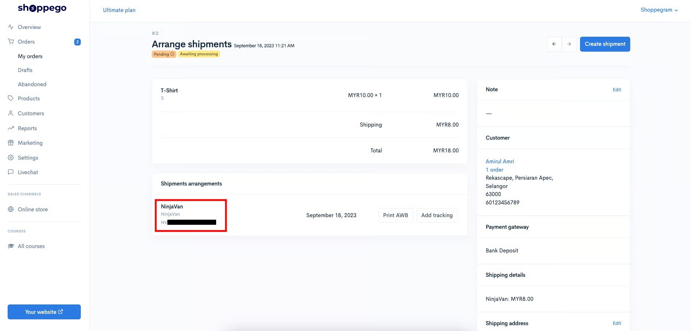<figcaption></figcaption></figure>

Once the **Add Shipment** process is made, check in the Ninjavan Dashboard to make sure the information displayed is the same.
