# Parcel Daily


Fungsi ini tersedia untuk **plan Premium** dan **Ultimate** sahaja.


## On this page:

* [Settings that need to be made](parcel-daily.md#settings-that-need-to-be-made)
* [Get Parcel Daily account Token](parcel-daily.md#get-parcel-daily-account-token)
* [Get Merchant ID for your Parcel Daily account](parcel-daily.md#get-merchant-id-for-your-parcel-daily-account)
* [Setting up in Shoppego](parcel-daily.md#setting-up-in-shoppego)
* [How to Fulfill Orders](parcel-daily.md#how-to-fulfill-orders)

## Settings that need to be made:

* Complete your information in your Parcel Daily account:
  * Sender address
  * Billing address
* [Get your Parcel Daily account Token.](parcel-daily.md#get-parcel-daily-account-token)
* [Get your Parcel Daily account Merchant ID.](parcel-daily.md#get-merchant-id-for-your-parcel-daily-account)
* [Do the setting in the Shoppego dashboard](parcel-daily.md#setting-up-in-shoppego)


**You can obtain all of the above information and settings by contacting your Parcel Daily sales/account manager.**


## Get Parcel Daily account Token

1. Log in to your Parcel Daily account

<figure>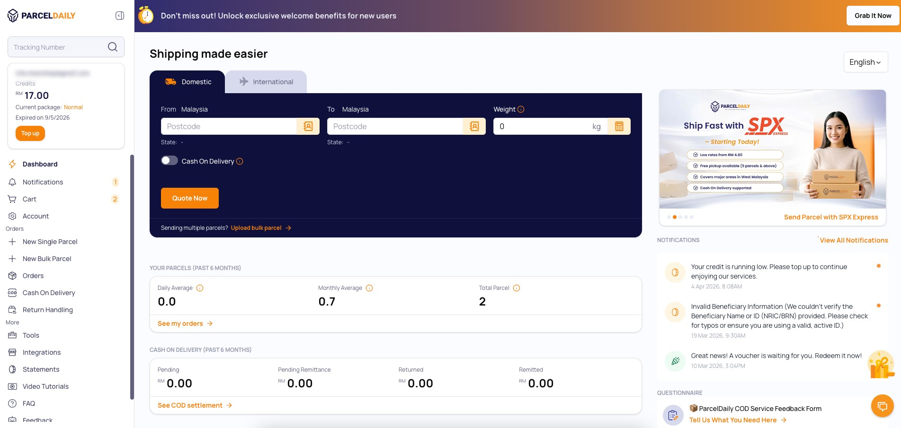<figcaption></figcaption></figure>

2. Click on **Integrations**

<figure>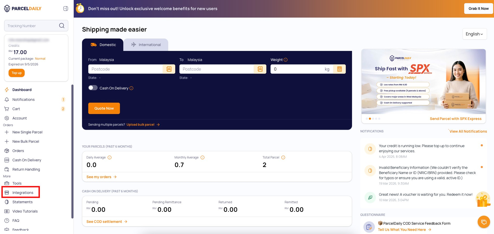<figcaption></figcaption></figure>

3. Click on **External API Details**

<figure>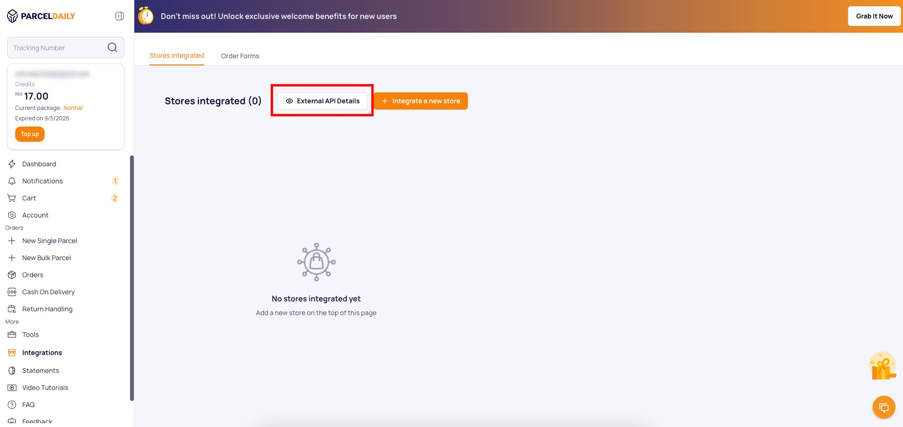<figcaption></figcaption></figure>

4. Click **Copy** for **Token Key**

<figure>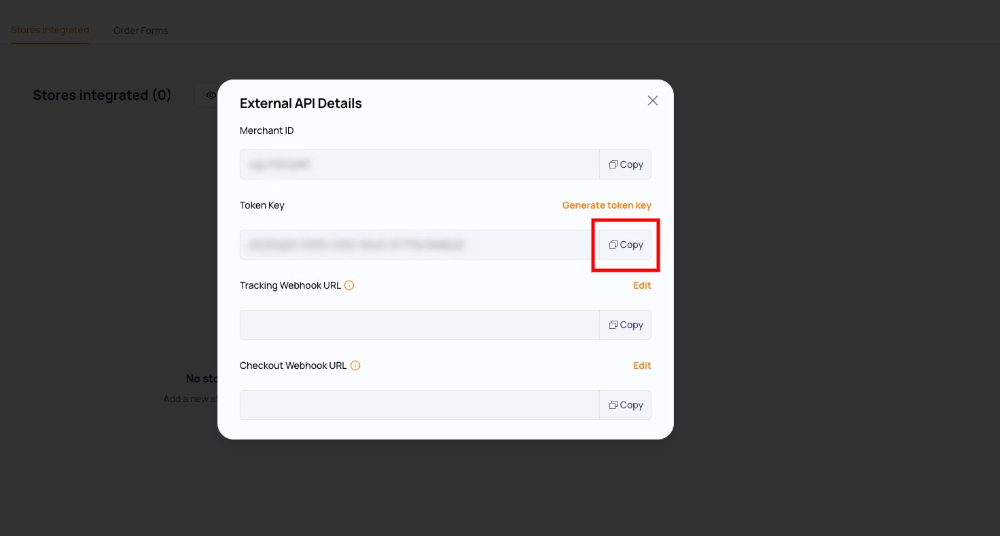<figcaption></figcaption></figure>

You can **save the Token key** **to be inserted into the Token setting space on the Shoppego dashboard** later.

## Get Merchant ID for your Parcel Daily account

1. Log in to your Parcel Daily account

<figure><figcaption></figcaption></figure>

2. Click on **Integrations**

<figure><figcaption></figcaption></figure>

3. Click on **External API Details**

<figure><figcaption></figcaption></figure>

4. Click **Copy** for **Merchant ID**

<figure>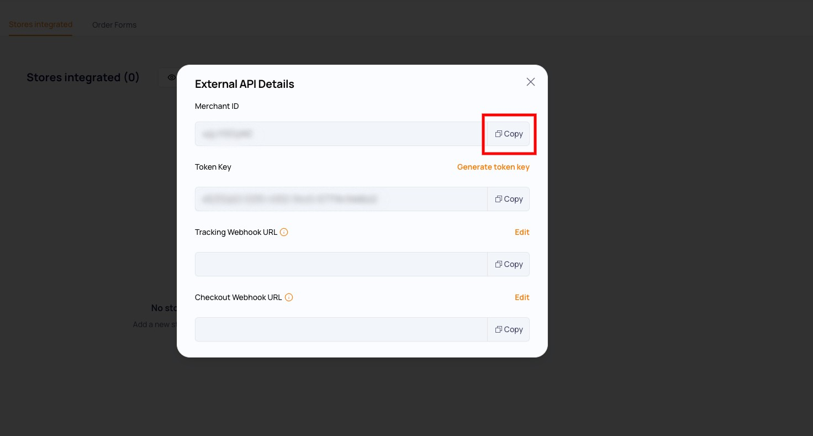<figcaption></figcaption></figure>

You can **save the Merchant ID to be entered in the Merchant ID setting space on the Shoppego dashboard** later.

## Setting up in Shoppego

Once you have all the information needed for the integration, you can follow the steps below to set it up in your Shoppego account.

1. Log in to your Shoppego account.

<figure><figcaption></figcaption></figure>

2. Click on **Settings**

<figure><figcaption></figcaption></figure>

3. Click on **Shipping provider**

<figure>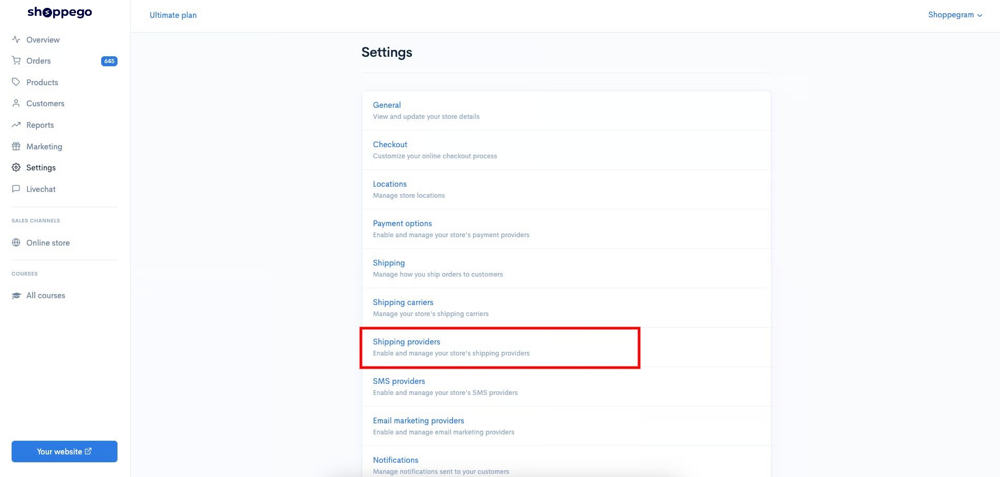<figcaption></figcaption></figure>

4. Click **Edit/Activate** on **shipping provider Parcel Daily**

<figure>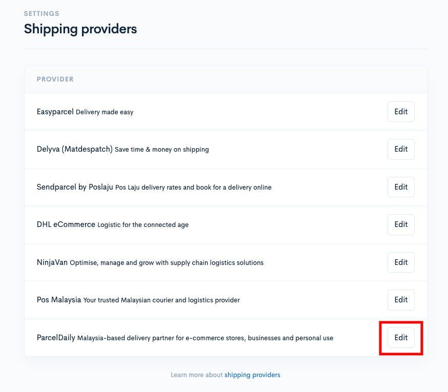<figcaption></figcaption></figure>

5. Then, you can enter all the information in the space provided and click **Save**.

<table><thead><tr><th width="193">Parameters</th><th>Description</th></tr></thead><tbody><tr><td><strong>Test mode</strong></td><td>You can activate this toggle if you are using a developer account from Parcel Daily itself.</td></tr><tr><td><strong>Token</strong></td><td>You can enter a <strong>Token</strong> for your Parcel Daily account.</td></tr><tr><td><strong>Merchant ID</strong></td><td>You can enter the <strong>Merchant ID</strong> for your Parcel Daily account.</td></tr><tr><td><strong>Automatically add tracking</strong></td><td>You can activate this toggle if you want the system to automatically send tracking numbers to customers via email <strong>(specifically for bulk shipments only</strong>).</td></tr><tr><td><strong>Enable content</strong></td><td>You can activate this toggle to ensure that the details of the product purchased by the customer are on the order AWB.</td></tr><tr><td><strong>Enable Parcel Daily</strong></td><td>You need to activate this toggle to ensure you can use the Parcel Daily shipping provider.</td></tr></tbody></table>

<figure>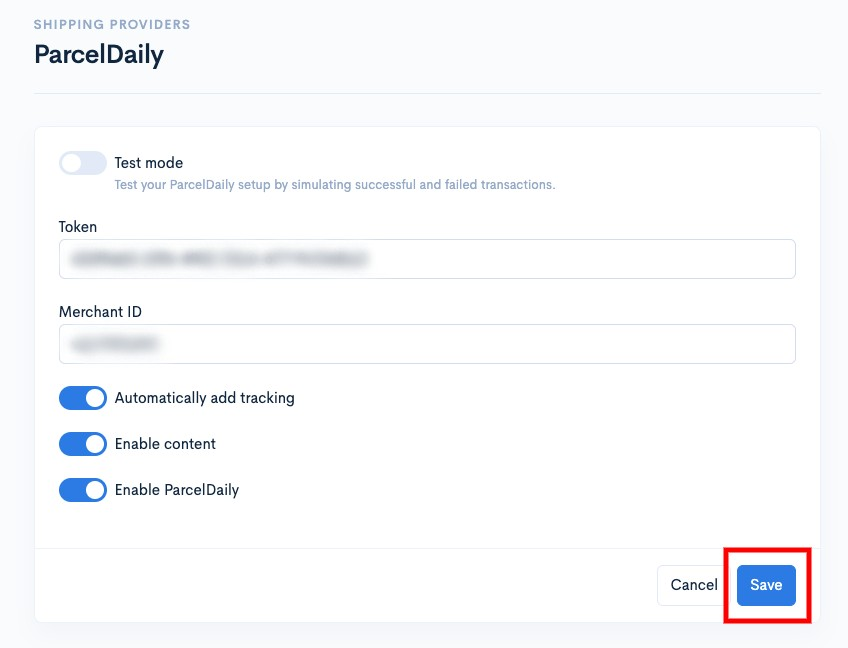<figcaption></figcaption></figure>

6. Once completed, your Parcel Daily shipping provider setting process has now been successful.

<figure>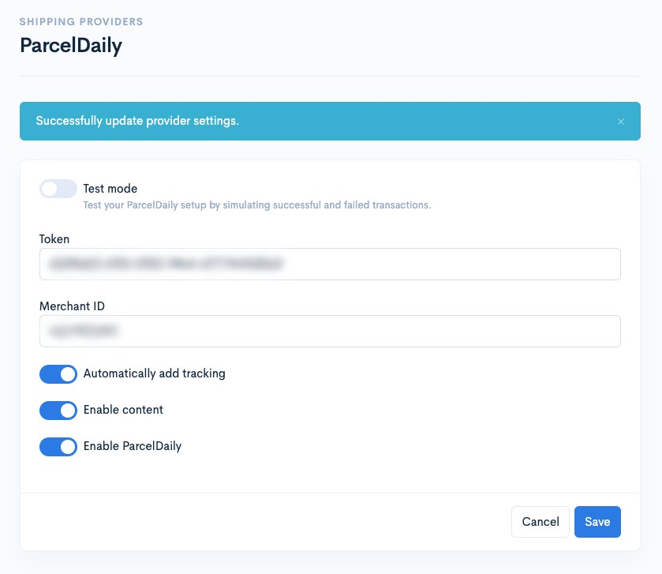<figcaption></figcaption></figure>

## How to Fulfill Orders

Tutorial setting up the section on how to manage orders to generate Airway Bills on the Parcel Daily platform without having to log in and only using the Shoppego platform.

1. Log in to the **Shoppego Dashboard** -> **Orders** on the left panel.

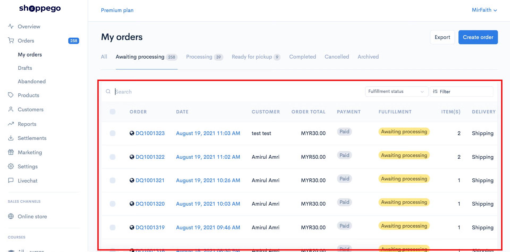

2. Select and **click on the order** you want to ship using Parcel Daily and the display will appear as below. Click the **Arrange shipment** button.

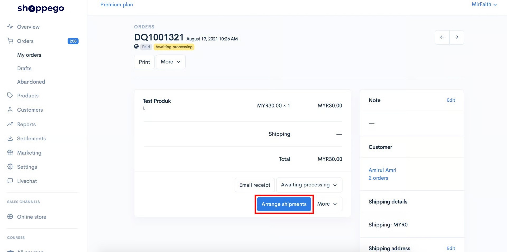

3. Press the blue **Create Shipment** button in the right corner.

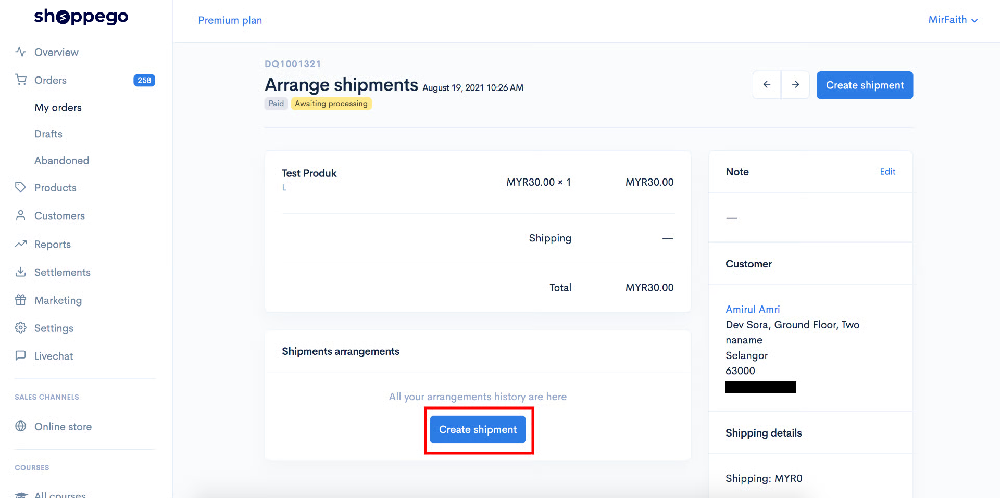

4\. Next a popup will appear, you can click on **Select Shipment Provider** and select **Parcel Daily**. Then click on **Choose Services** and click on any courier service you want to use. The price is determined according to the address on the order.

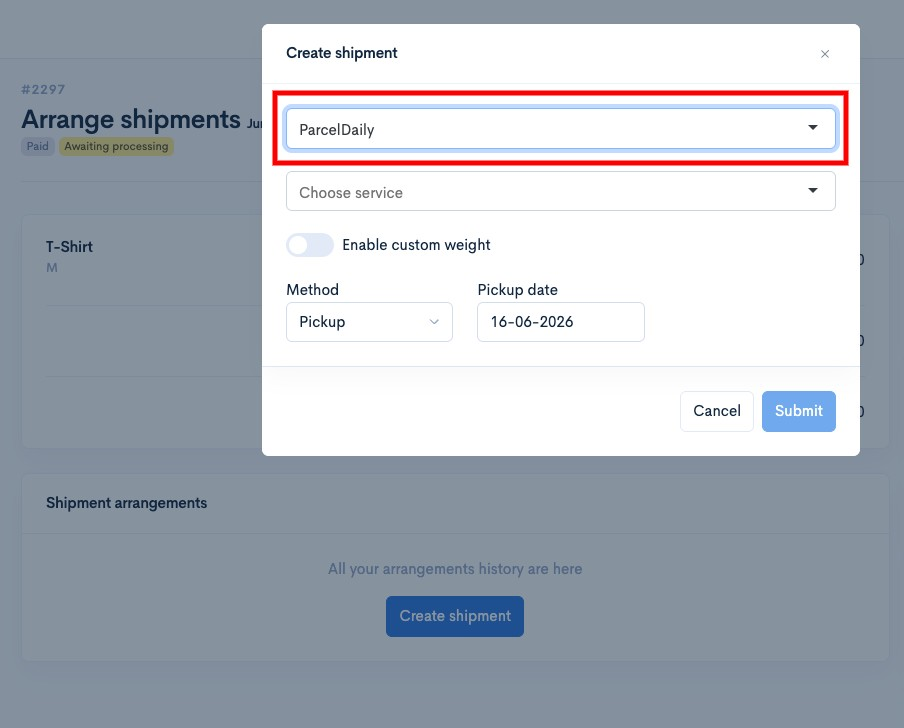

5\. Next, click on the method and select **Dropoff** or **Pickup**.


**Method** :&#x20;

* **Dropoff -** You will go to the nearest post office yourself and deliver the goods.
* **Pickup** - The courier will send a vehicle to pick up the ordered items at the address specified in your Location settings.
  

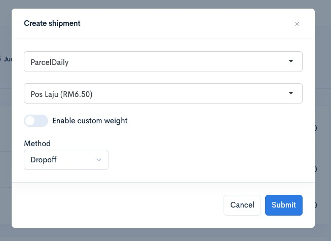


Usually the **Pickup** Method will be chosen to make it easier for the sellers.


6. When the **Pickup Method** is selected, a **schedule** will be displayed for the courier to choose a pickup date. Click on the date you want and then click the **Submit** button. Refer to the image below.

<figure>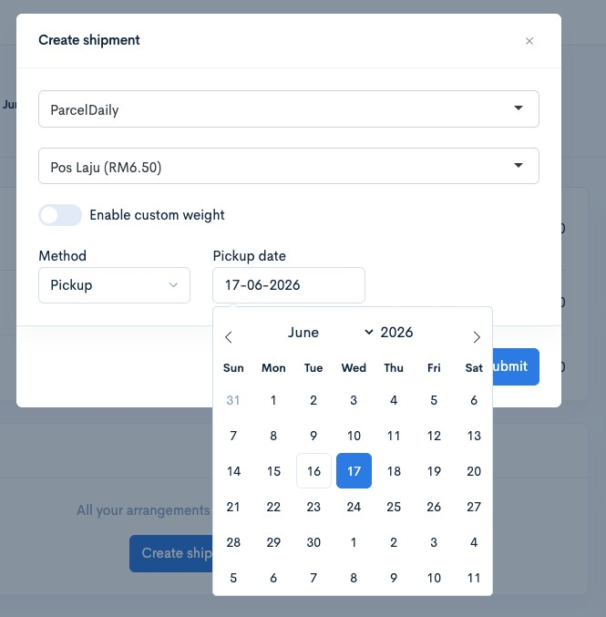<figcaption></figcaption></figure>

7. After clicking the **Submit** button, your order will automatically receive a tracking number as shown in the image below.


An **Airwaybill (AWB)** for this order has already **been automatically generated** and you only need to **print this AWB**.


<figure>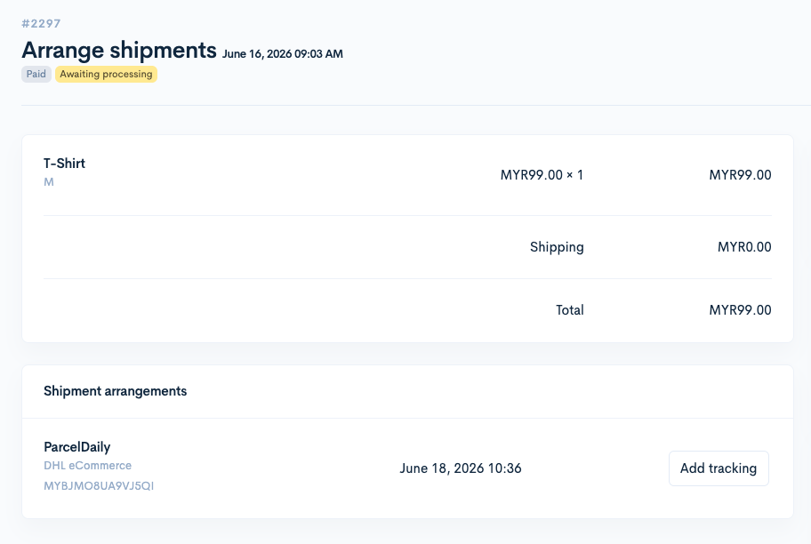<figcaption></figcaption></figure>

Once the **Add Shipment** process has been completed, check the Parcel Daily Dashboard to make sure the information displayed is the same.
