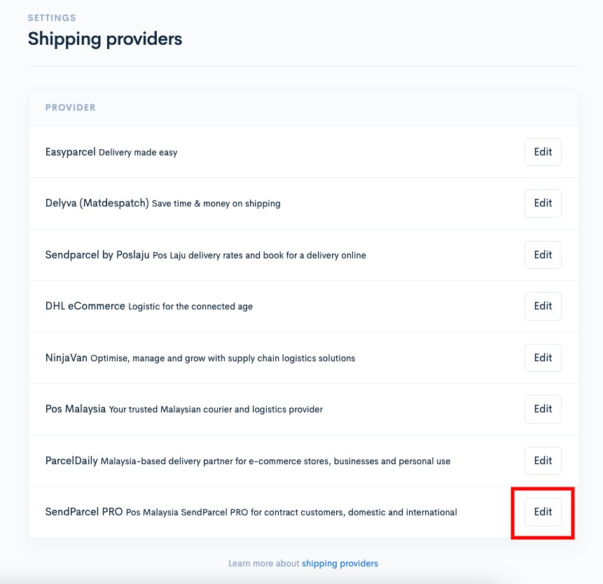
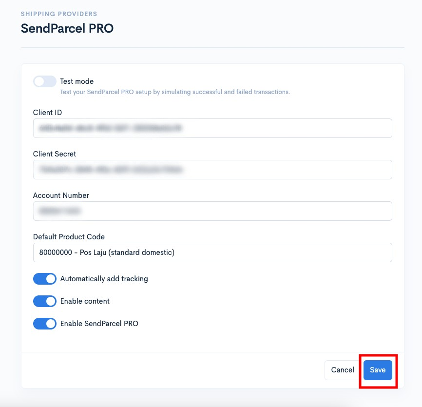
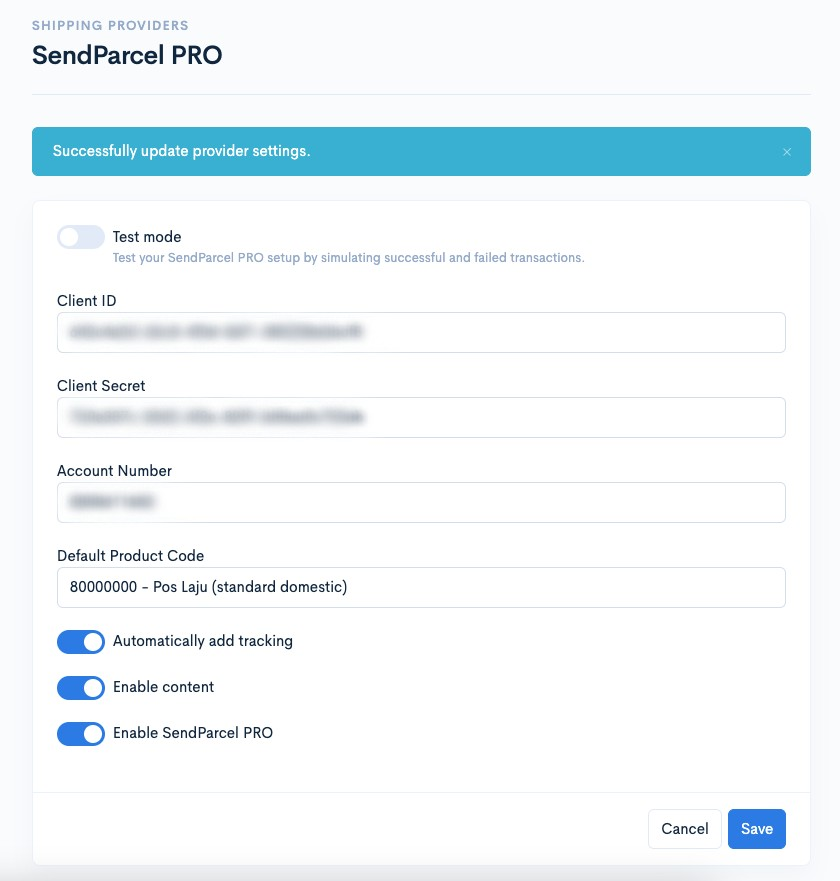
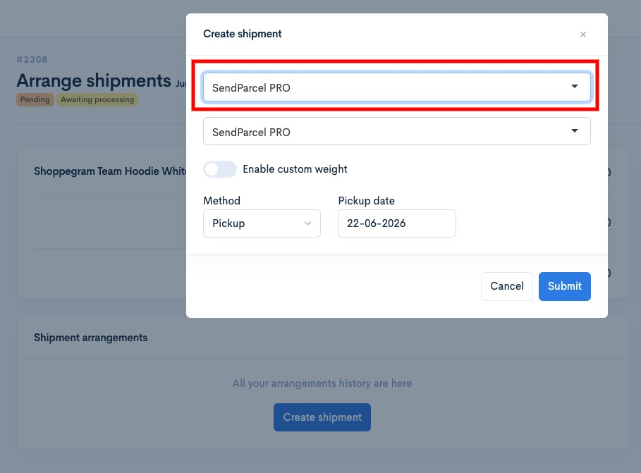
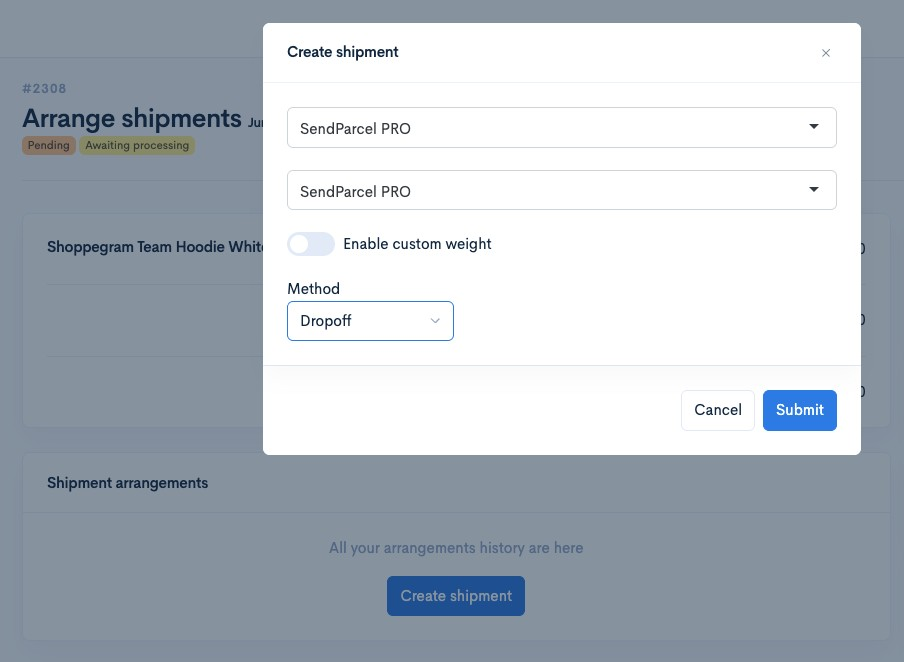
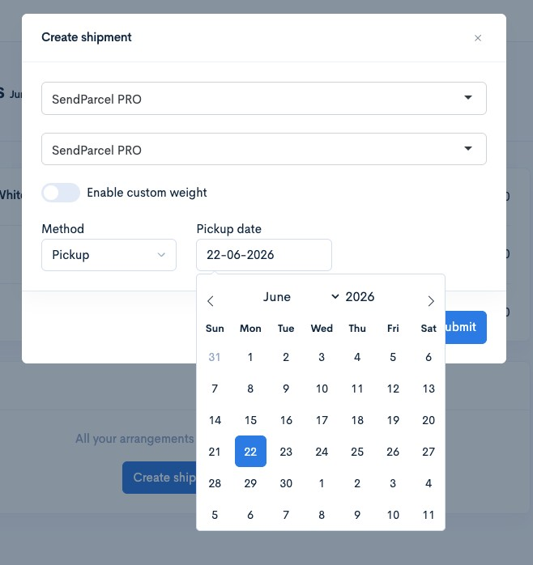
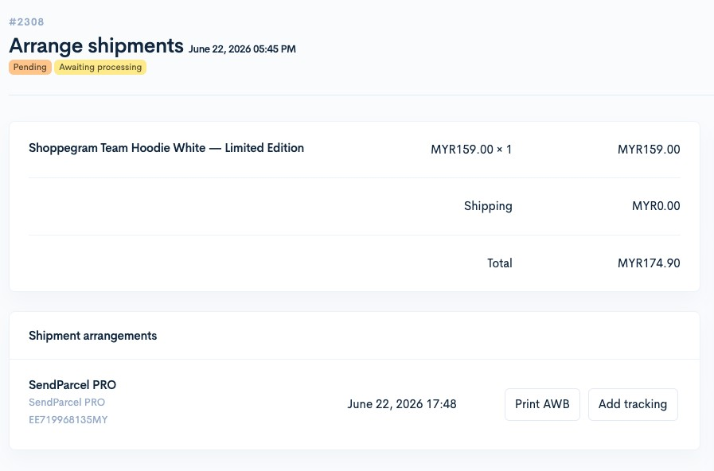

# Senparcel Pro


This function is available for **Premium** and **Ultimate** plans only.


## On this page:

* [Settings that need to be made](senparcel-pro.md#settings-that-need-to-be-made)
* [Setting up in Shoppego](senparcel-pro.md#setting-up-in-shoppego)
* [How to Fulfill Orders](senparcel-pro.md#how-to-fulfill-orders)

## Settings that need to be made:

* Complete your information in your Sendparcel Pro account
* Get your Sendparcel Pro account **Client ID**
* Get your Sendparcel Pro account's **Client Secret**
* Get your Sendparcel Pro **Account Number**
* [Do the setting in the Shoppego dashboard](senparcel-pro.md#setting-up-in-shoppego)


**You can obtain all of the above information and settings by contacting your Sendparcel Pro sales/account manager.**


## Setting up in Shoppego

Once you have all the information needed for the integration, you can follow the steps below to set it up in your Shoppego account.

1. Log in to your Shoppego account.

<figure><figcaption></figcaption></figure>

2. Click on **Settings**

<figure><figcaption></figcaption></figure>

3. Click on **Shipping provider**

<figure><figcaption></figcaption></figure>

4. Click **Edit/Activate** on the **shipping provider Sendparcel Pro**

<figure><figcaption></figcaption></figure>

5. Then, you can enter all the information in the space provided and click **Save**.

<table><thead><tr><th width="193">Parameter</th><th>Description</th></tr></thead><tbody><tr><td><strong>Test mode</strong></td><td>You can activate this toggle if you are using a developer account from Sendparcel Pro itself.</td></tr><tr><td><strong>Client ID</strong></td><td>You can enter the <strong>Client ID</strong> for your Sendparcel Pro account.</td></tr><tr><td><strong>Client Secret</strong></td><td>You can enter the <strong>Client Secret</strong> for your Sendparcel Pro account.</td></tr><tr><td><strong>Account Number</strong></td><td>You can enter the <strong>Account Number</strong> for your Sendparcel Pro account.</td></tr><tr><td><strong>Default Product Code</strong></td><td>You can choose whether you want to use Pos Laju (standard domestic) or International.</td></tr><tr><td><strong>Default HS Code (international)</strong></td><td>You can enter your own HS Code for international shipping. You can also leave it blank to use the default settings.</td></tr><tr><td><strong>Automatically add tracking</strong></td><td>You can activate this toggle if you want the system to automatically send tracking numbers to customers via email (<strong>specifically for bulk shipments only</strong>).</td></tr><tr><td><strong>Enable content</strong></td><td>You can activate this toggle to ensure that the details of the product purchased by the customer are on the order AWB.</td></tr><tr><td><strong>Enable Sendparcel Pro</strong></td><td>You need to activate this toggle to make sure you can use this Sendparcel Pro shipping provider.</td></tr></tbody></table>

<figure><figcaption></figcaption></figure>

6. Once completed, the process of setting up your Sendparcel Pro shipping provider is now successful.

<figure><figcaption></figcaption></figure>

## How to Fulfill Orders

Tutorial on how to manage orders to generate Airway Bills on the Sendparcel Pro platform without having to log in and only using the Shoppego platform.

1. Log in to the **Shoppego Dashboard** -> **Orders** on the left panel.

2. Select and **click on the order** you want to ship using Sendparcel Pro and the display will appear as below. Click the **Arrange shipment** button.

3. Press the blue **Create Shipment** button in the right corner.

4\. Next a popup will appear, you can click on **Select Shipment Provider** and select **Sendparcel Pro**. Then click on **Choose Services** and click on any courier service you want to use. The price is determined according to the address on the order.

5\. Next, click on the method and select **Dropoff** or **Pickup**.


**Method** :&#x20;

* **Dropoff -** You will go to the nearest post office yourself and deliver the goods.
* **Pickup** - The courier will send a vehicle to pick up the ordered items at the address specified in your Location settings.
  


Usually the **Pickup** Method will be chosen to make it easier for the sellers.


6. When the **Pickup Method** is selected, a **schedule** will be displayed for the courier to choose a pickup date. Click on the date you want and then click the Submit button. Refer to the image below.

<figure><figcaption></figcaption></figure>

7. After clicking the **Submit** button, your order will automatically receive a tracking number as shown in the image below.


An **Airwaybill (AWB)** for this order has already been **automatically generated** and you only need to **print this AWB**.


<figure><figcaption></figcaption></figure>

Once the **Add Shipment** process is complete, check the Sendparcel Pro Dashboard to make sure the information displayed is the same.
