# Shipping

## Setup Shipping

1\. Login to your Commerce account.

2\. Click on **Settings**

3\. Click on **Shipping**

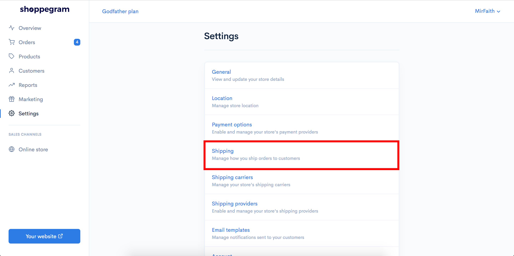

4. By default we have provided Shipping according to the zone, namely the :
   * **Peninsula (West Malaysia)**&#x20;
   * **Sabah & Sarawak (East Malaysia).**&#x20;

Click the **Edit** Button on any zone you want to set Shipping.

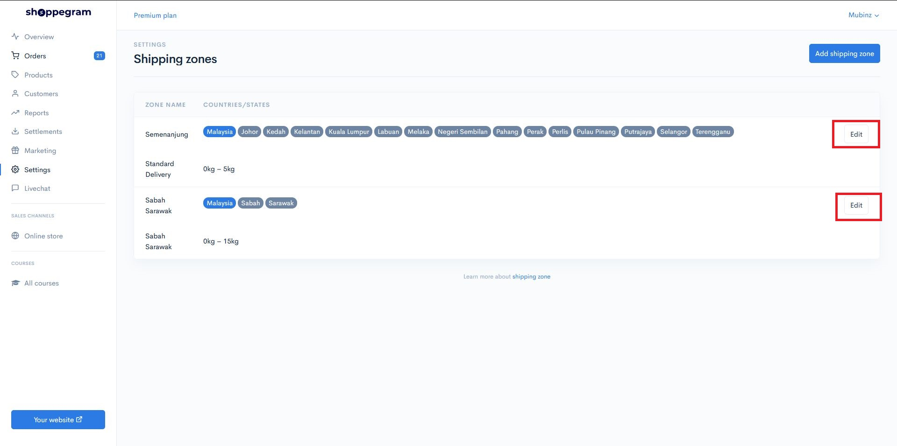

5\. Click on whichever rates you want to set.&#x20;

* **Weight-based rates -** Your shipping will be based on the weight of your product&#x20;

(Example: buyer's cart weight 1kg so their shipping rates are RM8 by default.)

* **Price-based rates -** Your shipping will be based on the buyer's cart price&#x20;

(Example: total buyer items in the cart is **RM50.00** so shipping rates will follow as you set.

* **Distance Based Rates** - Your shipping charges will be based on the distance between your store location and the customer's location. For a tutorial, click on the Page below. **This function is available only for Ultimate plan subscriptions and must be used in conjunction with the geolocation provider setting.**

(Example: The distance between the customer's location and your location is 10KM so the shipping rates will be as you set.

 <mark style="color:red;">**Attention**</mark>: For **Weight Based Rates, Price Based Rates and Distance Based Rates**, you can **modify them** according to current shipping fees.


## **Weight Based Rates**

By default, we have provided rates according to the **Tab Weight Based Rates** in your store.&#x20;

1. If you want to add new rates you can click on the **Add Rate** button.

<figure>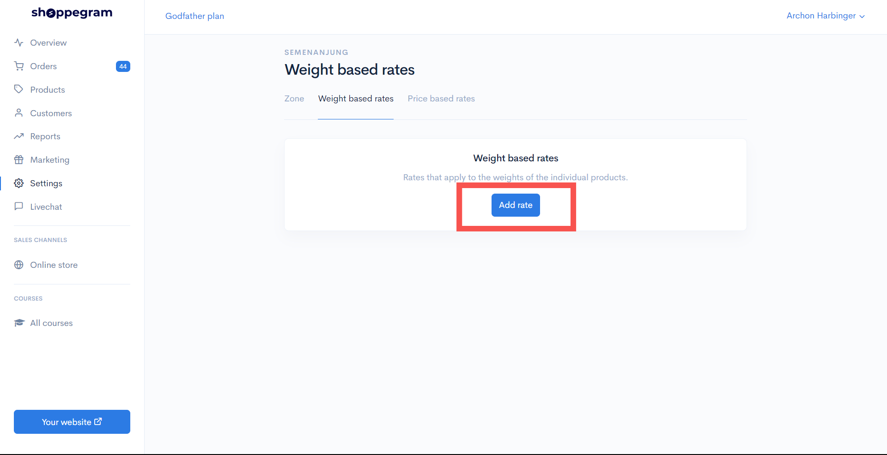<figcaption></figcaption></figure>

2. Then, a display will appear as below.

<figure>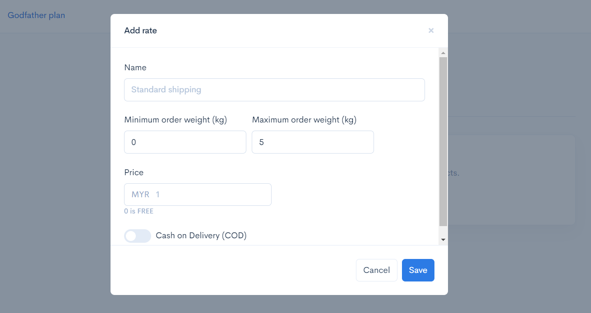<figcaption></figcaption></figure>

3\. You can enter the details you want according to your promo.

In the section:

<table><thead><tr><th width="275">Field</th><th>Description</th></tr></thead><tbody><tr><td><strong>Name</strong> </td><td>Enter your Shipping name.</td></tr><tr><td><strong>Minimum Order Weight (KG)</strong> </td><td>Enter the weight of the product that the customer needs to reach to get the Shipping rates.</td></tr><tr><td><strong>Maximum Order Weight (KG)</strong></td><td>Enter the maximum value for the Shipping rates price.</td></tr><tr><td><strong>Price</strong></td><td>Shipping Price</td></tr><tr><td><strong>Cash On Delivery (COD)</strong></td><td><strong>Turn on</strong> if your shipping method is using COD.</td></tr></tbody></table>

 <mark style="color:red;">**Notice**</mark> : If you want to offer <mark style="color:red;">**Free Shipping**</mark> but using **Weight Based Rates**, you can refer to this tutorial.



[Weight Based Rates](shipping/free-shipping/weight-based-rates.md)


### Display of Weight Price Based Rates

Upon completion of the display that will appear on your checkout section will be like the display below.

<figure>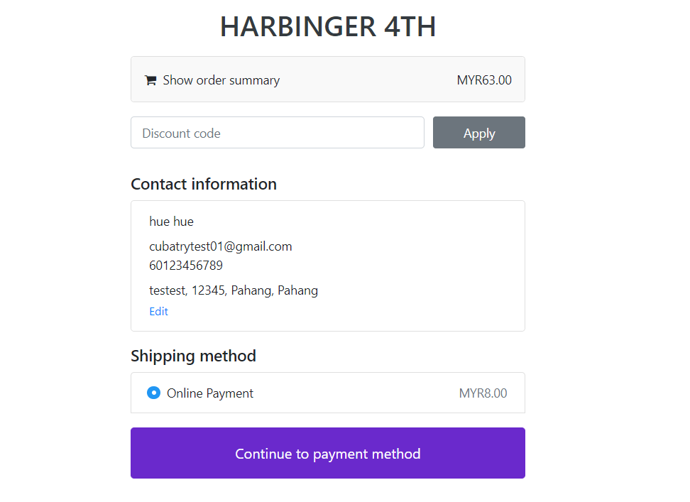<figcaption></figcaption></figure>

## Setting Up  Price Based Rates

By default, we have provided rates according to the **Tab Price Based Rates** in your store.&#x20;

1. If you want to add new rates you can click on the **Add Rate** button.

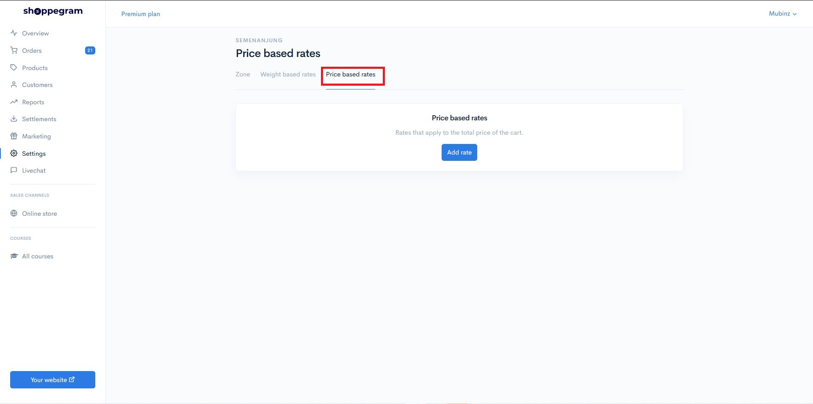

2. Click on the **Add Rate** button.

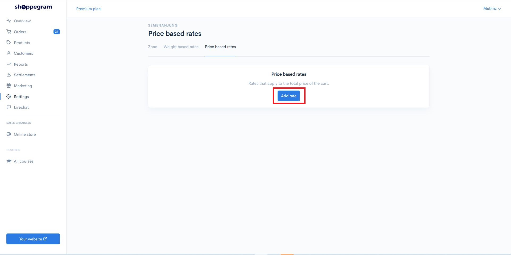

3. A popup will appear as shown below.

<figure>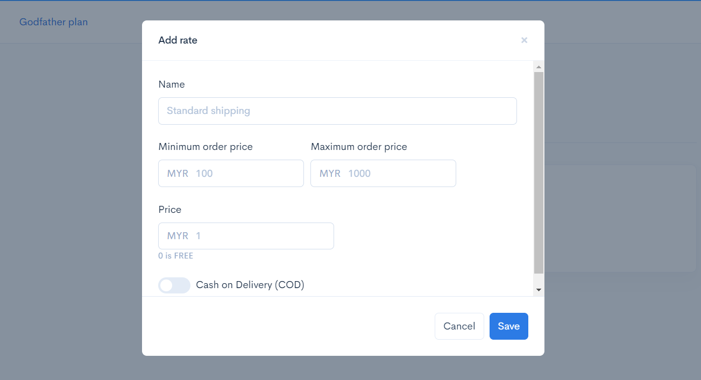<figcaption></figcaption></figure>

4\. You can enter the details you want according to your promo.

In the section:

<table><thead><tr><th width="236">Field</th><th>Description</th></tr></thead><tbody><tr><td><strong>Name</strong></td><td>Enter your shipping name.</td></tr><tr><td><strong>Minimum Order Price</strong></td><td>Enter the value that the customer needs to reach to get the Shipping rates.</td></tr><tr><td><strong>Maximum Order Price</strong></td><td>Enter the maximum value for the rates.</td></tr><tr><td><strong>Price</strong> </td><td>Shipping Price.</td></tr><tr><td><strong>Cash On Delivery (COD)</strong></td><td><strong>Turn on</strong> if your shipping method is using COD.</td></tr></tbody></table>

 <mark style="color:red;">**Notice**</mark> : If you want to offer <mark style="color:red;">**Free Shipping**</mark> but using **Price Based Rates**, you can refer to this tutorial.



[Price Based Rates](shipping/free-shipping/price-based-rates.md)


Once done, you can click the **Add** button and check the Free Shipping promotion that you have set earlier.

### Display of Price Based Rates 

Upon completion of the display that will appear on your checkout section will be like the display below.

<figure><figcaption></figcaption></figure>

## **Setting Up Distance Based Rates**


**This "Distance by rates" function is available only for Ultimate plan subscriptions and must be used in conjunction with the geolocation provider setting.**


Essentially, we have already set up rates based on the prices in your store. If you wish to add new rates:

1. You can simply press the "**Add rate**" button on the "**Distance Based Rates**" tab.

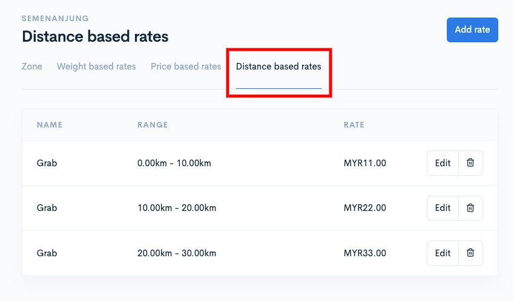

2. Click the **Add Rate** button.

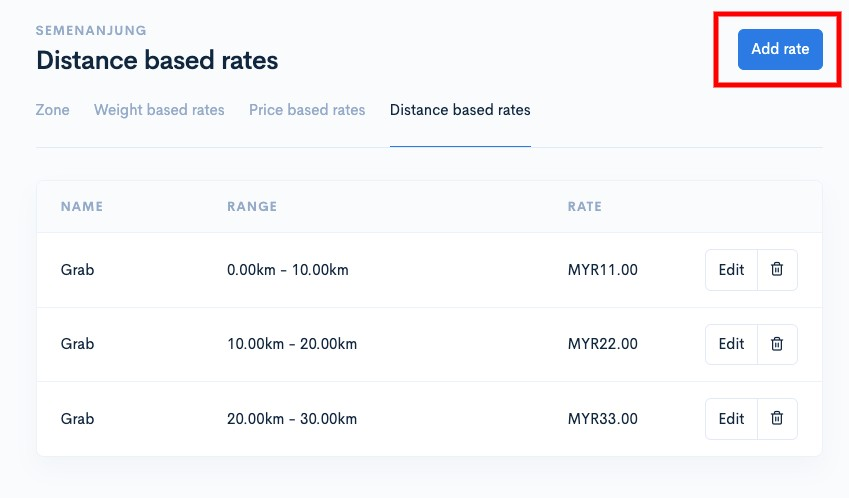

3. A popup will appear as shown below.

<figure>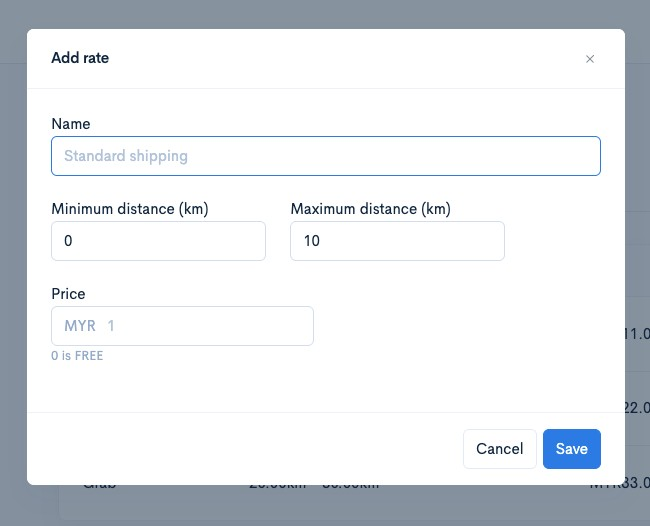<figcaption></figcaption></figure>

4. You can enter the details you want, in accordance with your promotion.

<table><thead><tr><th width="262">Parameter</th><th>Description</th></tr></thead><tbody><tr><td><strong>Name</strong> </td><td>Shipping Name (Example: Grab)</td></tr><tr><td><strong>Minimum distance (RM)</strong></td><td>Enter the amount the customer needs to reach to qualify for those shipping rates.</td></tr><tr><td><strong>Maximum distance (RM)</strong></td><td>Enter the maximum value for the rates</td></tr><tr><td><strong>Price</strong> </td><td>The shipping cost.</td></tr><tr><td><strong>Cash On Delivery (COD)</strong></td><td><strong>Enable</strong> this if your shipping method uses COD.</td></tr></tbody></table>

### Display of Distance Based Rates

Once completed, the display at the checkout section will look like the image below.

<figure>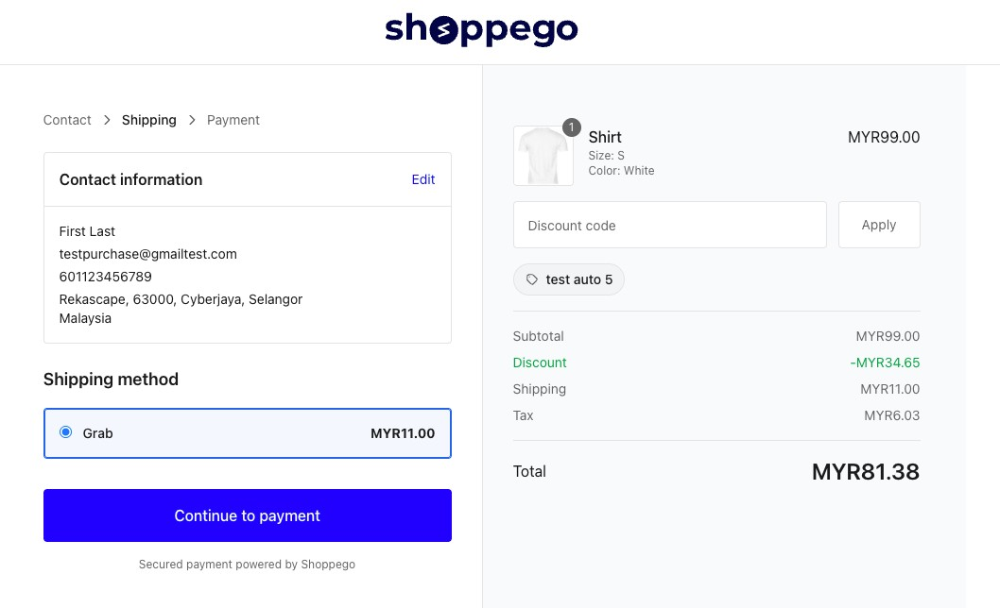<figcaption></figcaption></figure>

## Setting Up COD Shipping

For a tutorial on setting up COD shipping and payment methods, you can refer to the page below.


[COD Shipping](shipping/cod-shipping.md)


### Frequently Asked Questions:

1. Why can't I see the shipping options on my website checkout?\
   Answer: For that issue, you need to make sure that the "Shipping" setting for your product is set correctly. You can go to the section: Shoppego Dashboard (Overview) > Click on Products > Click on the product > Click on the Shipping tab > Make sure you tick the "Requires Shipping or Pickup" toggle and the "Global rates" toggle > After finishing, click Save. You can also repeat the steps above for other products that require shipping options.
2. Why doesn't my website checkout form have a space for customers to enter shipping information?\
   Answer: For that, you need to make sure that the "Shipping" setting for your product is set correctly. You can go to the section: Shoppego Dashboard (Overview) > Click on Products > Click on the product > Click on the Shipping tab > Make sure you tick the "Requires Shipping or Pickup" toggle > After finishing, click Save. You can also repeat the steps above for other products that require shipping.
3. Why aren't the shipping rates I created displayed on the shipping options on my website checkout page?\
   Answer: For that, you need to review your Shipping rates settings. Make sure that your minimum/maximum price/weight/distance based shipping rates settings can cover all orders that can be placed on your website. For further information regarding shipping settings, you can refer to this link: <https://my.shoppego.com/courses/ecommerce-game-on-fashion-founders-edition/125>
