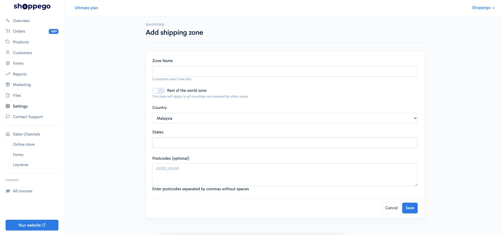
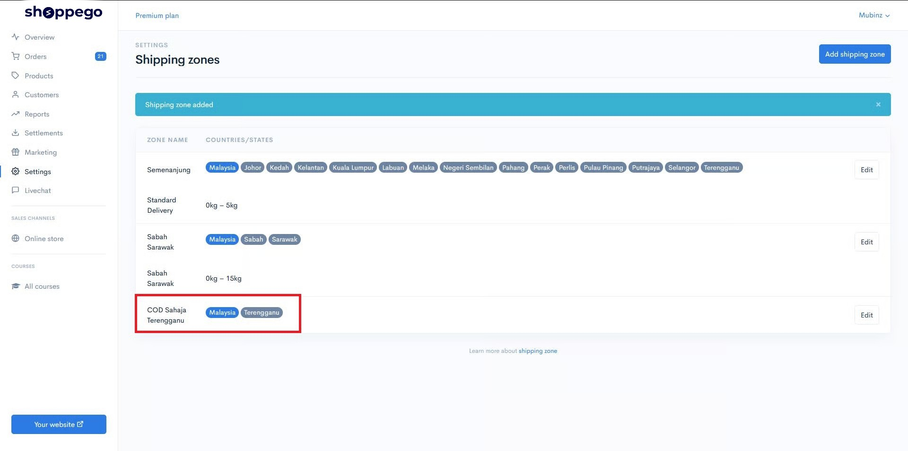
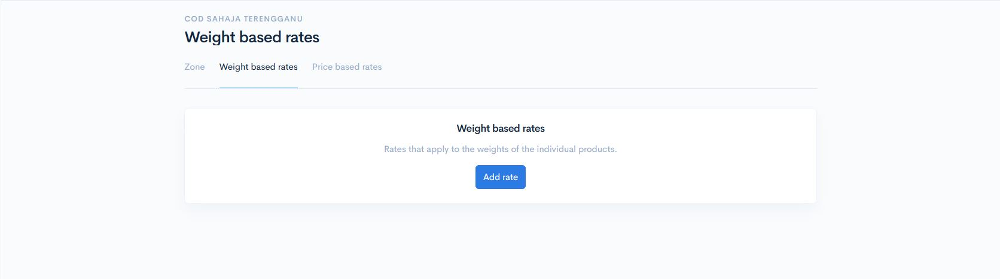
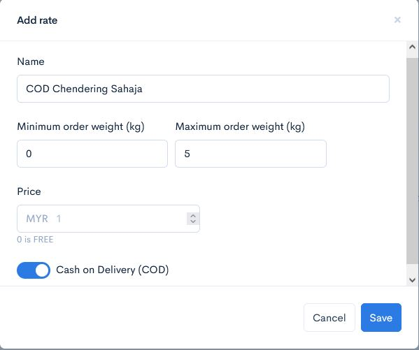
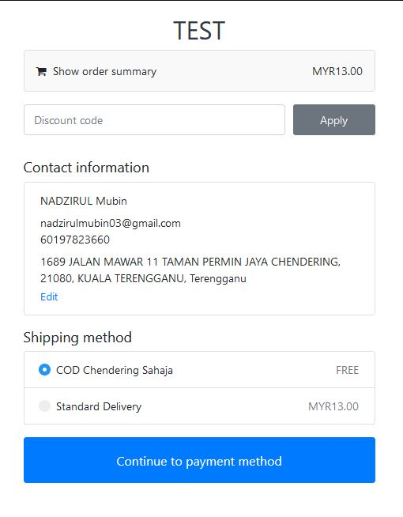
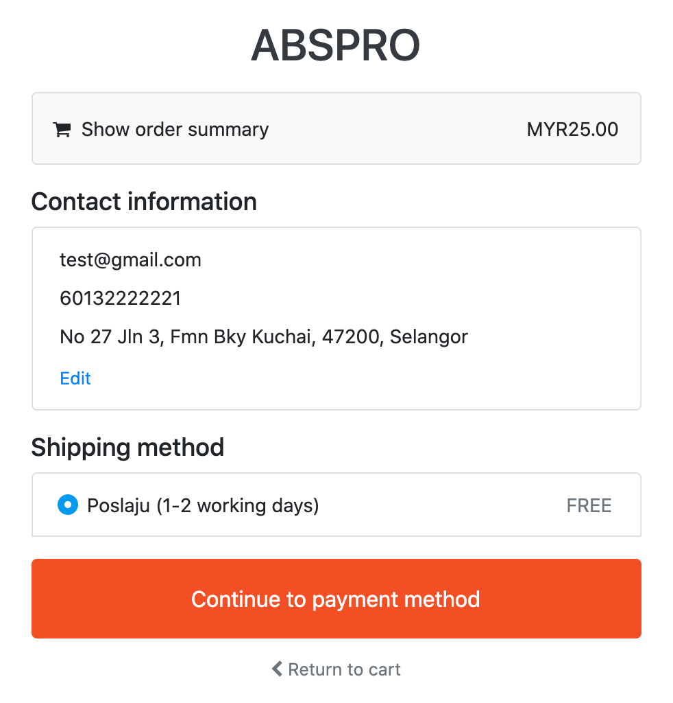

# Based on Zone/Poskod

Shoppego has a postcode and zone function that you can use to create special delivery methods for certain areas in the form of a postcode or zone.

For example, you may want to **make COD** in a specific area that is within a specific postcode only.

This can be done by adding a new Shipping Zone.

## Postcode setup

1. Log in to Dashboard Shoppego > **Settings** > **Shipping** and click the **Add Shipping Zones** button [**https://admin.shoppego.my/settings/shipping\_zones/create**](https://admin.shoppego.my/settings/shipping_zones/create) 

* Enter any name that represents your Zone Name.
* Select the relevant country or you can tick the "Rest of the world zone" toggle to create shipping zones for countries other than the ones you have already created their own shipping zones for.
* Finally, if you want to set this shipping zone for a specific postcode, you can enter the postcode of that area.\
  \
  If there are multiple postcodes, you need to put a mark between the postcodes, for example 47100,47190,47180

2. Click the **Save** button

Now your zone has been successfully created and click the **Edit** button on the special zone.

## Setup Rates

1. Next, click on the **Weight based rates** tab\
   \
   Click **Add rate**

2. Fill in your special delivery information in this field.\
   &#x20;\
   In this **Name** section, if possible, fill in a little more detail, because this information will be displayed when the customer makes a shipping choice later.\
   \
   Since this is a special delivery, you need to create a special weight category that does **not overlap** with any shipping rates in other **Zones**.\
   \
   Enter the price you want and if this is COD, check the Cash on Delivery (COD) box. If not, it does not need to be checked, leave it blank.\
   \
   Click the **Add** button

## Example

The settings that have been set earlier are.\
\
If the postcode entered is listed in the purchase by the prospect, the **COD Chendering Only** Zone will appear.

&#x20;If the postcode entered is not in the list, then no option for COD will appear.

