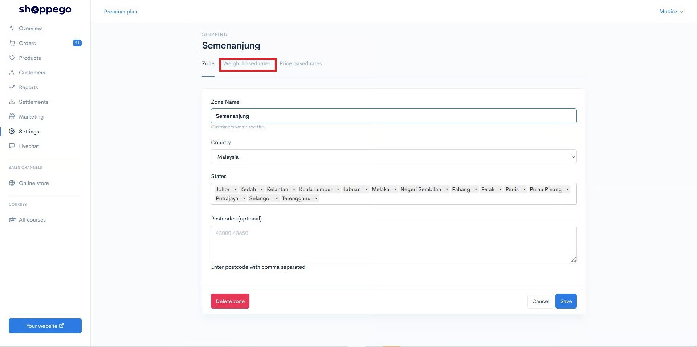

# Weight Based Rates

## Setup Free Shipping Based on Weight Based Rates

1\. Login to your Shoppego account.

2\. Click on **Settings**

3\. Click on **Shipping**

4\. Click the **Edit** Button in any zone where you want to apply this **Free Shipping** setting.

5\. Click on **Weight based rates**

6\. Click on the **Add rate** button

7\. A **popup** will appear as shown below.

8\. You can enter the details you want according to your promo. In part:

* **Name = Enter the name of your promotion**
* **Minimum&#x20;**<mark style="color:red;">**order weight**</mark>**&#x20;(kg) = Enter the&#x20;**<mark style="color:red;">**weight of the product**</mark>**&#x20;that the customer needs to achieve to get the&#x20;**<mark style="color:red;">**Free Shipping**</mark>
* **Maximum order weight (kg) = Enter a max value (100000)**
* **Price = Let the&#x20;**<mark style="color:red;">**value be 0**</mark>

9\. Once done you can click the Add button and check the Free Shipping promotion that you have set earlier.

### Example 

Upon completion, the display that will appear on your checkout section will be like the display below.

## Additional Information&#x20;

 <mark style="color:red;">**Attention**</mark>: Make sure your setting on **Weight Based Rate** is <mark style="color:red;">**not the same**</mark> as **Price Based Rate** to **avoid conflicting values** in your Shipping Method Page as shown in the picture below.


<figure><figcaption></figcaption></figure>
