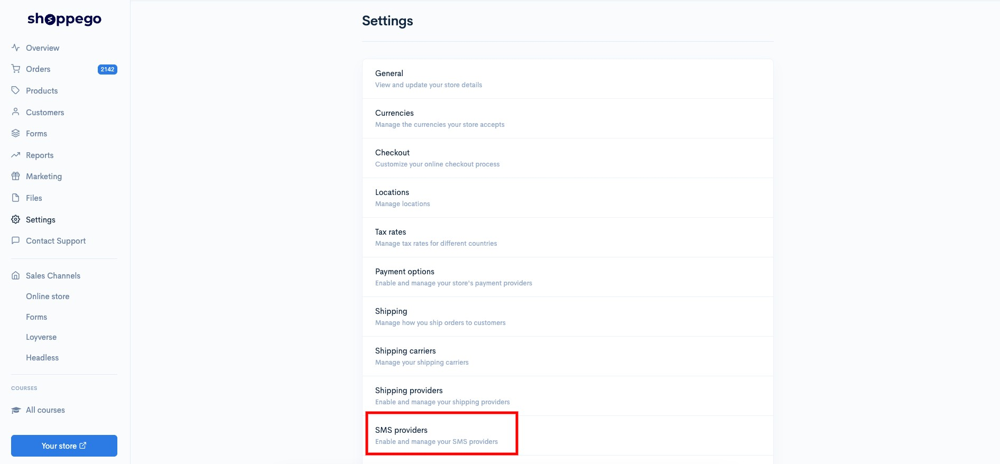
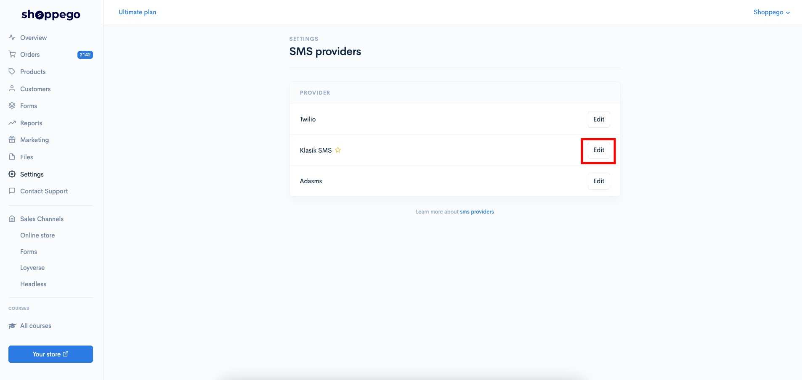
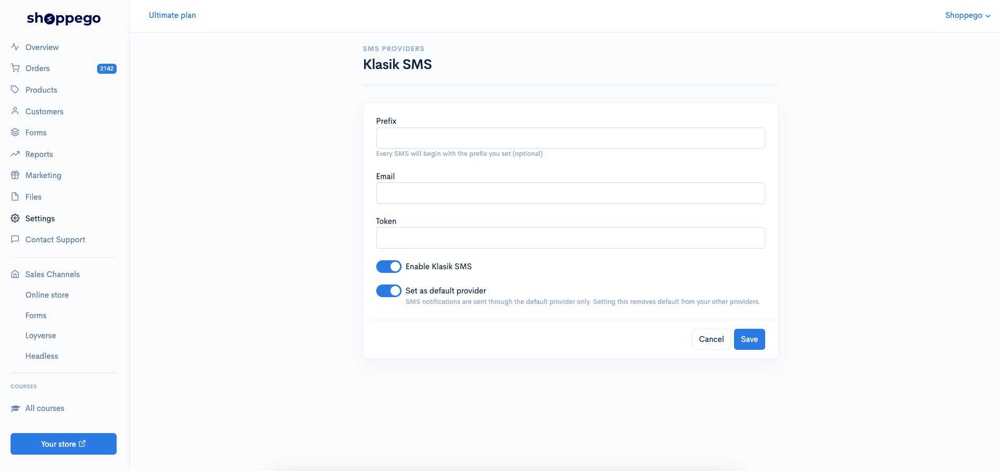
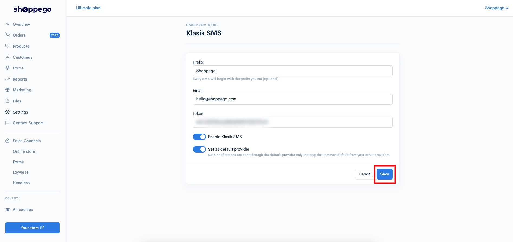
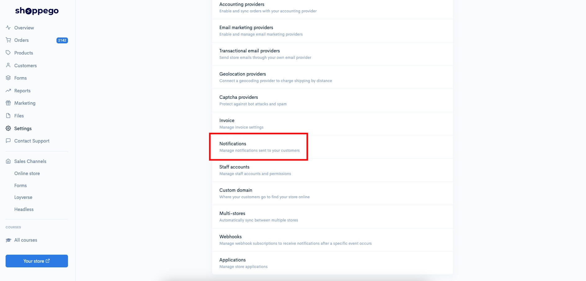
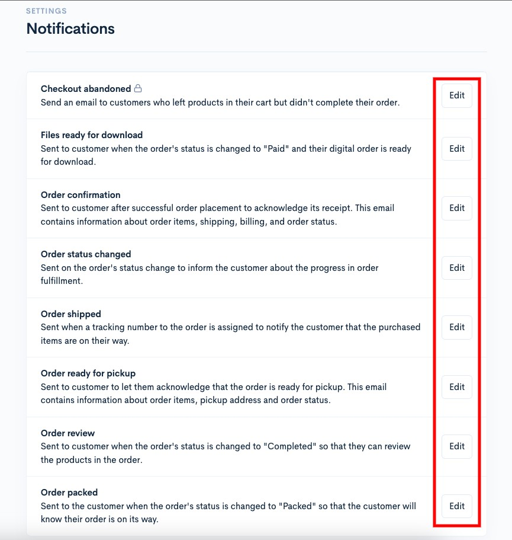
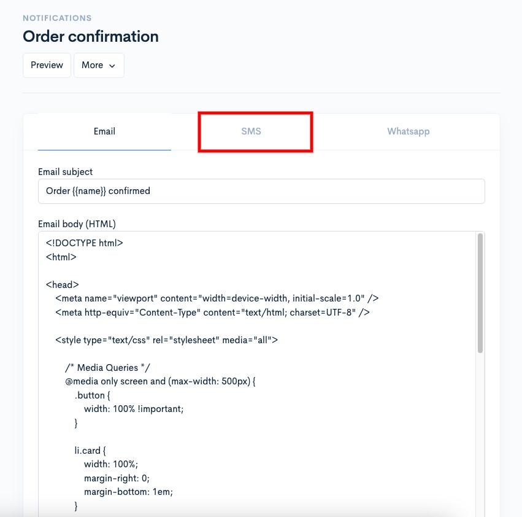
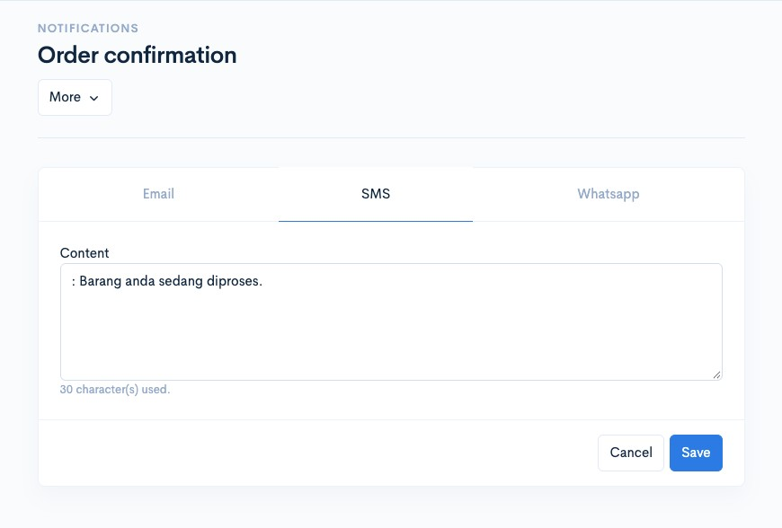
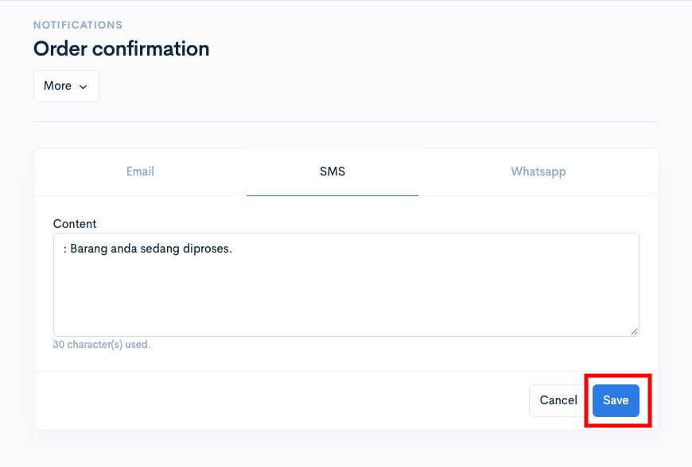

# KlasikSMS

To set up SMS Notification using the Classic SMS system you can follow the steps provided.

Before starting this setup, you need to make sure you have **registered a KlasikSMS account** and **set up the SMS message** that you want to send to your customers. Also, make sure you have created a notification template on your KlasikSMS account.

## Classic SMS information collection

1\. Log in to your SMS Classic account

2\. In the SMS Classic dashboard you need to find the information:

* **API key/Auth token**

3\. Next you need to click on **Edit Profile**

4\. On that page you need to save the information of **Short Code Whitelisted Company** Name for use in the next step. **(If the field is empty you need to top up the credit first in your Classic SMS account)**

**\*\*Both of this information you need to save for use in the next step.**

## Setup in Commerce

1\. Log in to your Commerce account

2\. Click on the **Settings** tab

3\. Click on the **SMS providers** tab

4\. Click the **Activate** button on the **KlasikSMS** tab

5\. Enter the information you have saved in the space provided. For the prefix field, you can enter the text **Short Code Whitelisted Company Name** that you just copied in the previous step. You also need to make sure you have clicked **Enable Classic SMS (Make sure it is blue)**.

6\. Once done you can click **Save**

Once done you can try to make a purchase on your website and see the results for yourself.

### Notification Settings

1. Log in to your Shoppego account

<figure><figcaption></figcaption></figure>

2. Click on **Settings**

<figure><figcaption></figcaption></figure>

3. Click on **Notifications**

<figure><figcaption></figcaption></figure>

4. You can click on **any notification** for which you wish to set an SMS message delivery template.

<figure><figcaption></figcaption></figure>

5. Click on the **SMS** tab.

<figure><figcaption></figcaption></figure>

6. Make sure **your SMS template is the same as the one you have submitted on KlasikSMS**.\
   \
   For example: The **template in your KlasikSMS** is "**RM0 Shoppego : Barang anda sedang di proses.**"\
   \
   So, the **text you need to enter in the Shoppego setting** is "**: Barang anda sedang di proses.**"

<figure><figcaption></figcaption></figure>

7. Once finished, click **Save**.

<figure><figcaption></figcaption></figure>
