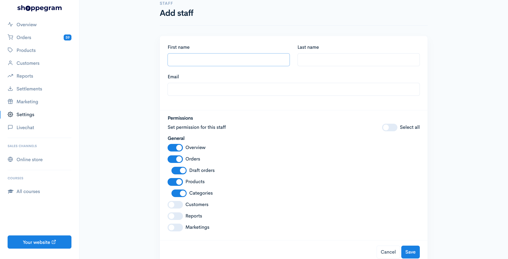
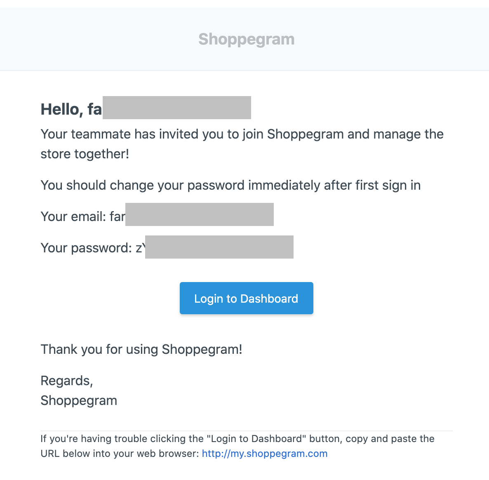
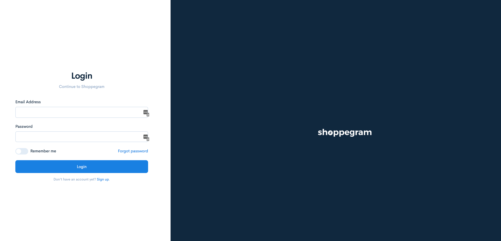

# Staff Account

In Commerce, users can give access to others to manage their online store by adding staff accounts in the settings.

## Add staff

1. Log in to the Commerce dashboard and go to **Settings** -> **Account** and click the **Add staff button**

For the default settings, staff can only access the activated button.

You can set according to your suitability and desire to limit store access to your staff.

Fill in the details in the space provided. For the **Permissions** setting section, you can click on the toggle for the setting that the staff can see or make modifications.

<table><thead><tr><th width="156">Parameters</th><th>Uses</th></tr></thead><tbody><tr><td><strong>Select all</strong></td><td>For you make sure the staff has <strong>access to all settings and page</strong></td></tr><tr><td><strong>Overview</strong></td><td>The staff will be able to see the <strong>Overview page</strong></td></tr><tr><td><strong>Orders</strong></td><td>The staff will be able to view and make settings on the <strong>Orders page</strong></td></tr><tr><td><strong>Draft orders</strong></td><td>The staff will be able to view and make settings on the <strong>Draft orders page</strong></td></tr><tr><td><strong>Products</strong></td><td>The staff will be able to view and make settings on the <strong>Products page</strong></td></tr><tr><td><strong>Categories</strong></td><td>The staff will be able to view and make settings on the <strong>Categories page</strong></td></tr><tr><td><strong>Customers</strong></td><td>The staff will be able to view and make settings on the <strong>Customers page</strong></td></tr><tr><td><strong>Reports</strong></td><td>The staff will be able to view and make settings on the <strong>Reports page</strong></td></tr><tr><td><strong>Marketing</strong></td><td>The staff will be able to view and make settings on the <strong>Marketing page</strong></td></tr></tbody></table>

Once you have done with all the settings you can click the **Save** button.

Upon completion, the staff will receive an invitation to manage your store in the form of an email.

Click the **Login to Dashboard** button and you will be taken to the login page

Enter the email and password provided as in the previous email.

Now your staff can manage your store according to the permissions settings you have set.

## Store Ownership

If you happen to **change your store email address** or **store ownership**, please refer the tutorial below:


[Transfer Ownership](staff-account/transfer-ownership.md)

