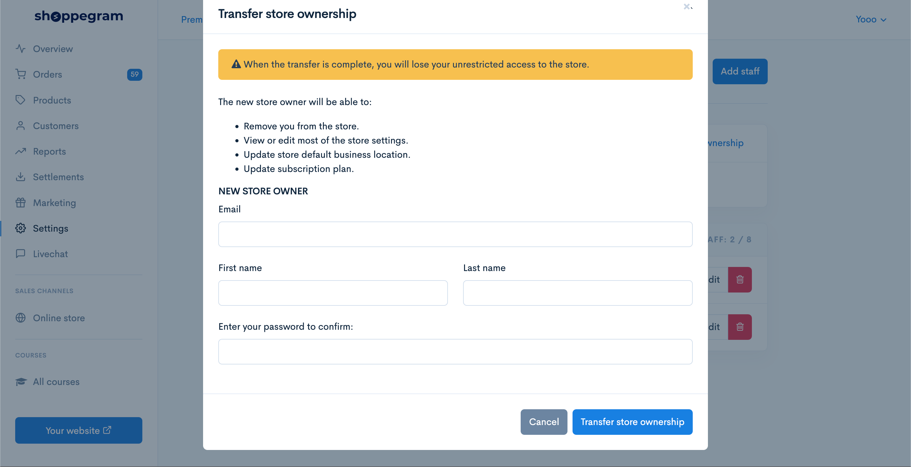

# Transfer Ownership

**Ownership transfer** is a feature to change :&#x20;

* the original **store owner to another store owner**.&#x20;
* Change the **owner current email address to new one**.


After the **transfer process**, you current account will <mark style="color:red;">**lose**</mark>**&#x20;access** to your store.


1. Click on the **Transfer ownership** button.

2\. Enter the required information and click transfer store owner. Therefore, the process of changing the store owner has been completed.

​
