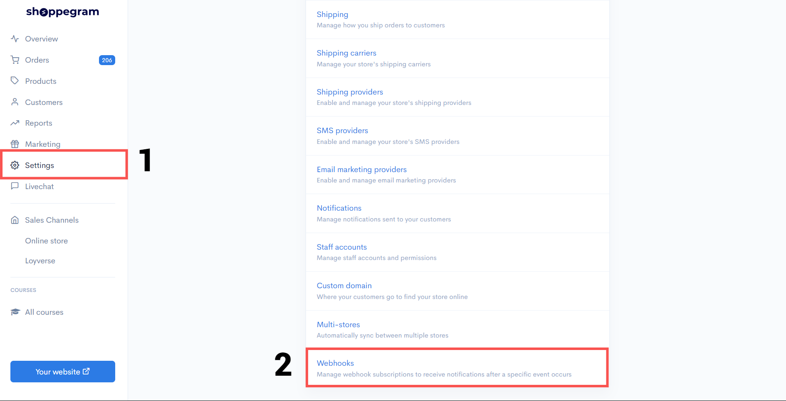
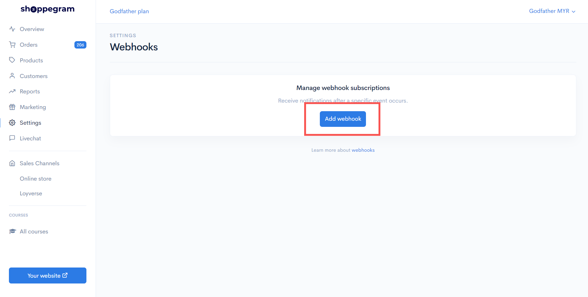
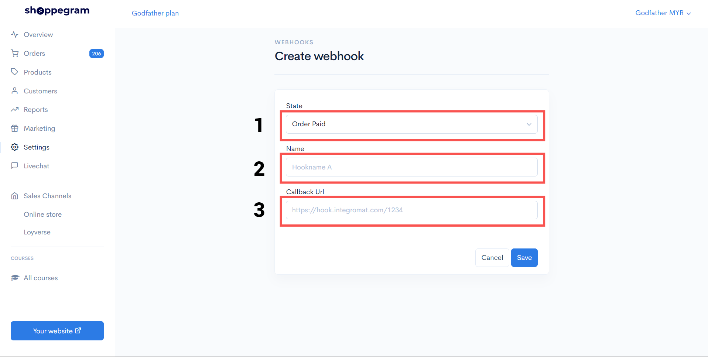
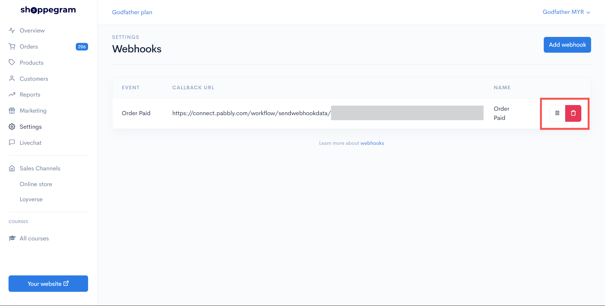

# Webhook


Webhook can be used for you to automatically send messages via Telegram to yourself for you to be notified of recent purchases made by your customers.\
\
You can also use this webhook to send your customer's purchase information into your Google Excel and more.



This Webhook function is only available on Standard, Premium and Ultimate plan subscriptions.


### Webhooks Setup

1. Click on **Settings (1)** and scroll down until you find the **Webhooks section (2)**.

<figure><figcaption></figcaption></figure>

2. Press the **Add Webhook** button to add your webhook.

<figure><figcaption></figcaption></figure>

3. Select **Webhook Status (1)**, then enter the name you want to assign in the **Name field (2)** and enter the webhook link in the **Callback URL field (3)**.

<figure><figcaption></figcaption></figure>

4. Press the **'||'** icon to stop receiving data from your webhook and press it again to resume receiving data from the webhook. Press the **trash can icon** to delete the webhook.

<figure><figcaption></figcaption></figure>

### Webhook Data

In Commerce, you can use the webhook to pull data for each:

<table data-header-hidden><thead><tr><th width="243">State</th><th>Descriptions</th></tr></thead><tbody><tr><td><strong>Order Paid</strong></td><td>Trigger when you mark your order as paid or the customer's order successfully makes a payment</td></tr><tr><td><strong>Order Shipped</strong></td><td>Trigger when you enter the tracking number on the customer's order</td></tr><tr><td><strong>Checkout Abandoned</strong></td><td>Trigger when a customer does not complete payment within 60 minutes</td></tr><tr><td><strong>Checkout Completed</strong></td><td>Trigger when the customer successfully checkout and reaches up to the thank you page</td></tr><tr><td><strong>Checkout Updated</strong></td><td>Trigger when customers receive the Thank you Page Offer (TYPO) promotion you offer</td></tr><tr><td><strong>Order Status Processing</strong></td><td>Trigger when you change the status of a customer's order to Processing</td></tr><tr><td><strong>Order Status Completed</strong></td><td>Trigger when you change the status of a customer's order to Completed</td></tr><tr><td><strong>Order Updated</strong></td><td>Triggered when the <strong>order is updated</strong> after the customer accepts the Thank You Page Offer (TYPO).</td></tr><tr><td><strong>Order Ready For Pickup</strong></td><td>Trigger when you change the customer's order status to "<strong>Ready for Pickup</strong>".</td></tr><tr><td><strong>Order Packed</strong></td><td>Trigger when you change the customer's order status to '<strong>Order Packed</strong>'.</td></tr><tr><td><strong>Inventory Updated</strong></td><td>Trigger when there is a <strong>change in your product stock</strong> quantity.</td></tr></tbody></table>

Here, we include the values ​​that you can pull.

| 
<strong>Parameters</strong>: {{ checkout}}  <strong>Description</strong>: Checkout data <strong>Example</strong>: \[Collection]
                                                                                                |
| ------------------------------------------------------------------------------------------------------------------------------------------------------------------------------------------------------------------------------------------- |
| 
<strong>Parameters</strong>: {{ checkout.id}} <strong>Description</strong>: Id for checkout data <strong>Example</strong>: 1262140
                                                                                             |
| 
<strong>Parameters</strong>: {{ checkout.domain}}  <strong>Description</strong>: Domain/Subdomain of your store <strong>Example</strong>: mirfaith.myshoppegram.com
                                                            |
| 
<strong>Parameters</strong>: {{ checkout.url}}  <strong>Description</strong>: Your store link <strong>Example</strong>: <https://mirfaith.myshoppegram.com> 
                                                                   |
| 
<strong>Parameters</strong>: {{ checkout.currency}}  <strong>Description</strong>: Currency used in your store <strong>Example</strong>: MYR
                                                                                   |
| 
<strong>Parameters</strong>: {{ checkout.total}}  <strong>Description</strong>: The amount of payment charged <strong>Example</strong>: 10
                                                                                     |
| 
<strong>Parameters</strong>: {{ checkout.shipping}}  <strong>Description</strong>: The shipping rates you have set <strong>Example</strong>: 0
                                                                                 |
| 
<strong>Parameters</strong>: {{ checkout.rate}}  <strong>Description</strong>: The name of the shipping rates that the customer has chosen <strong>Example</strong>: FREE SHIPPING COD
                                         |
| 
<strong>Parameters</strong>: {{ checkout.completed\_at}}  <strong>Description</strong>: The date and time the customer successfully made the payment <strong>Example</strong>: 2021-03-03T22:58:32+08:00
                       |
| 
<strong>Parameters</strong>: {{ checkout.created\_at}}  <strong>Description</strong>: The date and time the customer wants to make the payment <strong>Example</strong>: 2021-03-03T22:58:17+08:00
                             |
| 
<strong>Parameters</strong>: {{ checkout.items}}  <strong>Description</strong>: Data items/variants in checkout <strong>Example</strong>: \[Collection]
                                                                        |
| 
<strong>Parameters</strong>: {{ checkout.items\[].product}}  <strong>Description</strong>: Product data at checkout <strong>Example</strong>: \[Collection]
                                                                    |
| 
<strong>Parameters</strong>: {{ checkout.items\[].product.name}}  <strong>Description</strong>: The name of your product <strong>Example</strong>: Test 
                                                                       |
| 
<strong>Parameters</strong>: {{ checkout.items\[].product.sku}}  <strong>Description</strong>: SKUs for your product variants <strong>Example</strong>: 123456
                                                                 |
| 
<strong>Parameters</strong>: {{ checkout.items\[].name}}  <strong>Description</strong>: The name of your product variant <strong>Example</strong>: 2 Unit/ Hitam
                                                               |
| 
<strong>Parameters</strong>: {{ checkout.items\[].currency}}  <strong>Description</strong>: Currency used in your store <strong>Example</strong>: MYR 
                                                                         |
| 
<strong>Parameters</strong>: {{ checkout.items\[].price}}  <strong>Description</strong>: The price of your product variants <strong>Example</strong>: 10
                                                                       |
| 
<strong>Parameters</strong>: {{ checkout.items\[].quantity}}  <strong>Description</strong>: The quantity of your variant product that is at Checkout <strong>Example</strong>: 1
                                               |
| 
<strong>Parameters</strong>: {{ checkout.items\[].subtotal}}  <strong>Description</strong>: The total price of the variant product at Checkout <strong>Example</strong>: 10
                                                    |
| 
<strong>Parameters</strong>: {{ checkout.customer}}  <strong>Description</strong>: Customer data that checkout on your website <strong>Example</strong>: \[Collection]
                                                         |
| 
<strong>Parameters</strong>: {{ checkout.customer.first\_name}}  <strong>Description</strong>: The first name of the customer who checked out on your website <strong>Example</strong>: Abu
                                    |
| 
<strong>Parameters</strong>: {{ checkout.customer.last\_name}} <strong>Description</strong>: The last name of the customer who checked out on your website <strong>Example</strong>: Ali
                                       |
| 
<strong>Parameters</strong>: {{ checkout.customer.phone}}  <strong>Description</strong>: The phone number of the customer who checked out on your website <strong>Example</strong>: 60123456789
                                |
| 
<strong>Parameters</strong>: {{ checkout.customer.email}}  <strong>Description</strong>: Email customers who checkout on your website <strong>Example</strong>: <abuali@gmail.com>
                                             |
| 
<strong>Parameters</strong>: {{ checkout.shipping\_address}}  <strong>Description</strong>: Shipping data entered during checkout on your website <strong>Example</strong>: \[Collection]
                                      |
| 
<strong>Parameters</strong>: {{ checkout.shipping\_address.first\_name}}  <strong>Description</strong>: The first name entered on the shipping page during checkout on your website <strong>Example</strong>: Nur
              |
| 
<strong>Parameters</strong>: {{ checkout.shipping\_address.last\_name}}   <strong>Description</strong>: The last name entered on the shipping page during checkout on your website  <strong>Example</strong>: Aishah
           |
| 
<strong>Parameters</strong>: {{ checkout.shipping\_address.phone}}  <strong>Description</strong>: Phone number entered on the shipping page during checkout on your website <strong>Example</strong>: 601122334455
             |
| 
<strong>Parameters</strong>: {{ checkout.shipping\_address.email}}   <strong>Description</strong>: Email entered on the shipping page during checkout on your website <strong>Example</strong>: <nuraishah@gmail.com>
          |
| 
<strong>Parameters</strong>: {{ checkout.shipping\_address.address1}}   <strong>Description</strong>: Address entered on the shipping page during checkout on your website <strong>Example</strong>: Persiaran Permata Perdana
 |
| 
<strong>Parameters</strong>: {{ checkout.shipping\_address.address2}}  <strong>Description</strong>: Address line 2 (If any) entered on the shipping page during checkout on your website

<strong>Example</strong>: -
       |
| 
<strong>Parameters</strong>: {{ checkout.shipping\_address.zip}}  <strong>Description</strong>: Postal code entered on the shipping page during checkout on your website <strong>Example</strong>: 63000
                       |
| 
<strong>Parameters</strong>: {{ checkout.shipping\_address.city}}  <strong>Description</strong>: The city entered in the shipping page during checkout on your website <strong>Example</strong>: Selangor
                      |
| 
<strong>Parameters</strong>: {{ checkout.shipping\_address.state}}  <strong>Description</strong>: The state entered in the shipping page during checkout on your website <strong>Example</strong>: Cyberjaya
                   |
