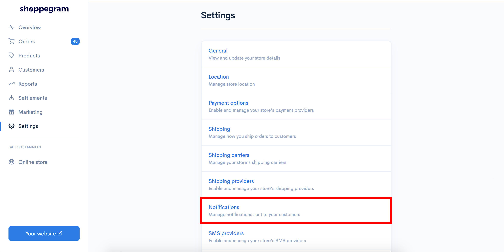
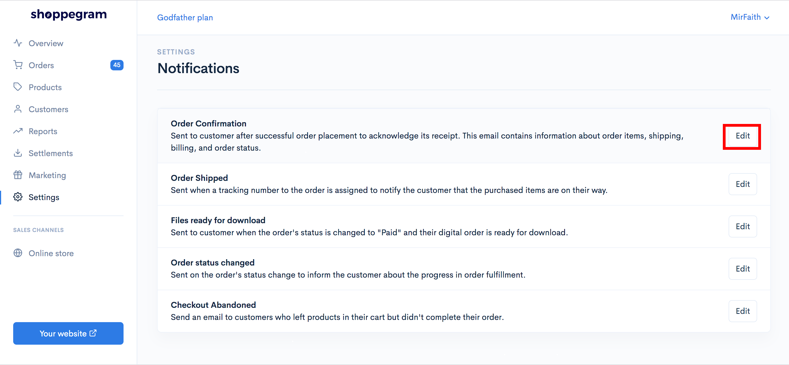
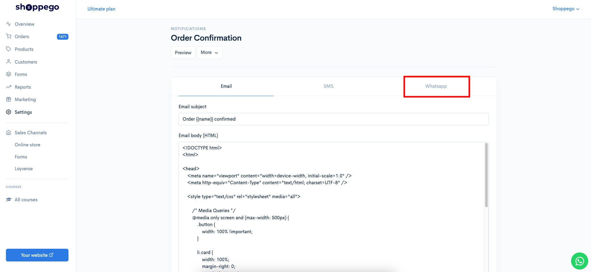
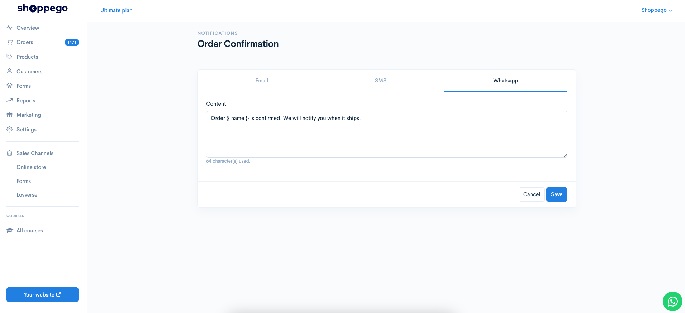
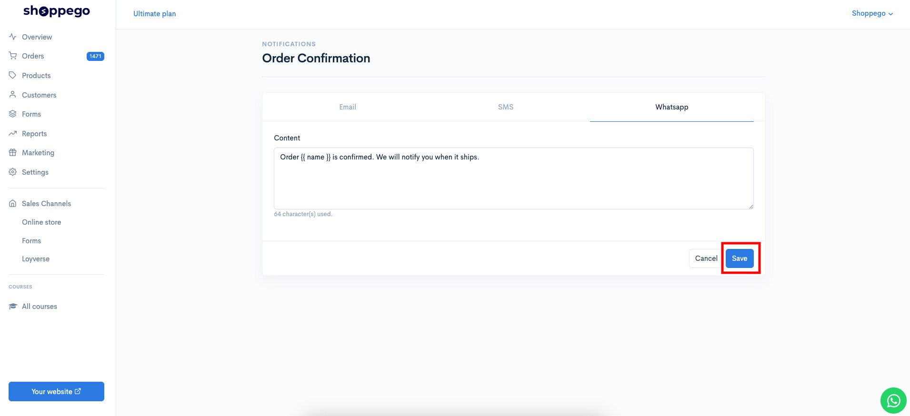
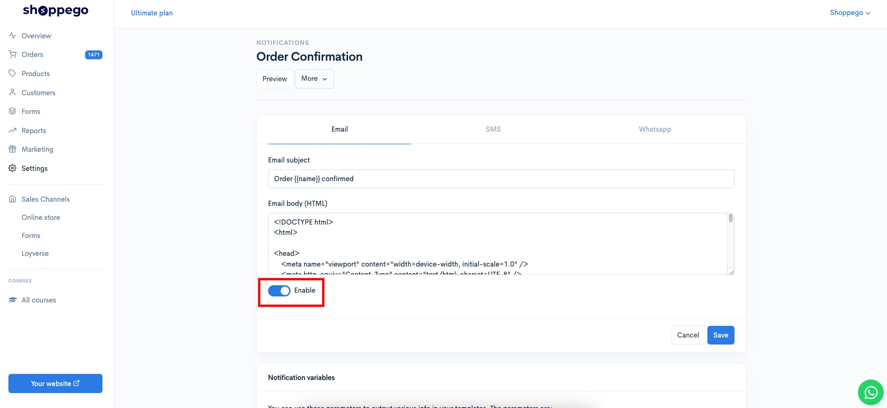

# Whatsapp providers

At Shoppego, you can connect your website with the Whatsapp Provider system such as:


[Onsend](whatsapp-providers/onsend.md)



[Wabot](whatsapp-providers/wabot.md)


Before starting the following settings, you need to set the WhatsApp message notification settings that will be sent first.



* These features are only available for <mark style="color:red;">Premium</mark> and <mark style="color:red;">Ultimate</mark> plans.
* The only Whatsapp notifications that can be sent to customers are <mark style="color:red;">**Order confirmation, Order shipped, Order review, Order packed**</mark> and <mark style="color:red;">**Order ready for pickup**</mark> for now.
  

## **Settings at Shoppego**

1\. Log in to your Shoppego account.

2\. Click on the **Settings** tab

3\. Click on the **Notifications** tab.

4\. Click the **Edit** button on the Order Confirmation tab

5\. Click on the **Whatsapp** tab

6\. In the **Content** column, you can enter the text/message you want to send to customers after they make a payment on your website.

7\. Once finished, you can click **Save**.

8\. You need to make sure that the Order Confirmation is in the Enable state. (Make sure it is blue)

Once finished, you can make other WhatsApp notification settings.
