# Onsend

To set up WhatsApp Notifications using the Onsend system, you can follow the steps provided.

**Before starting this setup, you need to make sure you have registered an Onsend account first.**

## **Settings at Onsend**

1. Log in to your Onsend account.

<figure>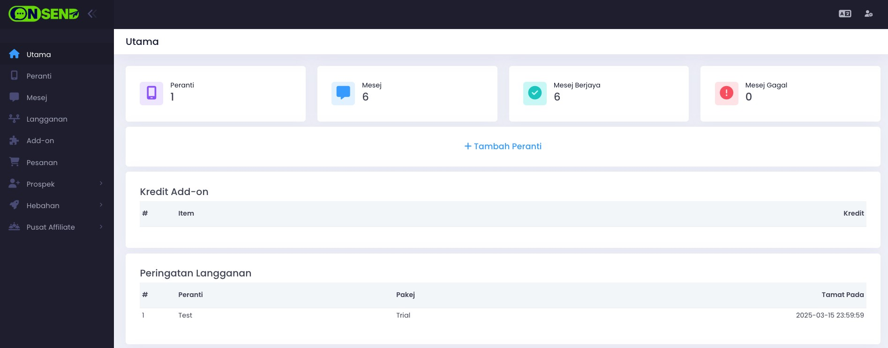<figcaption></figcaption></figure>

2. If you have not yet added a Whatsapp number to your Onsend account, you can click on **Devices**.

<figure>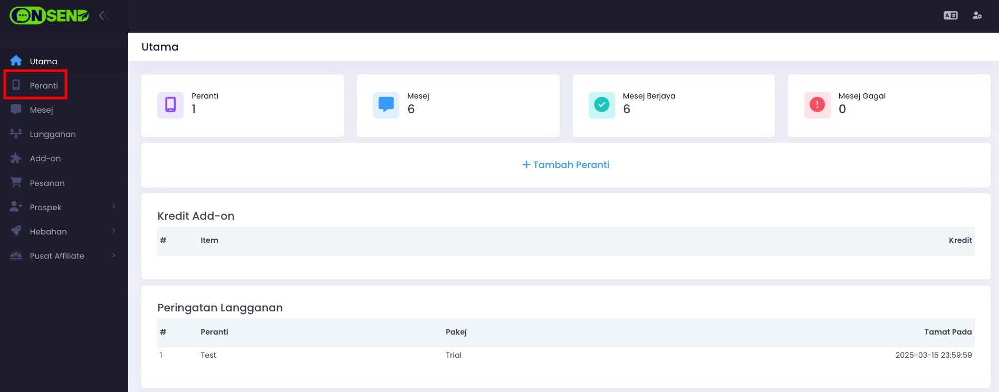<figcaption></figcaption></figure>

3. Click **Add Device**

<figure>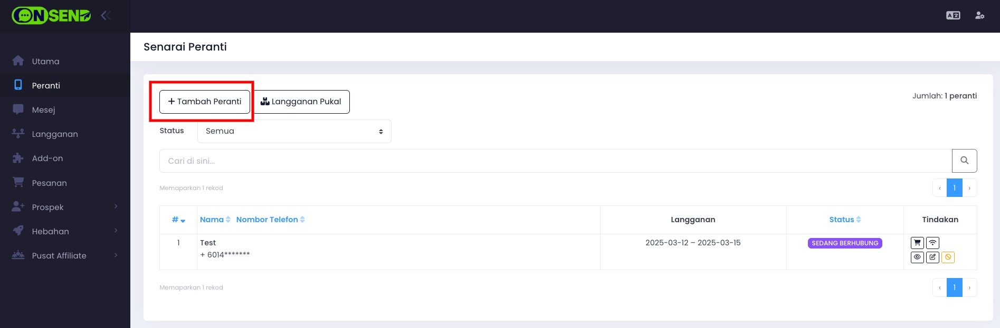<figcaption></figcaption></figure>

4. Enter a **name** (for reference) for the device and click **Save**

<figure>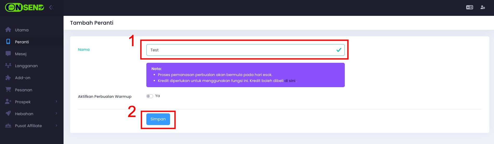<figcaption></figcaption></figure>

5. Then, you can click on the **activate button/icon** to **scan your WhatsApp QR**.

<figure>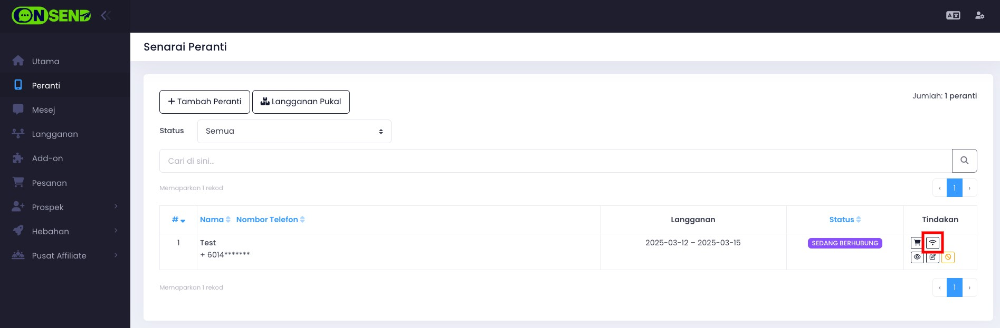<figcaption></figcaption></figure>

6. Once done, you should be able to see the **status of your device change to Connected**.

<figure>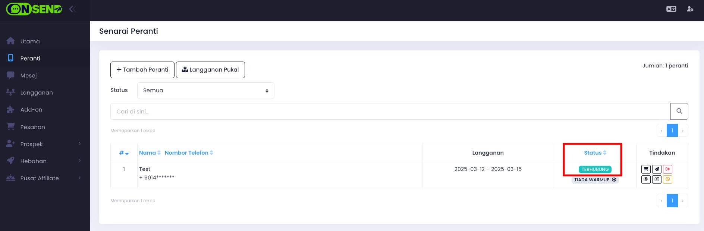<figcaption></figcaption></figure>

7. Next, you can click on the **View button/icon**

<figure>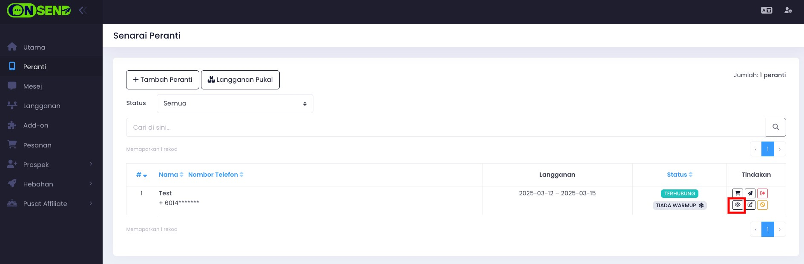<figcaption></figcaption></figure>

8. On the page you will be taken to, you can **get your device token** to **use to connect to your Shoppego store** later.

<figure>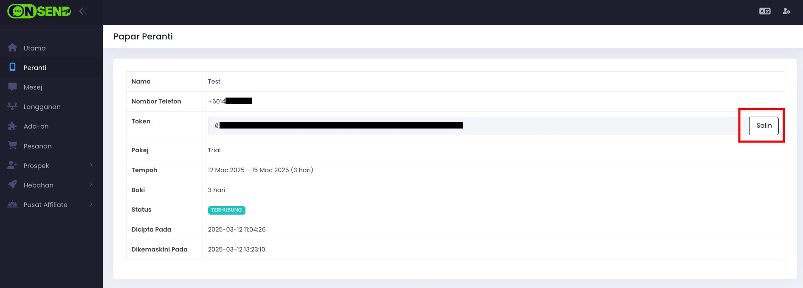<figcaption></figcaption></figure>

## Settings at Shoppego

1. Log in to your Shoppego account

<figure><figcaption></figcaption></figure>

2. Click on **Settings**

<figure><figcaption></figcaption></figure>

3. Click on **Whatsapp providers**

<figure>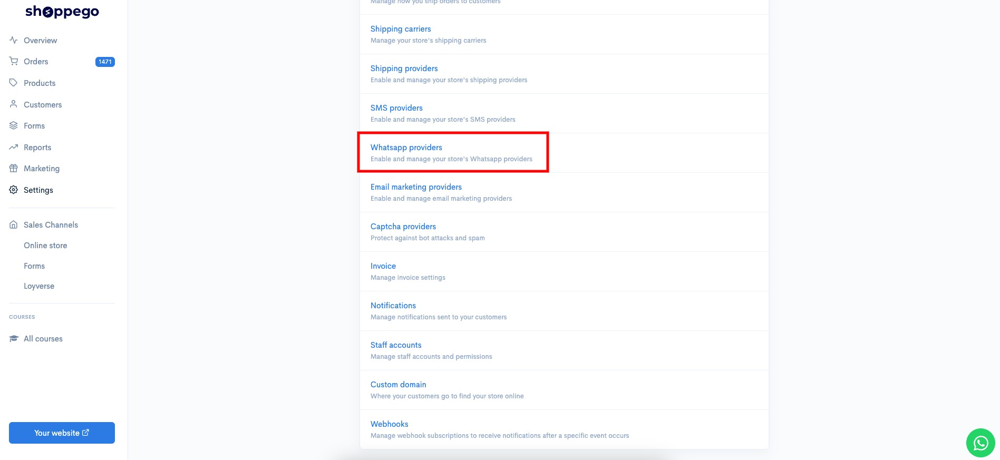<figcaption></figcaption></figure>

4. Click **Edit/Activate on the Onsend tab**

<figure>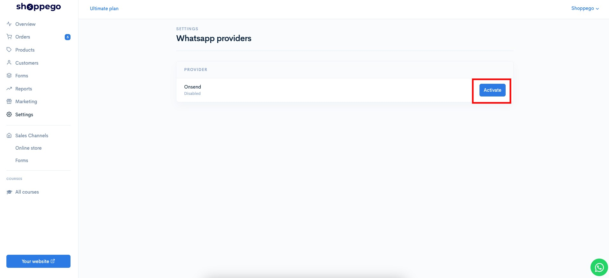<figcaption></figcaption></figure>

5. **Enter the token** you have obtained in the space provided and click **Save**.

<figure>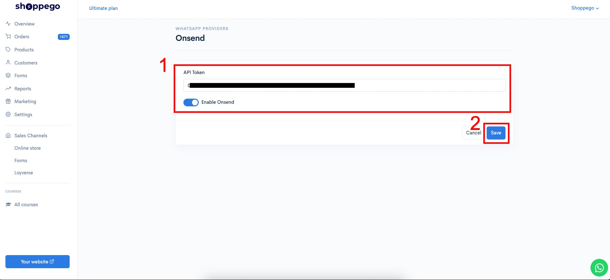<figcaption></figcaption></figure>

Now your setting is complete.
