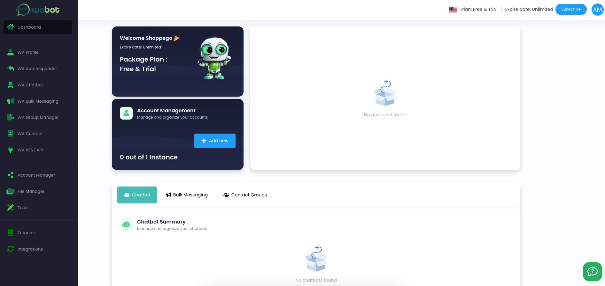
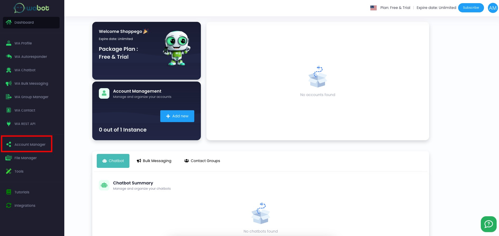
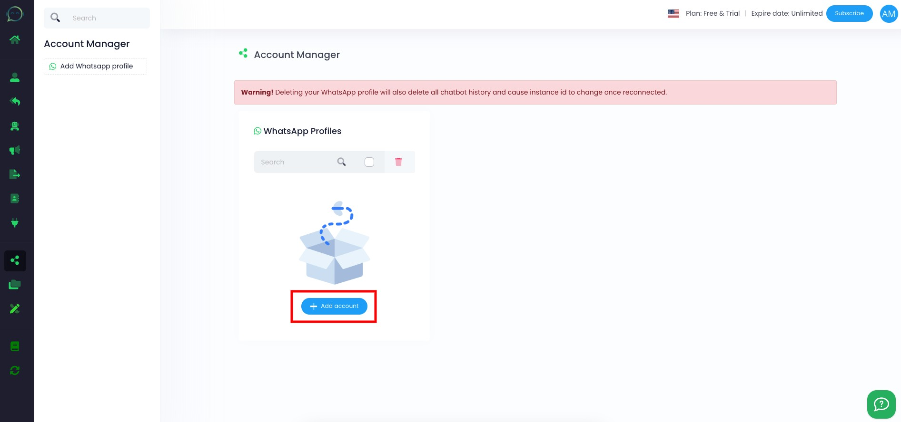
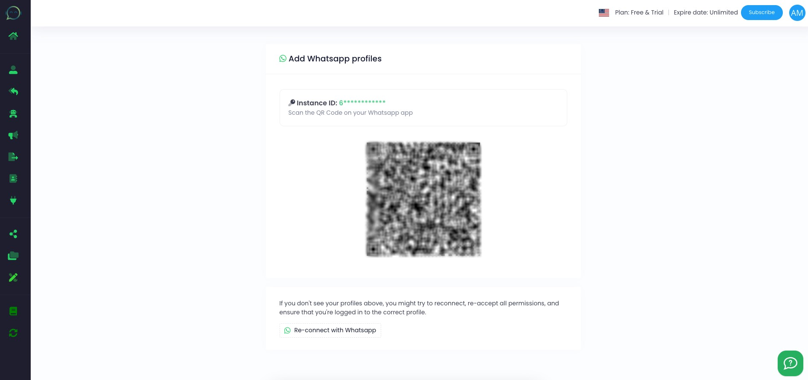
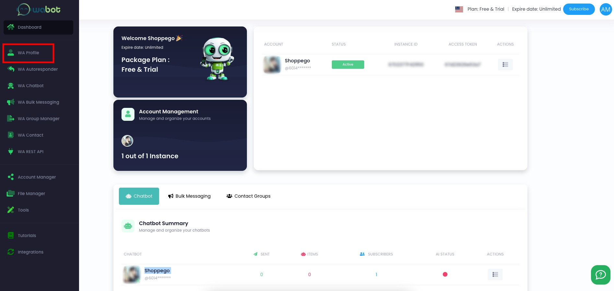
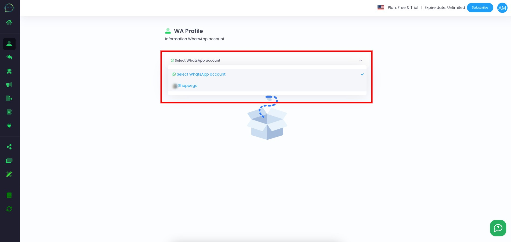
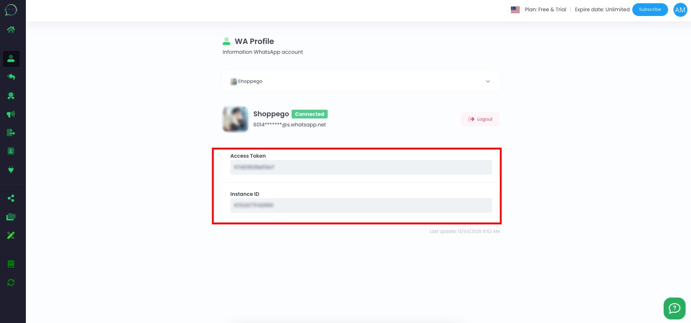
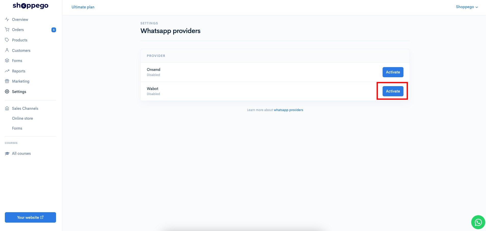
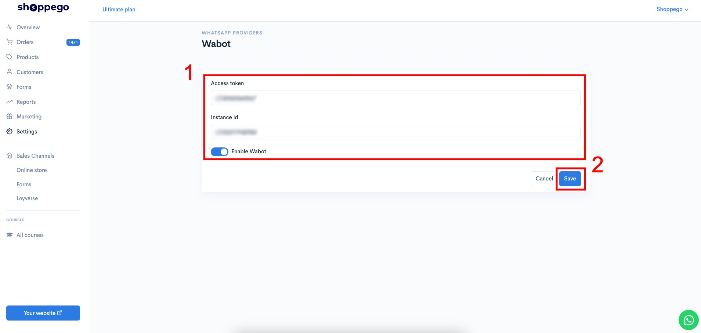

# Wabot

To set WhatsApp Notifications using the Wabot system, you can follow the steps provided.

Before starting this setup, you need to make sure you have registered a Wabot account first.

## **Settings at Wabot**

1. Log in to your Wabot account

<figure><figcaption></figcaption></figure>

2. If you have not yet added a Whatsapp number to your Wabot account, you can click on **Account Manager.**

<figure><figcaption></figcaption></figure>

3. Click **Add account**

<figure><figcaption></figcaption></figure>

4. Then, you need to **scan the QR code** of your Whatsapp account.

<figure><figcaption></figcaption></figure>

5. Once done, you can click on **WA Profile**

<figure><figcaption></figcaption></figure>

6. Then, **select the Whatsapp account you just added**.

<figure><figcaption></figcaption></figure>

7. On the page you will be taken to, you can **get the** "**Access token**" and "**Instance Id**" **information** that you can **use to connect to your Shoppego store** later.

<figure><figcaption></figcaption></figure>

## Settings at Shoppego

1. Log in to your Shoppego account

<figure><figcaption></figcaption></figure>

2. Click on **Settings**

<figure><figcaption></figcaption></figure>

3. Click on **Whatsapp providers**

<figure><figcaption></figcaption></figure>

4. Click **Edit/Activate on the Wabot tab**

<figure><figcaption></figcaption></figure>

5. **Enter the** "**Access token**" and "**Instance Id**" information **that you have obtained** in the spaces provided and click **Save**.

<figure><figcaption></figcaption></figure>

Now your setting is complete.
