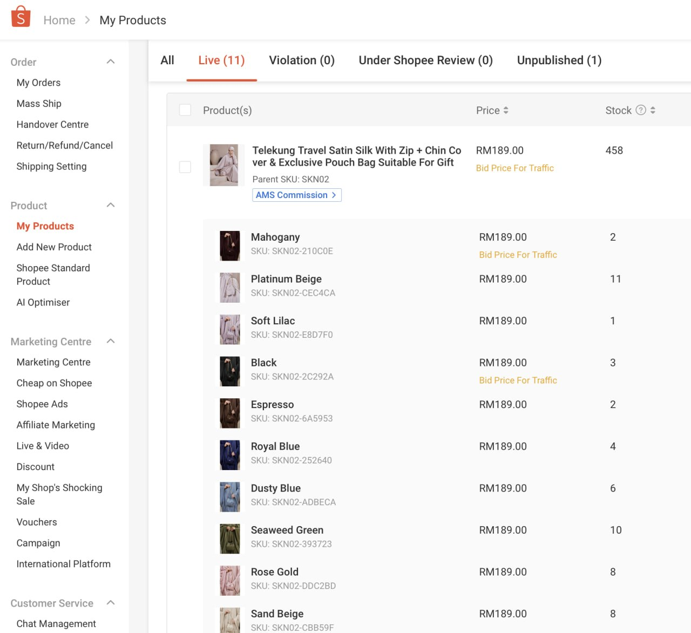
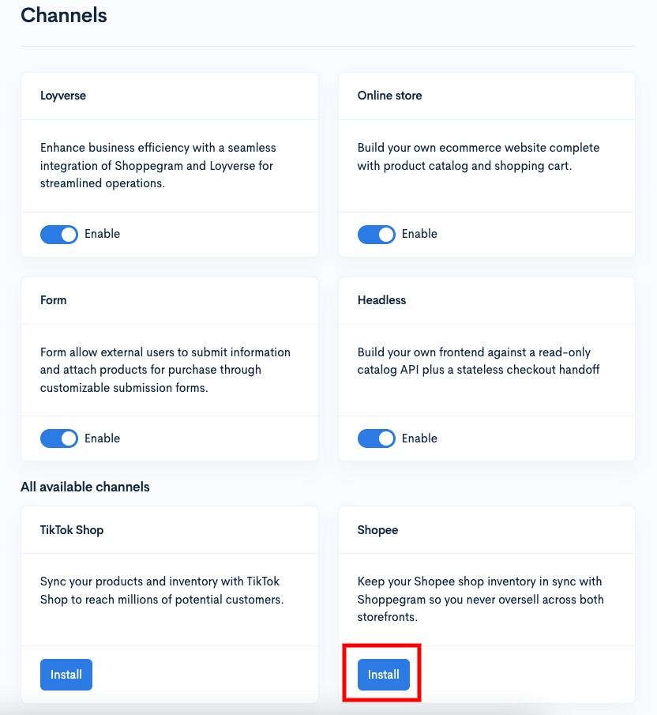
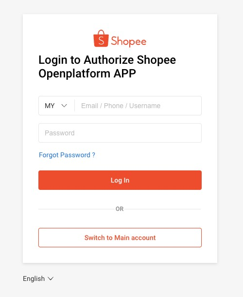
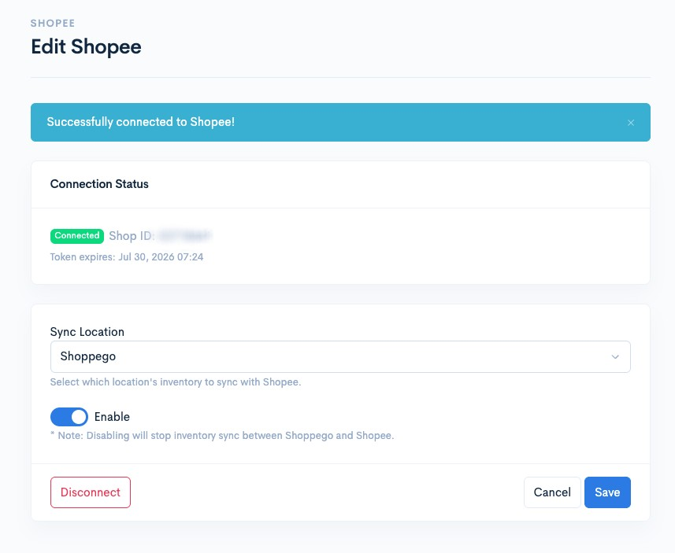

# Shopee

Shopee is a marketplace platform. You can use the integration function with Shopee Seller to synchronize your product inventory with Shopee Seller. **Please note that the system will only synchronize product stock for:**

* **Stock changes from the Shoppego platform**
* **Stock changes through purchases on the Shoppego platform**
* **Stock changes through purchases on the Shopee Seller platform**
* **Stock changes through the cancel/refund process on the Shopee Seller platform**

**The stock synchronization function between the Shoppego platform and Shopee Seller will also be guided by the SKU settings of the products or product variants themselves.**


This feature is available only for the **Ultimate** plan subscription.


## Shopee Seller account registration

If you don't have a Shopee Seller account yet, you can register via this link first: <https://seller.shopee.com.my/portal/my-onboarding>

## Product Format for Shopee

Once you have logged in to your Shopee Seller account dashboard, you can add products to Shopee as usual.

You need to make sure each of your variants has a unique SKU for the sync process with your Shoppego store later.

<figure><figcaption></figcaption></figure>

## Product Format for Shoppego

You need to ensure that every product on Shoppego for which you wish to synchronize stock with Shopee has the same SKU as the corresponding product on Shopee.

To set up SKUs on the Shoppego platform, you can go to the following section:

1. Log in to your Shoppego account

<figure><figcaption></figcaption></figure>

2. Click on **Products**

<figure><figcaption></figcaption></figure>

3. Click on the product you want to adjust the stock for or you can simply create a new product.

<figure><figcaption></figcaption></figure>

4. You can go to the **Variants** tab

<figure><figcaption></figcaption></figure>

5. Click on the variant selection tab for which you want to add SKU designations to align stock.

<figure><figcaption></figcaption></figure>

6. Then, you can **enter the same SKU designation as your product on Shopee in the "SKU (Stock Keeping Unit)" designation on the Shoppego platform** and click **Save**

<figure><figcaption></figcaption></figure>

## Shopee Configuration on Shoppego

1. Log in to your Shoppego account

<figure><figcaption></figcaption></figure>

2. Click on **Sales channels**

<figure><figcaption></figcaption></figure>

3. Click on "**Install**" on **Shopee**

<figure><figcaption></figcaption></figure>

4. Next, you will be asked to log in to your Shopee Seller account.

<figure><figcaption></figcaption></figure>

Your Shoppego store is now connected to your Shopee Seller account.

<figure><figcaption></figcaption></figure>

Next, you can configure the settings to synchronize stock; please refer to the section:


[Products](shopee/products.md)


To reset Shopee integration or change stock coordination location, you can refer to the section:


[Settings](shopee/settings.md)

