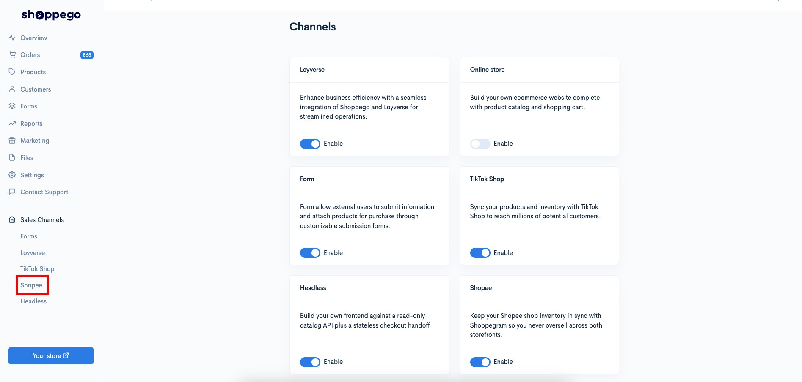
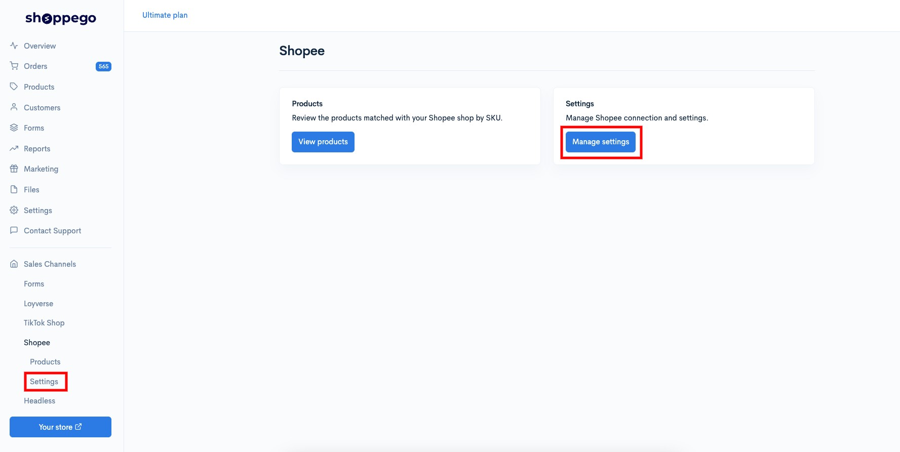
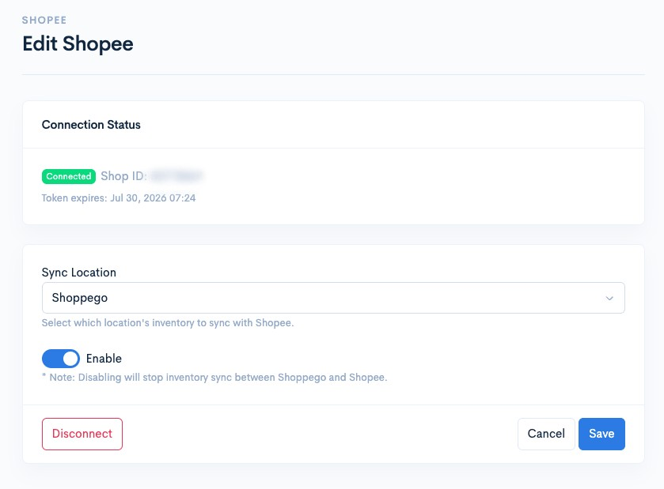
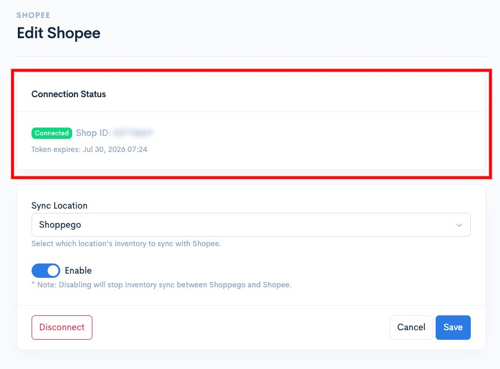
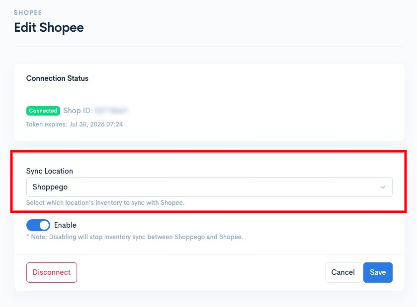
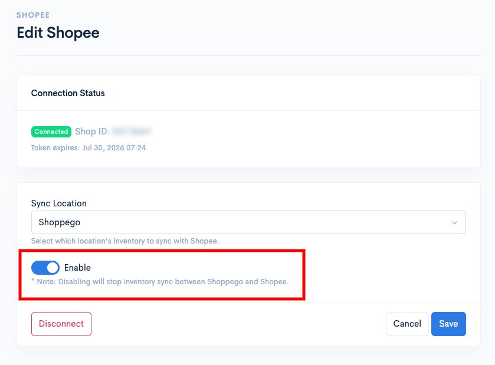
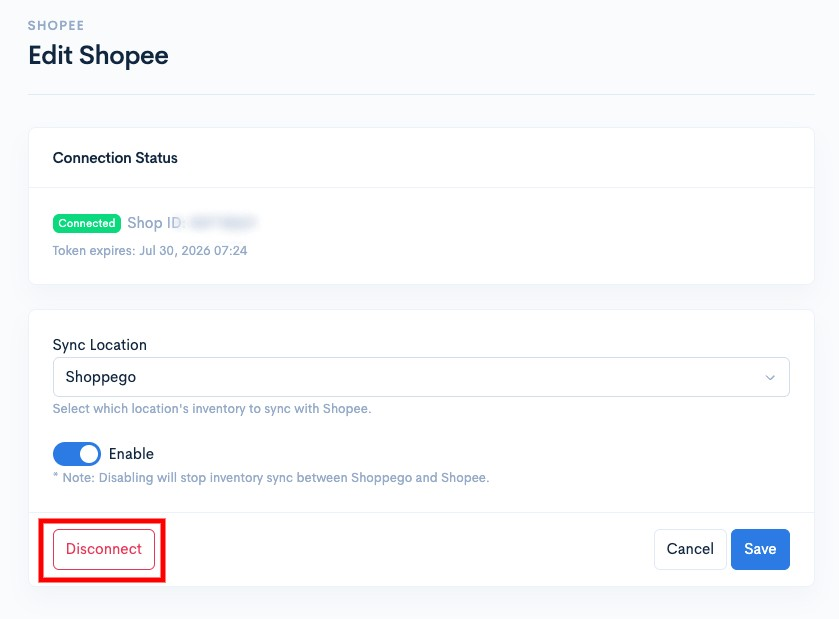
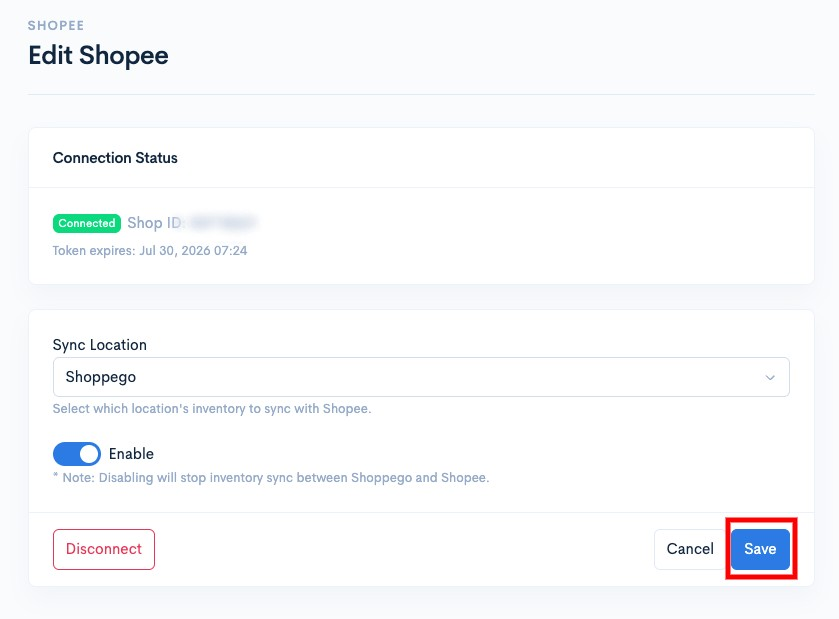

# Settings

To modify your Shopee Seller integration settings, whether for location or the Shopee Seller account, you can go to the following section:

1. Log in to your Shoppego account

<figure><figcaption></figcaption></figure>

2. Click on **Sales Channels**

<figure><figcaption></figcaption></figure>

3. Click on **Shopee**

<figure><figcaption></figcaption></figure>

4. Click on **Settings**

<figure><figcaption></figcaption></figure>

On this page, you will find several settings and pieces of information, including:

<figure><figcaption></figcaption></figure>

### View Shopee account integration info

<figure><figcaption></figcaption></figure>

### Perform a location change to reconcile stock.

<figure><figcaption></figcaption></figure>

### Deactivate Shopee integration

<figure><figcaption></figcaption></figure>

### Remove Shopee account integration

<figure><figcaption></figcaption></figure>

Make sure that for every change you make, you click on the **Save** button to save the setting.

<figure><figcaption></figcaption></figure>
