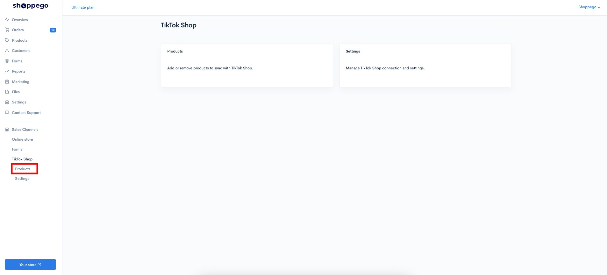
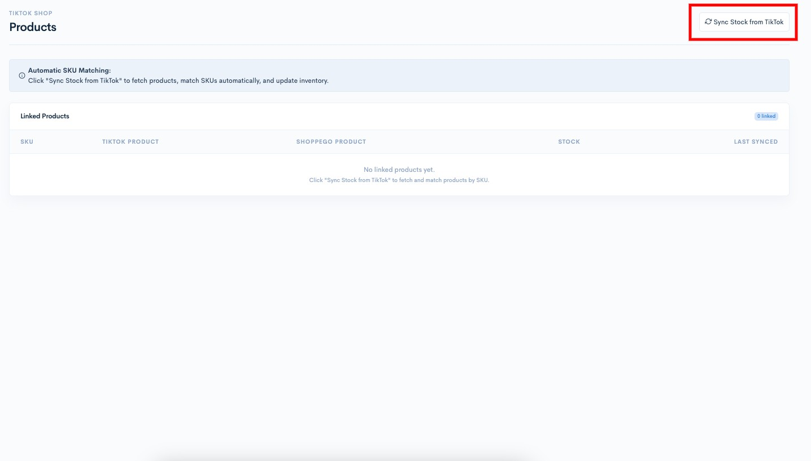
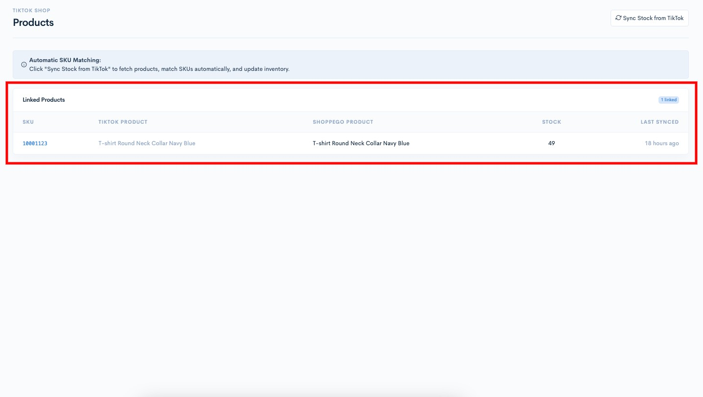

# Products

To sync your products on the Shoppego website and on the TikTok Shop, you can go to the section:

1. Log in to your Shoppego account

<figure><figcaption></figcaption></figure>

2. Click on **Sales Channels**

<figure><figcaption></figcaption></figure>

3. Click on **TikTok Shop**

<figure><figcaption></figcaption></figure>

4. Click on **Products**

<figure><figcaption></figcaption></figure>

5. Then click the "**Sync Stock from TikTok**" button to synchronize your products on TikTok with those in the Shoppego store via SKU reading.

<figure><figcaption></figcaption></figure>

Now the stock adjustment is complete.

<figure><figcaption></figcaption></figure>

## Additional Information

If you **have made manual stock changes on the TikTok Shop platform**, you need to **click the "Sync Stock from TikTok" button again to re-sync the product stock**.

If you experience any errors on the TikTok Shop platform, you can contact [TikTok Support](https://ads.tiktok.com/athena/requester/boards?identify_key=6a1e079024806640c5e1e695d13db80949525168a052299b4970f9c99cb5ac78) for assistance. You can also click **Get Support** in the TikTok app to access their support queue.
