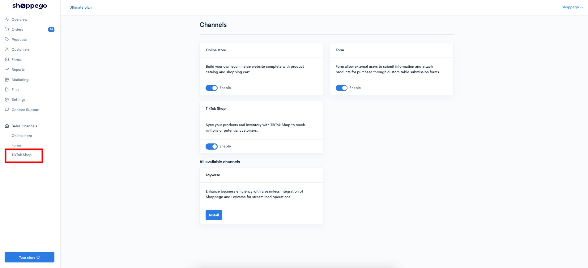
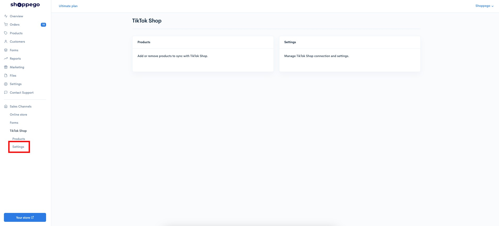
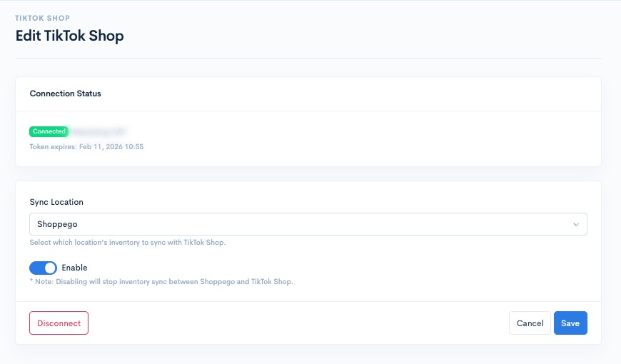
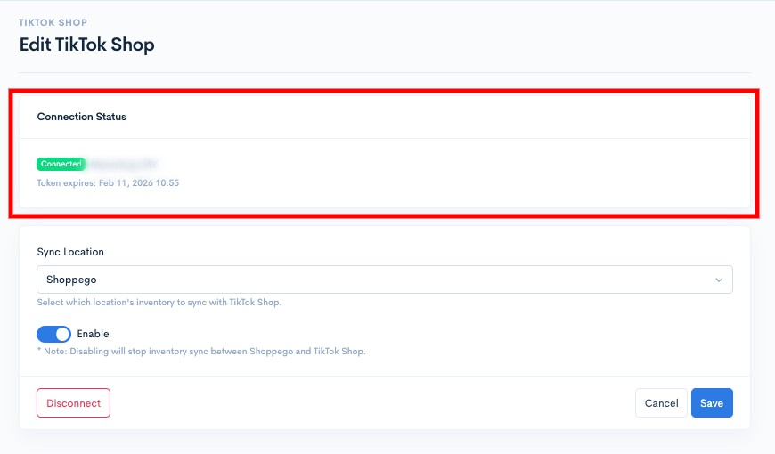
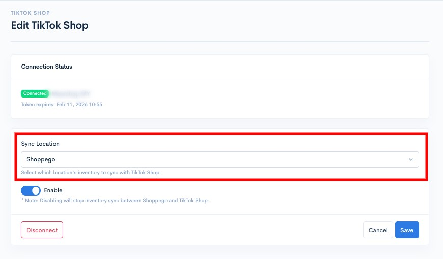
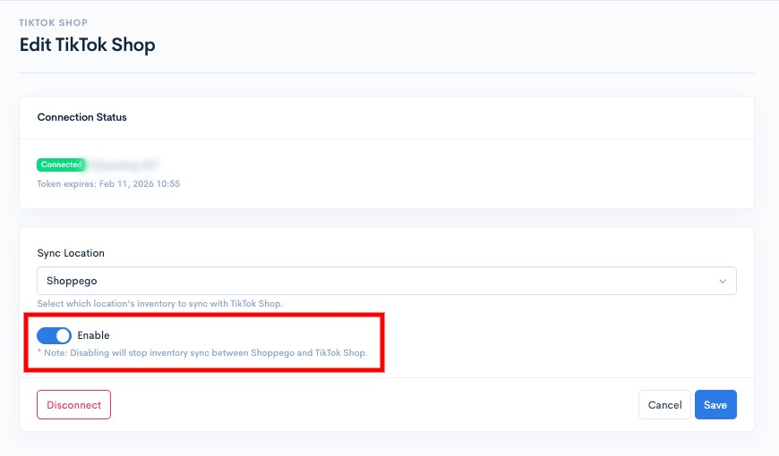
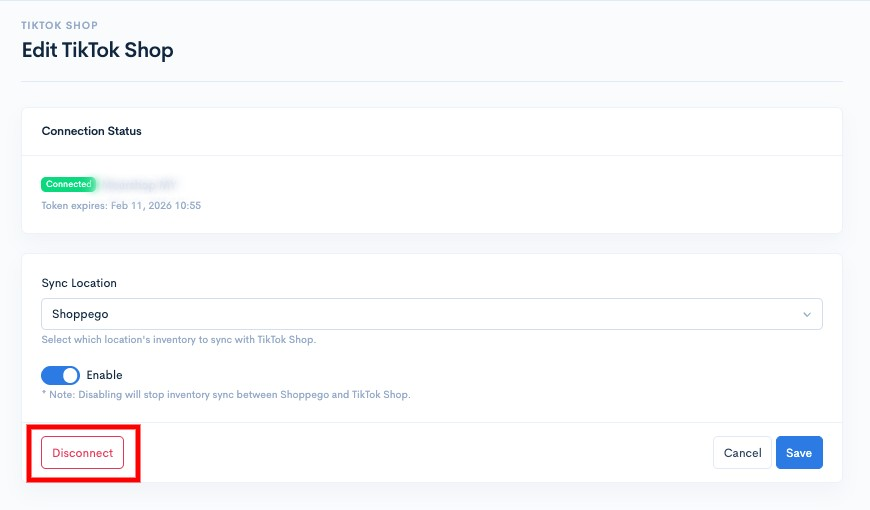
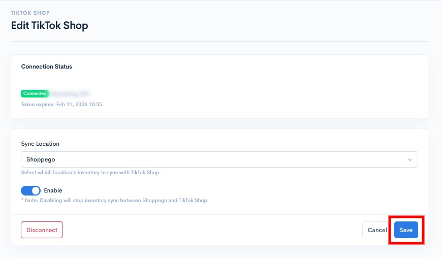

# Settings

To change the TikTok Shop integration settings, whether it's location settings or TikTok Shop accounts, you can go to the section:

1. Log in to your Shoppego account

<figure><figcaption></figcaption></figure>

2. Click on **Sales Channels**

<figure><figcaption></figcaption></figure>

3. Click on **TikTok Shop**

<figure><figcaption></figcaption></figure>

4. Click on **Settings**

<figure><figcaption></figcaption></figure>

On this page, there are several settings and information that you can see, including:

<figure><figcaption></figcaption></figure>

### See TikTok Shop account integration info

<figure><figcaption></figcaption></figure>

### Make location changes to align stock

<figure><figcaption></figcaption></figure>

### Deactivate the TikTok Shop integration

<figure><figcaption></figcaption></figure>

### Removing TikTok Shop account integration

<figure><figcaption></figcaption></figure>

Make sure that for every change you make, you click on the **Save** button to save the setting.

<figure><figcaption></figcaption></figure>
