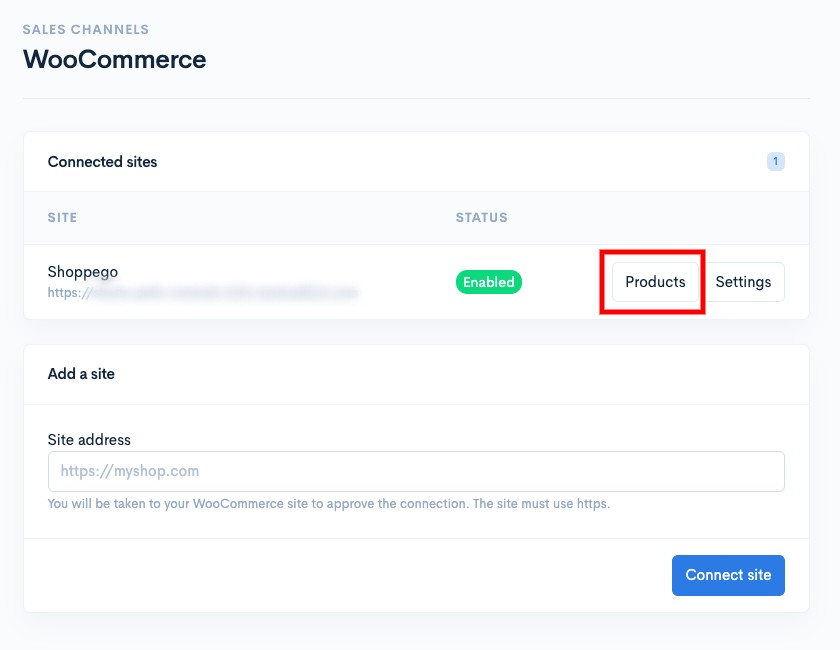
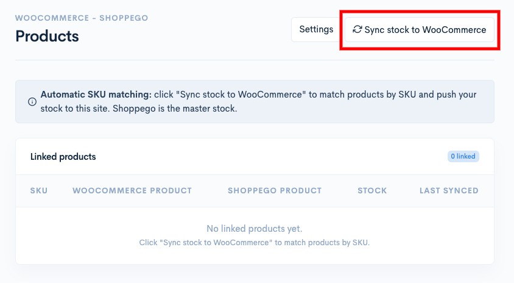
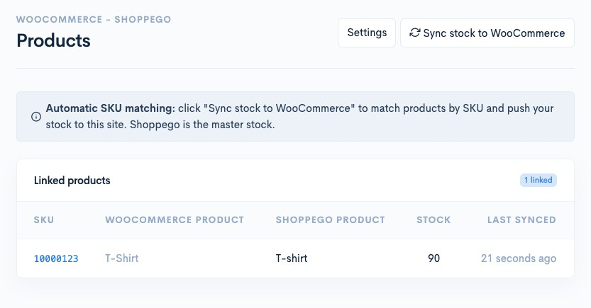

# Products

To synchronize your products between the Shoppego website and WooCommerce, you can go to the following section:

1. Log in to your Shoppego account

<figure><figcaption></figcaption></figure>

2. Click on **Sales Channels**

<figure><figcaption></figcaption></figure>

3. Click on **WooCommerce**.

<figure><figcaption></figcaption></figure>

4. Click on **Products**

<figure><figcaption></figcaption></figure>

5. Next, you can click the "**Sync Stock from WooCommerce**" button to synchronize your WooCommerce products with those in your Shoppego store based on their SKUs.

<figure><figcaption></figcaption></figure>

The stock reconciliation setting has now been completed.

<figure><figcaption></figcaption></figure>

## Maklumat Tambahan

If you make **manual stock changes on the WooCommerce platform**, you **need to click the** "**Sync Stock from WooCommerce**" button again **to re-synchronize the product's stock**.

**Automatic stock synchronization only works when the SKU in Shoppego matches the SKU in WooCommerce**. If the SKUs differ, Shoppego will not be able to synchronize the stock for the product in question.

**Shoppego should serve as the primary source for your inventory**. We recommend updating product stock exclusively on Shoppego. Avoid updating stock on both Shoppego and WooCommerce, as this can lead to inconsistencies in stock data.

If you encounter any errors on the WooCommerce platform, you can contact their support system for assistance.
