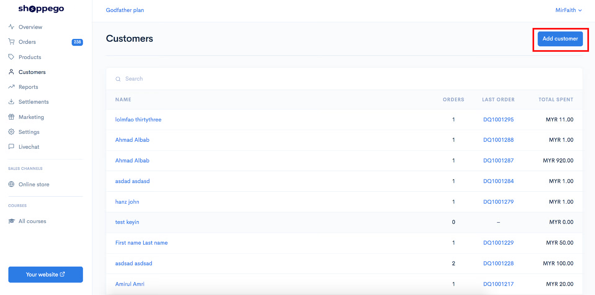
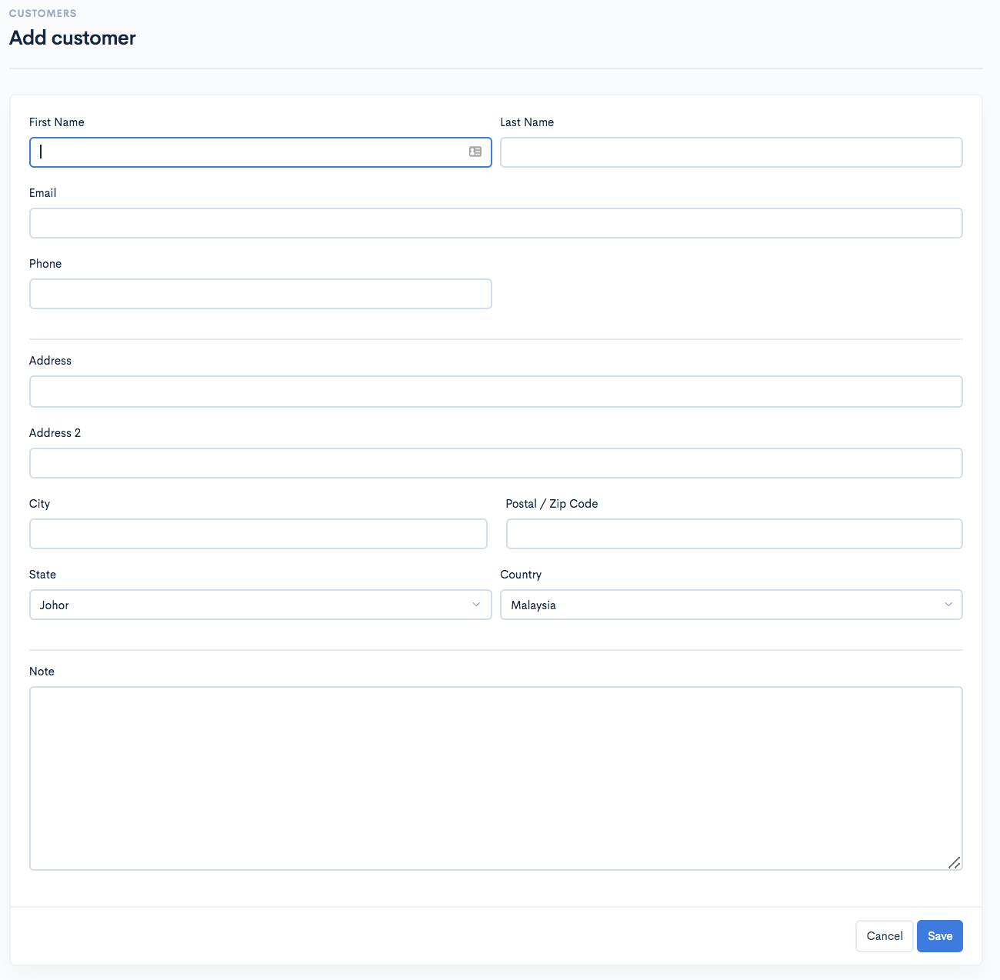
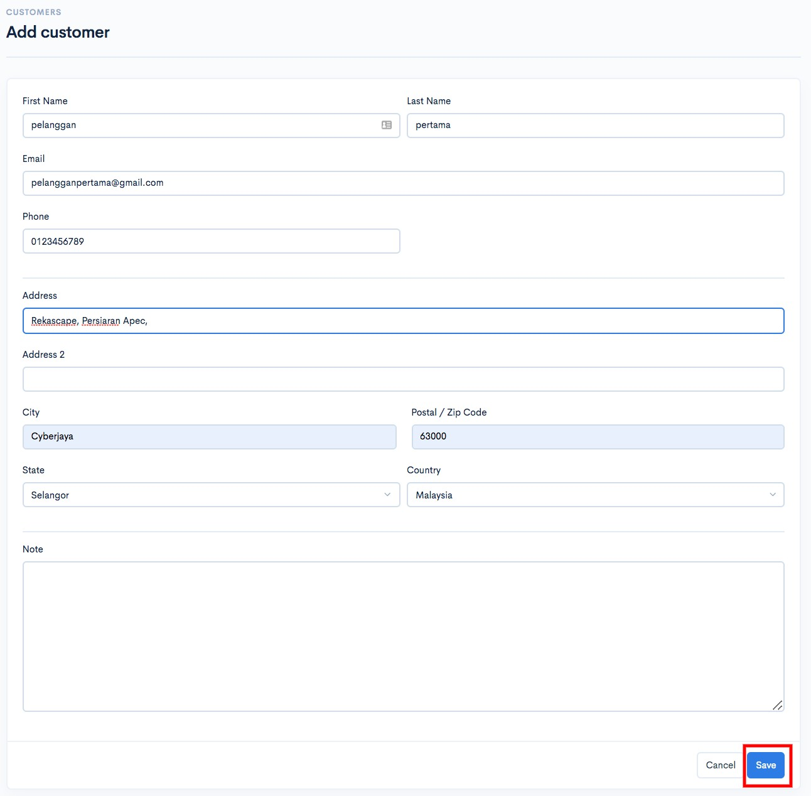
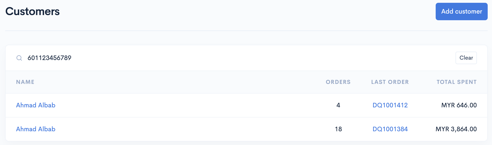
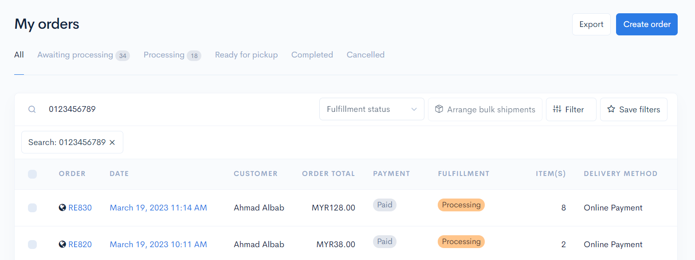

# Customers

Didalam Commerce, anda boleh cipta akaun untuk pelanggan anda. Akaun pelanggan anda juga akan dicipta secara auto jika mereka ada membuat pembayaran melalui website anda.

Untuk mencipta akaun untuk pelanggan anda secara manual, anda boleh rujuk pada langkah penetapan ini

## Penambahan Pelanggan

1\. Log in kedalam **Dashboard Commerce**.

2\. Klik **Customers.**

3\. Klik **Add customer.**

4\. Seterusnya, masukkan maklumat pelanggan anda.

5\. Setelah selesai klik **Save**.

## Carian pelanggan&#x20;

Untuk menggunakan fungsi ini, hanya perlu pergi ke **Dashboard Customer** atau **Dashboard Orders** dan **masukkan nombor telefon pelanggan** anda.

**Maklumat pelanggan berkaitan** dengan nombor telefon akan dipaparkan. &#x20;

### Paparan Dashboard Customers

<figure><figcaption></figcaption></figure>

### Paparan Dashboard Orders

<figure><figcaption></figcaption></figure>
