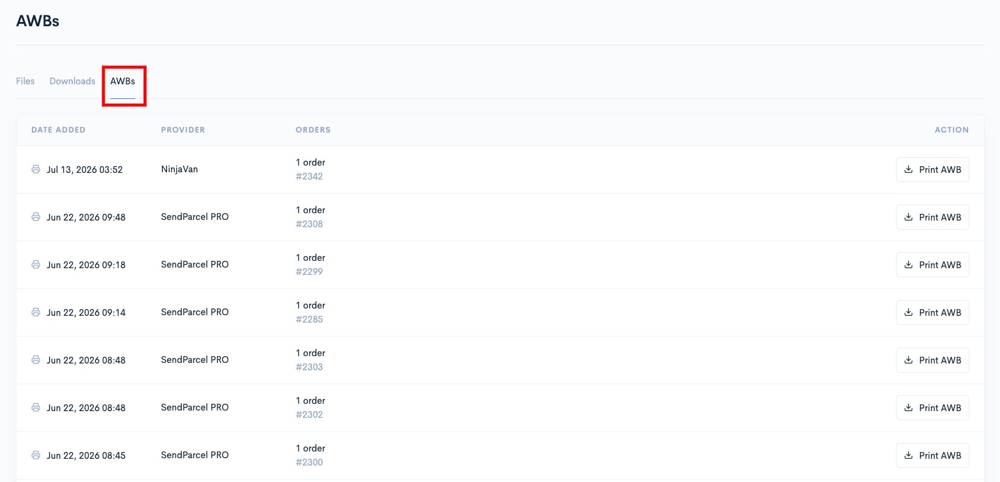

# AWBs

Shoppego kini membolehkan anda **mencetak AWB (Air Waybill) secara pukal** dalam satu masa.

Dengan fungsi ini, anda tidak perlu membuka dan mencetak setiap AWB satu per satu. Semua AWB yang telah dijana untuk sekumpulan pesanan boleh dicetak bersama dengan hanya satu klik.

Setiap order yang di proses melalui integration dengan mana-mana shipping provider, anda boleh semak AWB order itu yang tersendiri pada halaman ini.

## Pada halaman ini:

* [Cara mencetak AWB](awbs.md#cara-mencetak-awb)
* [Maklumat penting](awbs.md#maklumat-penting)

### Cara Mencetak AWB

1. Log masuk akaun Shoppego

<figure><figcaption></figcaption></figure>

2. Klik pada **Files**

<figure><figcaption></figcaption></figure>

3. Klik pada **AWBs**

<figure><figcaption></figcaption></figure>

Pada halaman ini, anda akan melihat senarai AWB yang telah dijana bersama beberapa maklumat seperti:

| Maklumat       | Penerangan                                       |
| -------------- | ------------------------------------------------ |
| **Date Added** | Tarikh dan masa AWB dijana                       |
| **Provider**   | Penyedia atau courier yang digunakan             |
| **Orders**     | Senarai pesanan yang berkaitan dengan AWB        |
| **Action**     | Tindakan yang boleh dilakukan untuk AWB tersebut |

#### Cari kumpulan AWB yang ingin dicetak

Setiap rekod AWB akan menunjukkan jumlah pesanan yang berkaitan dengannya.

Sebagai contoh:

> **DHL eCommerce**\
> 3 orders\
> \#21566, #21567, #21568

Ini bermaksud terdapat **3 AWB** yang berkaitan dengan pesanan tersebut.

#### Klik "Print All AWB" atau "Print AWB"

Selepas menemukan kumpulan AWB yang ingin dicetak, klik butang "**Print All AWB" untuk bulk shipment** dan **"Print AWB" untuk single shipment**.

Shoppego akan membuka AWB yang disediakan oleh courier tersebut supaya anda boleh mencetaknya.

### Maklumat Penting

Untuk fungsi "Print All AWB" ia **hanya boleh digunakan untuk shipping provider DHL Ecommerce sahaja**.

AWB **dihoskan oleh pihak courier dan tidak disimpan di dalam Shoppego**.

Oleh itu, kami menyarankan supaya anda **mencetak AWB sebaik sahaja ia dijana atau selepas booking penghantaran dibuat**.

Link AWB yang lama mungkin tidak lagi boleh digunakan sekiranya pihak courier telah tamatkan tempoh akses kepada link tersebut.

> **Penting:** Jika link AWB sudah tidak boleh diakses, anda mungkin perlu mendapatkan semula AWB melalui pihak courier yang berkaitan.
