# Forms

Di Shoppego anda kini sudah boleh cipta page anda yang tersendiri dan mempunyai element form bagi pengumpulan data maklumat pelanggan anda.

**Untuk membolehkan anda menggunakan fungsi ini, anda&#x20;**<mark style="color:red;">**perlu lakukan penetapan Captcha**</mark>**&#x20;juga didalam store Shoppego anda.**

**Untuk contoh penetapan Captcha, anda boleh rujuk pada link ini:**


[Google reCAPTCHA V3](settings/captcha-providers/google-recaptcha-v3.md)


Untuk contoh penetapan, anda boleh pergi pada bahagian:

1. Log masuk kedalam akaun Shoppego anda

<figure><figcaption></figcaption></figure>

2. Klik pada **Forms**

<figure>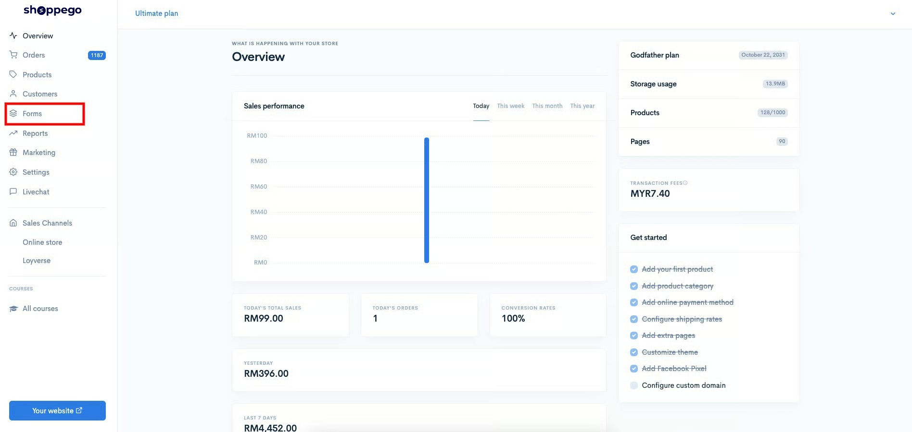<figcaption></figcaption></figure>

3. Klik pada butang **Add form**

<figure>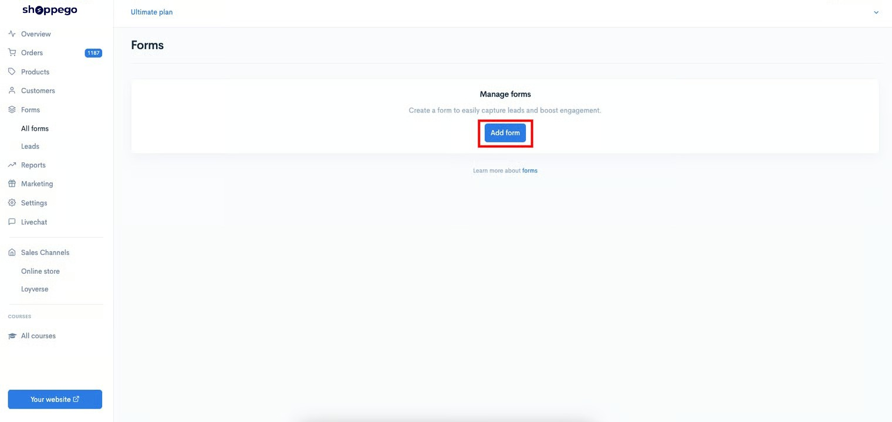<figcaption></figcaption></figure>

4. Kemudian, **masukkan Title page anda** yang mempunyai form itu dan klik **Save**

<figure>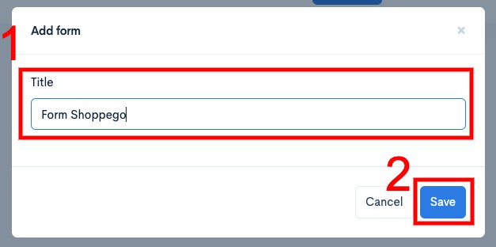<figcaption></figcaption></figure>

5. Kini, page anda yang khas dengan element form telah berjaya dicipta.

<figure>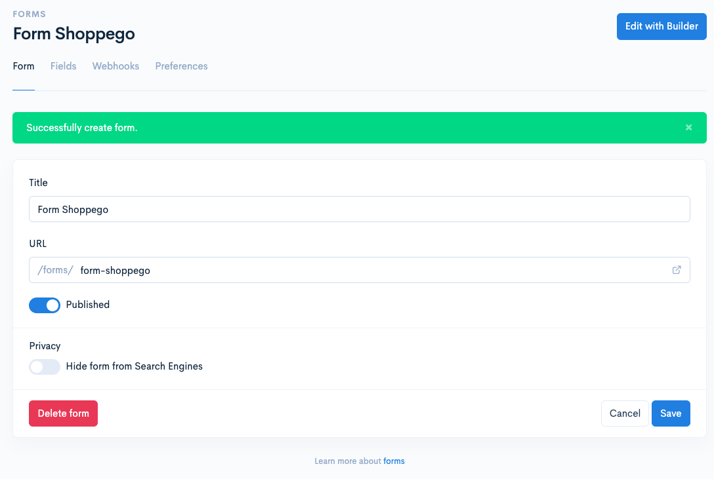<figcaption></figcaption></figure>

Seterusnya, anda boleh teruskan dengan penetapan untuk design page anda itu.

## Penetapan Page

1. Anda boleh klik pada butang **Edit with Builder**

<figure>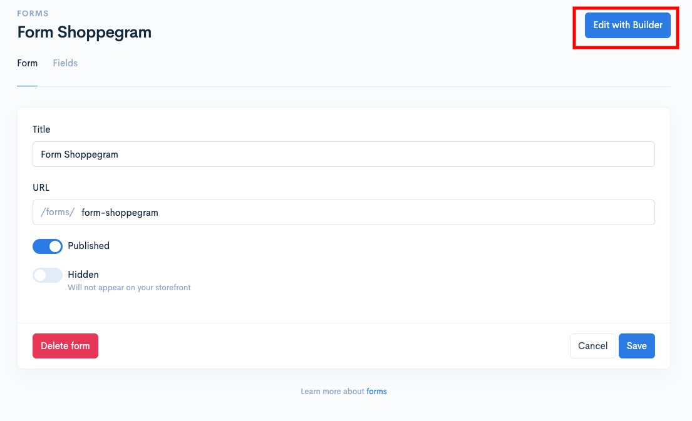<figcaption></figcaption></figure>

2. Nanti, anda akan dibawa ke halaman editor builder kami dan design seperti biasa page anda itu menggunakan editor builder kami.

<figure>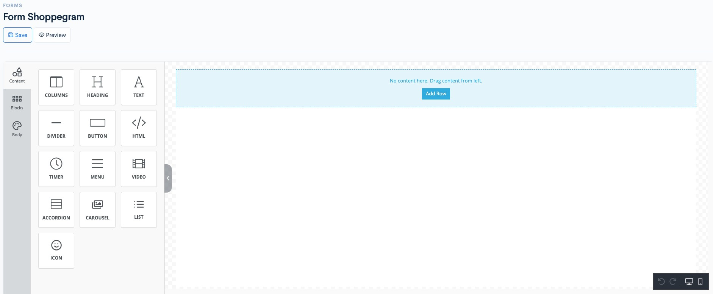<figcaption></figcaption></figure>

### Preview Form

1. Untuk lihat halaman anda itu pada live website, anda boleh klik pada butang **Preview**

<figure><figcaption></figcaption></figure>

### Duplicate Form

1. Anda boleh klik pada butang **Duplicate** untuk anda cipta page form yang baru dengan menggunakan design atau penetapan form sedia ada anda ini.

<figure>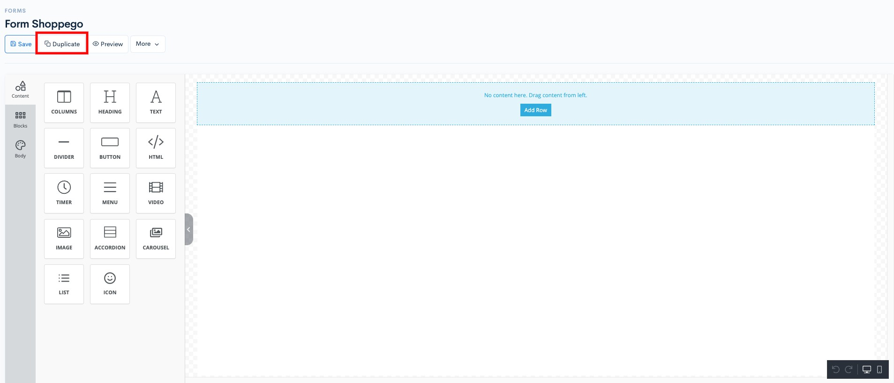<figcaption></figcaption></figure>

2. Kemudian, anda boleh masukkan info bagi form anda yang baru itu dan lakukan pemilihan penetapan yang anda ingin bawa ke form yang baru tersebut.

| Penetapan                            | Penerangan                                                                                                        |
| ------------------------------------ | ----------------------------------------------------------------------------------------------------------------- |
| **Provide a name for your new form** | Anda boleh masukkan nama baru untuk form anda yang akan dicipta.                                                  |
| **Preferences**                      | Anda boleh tick pada toggle ini untuk bawa sekali penetapan "**Preferences**" anda itu ke form yang baru dicipta. |
| **Form fields**                      | Anda boleh tick pada toggle ini untuk bawa sekali penetapan "**Fields**" anda itu ke form yang baru dicipta.      |
| **Webhooks**                         | Anda boleh tick pada toggle ini untuk bawa sekali penetapan "**Webhooks**" anda itu ke form yang baru dicipta.    |

<figure>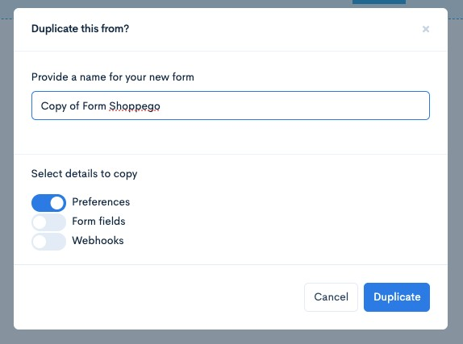<figcaption></figcaption></figure>

3. Setelah selesai klik **Duplicate**

<figure>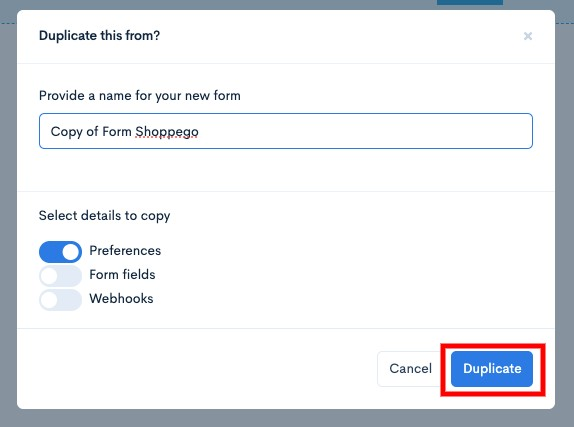<figcaption></figcaption></figure>

### Import JSON

1. Anda boleh bawa masuk file JSON yang dicipta menggunakan sistem Shoppego kedalam page form anda ini dengan cara, klik pada butang **More**

<figure>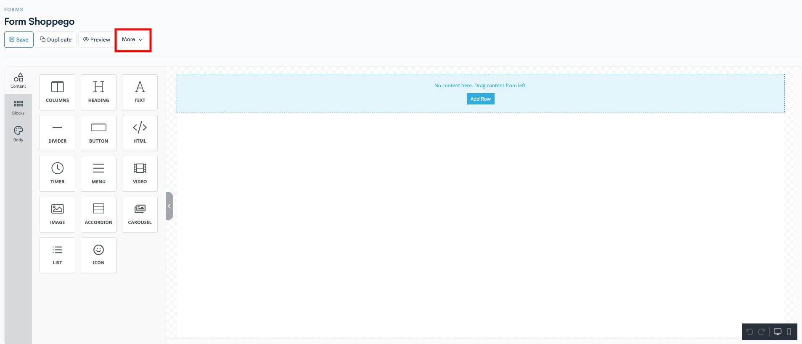<figcaption></figcaption></figure>

2. Kemudian, klik pada butang **Import JSON** dan **lakukan pemilihan file anda itu dari dalam peranti anda**.

<figure><figcaption></figcaption></figure>

### Delete Form

1. Anda boleh delete form didalam page anda itu dengan cara, klik pada butang **More**

<figure><figcaption></figcaption></figure>

2. Kemudian, lakukan pemilihan **Delete form**

<figure>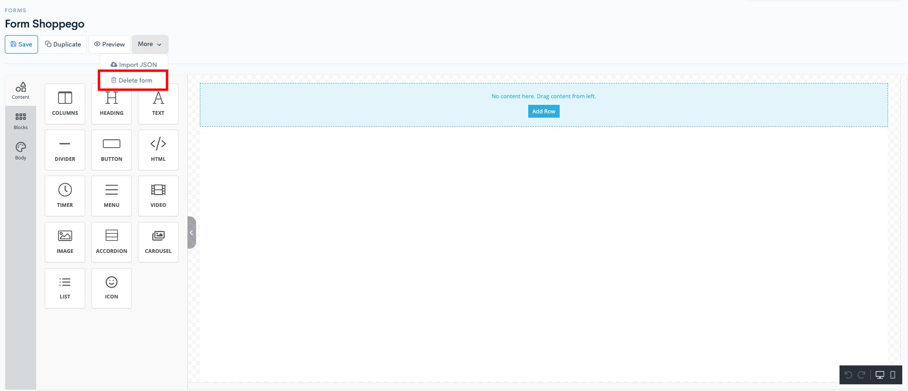<figcaption></figcaption></figure>

## Penetapan Form

### Fields

1. Anda boleh lihat penetapan field form anda itu pada bahagian, klik pada butang **Fields**

<figure>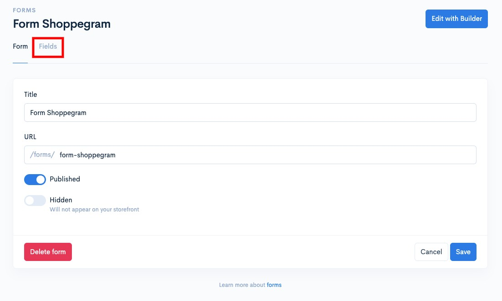<figcaption></figcaption></figure>

2. Pada halaman ini, anda boleh lihat field-field yang terdapat pada form anda itu. By default, sistem akan automatik cipta 3 jenis field(Name, Email & Phone) untuk anda dan anda tidak boleh padam/buang field tersebut.

<figure>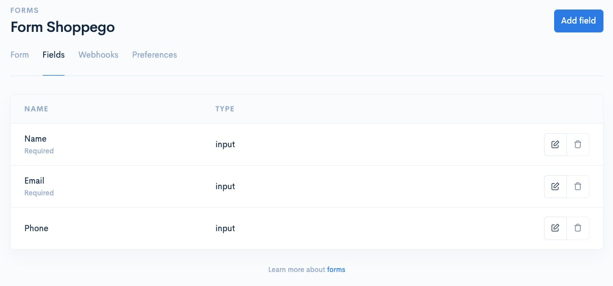<figcaption></figcaption></figure>

#### Add Field

1. Anda boleh lakukan penambahan field yang baru dengan cara klik pada butang **Add field**

<figure>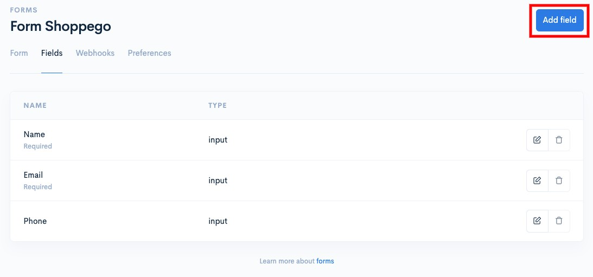<figcaption></figcaption></figure>

2. Kemudian, masukkan info-info yang diperlukan untuk field anda itu:

| Penetapan    | Penerangan                                                                                                                                                                  |
| ------------ | --------------------------------------------------------------------------------------------------------------------------------------------------------------------------- |
| **Label**    | Tajuk bagi field anda ini, ianya akan dipaparkan pada pelanggan.                                                                                                            |
| **Name**     | ID bagi field anda ini, ianya tidak akan dipaparkan pada pelanggan.                                                                                                         |
| **Type**     | Anda boleh lakukan pemilihan untuk jenis input yang anda ingin gunakan pada form anda itu. Antara pilihannya adalah **Input**, **Checkbox**, **Dropdown** dan **Textarea**. |
| **Visible**  | Anda boleh tick pada toggle ini untuk paparkan ruangan field ini pada form anda.                                                                                            |
| **Required** | Anda boleh tick pada toggle ini untuk pastikan pelanggan perlu isi ruangan field ini terlebih dahulu untuk membolehkan mereka submit form anda ini.                         |

<figure>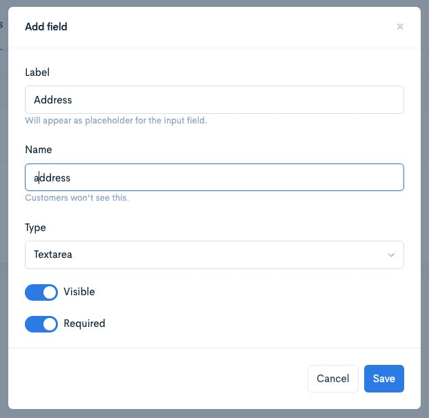<figcaption></figcaption></figure>

3. Setelah selesai klik **Save**

<figure>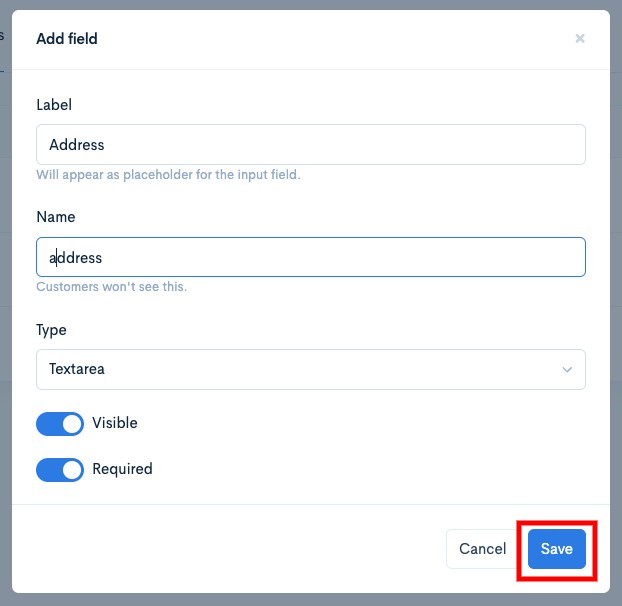<figcaption></figcaption></figure>

Kini Field anda sudah berjaya dicipta.

<figure>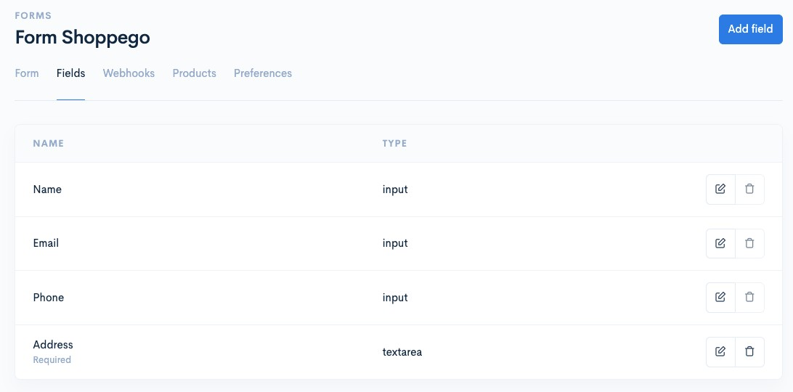<figcaption></figcaption></figure>

#### Edit Field

1. Anda boleh edit/ubah penetapan field sedia ada dengan cara klik pada **butang ikon pensil** itu.

<figure>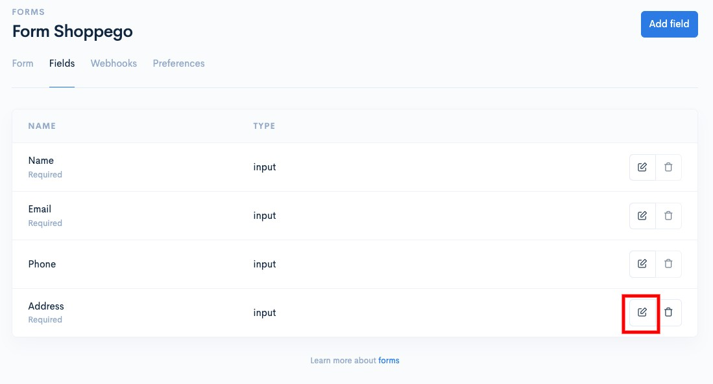<figcaption></figcaption></figure>

2. Kemudian, lakukan perubahan yang anda inginkan dan klik **Save**

<figure>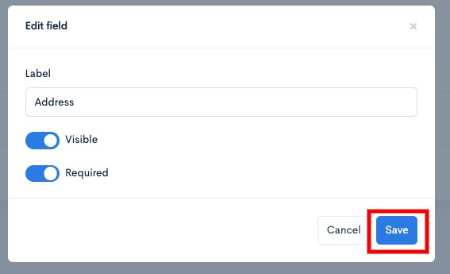<figcaption></figcaption></figure>

#### Delete Field(Yang dibenarkan sahaja)

1. Anda boleh padam field yang anda inginkan itu, dengan cara klik pada **butang ikon tong sampah** pada field tersebut. <mark style="color:red;">**Perlu di ingatkan anda hanya boleh delete field yang dibenarkan sahaja.**</mark>

<figure>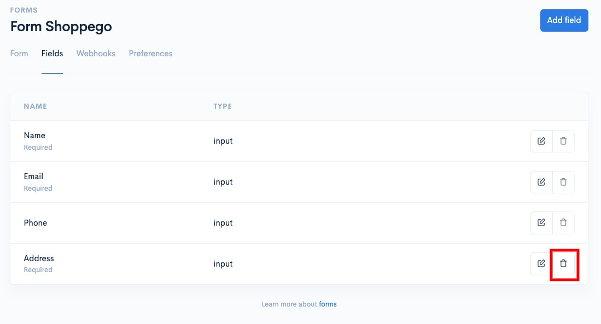<figcaption></figcaption></figure>

### Webhooks

1. Anda juga boleh tetapkan webhook yang khas untuk trigger dari form anda ini. Untuk lakukan penetapan itu, anda boleh klik pada butang **Webhooks**

<figure>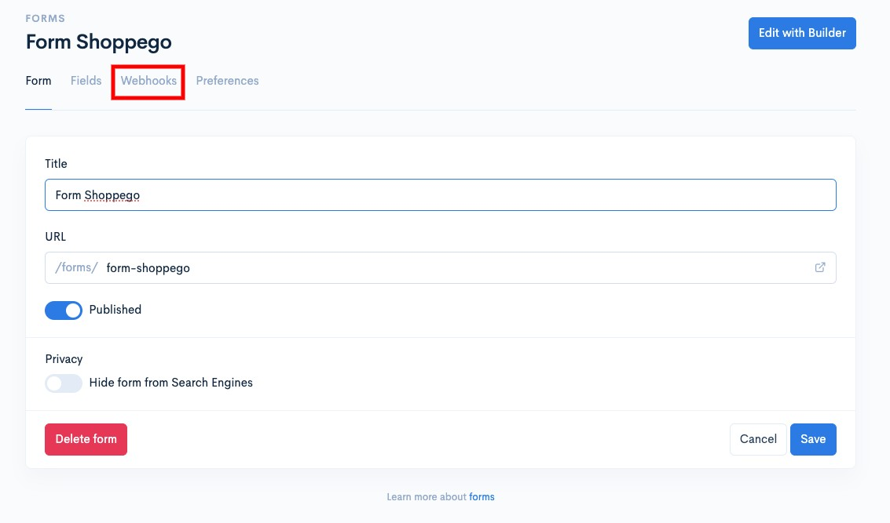<figcaption></figcaption></figure>

2. Kemudian, klik pada butang **Add webhook**

<figure>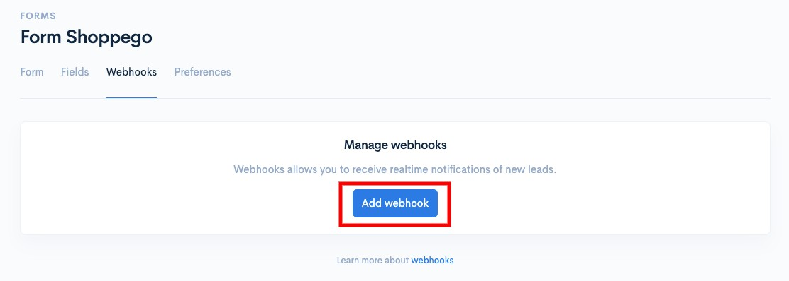<figcaption></figcaption></figure>

3. Setelah anda **masukkan info penetapan webhook** anda itu, anda boleh klik **Save**

<figure>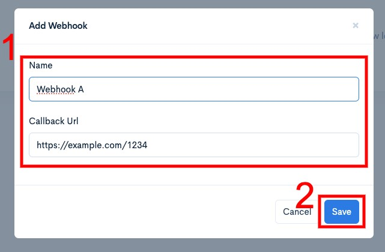<figcaption></figcaption></figure>

4. Setelah selesai, anda boleh lakukan percubaan untuk submit form anda itu bagi trigger webhook tersebut di platform yang anda gunakan.

<figure>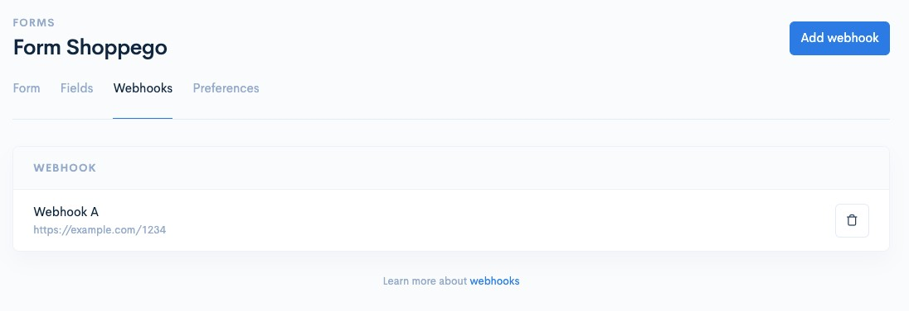<figcaption></figcaption></figure>

#### Delete Webhook

1. Untuk padam/buang webhook yang anda sudah cipta itu, anda boleh klik pada **butang ikon tong sampah**

<figure>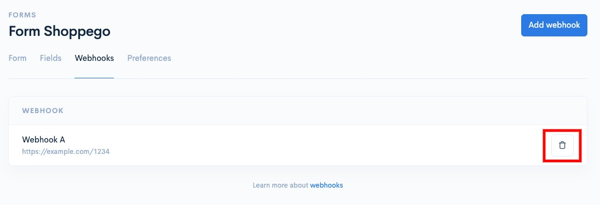<figcaption></figcaption></figure>

### Products

Anda boleh lakukan penambahan produk pada form anda ini untuk membolehkan pelanggan lakukan pembelian.

1. Klik pada butang **Products**.

<figure>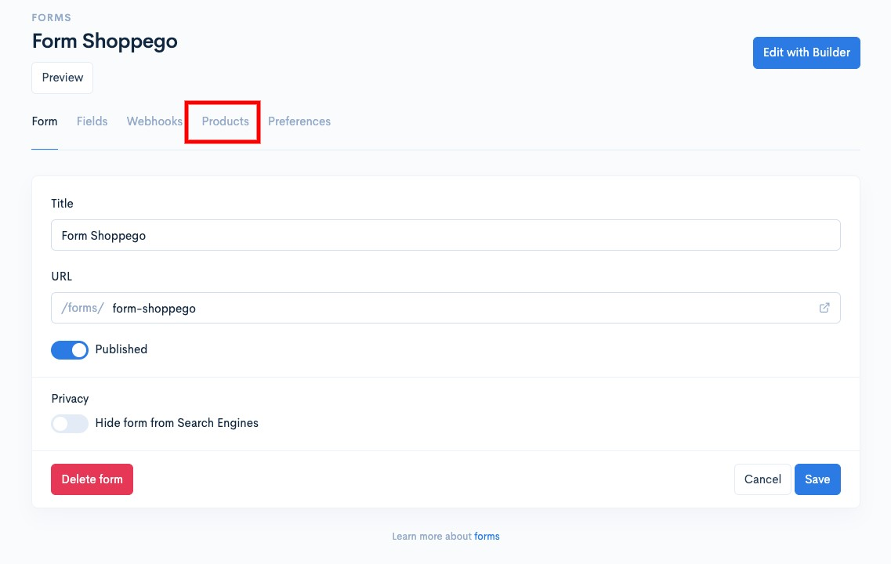<figcaption></figcaption></figure>

2. Kemudian, anda boleh **lakukan pemilihan produk yang anda ingin masukkan dengan cara klik pada dropdown Select product tersebut.**

<figure>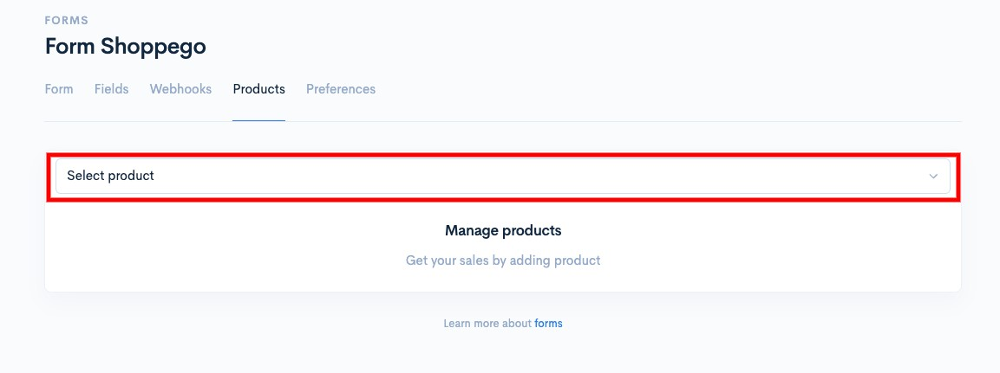<figcaption></figcaption></figure>

#### Delete product

Untuk delete produk yang anda sudah tambah pada form tersebut, anda boleh klik pada **butang ikon tong sampah**

<figure>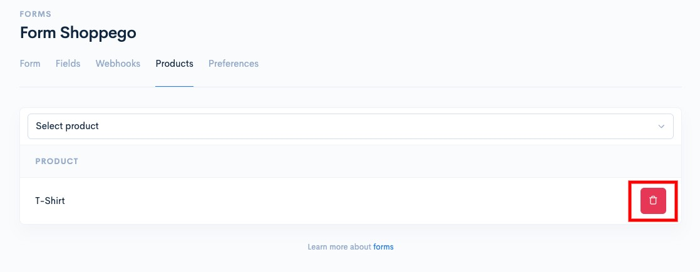<figcaption></figcaption></figure>

### Preferences

1. Anda boleh lihat penetapan lain yang anda boleh lakukan untuk proses submission form anda itu dengan klik pada butang **Preferences**

<figure>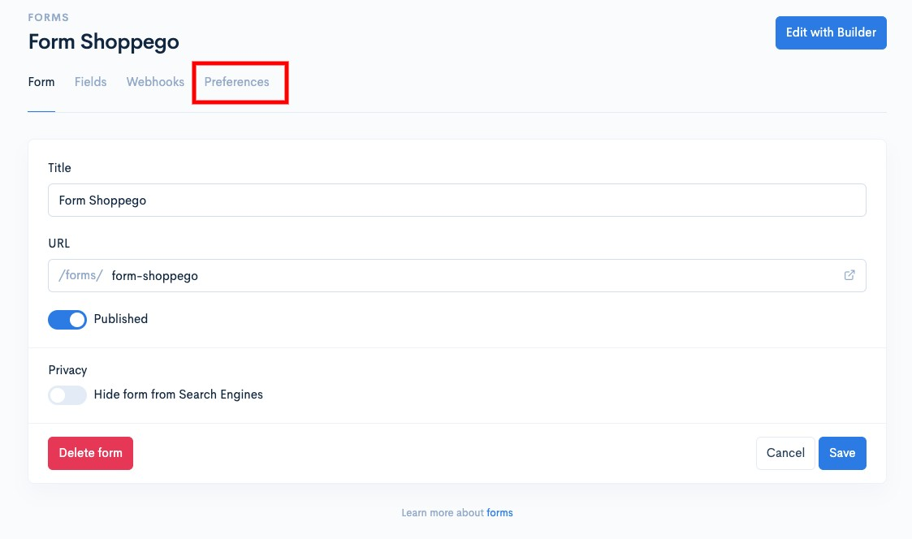<figcaption></figcaption></figure>

2. Kemudian, anda boleh lakukan penetapan yang anda inginkan itu:

| Penetapan                                 | Penerangan                                                                                                                                                                                                                                                     |
| ----------------------------------------- | -------------------------------------------------------------------------------------------------------------------------------------------------------------------------------------------------------------------------------------------------------------- |
| **Facebook Pixel ID**                     | Anda boleh masukkan FB pixel ID anda.                                                                                                                                                                                                                          |
| **Facebook Pixel Access Token**           | Anda boleh masukkan FB pixel Access Token anda.                                                                                                                                                                                                                |
| **Facebook test\_event\_code**            | Anda boleh masukkan FB test\_event\_code anda.                                                                                                                                                                                                                 |
| **Enable pre-iOS 14 tracking bypass**     | Anda boleh tick pada toggle ini untuk lakukan pintasan terhadap pre-iOS 14 tracking.                                                                                                                                                                           |
| **Tiktok Pixel ID**                       | Anda boleh masukkan Tiktok pixel ID anda.                                                                                                                                                                                                                      |
| **Google Analytics ID**                   | Anda boleh masukkan Google Analytics ID anda.                                                                                                                                                                                                                  |
| **Enable Google Ads Conversion Tracking** | Anda boleh tick pada toggle ini untuk lakukan penetapan Google Ads Conversion Tracking.                                                                                                                                                                        |
| **Google Ads ID**                         | Anda boleh masukkan Google Ads ID anda. Anda perlu tick pada toggle "Enable Google Ads Conversion Tracking" untuk gunakan fungsi ini.                                                                                                                          |
| **Initiate checkout**                     | Anda boleh masukkan Initiate checkout label anda. Anda perlu tick pada toggle "Enable Google Ads Conversion Tracking" untuk gunakan fungsi ini.                                                                                                                |
| **Purchase label**                        | Anda boleh masukkan Purchase label anda. Anda perlu tick pada toggle "Enable Google Ads Conversion Tracking" untuk gunakan fungsi ini.                                                                                                                         |
| **Submit lead label**                     | Anda boleh masukkan Submit lead label anda. Anda perlu tick pada toggle "Enable Google Ads Conversion Tracking" untuk gunakan fungsi ini.                                                                                                                      |
| **Google Tag Manager ID**                 | Anda boleh masukkan Google Tag Manager ID anda.                                                                                                                                                                                                                |
| **Submit button text**                    | Anda boleh ubah teks submit button form anda itu kepada teks yang lain                                                                                                                                                                                         |
| **Footer text**                           | Anda boleh paparkan teks dibawah form anda itu                                                                                                                                                                                                                 |
| **Action after form submission**          | 
Anda boleh tetapkan halaman yang anda ingin bawa apabila pelanggan submit form anda ini.  1. Go to default thank you page = Bawa pelanggan ke halaman thank you page 2. Redirect to URL address = Bawa pelanggan ke halaman yang anda inginkan
 |
| **Thank-You Page > Title**                | Anda boleh ubah title teks pada halaman thank you page form anda itu(Halaman selepas pelanggan submit form)                                                                                                                                                    |
| **Thank-You Page > Body**                 | Anda boleh ubah body teks pada halaman thank you page form anda itu(Halaman selepas pelanggan submit form)                                                                                                                                                     |
| **Form theme > Form color**               | Anda boleh ubah warna divider untuk form tersebut.                                                                                                                                                                                                             |
| **Form theme > Submit button color**      | Anda boleh ubah warna CTA button untuk form tersebut                                                                                                                                                                                                           |
| **Form theme > Submit button text color** | Anda boleh ubah warna teks pada CTA button untuk form tersebut.                                                                                                                                                                                                |

<figure>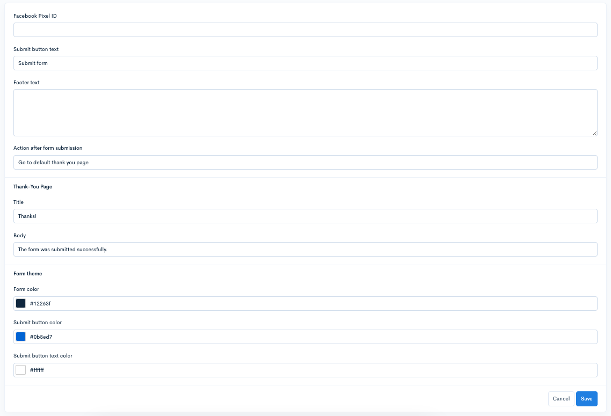<figcaption></figcaption></figure>

3. Setelah anda selesai lakukan penetapan anda itu, pastikan anda klik pada butang **Save**

<figure>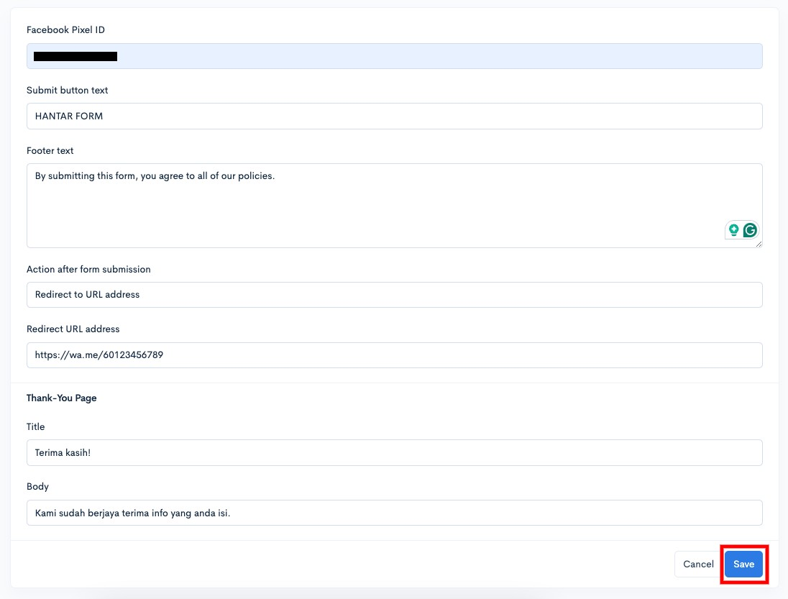<figcaption></figcaption></figure>

## Pengurusan Leads

Untuk anda lihat kesemua data leads yang masuk, anda perlu pergi ke halaman Leads. Untuk info lanjut, anda boleh klik pada butang tab di bawah ini:


[Leads](forms/leads.md)

