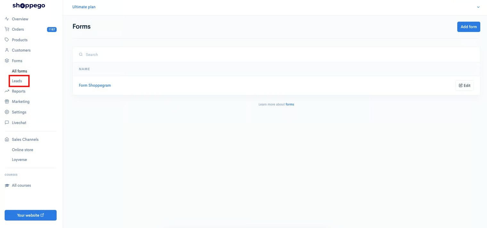
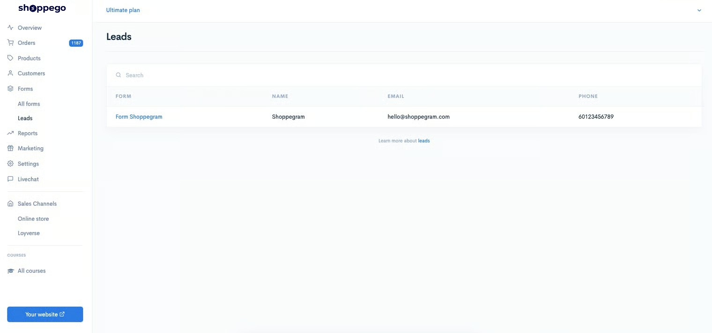

# Leads

Untuk akses ke halaman Leads, anda boleh pergi pada bahagian:

1. Log masuk kedalam akaun Shoppego anda.

<figure><figcaption></figcaption></figure>

2. Klik pada **Forms**

<figure><figcaption></figcaption></figure>

3. Klik pada **Leads**

<figure><figcaption></figcaption></figure>

Kemudian, anda akan dibawa ke halaman yang akan paparkan kesemua data Leads dari form anda itu.

<figure><figcaption></figcaption></figure>
