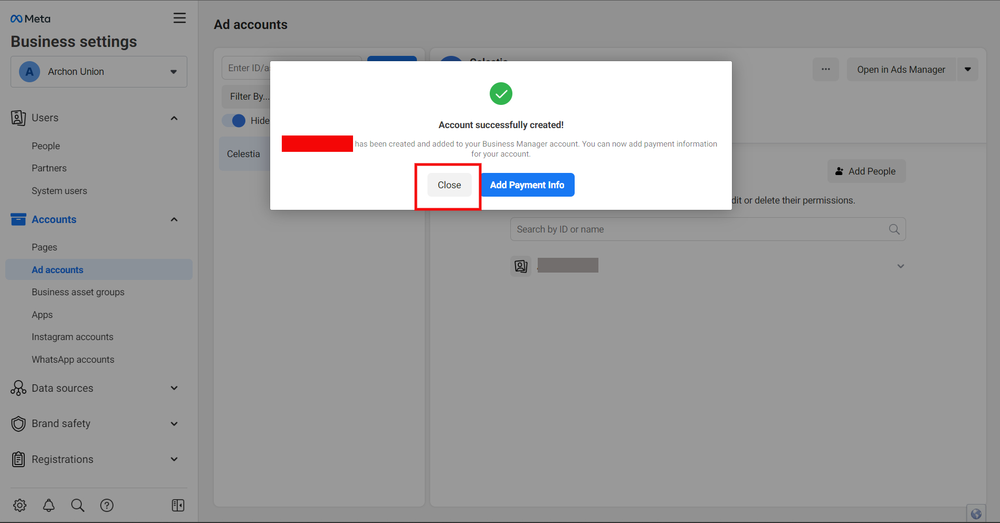

# Facebook Pixel

Shoppego telah memudahkan urusan untuk pengguna setup **Facebook pixel** dengan hanya perlu masukkan **Facebook Pixel** ke dalam penetapan **Preferences Shoppego** sahaja. Sangat mudah!\
\
Tidak perlu melibatkan penetapan yang berkaitan dan melibatkan coding.


Penggunaan **Facebook Pixel lebih dari satu** tersedia untuk plan **Premium dan keatas**. Fungsi ini juga **hanya tersedia dalam penetapan "Forms"**.


## Apa itu Facebook Pixel?


Facebook Pixel adalah sebuah _**Tracking Mechanism**_ atau dalam Bahasa Melayu disebut sebagai **Mekanisma Penjejak** untuk menjejaki pelawat yang masuk ke website anda.


Satu cara yang paling terbaik untuk setup **Facebook Pixel** adalah dengan menggunakan **Meta Business Suite**. Jadi anda perlu daftar Facebook Business Manager untuk penetapan **Facebook Pixel** ini.

## Pendaftaran Akaun Business Suite

1. **Klik** [<mark style="color:blue;">**link**</mark> ](https://business.facebook.com/)ini untuk ke **Facebook Business Manager** [https://business.facebook.com/](https://business.facebook.com/)

&#x32;**. Klik** pada **Cipta Akaun (Create Account)** untuk **mendaftar**.

<figure><figcaption></figcaption></figure>

3\. Isikan **nama mengenai perniagaan anda** dan pada ruangan tersebut, anda perlu isi juga bagi ruangan **Your Name** dan juga **Business Email Address**, setelah **selesai**, anda boleh tekan **Submit.**

<figure><figcaption></figcaption></figure>

4\. Satu **emel pengesahan** akan dihantar ke alamat **emel yang didaftarkan.** Anda perlu **buka** dan **sahkan emel** tersebut.

<figure><figcaption></figcaption></figure>

5\. Setelah itu, paparan yang anda akan terima adalah seperti dibawah.

<figure><figcaption></figcaption></figure>

6\. Setelah itu, anda perlu tekan ikon **≣** yang telah **di-highlight** dan pergi ke **Business Settings**.

<figure><figcaption></figcaption></figure>

## Penetapan Ad Account

1. Anda boleh pergi ke **Accounts** dan kemudian pilih **Ad Accounts.** Setelah itu, anda boleh tekan butang **Add**. Tujuan anda mencipta Akaun Ads adalah untuk hubungkan dengan akaun Meta Business Suites anda dan bagi memudahkan anda untuk menjalankan iklan.

<figure><figcaption></figcaption></figure>

2\. Akan terpapar 3 pilihan seperti di dalam gambar di bawah.

Pilihan : _**Add an Ad Account -**_ Sekiranya akaun Facebook peribadi anda sudah mempunyai Akaun Ads. Anda boleh gunakan pilihan ini untuk pindahkan dari akaun personal masuk ke Business Account ni.

Pilihan : _**Request to an Ad Account** -_ Gunakan pilihan ini sekiranya anda menguruskan iklan bagi pihak orang lain.

Pilihan : _**Create a New Ad Account**_ - Pilihan ini adalah bagi mereka yang baru nak buat iklan atau tak mahu ada kaitan dengan akaun ads yang sebelum ini.

Untuk langkah penetapan ini, pilihan **Create a New Ad Account** akan dibuat bagi memudahkan semua peringkat dapat belajar dan ikuti langkah seterusnya bagi penetapan ini.

3\. Klik **Create a New Ad Account**

<figure><figcaption></figcaption></figure>

4\. Masukkan **Maklumat** dan **pilih currency MYR** - Malaysian Ringgit untuk pastikan akaun iklan anda sentiasa menggunakan nilai mata wang Ringgit Malaysia dan terus klik butang **Next**.

<figure><figcaption></figcaption></figure>

5\. Tandakan pada **My Business** dan klik **Create**.

<figure><figcaption></figcaption></figure>

6\. Seterusnya anda akan dibawa kepada bahagian **Assign**. Bahagian ini adalah untuk **mengagihkan kuasa** bagi Ad Akaun yang telah dibina sebentar tadi.


\*\*Pastikan anda tandakan pada **Nama di sebelah panel kiri** dan juga tandakan pada **Manage Ad Account untuk berikan kuasa mutlak/penuh pada diri anda sendiri.**


Dan klik butang **Assign**.

<figure><figcaption></figcaption></figure>

7\. Pada halaman ini, anda akan diberi **pilihan** iaitu **Add Payment Info** atau <mark style="color:red;">**Close**</mark>, untuk **tutorial** ini, kita akan memilih untuk <mark style="color:red;">**Close**</mark>, tetapi bagi yang mahu **menjalankan Ads**, anda perlu membuat **Add Payment** Info.

<figure><figcaption></figcaption></figure>

8\. Untuk prompt yang ini, anda perlu memilih **Exit**.

<figure><figcaption></figcaption></figure>

## Penetapan Facebook Pixel

1. Anda boleh pergi ke halaman "Business settings" terlebih dahulu dengan klik pada butang **ikon gear**

<figure><figcaption></figcaption></figure>

2. Di panel kiri, anda perlu klik pada **Data sources** dan klik pada **Datasets**

<figure><figcaption></figcaption></figure>

3. Seterusnya klik butang **Add** untuk mula mencipta Datasets/Pixel and&#x61;**.** Tujuan Facebook Pixel adalah untuk anda melihat aktiviti pengguna didalam laman web anda.

<figure><figcaption></figcaption></figure>

4. Kemudian, pada popup "**Create a new dataset**", anda boleh masukkan nama datasets/pixel anda pada ruangan "**Name**" dan setelah selesai, klik butang **Create**.

<figure><figcaption></figcaption></figure>

5. Setelah selesai, anda boleh **refresh semula** halaman Datasets itu dan anda akan dapat lihat penetapan Dataset yang anda baru cipta sebentar tadi. Anda juga sudah boleh dapatkan "**Pixel ID**" untuk anda gunakan di Shoppego.

<figure><figcaption></figcaption></figure>

6. Kemudian, anda perlu **Assign people** dan **Assign assets(Ad account)** pada pixel tersebut. Anda boleh klik pada butang **Assign people**

<figure><figcaption></figcaption></figure>

7. "**Pilih akaun anda**", "**tick pada toggle Full control**" dan klik **Assign**

<figure><figcaption></figcaption></figure>

8. Kemudian, klik pula pada butang "**Connect assets**"

<figure><figcaption></figcaption></figure>

9. Pada pop up yang akan dipaparkan nanti, anda boleh klik "**Other business assets**" dan **pilih "Ad account" anda** dan klik **Add**. Setelah selesai, anda kini sudah boleh masukkan FB Pixel ID tersebut kedalam store Shoppego anda.

<figure><figcaption></figcaption></figure>

Jika anda ingin pergi ke halaman Events Manager, anda boleh klik pada butang **ikon 3 titik** dan pilih **Open in Events Manager**

<figure><figcaption></figcaption></figure>

## Penetapan pada sistem Shoppego

1. Log masuk ke **Dashboard Overview Shoppego** anda dan klik pada **Settings > General.** Selepas itu, anda boleh masukkan **Facebook Pixel ID** anda kedalam ruangan yang disediakan.

<figure><figcaption></figcaption></figure>

Tahniah! Pixel anda telah pun **berjaya** di tetapkan dalam **Shoppego**.

## Penetapan Facebook Pixel (Test Event)


<mark style="color:red;">\*\*Perhatian\*\*</mark>\*\*:\*\* Penetapan \*\*test events\*\* ini \*\*penting\*\* dan \*\*perlu dilakukan\*\* sebelum anda gunakan \*\*Pixel\*\* ini untuk \*\*penetapan ads\*\* anda. Hal ini bagi memastikan setiap events anda \*\*dapat ditrigger seperti biasa\*\* dan \*\*tiada sebarang masalah.\*\*


1. Untuk lakukan penetapan bagi **Test Event** bagi **Pixel** yang anda baru cipta, anda boleh tekan pada **Test events** dan kemudian masukkan **nama website anda** atau **domain anda** ke dalam ruangan yang disediakan. Dan kemudian anda boleh tekan **Open Website**.

<figure><figcaption></figcaption></figure>

2\. Selepas itu, anda akan dibawa ke laman web anda dan anda boleh cuba untuk lakukan **test event** seperti **Page View,** **Add to Cart**, dan **sebagainya**.

<figure><figcaption></figcaption></figure>

3\. Anda perlu **semak semula** data event yang telah **di-triggered**, jika data yang keluar adalah **sama**, ini bermakna penetapan **Facebook Pixel** anda telah **betul** dan **tiada masalah**.

<figure><figcaption></figcaption></figure>

## Isu Facebook Pixel

Jika **Facebook Pixel** anda bermasalah, boleh rujuk tutorial di bawah ini :


[configuration.md](facebook-pixel/configuration.md)

