# Conversion API

Didalam Shoppego anda boleh membuat penetapan **Conversion API** pada **FB Pixel** anda. Dengan Conversion API ini, data yang anda akan terima melalui **FB Pixel** anda akan <mark style="color:blue;">**lebih tepat**</mark>.


\*\*<mark style="color:red;">**Perhatian**</mark> : Untuk menggunakan **fungsi Conversion API** ini, ianya hanya terdapat pada **plan&#x20;**<mark style="color:red;">**Ultimate**</mark> sahaja.




## **Dapatkan Access Token**

Untuk penetapan Facebook Conversion API, anda hanya perlu masukkan sahaja **token Conversion API** pada platform Shoppego. Sangat mudah!

1. Pada bahagian pixels anda, pilih pixels yang anda ingin gunakan klik pada tab **Open in Events Manager**

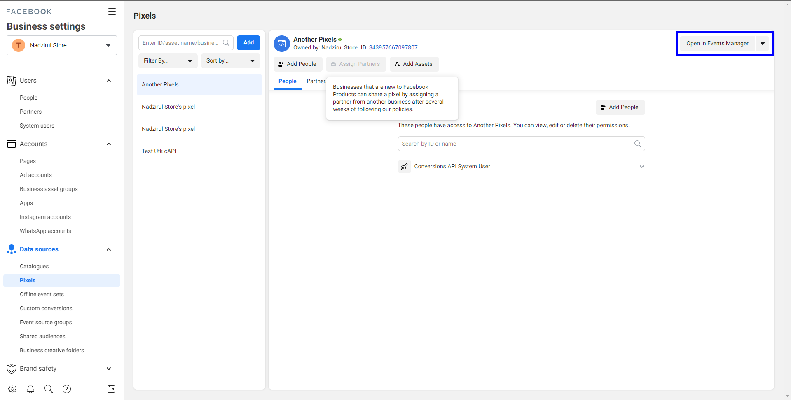

2\. Seterusnya , anda akan di bawa kepada satu laman baru. Pada laman ini klik pada tab **Settings**

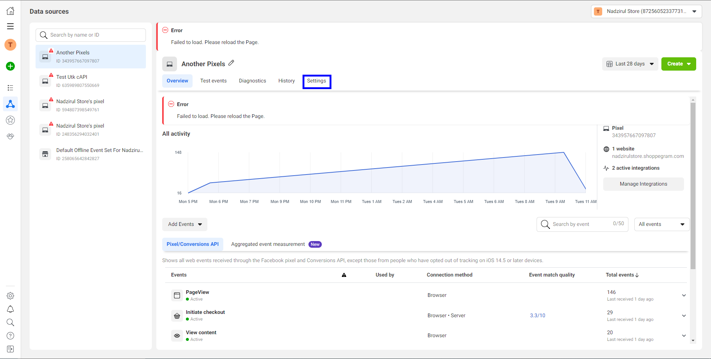

3\. Pada tab settings , tekan **Get Started** pada ruangan **Set up Manually.**&#x20;


**\*\***<mark style="color:red;">**Perhatian**</mark>**:** Jika button tidak boleh ditekan pastikan email anda telah diset pada Ads Manager.\*


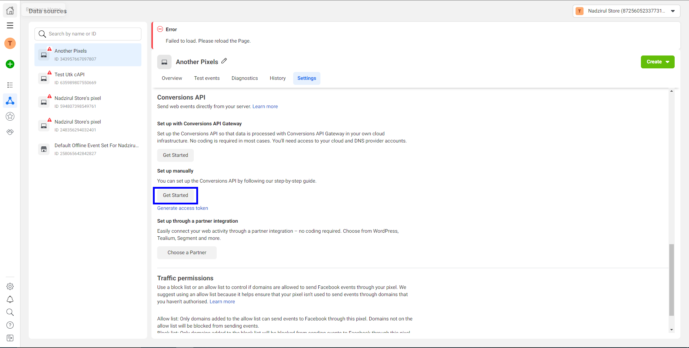

4\. Klik **Continue**

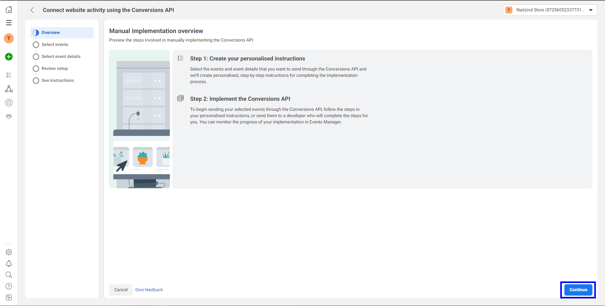

5\. Tick pada event **Purchase** dan **Initiate checkout or Leads**. Setelah anda tick kedua-dua events tersebut anda boleh klik **Continue**


Untuk laman web yang menggunakan fungsi pembelian, adalah disyorkan agar anda menggunakan event "Purchase" dan "Initiate checkout". Untuk laman web yang hanya menggunakan fungsi "Borang/Forms", adalah disyorkan agar anda menggunakan event "Leads".


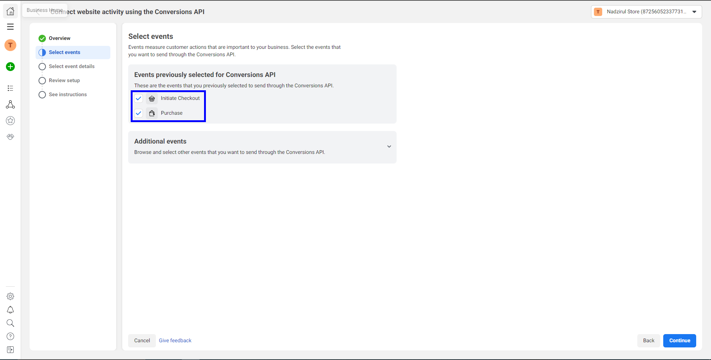

6\. Pastikan **penetapan event details untuk event Initiate Checkout anda adalah sama seperti gambar dibawah**. Setelah anda pastikan ianya sama, anda boleh klik pada butang **Continue**


Untuk event "Leads", anda masih boleh mengikuti semua parameter.


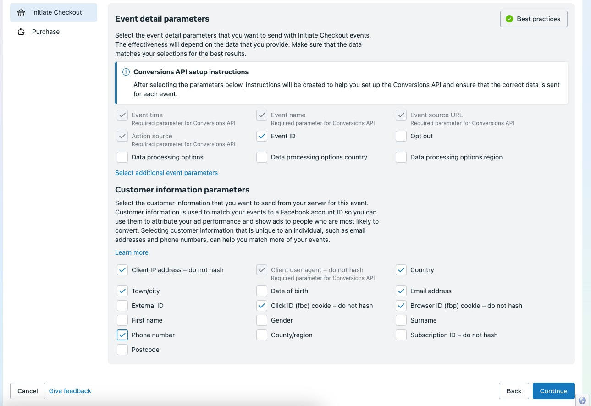

7\. Seterusnya, untuk **penetapan event details bagi event Purchase pula adalah seperti gambar dibawah**. Setelah anda pastikan ianya sama, anda boleh klik **Continue**

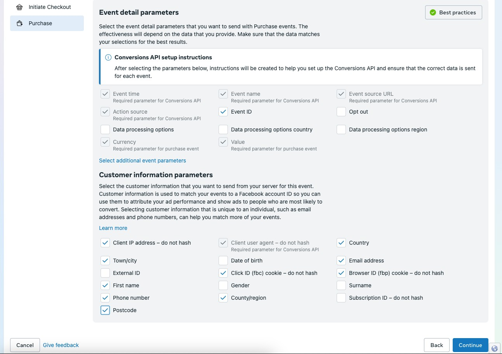

8\. Pada halaman ini, anda boleh pastikan ianya sama terpapar seperti pada paparan penetapan anda. Setelah anda pastikan ianya sama anda boleh klik **Continue**

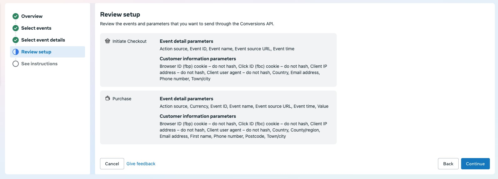

9\. Tekan **Finish** dan maka dengan itu penetapan anda telah selesai.

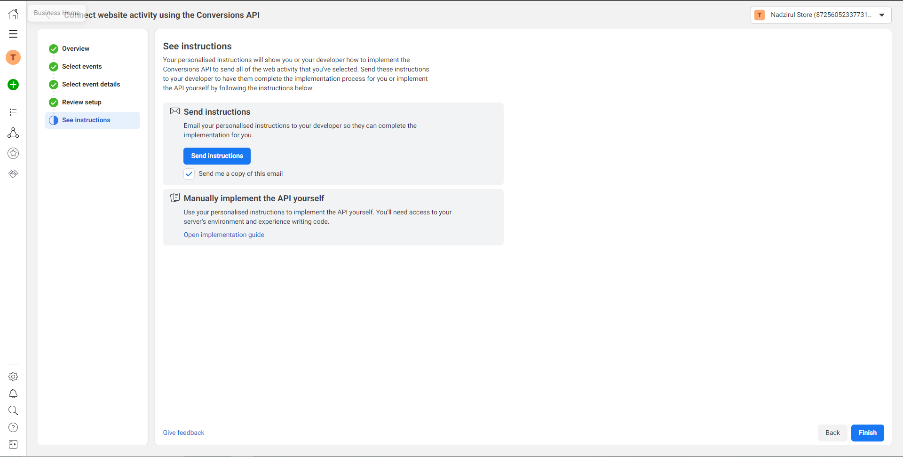

10\. Seterusnya, anda boleh klik semula pada tab **Settings**

11\.  Dapatkan token untuk conversion API anda dengan menekan **Generate access token. Anda perlu simpan access token ini untuk penetapan didalam Shoppego.**

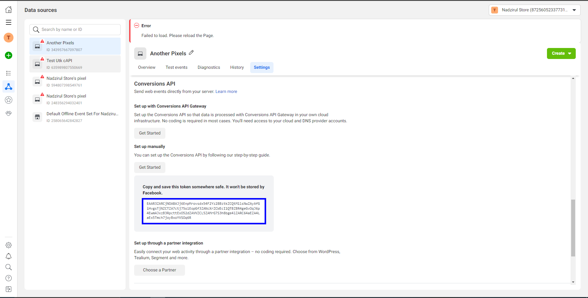

## **Penetapan di Shoppego**

Setelah anda mendapatkan access token Conversion API. Anda dikehendaki untuk memasukkan access token tersebut ke dalam akaun Shoppego anda.

1. Log masuk pada akaun Shoppego. Klik pada **Settings** -> **General**. **Masukkan access token** anda pada **ruangan Facebook Pixel Access Token** dan klik butang **Save**

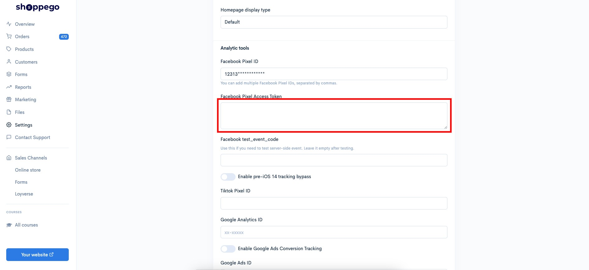

## Lakukan Test event pada penetapan

1\. Pada bahagian pixels anda, pilih pixels yang anda ingin gunakan klik pada tab **Open in** **Events Manager**

2\. Seterusnya , anda akan di bawa kepada satu laman baru. Pada laman ini klik pada tab **Test events**

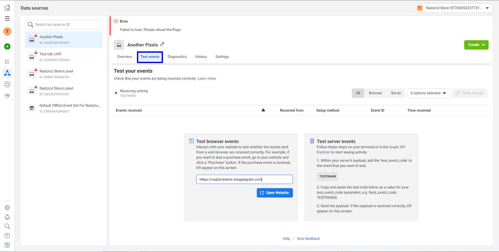

3\. Pada ruangan tab **Test server event** anda boleh **simpan Test event code anda dengan klik pada kotak test code anda**.&#x20;

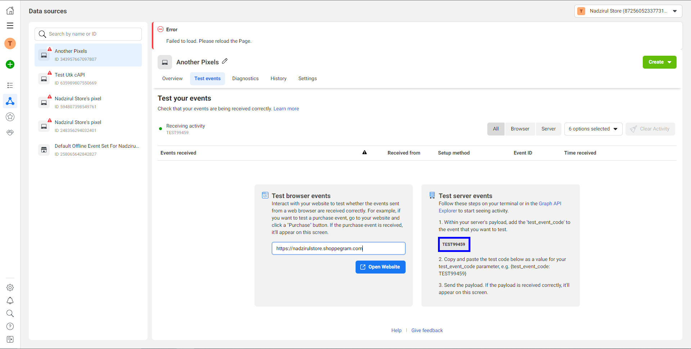

4\. Seterusnya, anda perlu masukkan **code ini** pada penetapan didalam **Shoppego**. Anda perlu Log masuk semula kedalam akaun Shoppego anda.

5\. Klik pada **Online store** -> **Preferences**. Letakkan **Test event code** anda pada **ruangan Facebook test\_event\_code** dan klik butang **Save**

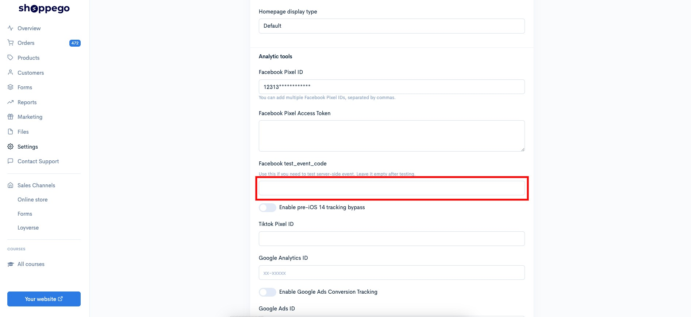

6\. Seterusnya , anda perlu kembali kepada **Test Events** dan masukkan domain store anda pada **Test browser events**. Setelah selesai klik pada butang **Open Website**.

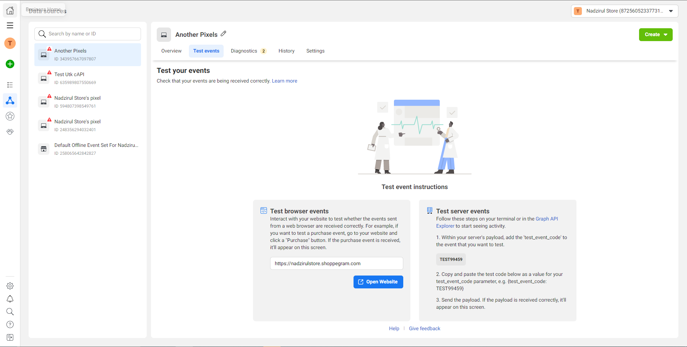

Setelah anda klik **butang tersebut** , anda akan dibawa ke **halaman website anda**. Anda boleh **refresh terlebih** dahulu untuk memastikan **event page view dapat di-trigger** pada penetapan test event anda. Jika **ianya dapat ditrigger** anda boleh meneruskan untuk **proses trigger event yang lain.**

Jika penetapan anda berjaya , pada test event anda akan menerima **events** **Initiate checkout** dan **Purchase** beserta maklumat **deduplication yang datang dari Server**.

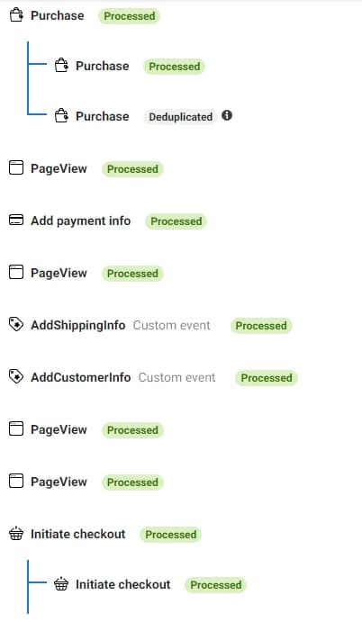


**\*\*Setelah anda selesai membuat penetapan test event ini. Anda perlu&#x20;**<mark style="color:red;">**delete facebook test event code**</mark>**&#x20;pada penetapan Shoppego anda.\*\***

