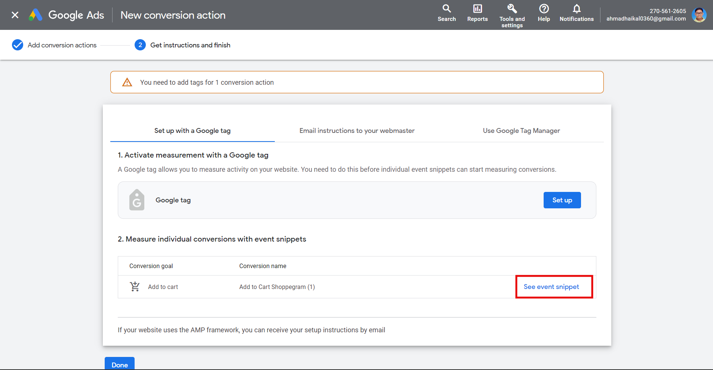
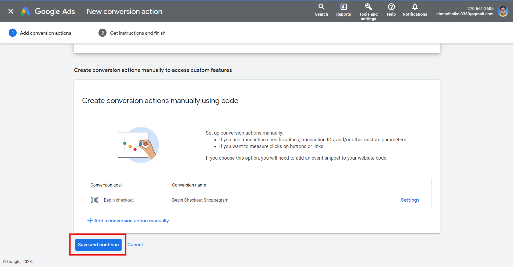

# Google Ads

Untuk penetapan integration Google Ads dengan akaun Shoppego, anda perlu dapatkan **Google Ads ID**, **Purchase label**, **Begin checkout label** dan **Add to cart label**.

Anda perlu pastikan anda **sudah mempunyai akaun Google Ads anda yang tersendiri** untuk anda mendapatkan key-key yang diperlukan tersebut.

Anda boleh rujuk link dibawah untuk langkah mendapatkan key-key yang diperlukan tersebut.

Pastikan juga anda **sudah membuat penetapan Google Analytics untuk store Shoppego anda** bagi membolehkan anda membuat penetapan Google Ads ini. Jika anda masih belum membuat penetapan Google Analytics untuk store anda, klik pada butang dibawah :


Untuk "borang/forms", anda masih boleh mengikuti tutorial ini. Walau bagaimanapun, anda perlu memilih ID Label Leads.



[google-analytics.md](google-analytics.md)


## Log masuk kedalam akaun Google Ads

1\. Anda boleh log masuk kedalam akaun Google Ads anda terlebih dahulu untuk membuat penetapan ini. Anda boleh klik pada link ini untuk log masuk : [https://ads.google.com/home/](https://ads.google.com/home/)

2\. Anda akan dapat lihat dashboard seperti ini setelah anda log masuk kedalam akaun Google Ads anda.

## Dapatkan Google Ads ID

1\. Pada dashboard, anda boleh klik pada butang **TOOLS & SETTINGS**

<figure><figcaption></figcaption></figure>

2\. Anda boleh pergi ke bahagian **Measurement** dan pilih **Conversions**.

<figure><figcaption></figcaption></figure>

3\. Setelah itu, anda boleh tekan pada **New Conversion Action**.

<figure><figcaption></figcaption></figure>

4\. Pada bahagian ini, anda perlu pilih **Website**.

<figure><figcaption></figcaption></figure>

5.Kemudian, anda perlu masukkan **nama website** anda atau **nama domain** anda. Setelah itu, anda boleh tekan butang **Scan**. Setelah selesai, anda boleh tekan butang **Save and Continue**.

<figure><figcaption></figcaption></figure>

6\. Anda perlu pastikan nama domain anda yang tertera pada bahagian **Website domain** itu. Setelah itu, anda boleh tekan pada **Add a conversion action manually.**

<figure><figcaption></figcaption></figure>

7\. Pada bahagian **Goal and action optimization**, anda boleh pilih **Purchase**. Kemudian pada **Conversion name**, anda boleh letak nama **Purchase Shoppego**. Pada ruangan **Value**, anda boleh pilih **Use different value for each conversion.**

<figure><figcaption></figcaption></figure>

8\. Pada ruangan _Goal and action optimization,_ anda akan lihat pada bahagian <mark style="color:blue;">**Conversion action optimization options**</mark>**,** pada tutorial ini kita akan gunakan tetapan default iaitu **Primary action used for bidding optimization**.

<figure><figcaption></figcaption></figure>

9\. Pastikan pada nilai **Conversion Name** dan **Value** adalah sama pada **langkah 1.** Pada ruangan **Count**, anda boleh pilih **Every.**

<figure><figcaption></figcaption></figure>

10\. Pada ruangan **Attribution Model**, pastikan anda pilih tetapan default iaitu **Data-driven.** Setelah itu, anda boleh tekan butang **Done.**

<figure><figcaption></figcaption></figure>

11\. Untuk dapatkan Tag anda, anda boleh tekan pada **Purchase Shoppego** anda.

<figure><figcaption></figcaption></figure>

12\. Pada halaman ini, anda boleh tekan pada **Tag Setup.**

<figure><figcaption></figcaption></figure>

13\. Setelah itu, and boleh pilih **Install the tag yourself.**

<figure><figcaption></figcaption></figure>

## Dapatkan Google Ads ID

1\. Pastikan pada ruangan **See code for** anda telah pilih **HTML** , dan pada ruangan **Google Tag,** anda pilih **The Google tag isn't installed on your HTML pages.** Anda boleh salin nilai yang telah **disorokkan** untuk tujuan penetapan di Shoppego nanti.\
\
**Perhatian: Nilai yang disorokkan pada gambar ini adalah nilai yang akan diletakkan pada Google Ads ID**

<figure><figcaption></figcaption></figure>

### Purchase Label ID

1\. Pada gambar ini, anda akan dapat lihat nilai bagi **Purchase Label ID** anda, anda boleh **salin** dan **simpan** nilai ini untuk penetapan di Shoppego.

<figure><figcaption></figcaption></figure>

## Dapatkan Add to Cart Label ID

1. Setelah itu, anda tekan pada **New Conversion Action** untuk dapatkan **Nilai Label** bagi **Add to Cart** dan **Begin Checkout**.

<figure><figcaption></figcaption></figure>

2\. Pada bahagian ini, anda boleh pilih **Website**.

<figure><figcaption></figcaption></figure>

3\. Kemudian, anda perlu masukkan **nama website** anda atau **nama domain** anda. Setelah itu, anda boleh tekan butang **Scan**. Setelah selesai, anda boleh tekan butang **Save and Continue**.

<figure><figcaption></figcaption></figure>

4\. Anda perlu pastikan nama domain anda yang tertera pada bahagian **Website domain** itu. Setelah itu, anda boleh tekan pada **Add a conversion action manually.**

<figure><figcaption></figcaption></figure>

5\. Pada _Goal and action optimization,_ anda perlu pilih **Add to Cart,** pada _Conversion Name_ anda boleh masukkan nama **Add to cart Shoppego.** Pada _Value,_ anda boleh pilih **Use different value for each conversion** dan **masukkan RM 1** pada **Enter a default value.**

<figure><figcaption></figcaption></figure>

6\. Pada **Count** pula, anda boleh pilih **Every,** pada **Attribution Model** pula pastikan anda telah pilih **Data-driven**. Setelah itu, anda boleh tekan butang **Done.**

<figure><figcaption></figcaption></figure>

7\. Setelah anda masukkan segala maklumat yang diperlukan, anda boleh tekan **Save and Continue**.

<figure><figcaption></figcaption></figure>

### Add to Cart Label ID

1. Pada halaman itu, anda boleh tekan **See event snippet**.

<figure><figcaption></figcaption></figure>

2\. Anda akan lihat **Add to Cart ID** anda pada kotak yang telah dimerahkan itu, anda perlu **salin** dan simpan nilai tersebut kerana akan digunakan pada sistem Shoppego. Setelah itu, anda boleh tekan butang **Close**.

<figure><figcaption></figcaption></figure>

## Dapatkan Begin Checkout Label ID

1. Untuk memulakan penetapan bagi mendapatkan label bagi Begin Checkout, anda perlu tekan butang **New Conversion Action.**

<figure><figcaption></figcaption></figure>

2\. Pada halaman ini, anda perlu klik pada **Website**.

<figure><figcaption></figcaption></figure>

3\. Setelah itu, anda perlu masukkan **nama website** atau **nama domain,** kemudian anda boleh tekan butang **Scan.** Apabila selesai, anda boleh tekan butang **Save and Continue**.

<figure><figcaption></figcaption></figure>

4\. Pada ruangan tersebut, pastikan anda telah masukkan **nama domain** atau **website** dengan betul. Setelah itu, anda boleh tekan **Add a conversionaction manually**.

<figure><figcaption></figcaption></figure>

5\. Pada _Goal and action optimization,_ anda perlu pilih **Begin to Checkout,** pada _Conversion Name_ anda boleh masukkan nama **Begin Checkout Shoppego.** Pada _Value,_ anda boleh pilih **Use different value for each conversion** dan pada **Enter a default value ,** anda boleh masukkan nilai **RM 1.**

<figure><figcaption></figcaption></figure>

6\. Pada **Count** pula, anda boleh pilih **Every,** pada **Attribution Model** pula pastikan anda telah pilih **Data-driven**. Setelah itu, anda boleh tekan butang **Done.**

<figure><figcaption></figcaption></figure>

7\. Selepas itu,anda boleh tekan butang **Save and Continue.**

<figure><figcaption></figcaption></figure>

### Begin Checkout Label ID

1. Untuk dapatkan label **Begin Checkout**, anda boleh tekan pada **See Event Snippet**.

<figure><figcaption></figcaption></figure>

2\. Pada kotak yang telah **dimerahkan**, itu adalah **Begin Checkout Label ID**, anda perlu salin dan simpan kerana ianya akan digunakan pada sistem Shoppego.

<figure><figcaption></figcaption></figure>

## Penetapan di Shoppego

Setelah anda mendapatkan kesemua key-key yang anda perlukan tersebut, anda boleh menghubungkan Google Ads anda dengan Shoppego dengan cara masukkan kesemua key-key tersebut didalam akaun Shoppego anda.

Untuk maklumat lanjut, anda boleh rujuk pada langkah penetapan dibawah :

1\. Log masuk kedalam akaun Shoppego anda. Klik pada butang **Settings > General.** Seterusnya anda boleh **skrol kebawah** untuk **aktifkan toggle Enable Google Ads Conversion Tracking**

5\. Kemudian, anda boleh **masukkan kesemua key-key tersebut pada ruangan yang telah disediakan**

6\. Setelah selesai, klik butang **Save**

