# TikTok Pixel

Penetapan ini membolehkan anda untuk pantau beberapa event apa yang pelawat anda lakukan didalam website anda. Antara event yang dapat di track ialah **ViewContent**, **Add to cart, Initiate checkout** dan **Complete payment**.

Satu cara yang paling terbaik untuk setup TikTok pixel adalah dengan menggunakan akaun TikTok Business.


Jadi anda perlu daftar dahulu pada page **TikTok Business** di sini : [https://ads.tiktok.com/i18n/signup](https://ads.tiktok.com/i18n/signup)


## Bahagian 1 : Penetapan di TikTok Business

1\. Isi maklumat akaun anda dan klik butang **Sign Up.**

<figure>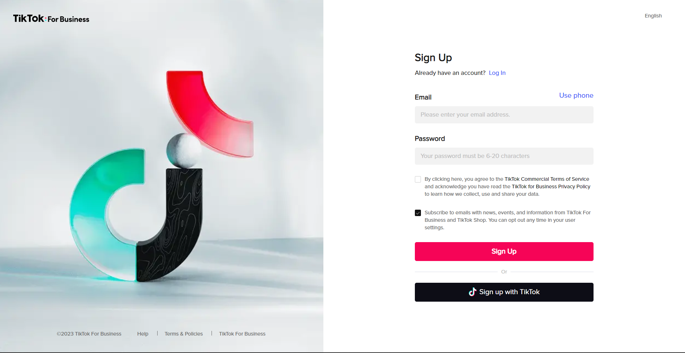<figcaption></figcaption></figure>

2\. Seterusnya anda akan melihat paparan seperti ini. Anda perlu isikan segala maklumat yang diperlukan untuk pendaftaran.

<figure>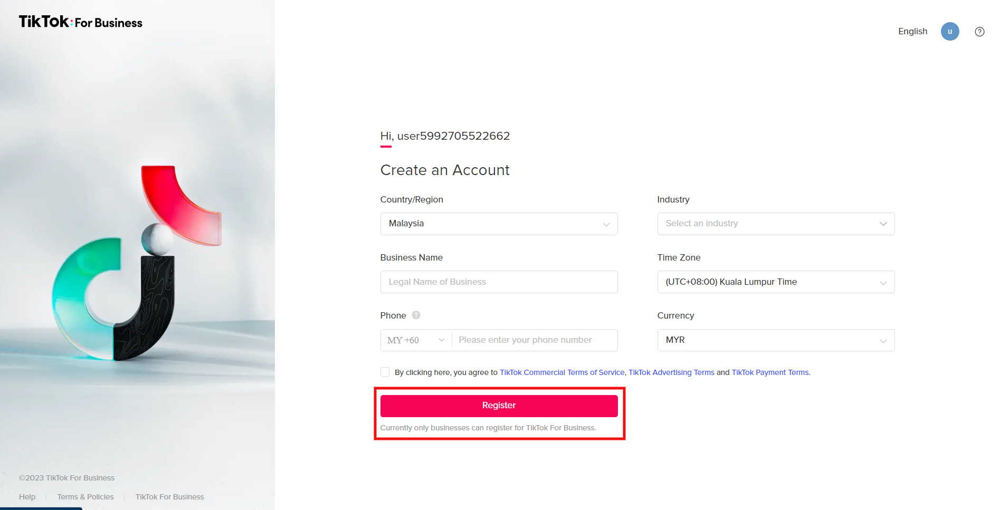<figcaption></figcaption></figure>

3\. Kemudian, anda boleh pilih **Manual Payment** untuk bahagian **Set up billing information.**

<figure>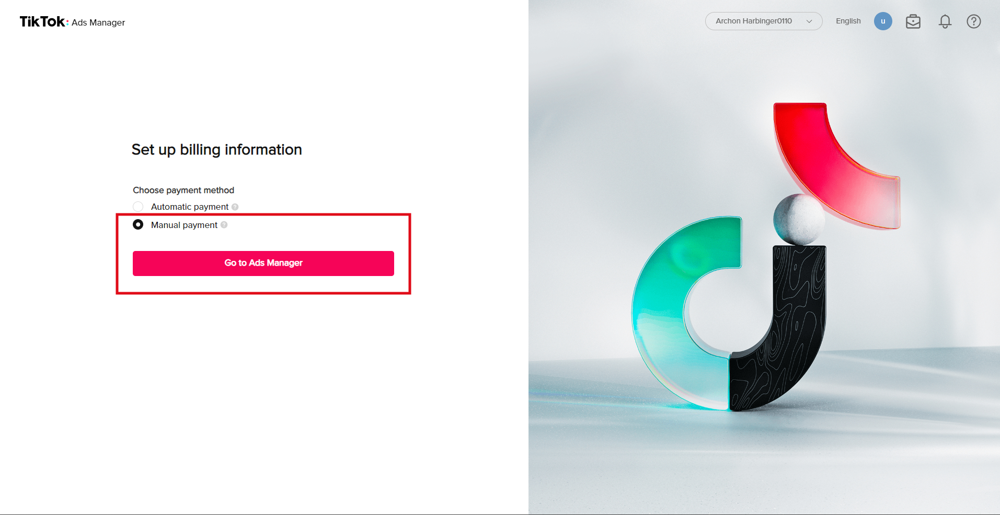<figcaption></figcaption></figure>

4\. Untuk penetapan dalam tutorial ini, kami akan gunakan **Custom Mode** sebagai tetapan.

<figure>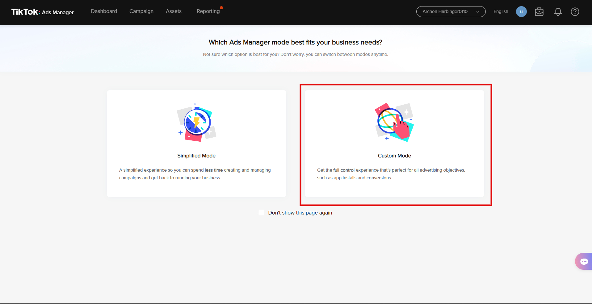<figcaption></figcaption></figure>

5\. Anda akan melihat halaman yang dipaparkan seperti ini.

<figure>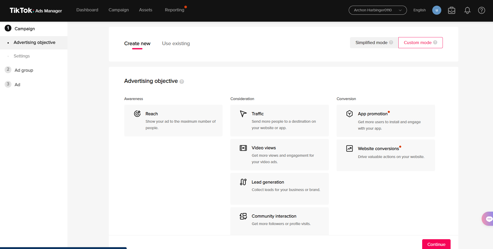<figcaption></figcaption></figure>

6\. Pada halaman tersebut, anda boleh lihat pada bar hitam diatas dan ada pilihan **Assets**. Klik pada **Assets** dan pilih **Events**.

<figure><figcaption></figcaption></figure>

7\. Anda boleh pilih **Web Events** untuk tetapan itu.

<figure>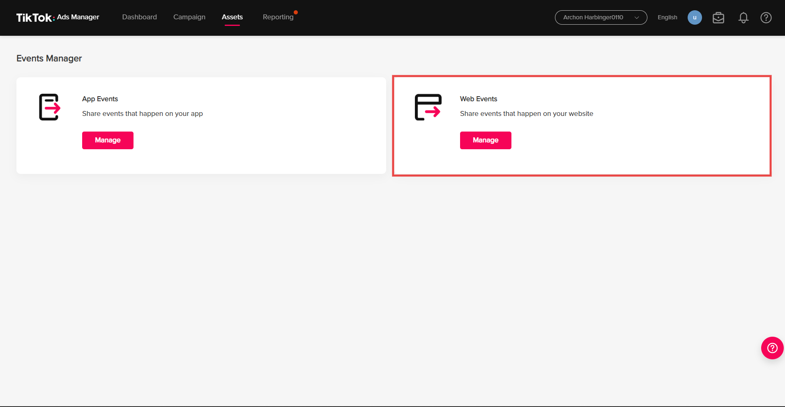<figcaption></figcaption></figure>

8\. Seterusnya, anda boleh klik pada **Create Pixel**.

<figure>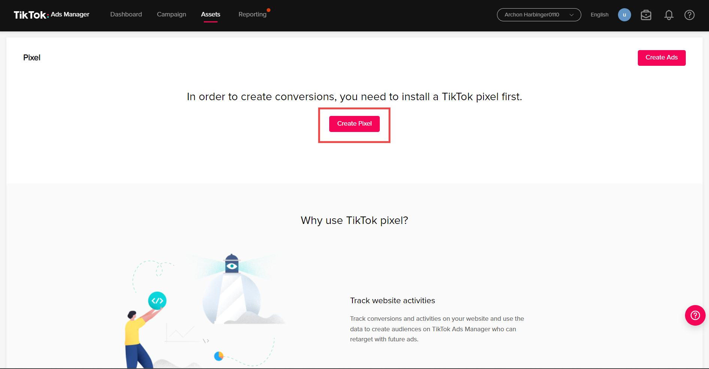<figcaption></figcaption></figure>

9\. Anda boleh pilih **Manual Setup** dan tekan **Next**.

<figure>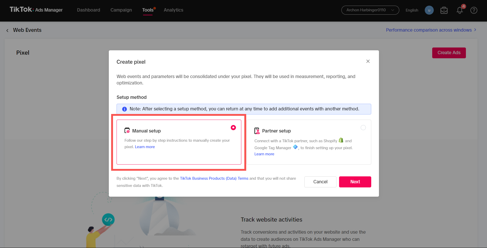<figcaption></figcaption></figure>

10\. Selepas itu, anda boleh masukkan **Nama Pixel** dan tekan **Next**.

<figure>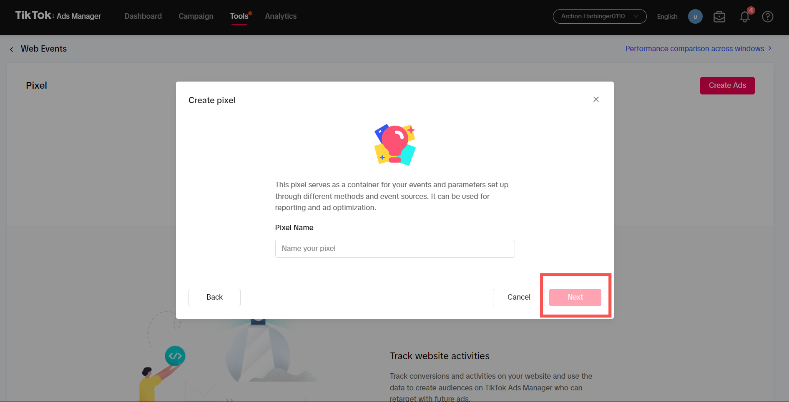<figcaption></figcaption></figure>

11. Pada bahagian ini boleh tekan **Skip Step**.

<figure>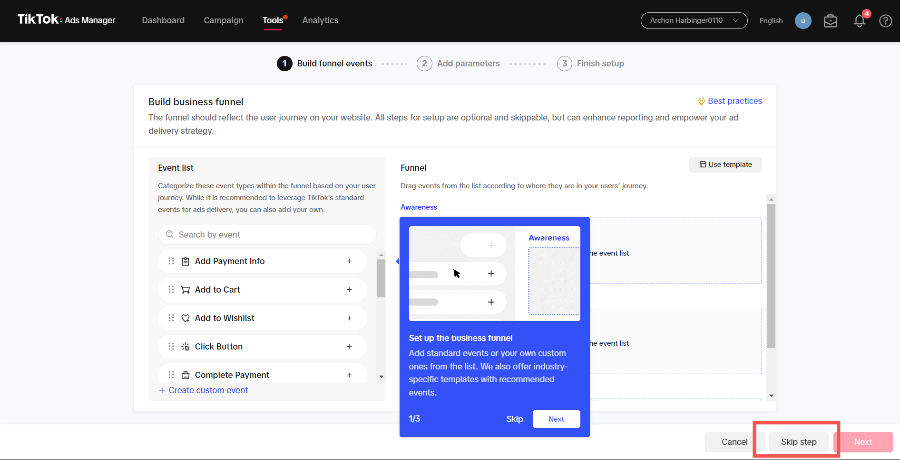<figcaption></figcaption></figure>

12\. Pada halaman tersebut, pilih hanya **Custom Code** sahaja.

<figure>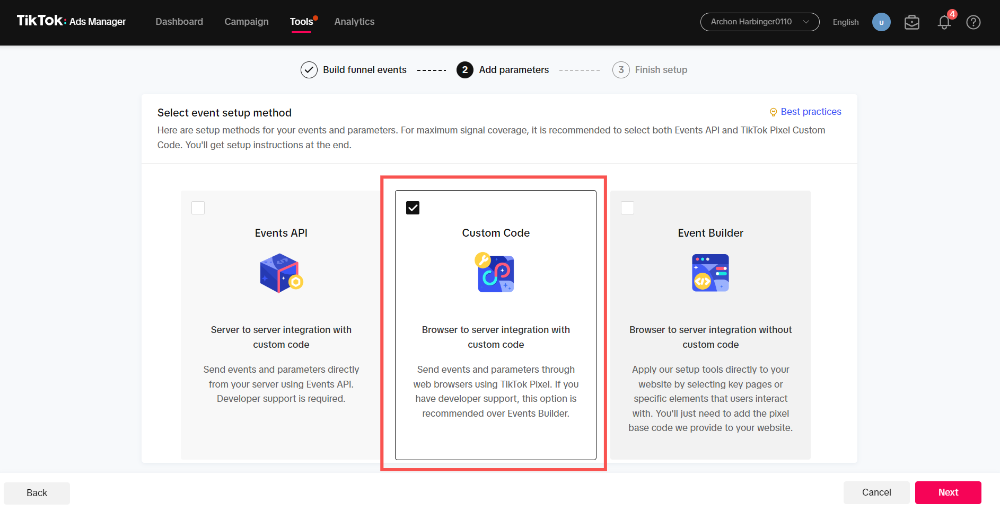<figcaption></figcaption></figure>

13. Hidupkan toggle **Automatic Advanced Matching** dan tekan **Finish**.

<figure>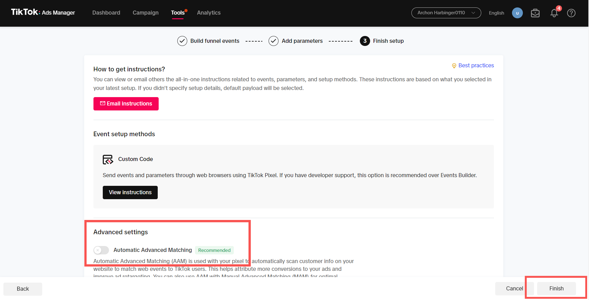<figcaption></figcaption></figure>

### Pasang Tiktok Pixel Helper

1\. Sekiranya anda tidak mempunyai **plugin** atau **extension Tiktok Pixel Helper** pada browser anda, anda boleh klik **Install** untuk memasang pada browser anda.

<figure>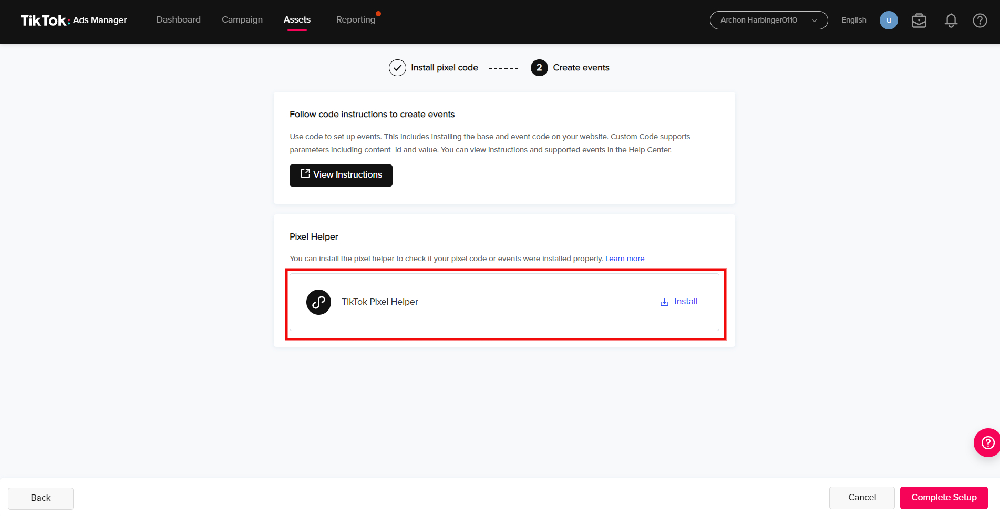<figcaption></figcaption></figure>

2\. Seterusnya,anda dibawa kesatu halaman dimana anda boleh klik pada butang **Add to Chrome** untuk memasang plugin atau extension ini kedalam browser anda.

<figure>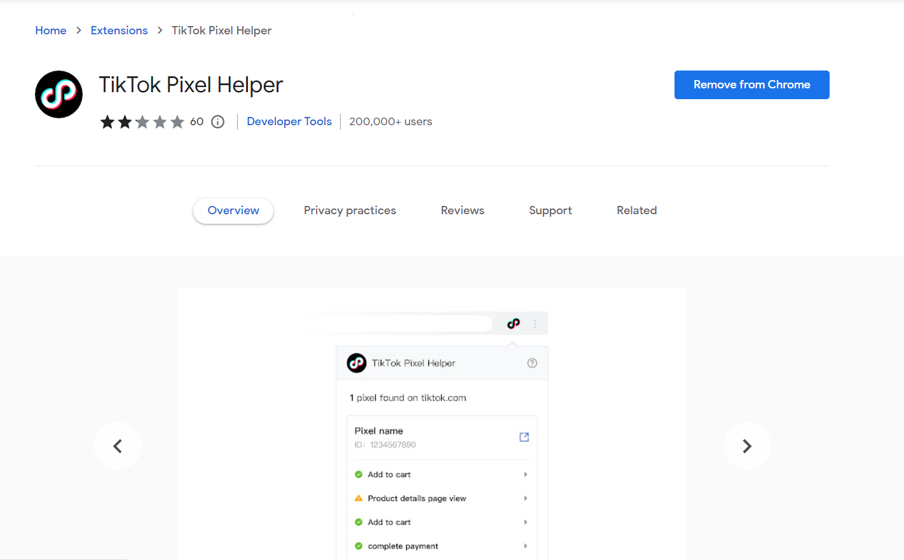<figcaption></figcaption></figure>

### Salin TikTok Pixel ID

1\. Salin **ID Tiktok Pixel** anda dan simpan, kerana **ID** tersebut akan digunakan untuk dimasukkan kedalam sistem Shoppego anda.

<figure>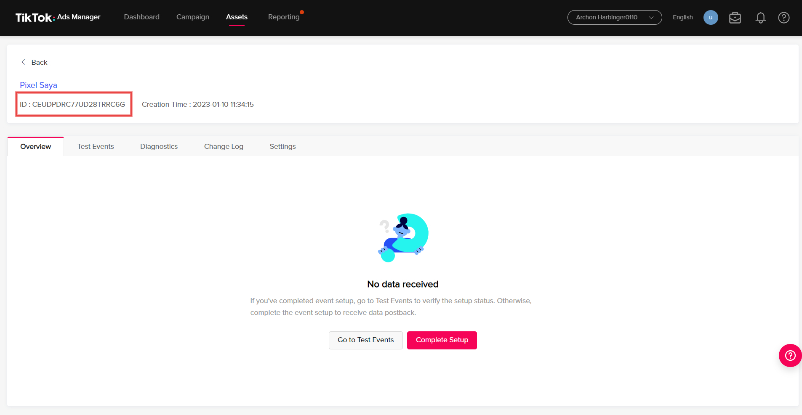<figcaption></figcaption></figure>

### Trigger Event Tiktok Pixel

1\. Anda boleh memulakan untuk proses test trigger events menggunakan **Tiktok Pixel** anda. Anda boleh pergi ke **Go to Test Events**.

<figure>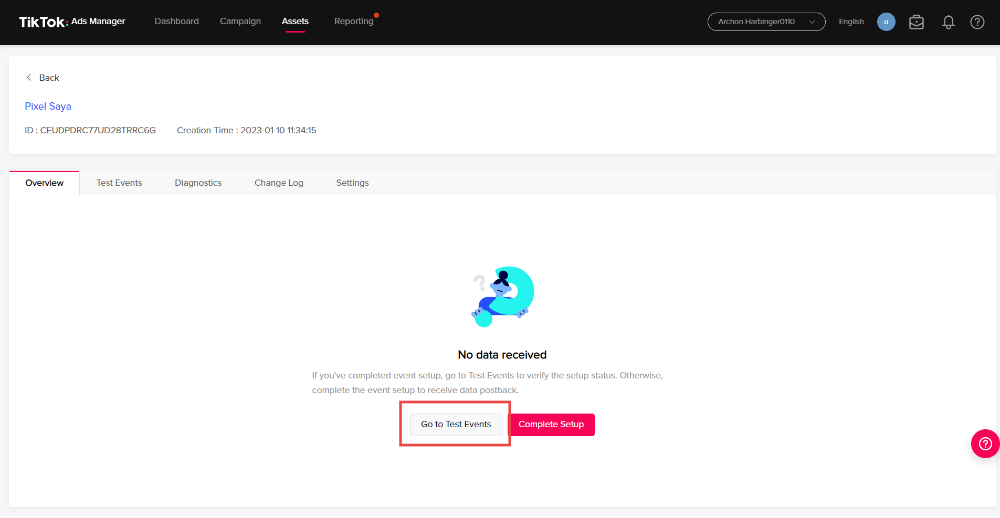<figcaption></figcaption></figure>

2\. Pada halaman tersebut, anda dikehendaki untuk memasukkan **nama website anda** atau **domain anda** di ruangan itu.

<figure>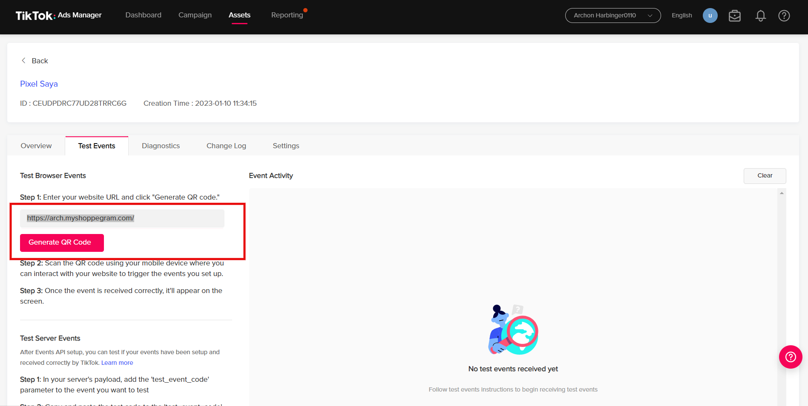<figcaption></figcaption></figure>

3\. Selepas itu, QR kod telah dijana , anda boleh buka **aplikasi Tiktok** di telefon anda dan **imbas QR kod** tersebut ya. Selepas anda imbas, anda boleh cuba membuat **order** atau **initiate checkout** dalam aplikasi Tiktok anda.

<figure>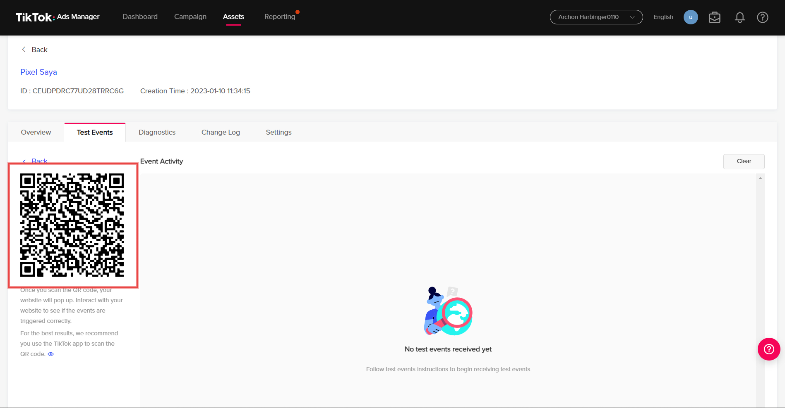<figcaption></figcaption></figure>

4\. Anda boleh lihat **events yang telah di-trigger** di aplikasi Tiktok didalam Tiktok Ads Manager anda.

<figure><figcaption></figcaption></figure>

Jika anda dapat trigger kesemua event yang anda inginkan di Shoppego ini iaitu **View Content**, **Add to Cart, Initiate Checkout & Complete Payment** ianya bermakna pixel anda sudah berfungsi dengan baik dan tiada sebarang isu.

## Bahagian 2 : Penetapan di Shoppego

1\. Seterusnya log masuk ke akaun Shoppego anda. Masuk ke pada bahagian **Settings -> General** -> dan masukkan pixel id anda pada ruangan TikTok Pixel dan **Save**.

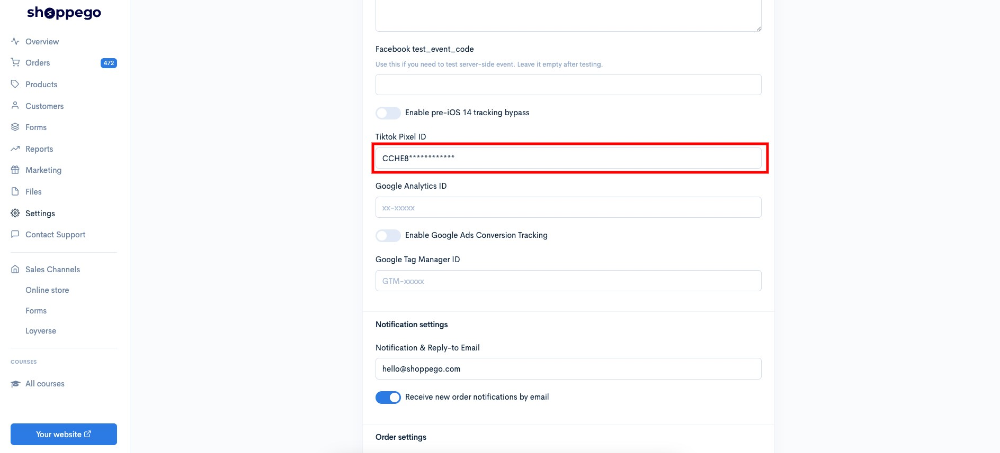

## Info Tambahan

Untuk makluman, selain dari penggunaan test event menggunakan QR Code untuk test trigger event TikTok pixel, anda juga boleh gunakan plugin **TikTok pixel helper** yang anda sudah pasang pada browser anda tersebut.

Berikut adalah cara untuk anda lakukan semakan trigger event TikTok pixel menggunakan plugin **TikTok pixel helper**.

Anda boleh lakukan beberapa langkah untuk trigger event yang boleh ditangkap pada **TikTok Pixel** di Shoppego. Sebagai contoh pada paparan dibawah kami telah melakukan **Add to cart** untuk trigger event **Add to cart.**

<figure>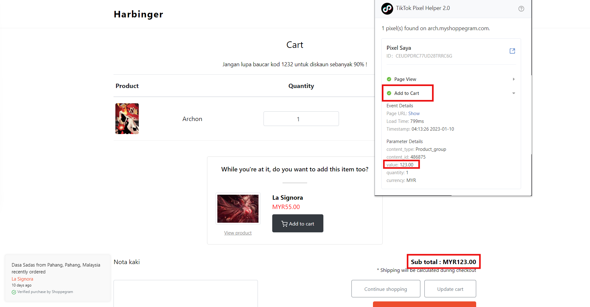<figcaption></figcaption></figure>

Seterusya anda juga boleh cuba untuk trigger event lain pada website anda dengan lakukan percubaan pembelian. Jika tiada sebarang masalah **Tiktok Pixel Helper** anda akan dapat lihat trigger event ,**View content**, **Add to cart**, **Initiate checkout** dan **Complete payment**.

## Ralat Konfigurasi

**Situasi :** Anda mempunyai isu dimana semasa anda ingin mencipta iklan pertama anda, pixel tiktok yang anda baru sahaja cipta tidak dapat ditemui?

**Jawapan** : Untuk isu tersebut, anda perlu **memberikan sedikit waktu untuk data events tiktok yang anda sudah trigger pada bahagian test events dapat dikesan pada tiktok pixel anda**. **Pastikan anda sudah lakukan test events terlebih dahulu pada tiktok pixel tersebut sebelum anda cipta iklan pertama anda.**
