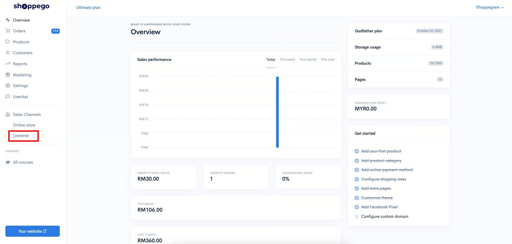
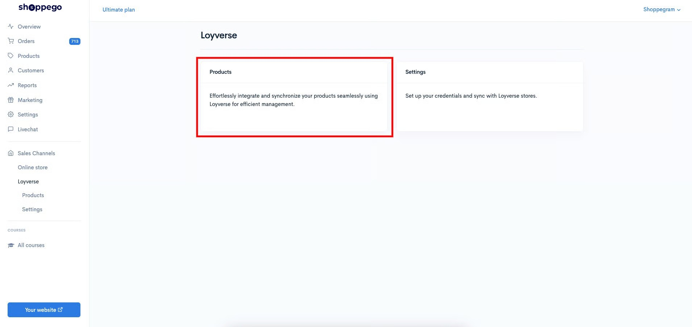
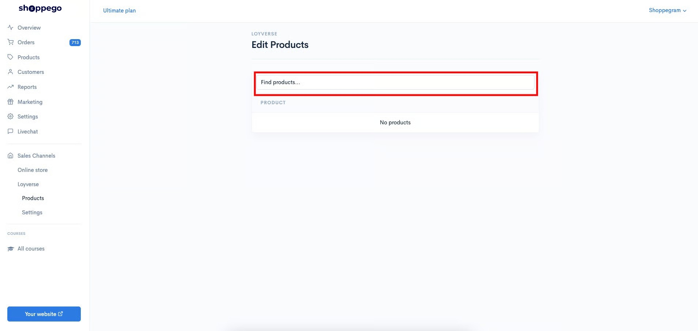
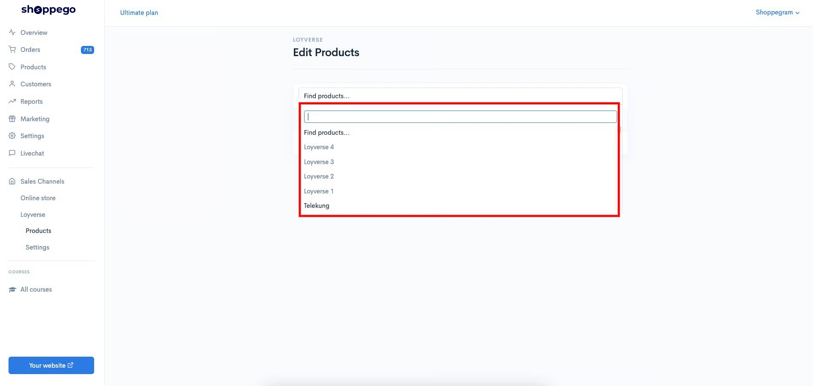
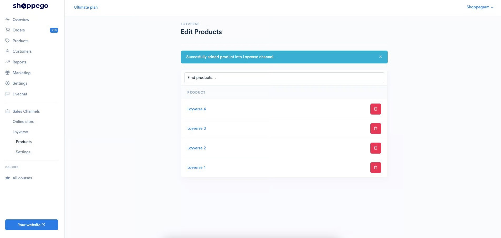
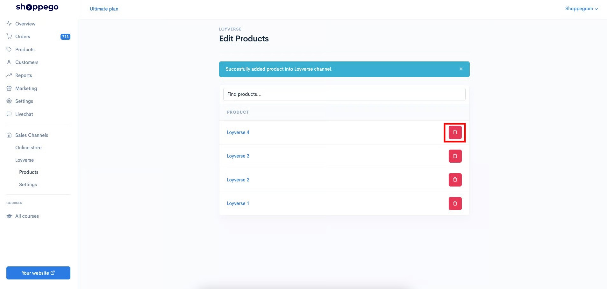
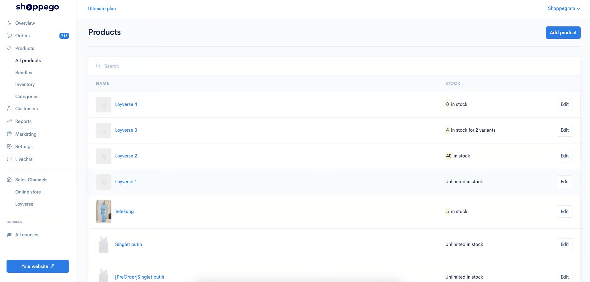
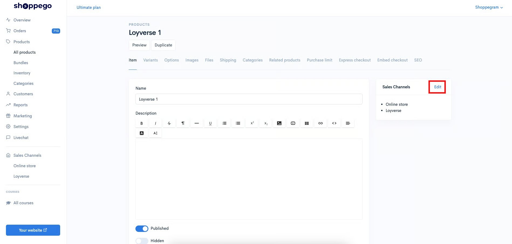
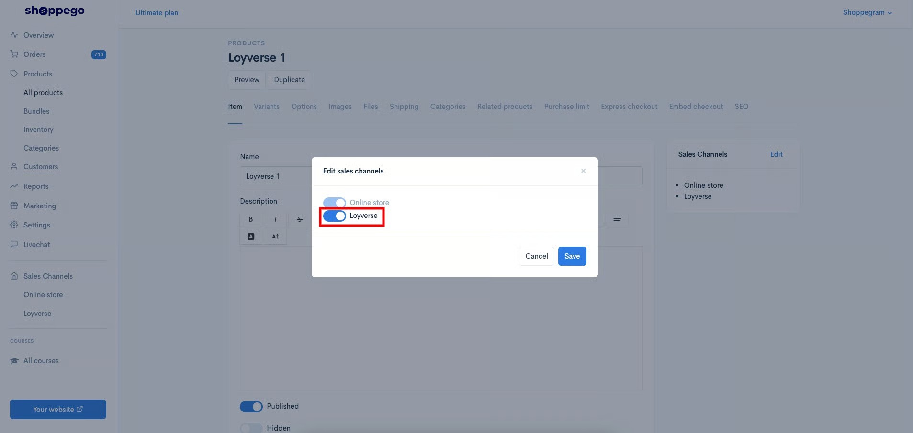
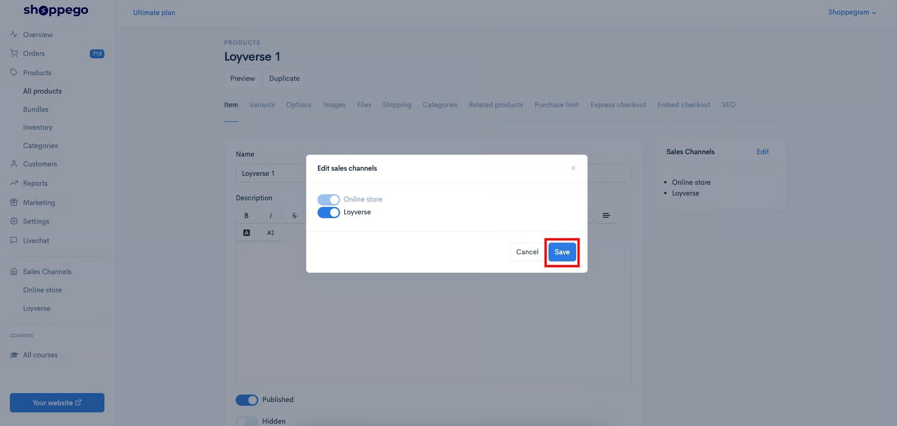

# Products


Untuk makluman, integration ini hanya akan **sync perubahan nama produk dan perubahan stock** yang berlaku antara produk anda di platform Shoppego dan Loyverse sahaja. Sila ambil perhatian bahawa jika anda membuat perubahan pada nama varian dalam Loyverse, ia tidak akan menjejaskan nama varian dalam Shoppego.



Setiap variant yang mempunyai penetapan "**Unmanage stock**"**(kecuali product yang hanya mempunyai 1 "Default" variant sahaja)** apabila dibawa dari Shoppego ke Loyverse ianya akan **paparkan nilai 0 di Loyverse**.


Untuk masukkan produk anda dari Shoppego kedalam sistem Loyverse, anda boleh rujuk pada tutorial ini:

1. Log masuk kedalam akaun Shoppego anda.

<figure><figcaption></figcaption></figure>

2. Klik pada **Loyverse**

<figure><figcaption></figcaption></figure>

3. Klik pada **Products**

<figure><figcaption></figcaption></figure>

4. Kemudian, pada **ruangan yang di highlight kan seperti pada paparan dibawah**, anda boleh **lakukan pemilihan produk yang anda ingin masukkan kedalam platform Loyverse**.

<figure><figcaption></figcaption></figure>

5. Setelah anda klik ruangan tersebut, anda boleh terus **search atau klik sahaja produk yang anda ingin sync dengan platform Loyverse** tersebut.

<figure><figcaption></figcaption></figure>

6. Setelah selesai, anda akan dapat paparan seperti paparan dibawah. Dimana setiap produk yang anda sync tersebut dapat dilihat.

<figure><figcaption></figcaption></figure>

## Delete products

Jika anda ingin delete produk itu dari sync di platform Loyverse, anda boleh sahaja klik pada **butang ikon tong sampah** tersebut. Penetapan ini akan menyebabkan produk ini tidak akan dapat dilihat lagi di platform Loyverse akan tetapi masih dikekalkan didalam platform Shoppego.

<figure><figcaption></figcaption></figure>

## Info tambahan

Anda juga boleh menguruskan pengurusan sync produk ini melalui halaman produk itu sendiri di dashboard Shoppego anda.

1. Anda boleh klik pada mana-mana produk yang anda ingin uruskan tersebut.

<figure><figcaption></figcaption></figure>

2. Kemudian, pada tab Items, anda boleh klik pada butang **Edit**

<figure><figcaption></figcaption></figure>

3. 1 popup akan keluar, untuk anda tick atau untick pada **toggle Loyverse**. Jika anda tick ia bermakna produk ini akan di sync dengan platform Loyverse. Manakala, jika anda untick toggle tersebut, ia bermakna produk ini akan dibuang atau tidak di synckan lagi di platform Loyverse.

<figure><figcaption></figcaption></figure>

4. Pastikan bagi setiap perubahan yang anda lakukan, anda klik butang **Save** untuk simpan penetapan tersebut.

<figure><figcaption></figcaption></figure>
