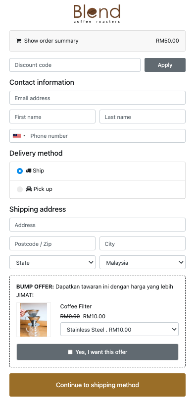
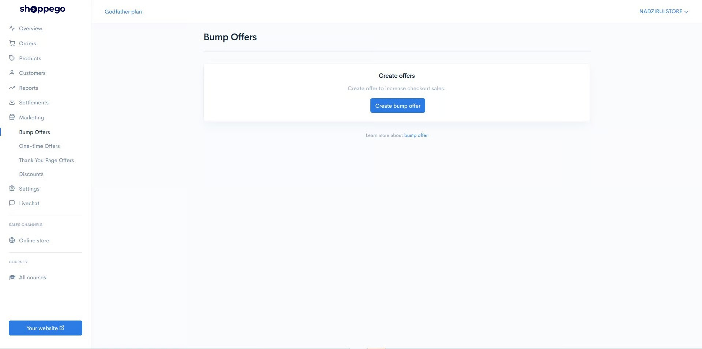
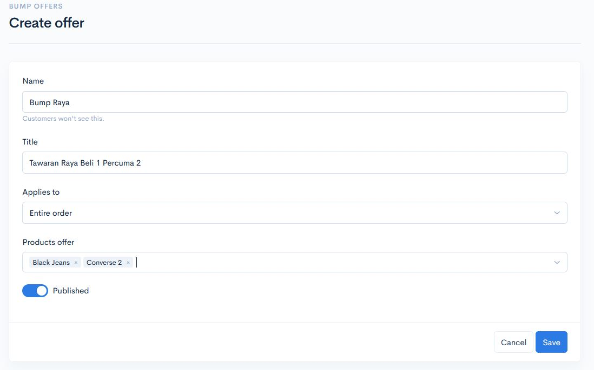

# Bump Offers

**Bump offers** adalah satu fungsi Shoppego dibawah marketing untuk meningkatkan conversion rate terhadap kedai online anda. Dalam bahasa mudah ianya adalah untuk di **cross-sell** kepada pembeli.&#x20;


Fungsi ini hanya tersedia untuk **plan&#x20;**<mark style="color:red;">**Premium**</mark> dan <mark style="color:red;">**Ultimate**</mark> sahaja.


Bump Offer akan **dipaparkan** pada bahagian **Checkout** iaitu ketika pembeli mengisikan maklumat untuk penghantaran.&#x20;

## Contoh Bump Offers di Shoppego:&#x20;

<figure><figcaption></figcaption></figure>

## Penetapan Bump Offers

1. Log masuk ke dashboard **Marketings** -> **Bump Offers .**

2. Klik pada butang **Create Bump Offer.**
3. Anda boleh letakkan seberapa banyak produk di bahagian ini dan ianya akan **dipaparkan secara rawak** kepada pembeli anda. &#x20;

<table><thead><tr><th width="167">Tajuk </th><th>Penerangan</th></tr></thead><tbody><tr><td><strong>Name</strong></td><td>Nama yang <strong>anda ingin letakkan</strong> sebagai rujukan anda.</td></tr><tr><td><strong>Title</strong></td><td>Masukkan <strong>headline</strong> anda yang dapat menarik perhatian pembeli.</td></tr><tr><td><strong>Products Offer</strong></td><td>Letakkan <strong>produk yang hendak di upsell</strong> pada bahagian ini.</td></tr></tbody></table>

4. Seterusnya klik butang **Save.** 

