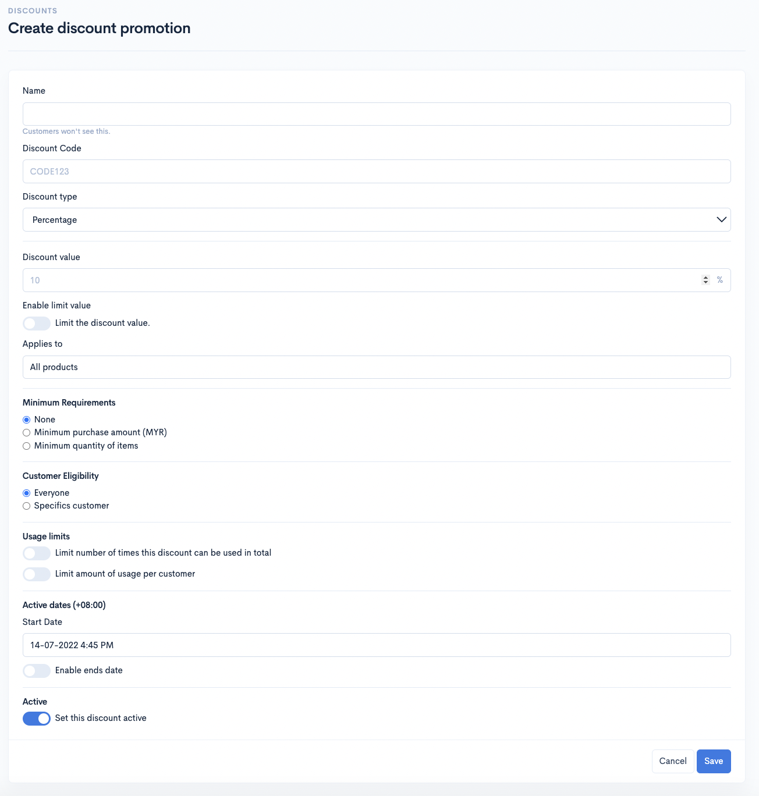
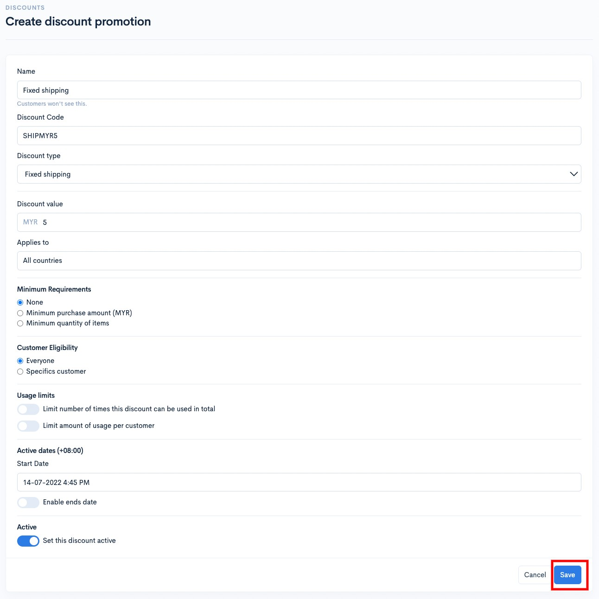

# Fixed Shipping

Untuk membuat penetapan diskaun kod **Fixed Shipping**, anda boleh ikut tutorial ini :

1\. Login ke Dashboard Shoppego anda.

2\. Klik pada tab **Marketing**

3\. Klik pada tab **Discounts**&#x20;

4\. Klik pada button **Create discount**

5\. Nanti anda akan dibawa ke halaman dimana anda boleh isikan maklumat kod voucher anda.

<table><thead><tr><th width="204">Ruang</th><th>​Penjelasan</th></tr></thead><tbody><tr><td><strong>Name</strong></td><td>Anda boleh masukkan nama promo anda (Pelanggan tidak akan dapat lihat nama ini)</td></tr><tr><td><strong>Discount Code</strong></td><td>Anda boleh masukkan kod yang anda ingin pelanggan masukkan supaya mereka dapat menggunakan promo ini.</td></tr><tr><td><strong>Discount type</strong></td><td>Anda boleh tetapkan kepada Fixed shipping</td></tr><tr><td><strong>Discount value</strong></td><td>Anda boleh masukan nilai penolakan daripada harga shipping yang anda inginkan pelanggan dapatkan semasa checkout.</td></tr><tr><td><strong>Applies to</strong></td><td>Anda boleh pilih sama ada, anda ingin tetapkan untuk spesifik countries/negara, spesifik states/daerah atau keseluruhan countries/negara.</td></tr><tr><td><strong>Minimum requirements</strong></td><td>Disini anda ada 3 pilihan iaitu sama ada, anda tidak ingin setkan apa-apa requirement("None") untuk penggunaan diskaun kod ini atau anda ingin tetapkan requirement berdasarkan "Minimum purchase amount" atau "Minimum quantity of items".</td></tr><tr><td><strong>Customer Eligibility</strong></td><td>Disini anda boleh setkan sama ada, anda ingin diskaun kod tersebut hanya boleh digunakan untuk "Specific customer" atau untuk kesemua pelanggan anda "Everyone".</td></tr><tr><td><strong>Active dates (+08:00)</strong></td><td>Disini anda boleh tetapkan tarikh untuk diskaun kod ini boleh mula diguna pakai pada(Start Date) atau anda juga boleh tetapkan tarikh tamat penggunaan diskaun kod ini pada(Enable ends date)</td></tr><tr><td><strong>Active</strong></td><td>Pastikan anda biarkan button Active itu berada dalam keadaan aktif( Bewarna biru ) untuk pastikan fungsi diskaun kod anda aktif.</td></tr></tbody></table>

6\. Setelah selesai anda boleh klik **Save** dan cuba menggunakan voucher tersebut diwebsite anda.

