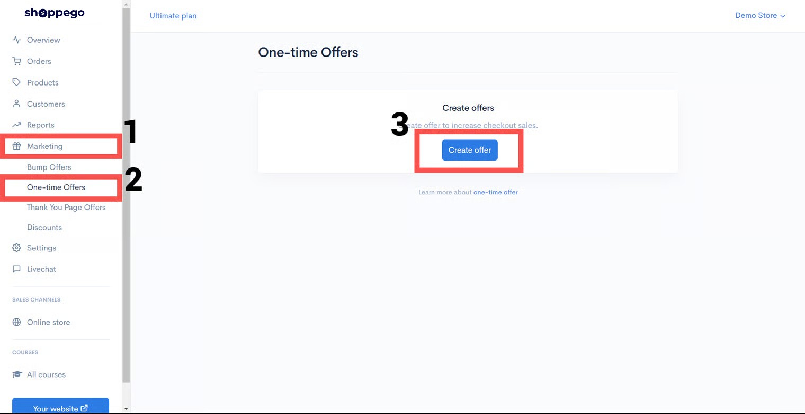
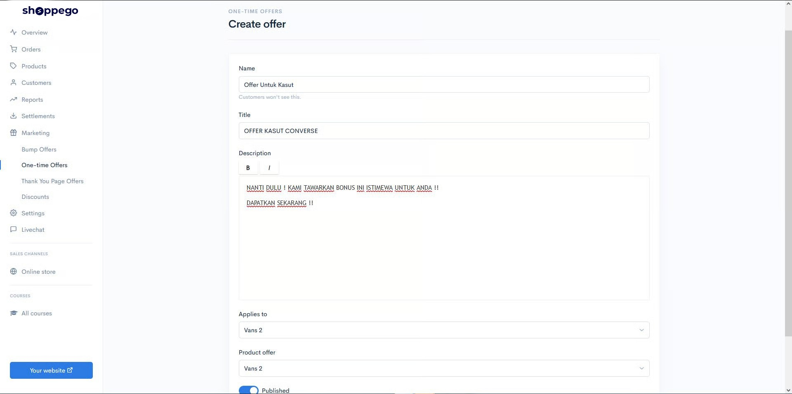

# One-Time Offers

**OTO** adalah **One-Time-Offer** dimana anda boleh mencipta **satu tawaran khas** kepada pelanggan hanya sekali sahaja ketika mereka membuat pembayaran.


Kebiasaanya, **produk yang ditawarkan adalah yang lebih mahal** didalam bahagian ini secara tak langsung **meningkatkan kadar jualan**.


Tawaran ini jika terlepas bermakna prospek anda tidak lagi akan dapat berpatah balik untuk mendapatkannya.


Fungsi ini hanya tersedia untuk **plan&#x20;**<mark style="color:red;">**Premium**</mark> dan <mark style="color:red;">**Ultimate**</mark> sahaja.


## Contoh One-Time Offers

&#x20;\
\
\
**OTO** akan terpapar selepas pembeli masukkan data mereka di **Checkout Page**.&#x20;

## **Penetapan One Time Offers (OTO)**

1. Log masuk ke **Dashboard Marketing(1)** -> **One Time Offers(2)** dan klik butang **Create Offer(3).**

<figure><figcaption></figcaption></figure>

2. Masukkan maklumat yang diperlukan. Setelah selesai, klik butang **Save.**

<table><thead><tr><th width="169">Tajuk</th><th>Penerangan</th></tr></thead><tbody><tr><td><strong>Name</strong></td><td>Maklumat yang melambangkan <strong>tawaran anda</strong> supaya senang untuk anda rujuk. </td></tr><tr><td><strong>Title</strong></td><td>Masukkan <strong>headline</strong> untuk menarik perhatian pengguna supaya teruskan pembacaan. </td></tr><tr><td><strong>Description</strong></td><td>Masukkan <strong>maklumat terperinci</strong> mengenai tawaran anda. </td></tr><tr><td><strong>Product Offer</strong></td><td> Pilih <strong>product yang anda nak tawarkan</strong> untuk <mark style="color:red;"><strong>sekali sahaja</strong></mark>.</td></tr></tbody></table>

