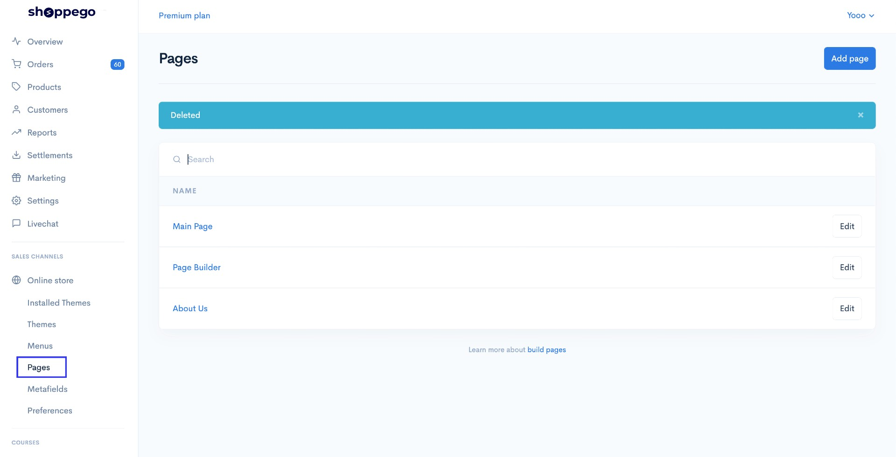
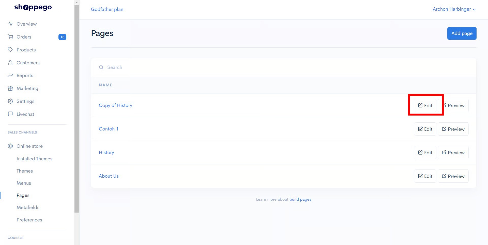
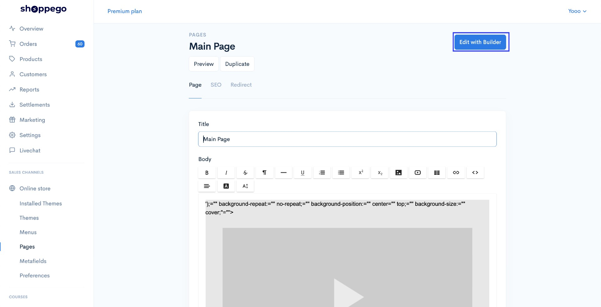
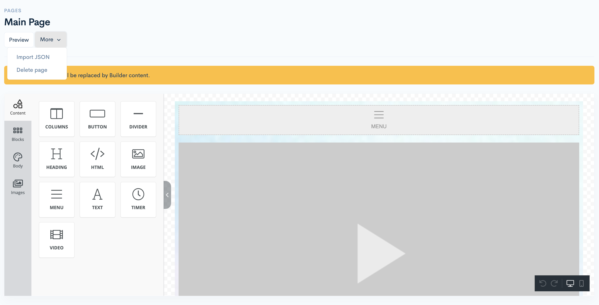
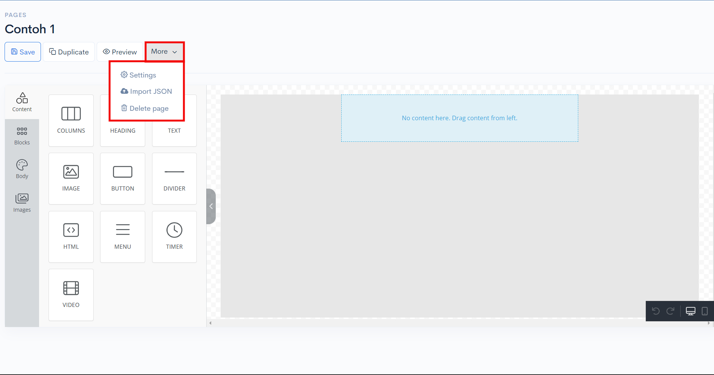
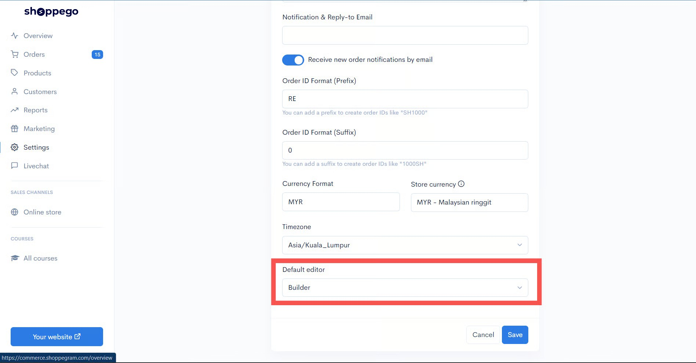

# Import JSON

Kini pada bahagian Page Builder Shoppego anda boleh menggunakan **fungsi import JSON**. Ini bermakna anda boleh gunakan template yang sedia ada. Berikut merupakan langkah langkah untuk import JSON kepada Page Builder

## Penetapan

1. Log masuk ke bahagian **Dashboard Shoppego.**

2\. Klik pada bahagian **Online Store**

3\. Klik pada **Pages**

### Laluan untuk pergi ke Setting -> Import JSON.

Untuk bahagian ini adalah mengikut interface Builder tersendiri.

### Default Editor: WYSIWYG&#x20;

1. Pilih **Pages** yang anda inginkan dan klik **Edit.**

2. Klik pada **Edit with Builder.**

3. Klik pada butang **More** dan pilih **Import JSON**. Perlu diingatkan anda hanya boleh import file berformat .json sahaja.

### Default Editor: Builder

1. Pilih **Pages** yang anda inginkan dan klik **Edit.**

<figure><figcaption></figcaption></figure>

2. Kemudian anda boleh tekan **More** -> dan **Import JSON**.

<figure><figcaption></figcaption></figure>

Oleh itu, proses **mengimport file json** anda telah pun selesai.

### Penetapan Default Editor

Untuk melihat Default Editor anda sama ada **WYSIWYG** atau **Builder**, anda boleh pergi ke:

Dashboard Overview -> Settings -> General -> Default Editor.


\*\*<mark style="color:red;">**Perhatian**</mark>: Jika anda <mark style="color:red;">**tidak melihat Default Editor**</mark>, maka **Default Editor** anda adalah **Builder**.


<figure><figcaption></figcaption></figure>
