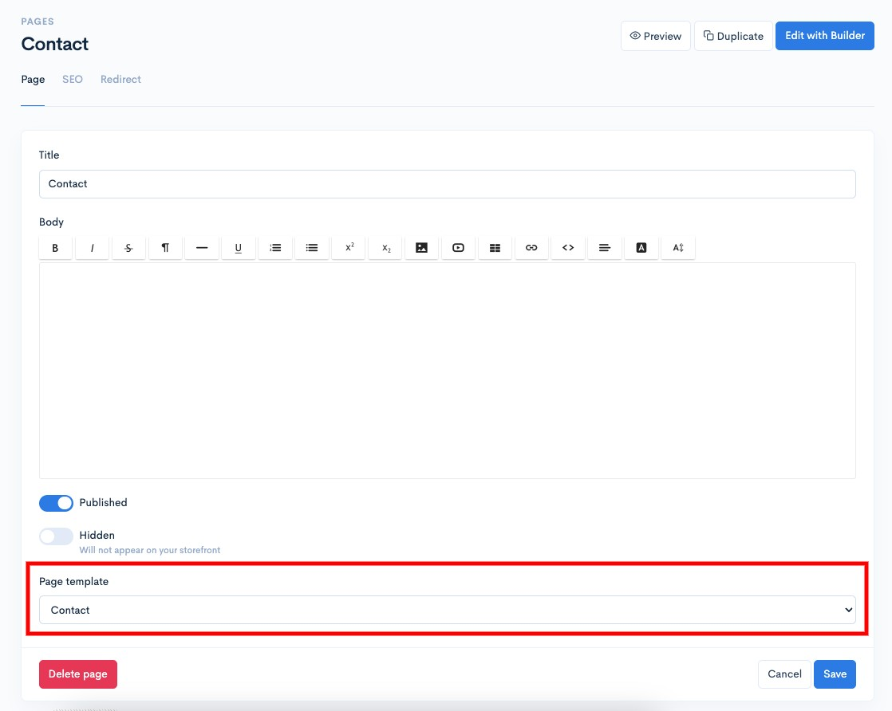
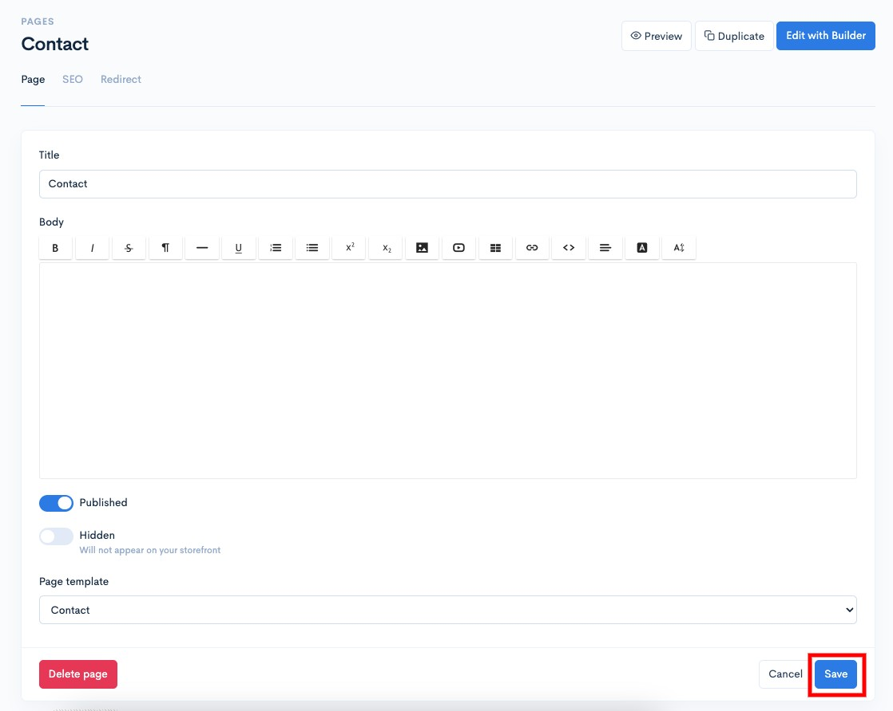
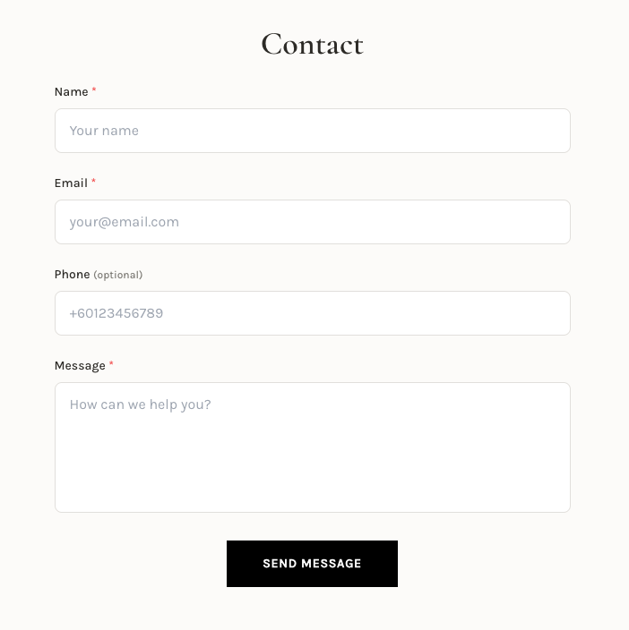

# Page template

Di Shoppego, kami ada sediakan template halaman yang anda boleh terus gunakan untuk paparan halaman anda.

Antara template yang anda boleh gunakan adalah:

* Default(Paparan asal)
* Contact page

Untuk menggunakan template tersebut pada page anda itu, anda boleh pergi pada bahagian:

1. Log masuk dashboard Shoppego

<figure><figcaption></figcaption></figure>

2. Klik pada **Online store**

<figure><figcaption></figcaption></figure>

3. Klik pada **Pages**

<figure><figcaption></figcaption></figure>

4. Sekiranya, anda masih belum cipta sebarang halaman, anda boleh cipta terlebih dahulu. Sekiranya, anda sudah cipta halaman itu, anda boleh terus **skroll ke bawah** dan pada penetapan "**Page template**" anda **boleh klik** dan **lakukan pemilihan jenis template yang anda ingin gunakan**.

<figure><figcaption></figcaption></figure>

5. Setelah selesai klik **Save**

<figure><figcaption></figcaption></figure>

Kini halaman anda itu sudah menggunakan template yang tersedia.

## Contoh Paparan Template

### Contact Page


Apabila pelawat menyerahkan borang, prospek secara automatik akan direkodkan sebagai pelanggan dalam store anda. Ini membolehkan anda mengurus dan membuat susulan dengan bakal pembeli dengan lebih cekap.


<figure><figcaption></figcaption></figure>
