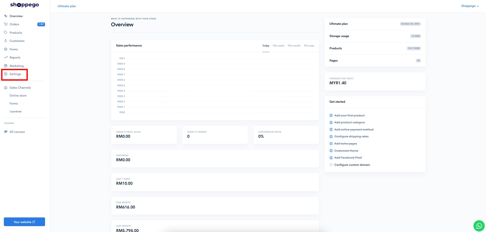
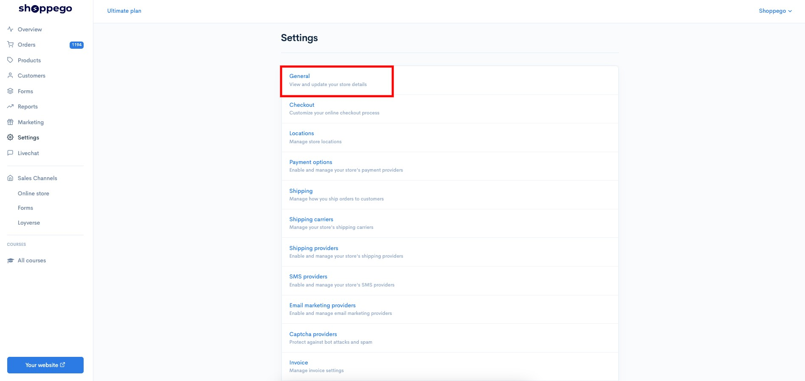
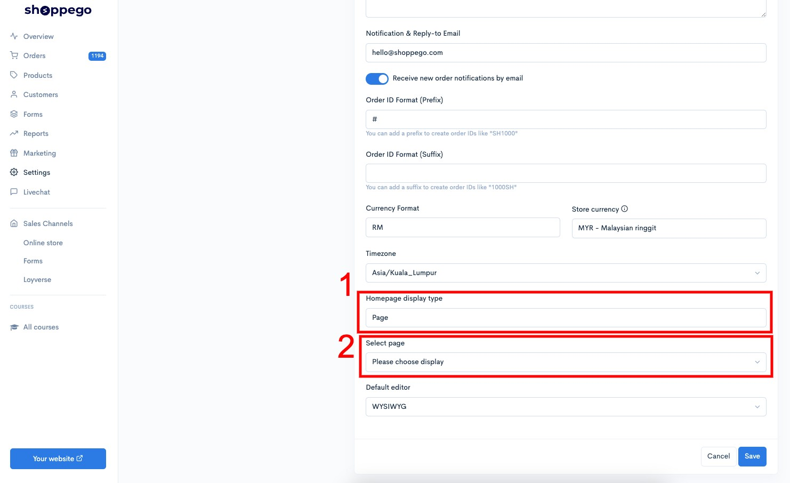
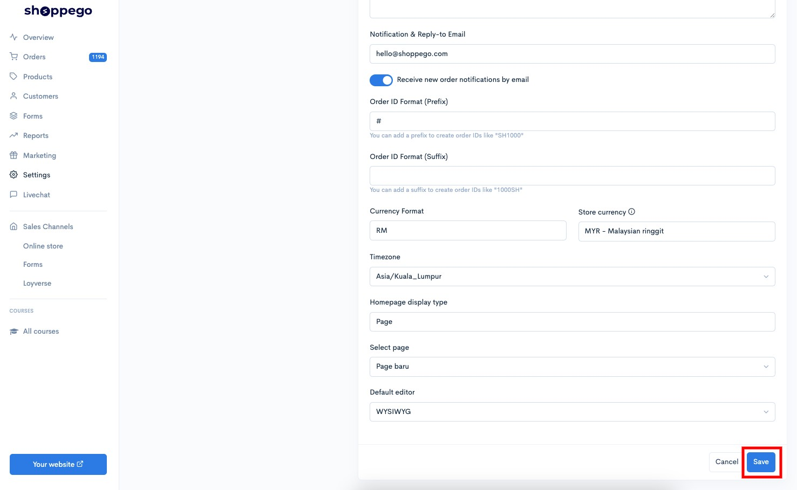

# Set Page as Homepage

Di Shoppego anda boleh jadikan page anda sebagai main **Homepage** pada website anda. Untuk proses penetapan fungsi ini, anda boleh ikut tutorial ini.


**\*\***<mark style="color:red;">**Perhatian**</mark>**: Sebelum memulakan penetapan ini anda perlu pastikan anda sudah mempunyai page yang anda sudah cipta pada website anda.**


1\. Anda boleh login terlebih dahulu pada akaun Shoppego anda.

2\. Seterusnya, anda boleh klik pada **Settings**.

3\. Kemudian, anda boleh klik pada butang **General**

4\. Anda akan dibawa ke halaman penetapan "General" disitu anda akan jumpa **setting Homepage display type**, **pada bahagian setting tersebut anda boleh pilih "Page"** dan **1 lagi penetapan iaitu "Select page" akan dipaparkan**. Pada penetapan tersebut anda boleh **pilih page yang anda ingin jadikan sebagai main Homepage website anda**.

5\. Setelah selesai membuat pemilihan page tersebut, anda boleh save setting tersebut dengan klik pada butang **Save** pada page yang sama.

Setelah selesai anda boleh lihat hasilnya pada website anda.
