# Customer Registration

Customer registration adalah fungsi untuk pelanggan mendaftar pada laman Shoppego anda.&#x20;


Fungsi ini hanyalah khas kepada plan <mark style="color:$danger;">**Standard**</mark>, <mark style="color:red;">**Premium**</mark> dan <mark style="color:red;">**Ultimate**</mark> sahaja. Berikut adalah langkah untuk penetapan Customer registration.


1. Login dan masuk ke bahagian **dashboard** anda.

2. Klik pada **Online store**

<figure><figcaption></figcaption></figure>

3. Klik pada **Customize**

<figure><figcaption></figcaption></figure>

4. Klik pada **tab Header untuk themes Tampin & Solaris**. Manakala, **tab Menu untuk themes Hartamas**. Kemudian, **tick pada checkbox Login menu**

<figure>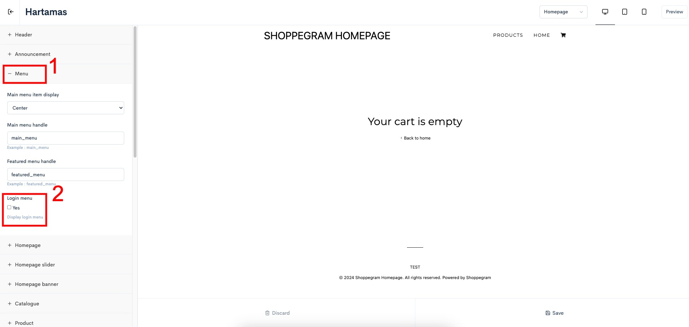<figcaption></figcaption></figure>

5. Setelah selesai klik **Save**

<figure>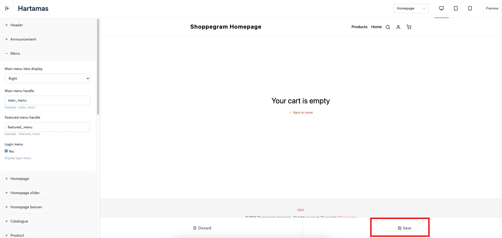<figcaption></figcaption></figure>

## Contoh Paparan di website

&#x20;Pada paparan store front, login akan kelihatan seperti ini.

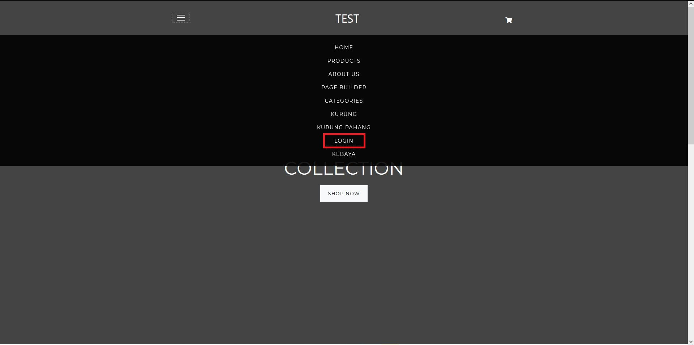

7\. Manakala paparan logout akan kelihatan seperti ini setelah pelanggan login.

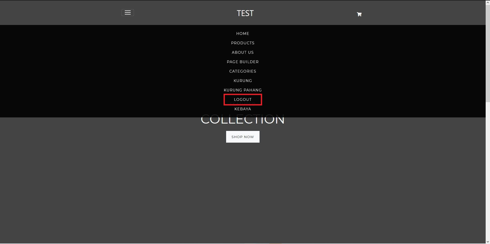

## **Customer Dashboard**

Ini adalah contoh paparan apabila pelanggan sudah berjaya log masuk kedalam akaun mereka di website anda itu:

<figure>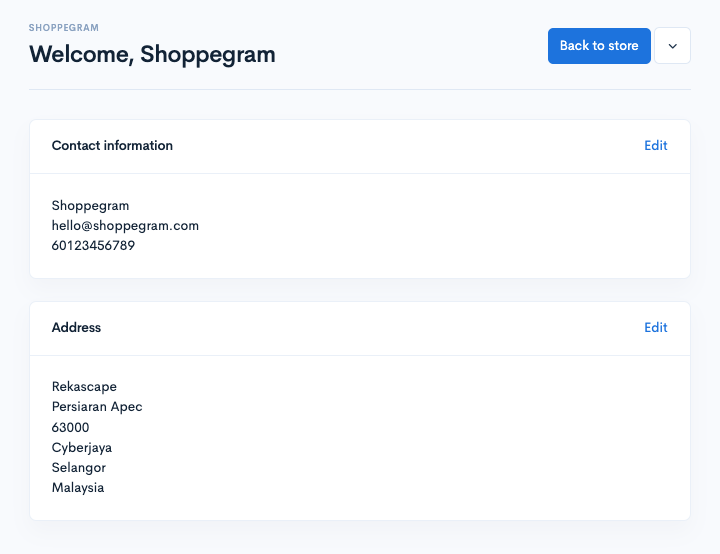<figcaption></figcaption></figure>

### Kemas Kini Contact Information atau Address

1. Melalui halaman ini, pelanggan anda boleh klik pada mana-mana butang **Edit** untuk kemas kini sama ada **Contact information** atau **Address** mereka.

<figure>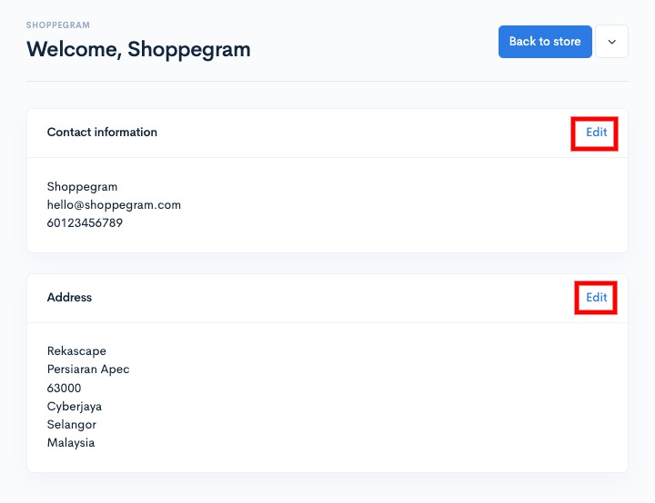<figcaption></figcaption></figure>

2. Pastikan setelah mereka selesai kemas kini maklumat, mereka klik pada butang **Save** untuk simpan penetapan tersebut.

<figure>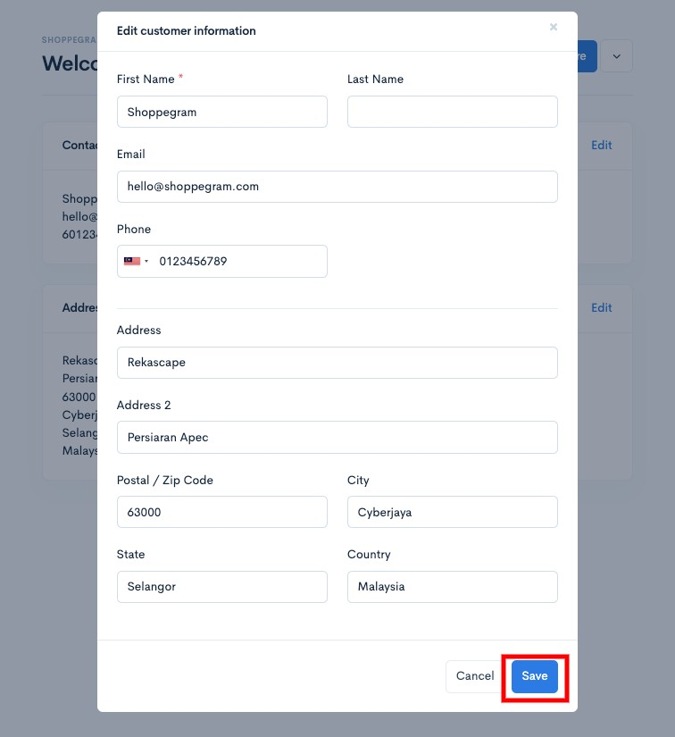<figcaption></figcaption></figure>

### Melihat Pembelian Yang Pernah Dibuat

1. Untuk pelanggan anda melihat order mereka sebelum ini, mereka boleh klik pada **butang ikon anak panah** tersebut.

<figure>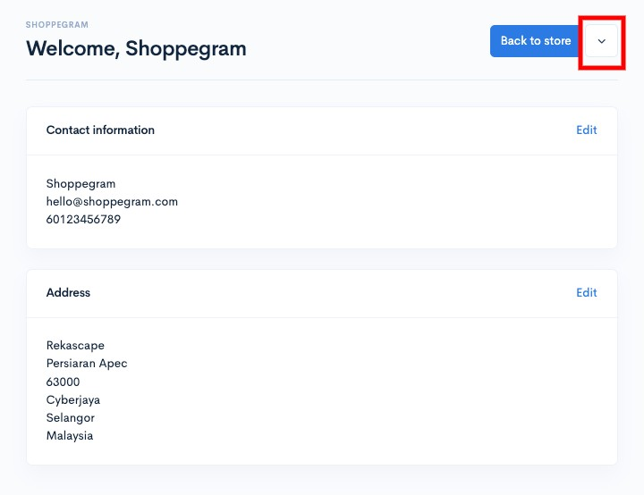<figcaption></figcaption></figure>

2. Kemudian, mereka boleh klik pada **My orders**

<figure>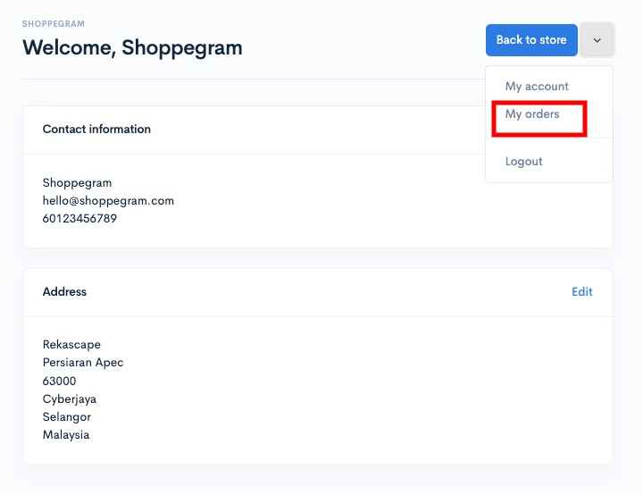<figcaption></figcaption></figure>

3. Nanti, mereka akan dibawa ke halaman yang mempunyai paparan kesemua order yang pernah dibuat oleh mereka.

<figure>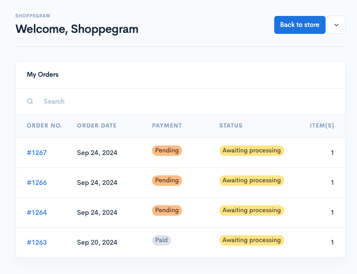<figcaption></figcaption></figure>

### Lakukan Carian Order

Melalui halaman ini, pelanggan boleh sahaja lakukan carian order mereka **menggunakan order number mereka untuk dimasukkan kedalam ruang carian tersebut**

<figure>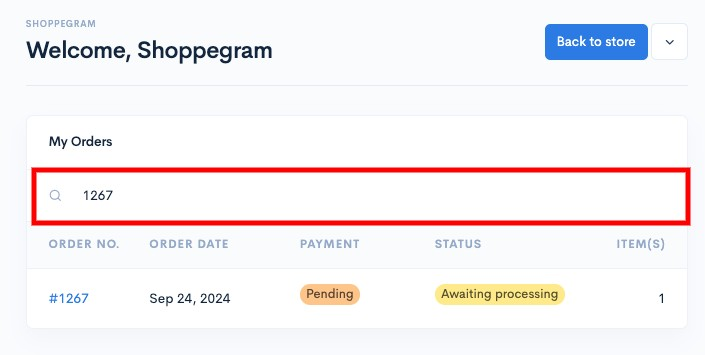<figcaption></figcaption></figure>

### Dapatkan Invoice Order

1. Melalui halaman ini juga, pelanggan boleh dapatkan invoice bagi setiap order mereka dengan cara, **klik pada order tersebut**

<figure>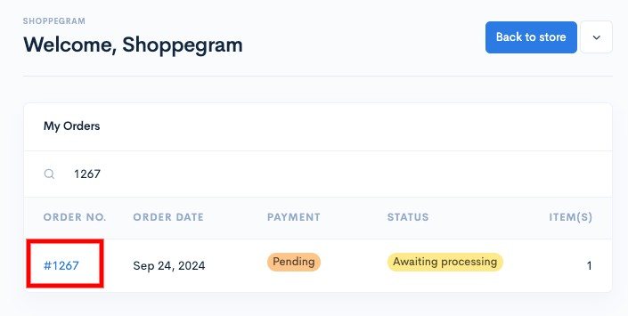<figcaption></figcaption></figure>

2. Kemudian, klik pada butang **Invoice**

<figure>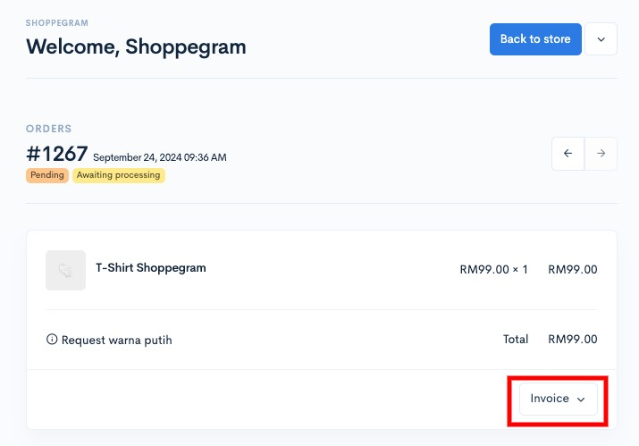<figcaption></figcaption></figure>

3. Seterusnya, pelanggan boleh pilih sama ada ingin terus **Download Invoice** bagi order tersebut atau ingin **hantar invoice itu ke Email** yang mereka inginkan(<mark style="color:red;">**Hanya 3 email sahaja dibenarkan**</mark>)

<figure>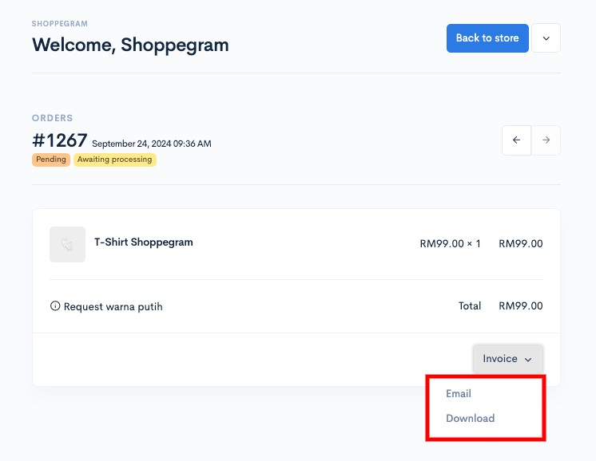<figcaption></figcaption></figure>

### Kembali ke website

Sekiranya pelanggan ingin kembali semula ke halaman website anda, mereka boleh klik pada butang **Back to store**

<figure>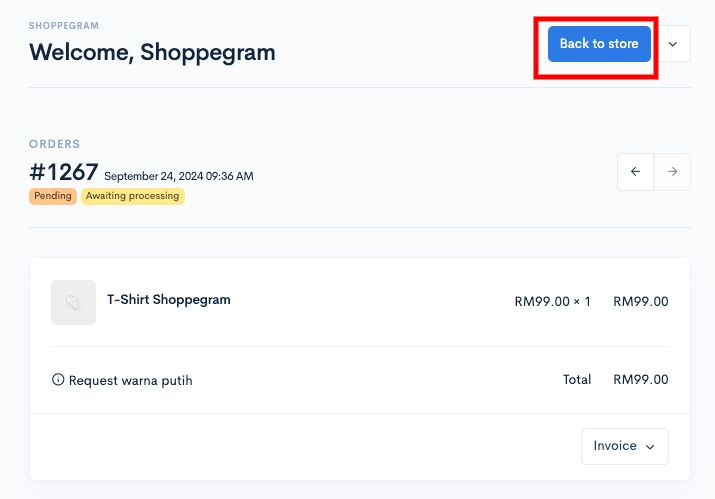<figcaption></figcaption></figure>

## **Maklumat Tambahan**

Jika anda ingin pelanggan anda perlu login dan mendaftar sebelum membuat pembelian pada store anda.&#x20;

Anda harus melakukan penetapan itu dengan log masuk ke Shoppego dashboard. Masuk pada bahagian **Settings ->** **Checkout ->** enable **Force Login** dan **Enable** **Customer Registration** dan tekan **Save**.


\*\***Force Login** bermaksud anda memaksa pelanggan mendaftar dahulu sebelum membuat pembelian.&#x20;

Jika butang ini diaktifkan, pelanggan perlu login atau daftar dahulu sebelum masuk ke laman store anda.


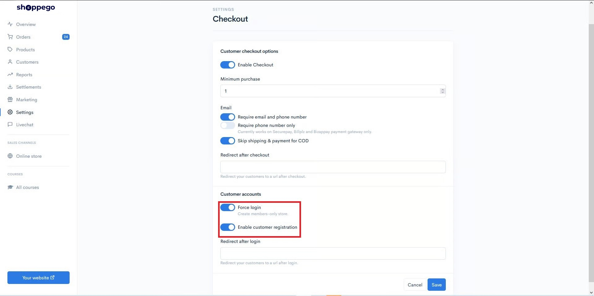

Pelanggan anda juga sudah **tidak perlu masukkan** sebarang maklumat seperti **Nama** atau **Password** **sewaktu proses log masuk atau pendaftaran** akaun nanti. Mereka **hanya perlu** **masukkan** maklumat **email** mereka sahaja dan sistem akan automatik **hantar 1-time password melalui email** mereka nanti.

Ini adalah paparan log masuk/daftar yang pelanggan akan dapat lihat nanti:

<figure>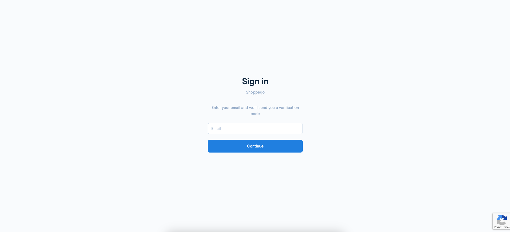<figcaption></figcaption></figure>

Ini adalah contoh email yang pelanggan akan dapat:

<figure>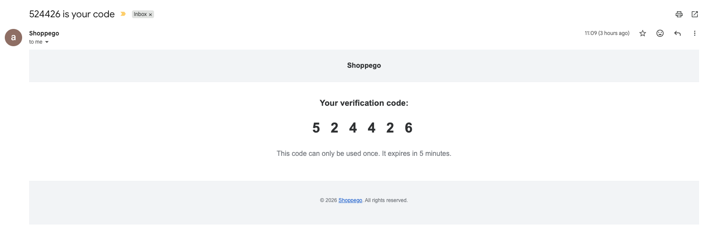<figcaption></figcaption></figure>
