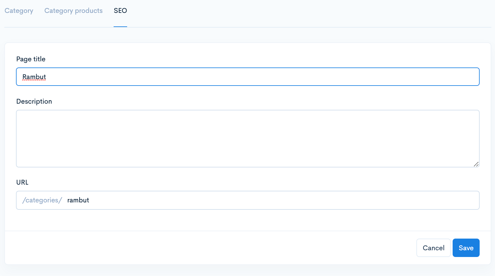

# Footer Menu

Untuk membuat tetapan pada menu terdapat 2 langkah iaitu:-&#x20;

1. Membina Page/Category&#x20;

* Rujuk tutorial bina page di link berikut: [**Pages**](../custom-pages/build-pages.md)


[Build Pages](../custom-pages/build-pages.md)


* Rujuk tutorial bina category di link berikut: [**Categories**](../../products/categories.md)


[Categories](../../products/categories.md)


2. Mencipta menu kepada page/category.&#x20;

Tutorial ini akan terus kepada langkah kedua. Sekiranya Page atau Categories masih lagi belum dicipta boleh ikuti tutorial seperti link di atas.&#x20;

## Bahagian 1 : Mencipta Footer Menu

1. Log masuk ke dashboard dan pergi kepada **Online Store -> Menus.**\
   Paparan seperti di bawah akan keluar.&#x20;

2. Klik pada butang **Add Menu.** Masukkan perkataan **Footer menu** pada ruangan **Title.**&#x20;


\*\*<mark style="color:red;">**Perhatian**</mark>: Pastikan **ejaan** dan huruf besar atau kecil adalah **sama**. seperti di dalam gambar di bawah.&#x20;


3. Klik butang **Save**

4. Seterusnya footer menu yang bari dicipta sebentar tadi akan terpapar. Klik pada tab **Menu items**

5. Paparan selepas klik tab **Menu items**

6. Seterusnya klik butang **Add menu item.** Pada ruang Title masukkan apa-apa nama yang melambangkan page anda.

Pada ruang link masukkan handle sahaja. Contoh adalah seperti dibawah.

* **Pages :   /pages/nama-page-anda**
* **Categories : /categories/nama-category-anda**


**\*\***<mark style="color:red;">**Perhatian**</mark>**:** Pastikan anda <mark style="color:red;">**tidak**</mark>**&#x20;meletakkan jarak** antara **/** dan **Nama page** anda. Perkara sama juga untuk **Categories**.


Sebagai contoh:

* **/pages/**<mark style="color:red;">**<->**</mark>**nama-page-anda** ❌
* **/pages/nama-page-anda** ✅

### 1 : Dapatkan Link bagi Pages

&#x20;Terdapat **dua cara** untuk dapatkan link mengikut interface builder anda:&#x20;

1. &#x20;**Pages**:  Pergi ke **Online store** -> **Pages**-> klik butang **Edit** pada **Nama page** dan copy **URL**.

2. **Pages**:  Pergi ke **Online store** -> **Pages**-> **Edit** -> **More** -> **Settings** -> **SEO** -> copy **URL**.

<figure><figcaption></figcaption></figure>

### 2 : Dapatkan Link bagi Categories

**Categories**: Pergi ke **Products** -> **Categories** -> klik **Edit** pada **categories** -> klik tab **SEO** copy **URL.**

Paste kan URL tu pada ruangan Link. Contoh adalah seperti gambar di bawah.&#x20;


\*\*<mark style="color:red;">**Perhatian**</mark>: Sila pastikan <mark style="color:red;">**ejaan**</mark> pada **Link menu items** yang anda telah salin dari **SEO Page** dan **SEO Categories** adalah <mark style="color:red;">**sama**</mark>.


Klik butang **Add**.

Kini anda boleh cuba lihat pada homepage akan terpapar satu **footer menu** yang baru diciptakan sebentar tadi iaitu menu **New Arrival**

