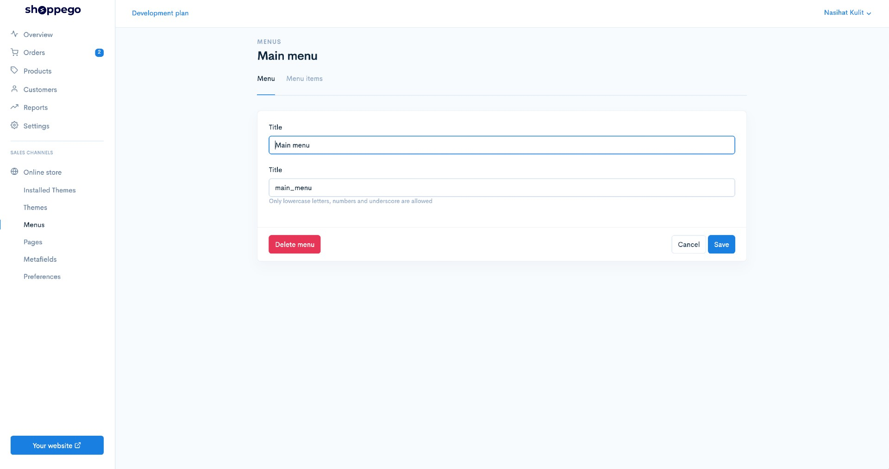
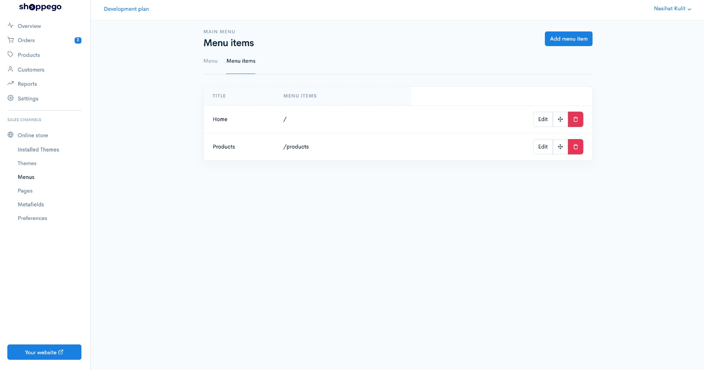
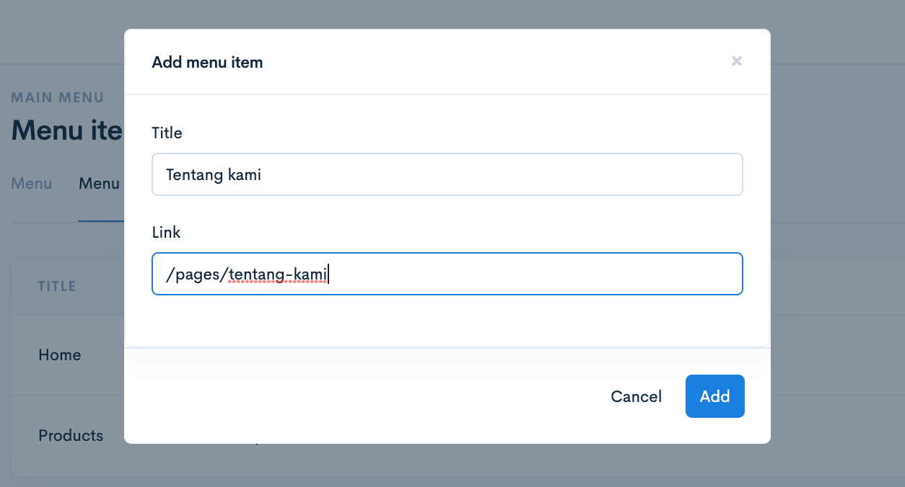
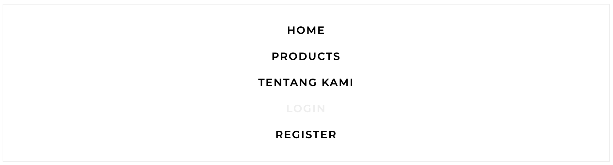
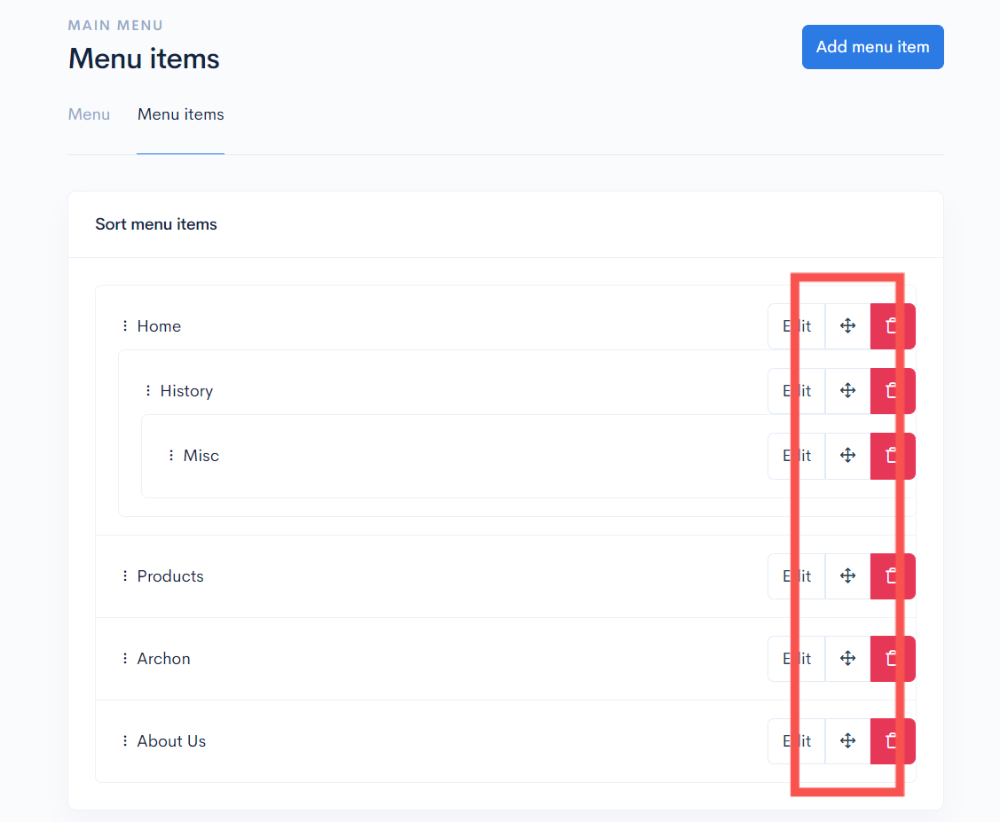
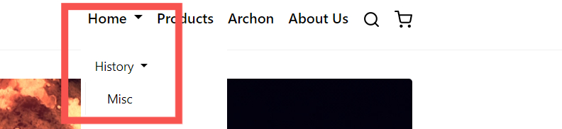
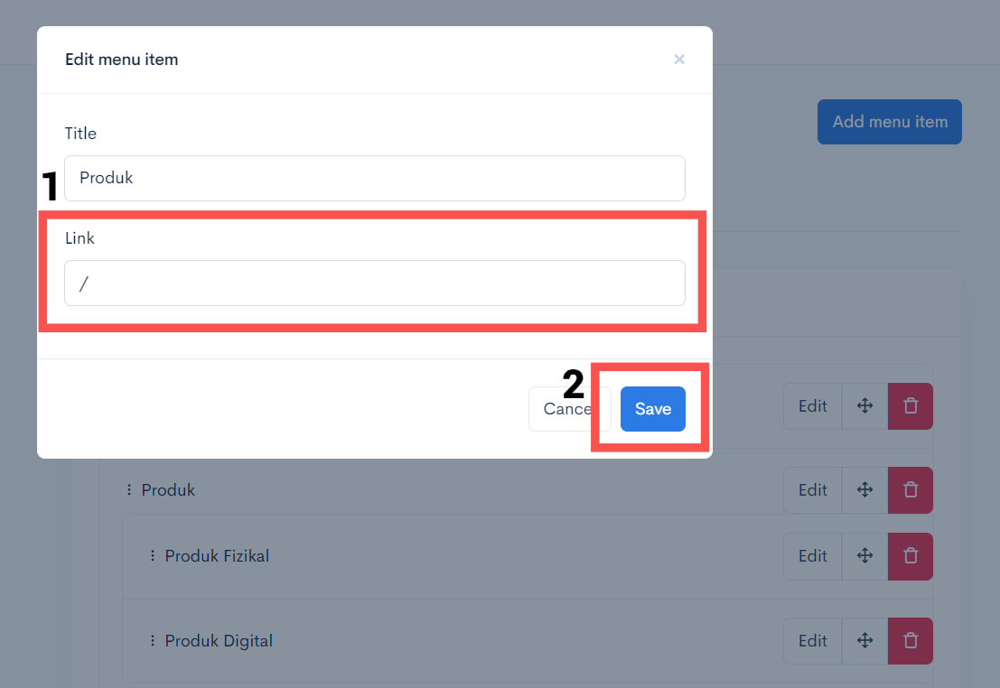
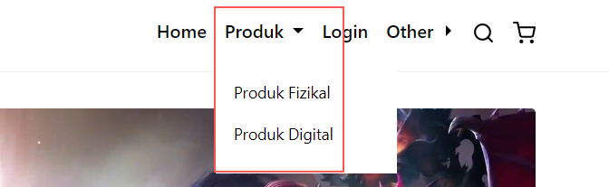

# Main Menu

Untuk membuat tetapan pada menu terdapat 2 langkah iaitu dengan menghubungkan Page / Category :

**Tutorial** bina page: [**Pages**](../custom-pages/build-pages.md)


[Build Pages](../custom-pages/build-pages.md)


**Tutorial** bina category: [**Categories**](../../products/categories.md)


[Categories](../../products/categories.md)


## **Bahagian 1 : Cipta Main Menu**

1. Log masuk ke dashboard dan pergi kepada **Online Store** -> **Menus**\
   Paparan seperti di bawah akan keluar.&#x20;

2. Klik pada perkataan **Main Menu.** Paparan seperti di bawah akan keluar. Perhatikan terdapat tab untuk **Menu** dan juga tab untuk **Menu Items.**


**\*\***<mark style="color:red;">**Perhatian**</mark>**: Pages** atau **Categories** hanya perlu dimasukkan kepada **Menu Items** dan bukan pada **Menu**.


## Bahagian 2 : Cipta Menu Items

Klik pada tab **Menu Items**. Pastikan paparan seperti di bawah ini akan keluar selepas klik pada **Menu Items.**


**\*\***<mark style="color:red;">**Perhatian**</mark>**: Pages** atau **Categories** hanya perlu dimasukkan kepada **Menu Items** dan bukan pada **Menu**.


4. Seterusnya klik pada butang **Add menu item.** Pada ruang **Title** masukkan apa-apa nama yang melambangkan page anda. \
   \
   Pada ruang link masukkan handle sahaja. Contoh adalah seperti dibawah:

* **Pages :   /pages/nama-page-anda**
* **Categories : /categories/nama-category-anda**


**\*\***<mark style="color:red;">**Perhatian**</mark>**:** Pastikan anda <mark style="color:red;">**tidak**</mark>**&#x20;meletakkan jarak** antara **/** dan **Nama page** anda. Perkara sama juga untuk Categories.


Sebagai contoh:

* **/pages/**<mark style="color:red;">**<->**</mark>**nama-page-anda** ❌
* **/pages/nama-page-anda** ✅

### 1 : Dapatkan Link bagi Pages

&#x20;Terdapat **dua cara** untuk dapatkan link mengikut interface builder anda:&#x20;

1. &#x20;**Pages**:  Pergi ke **Online store** -> **Pages**-> klik butang **Edit** pada **Nama page** dan copy **URL**.

2. **Pages**:  Pergi ke **Online store** -> **Pages**-> **Edit** -> **More** -> **Settings** -> **SEO** -> copy **URL**.

<figure><figcaption></figcaption></figure>

### 2 : Dapatkan Link bagi Categories

**Categories**: Pergi ke **Products** -> **Categories** -> klik **Edit** pada **categories** -> klik tab **SEO** copy **URL.**

5. Paste kan **URL** tu pada ruangan **Link.** Contoh adalah seperti gambar di bawah.&#x20;


\*\*<mark style="color:red;">**Perhatian**</mark>: Sila pastikan <mark style="color:red;">**ejaan**</mark> pada **Link menu items** yang anda telah salin dari **SEO Page** dan **SEO Categories** adalah <mark style="color:red;">**sama**</mark>.


6. Klik butang **Add**\
   \
   Kini anda boleh cuba lihat pada main menu akan terpapar satu menu yang baru diciptakan sebentar tadi iaitu menu **Tentang Kami**

## **Bahagian 3 : Dropdown Menu**&#x20;

### 1 : Dropdown Menu

Anda juga boleh lakukan fungsi Drag and Drop pada menu items anda. Anda hanya perlu ajukan pointer mouse ke ikon anak panah tersebut dan klik untuk **DRAG and DROP**.

<figure><figcaption></figcaption></figure>

Kemudian, anda akan dapat lihat paparan pada menu di laman web anda telah berubah.

<figure><figcaption></figcaption></figure>

### 2 : Pautan Tajuk Dropdown

Sekiranya anda mahu membuat Tajuk bagi Menu <mark style="color:red;">**tanpa link**</mark>**&#x20;yang spesifik**, anda **hanya perlu letakkan /** pada **ruangan Link (1)**. Selepas itu, anda boleh tekan butang **Save (2).**

<figure><figcaption></figcaption></figure>

Paparan bagi menu anda akan seperti dibawah :&#x20;

<figure><figcaption></figcaption></figure>


Tier dropdown hanya boleh dicipta sehingga **3 Tier sahaja**.

