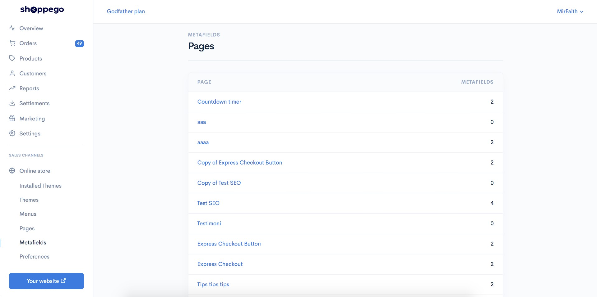
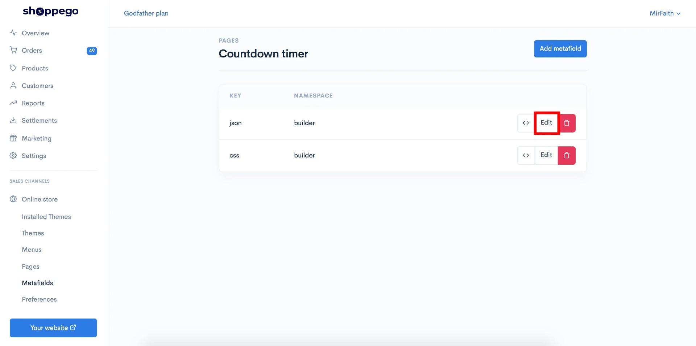
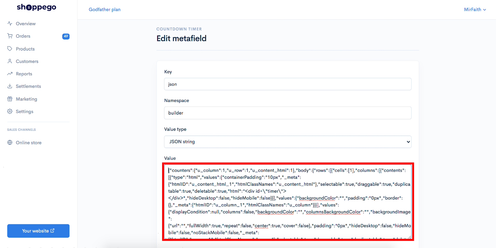

# Page Metafield


Features page metafield ini membolehkan anda **salin template landing page** anda dan **letakkan pada page yang lain.**


Untuk menggunakan features ini, anda boleh rujuk link ini :

## Dapatkan Json landing page anda.

1\. Log in ke akaun Shoppego anda.

2\. Klik pada **Online store**

3\. Klik pada **Metafields**

4\. Klik pada **Pages**

5\. Klik pada **page yang anda ingin copy template page tersebut**.

6\. Klik **Edit pada tab json**

7\. Anda boleh **copy kesuluruhan text dibahagian tab Value**


**Jika anda ingin import sales page ini kedalam akaun lain, anda boleh&#x20;**<mark style="color:red;">**Save text**</mark>**&#x20;yang anda&#x20;**<mark style="color:red;">**telah copy didalam tab Value**</mark>**&#x20;itu&#x20;**<mark style="color:red;">**kedalam komputer anda yang tersendiri**</mark> <mark style="color:red;">**sebagai fail .json**</mark>**.**


## Cipta page baru

Setelah anda copy json tersebut, anda boleh cipta 1 new page untuk kegunaan metafield tersebut

1\.  Pergi semula ke Dashboard Shoppego anda.

2\. Klik pada **Online store**

3\. Klik pada **Pages**

4\. Klik pada **Add page**

5\. Seterusnya anda boleh isikan **maklumat title**(Mengikut kemahuan anda) untuk page tersebut dan klik **Save**

6\. Setelah selesai, anda boleh **klik semula pada page tersebut**.

7\. Klik pada **Edit with builder**

8\. Di Page builder tersebut, anda boleh **masukkan mana - mana element**. Sebagai contoh anda boleh drag element button dan masukkan kedalam ruangan Page builder tersebut.

## Masukkan data json kedalam page yang anda baru cipta

Setelah selesai cipta page tersebut menggunakan page builder, anda boleh masukkan data json tersebut kedalam page yang anda baru cipta.

1\. Anda boleh pergi semula ke Dashboard Shoppego anda.

2\. Klik pada **Online store**

3\. Klik pada **Metafields**

4\. Klik pada **Pages**

5\. Klik pada **page yang anda baru cipta sebentar tadi**

6\. Klik **Edit** pada tab json.

7\. Seterusnya, anda boleh **pastekan code json yang anda baru copy** pada langkah sebelum ini dan **pastekan pada ruangan Value**.

8\. Setelah selesai anda boleh klik **Save**.

**Jika tiada sebarang perubahan pada halaman tersebut, anda boleh lakukan sedikit perubahan pada page builder halaman ini.**
