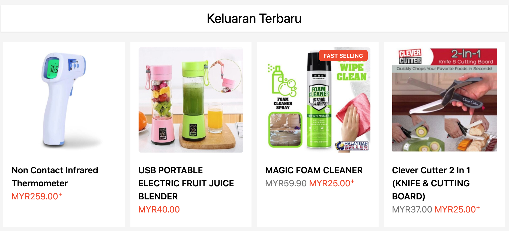
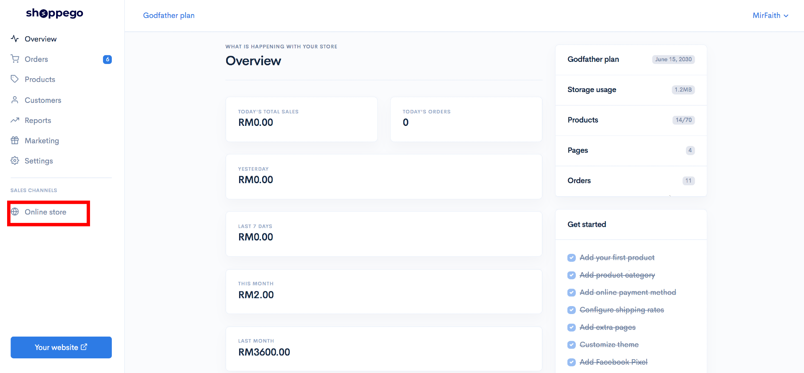
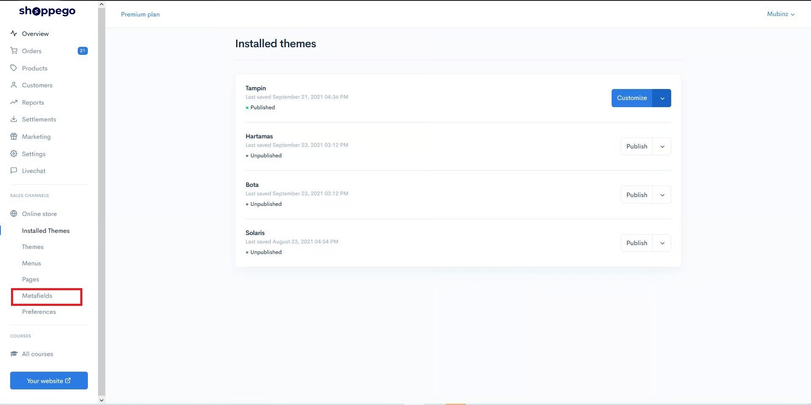
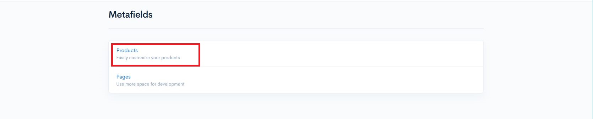
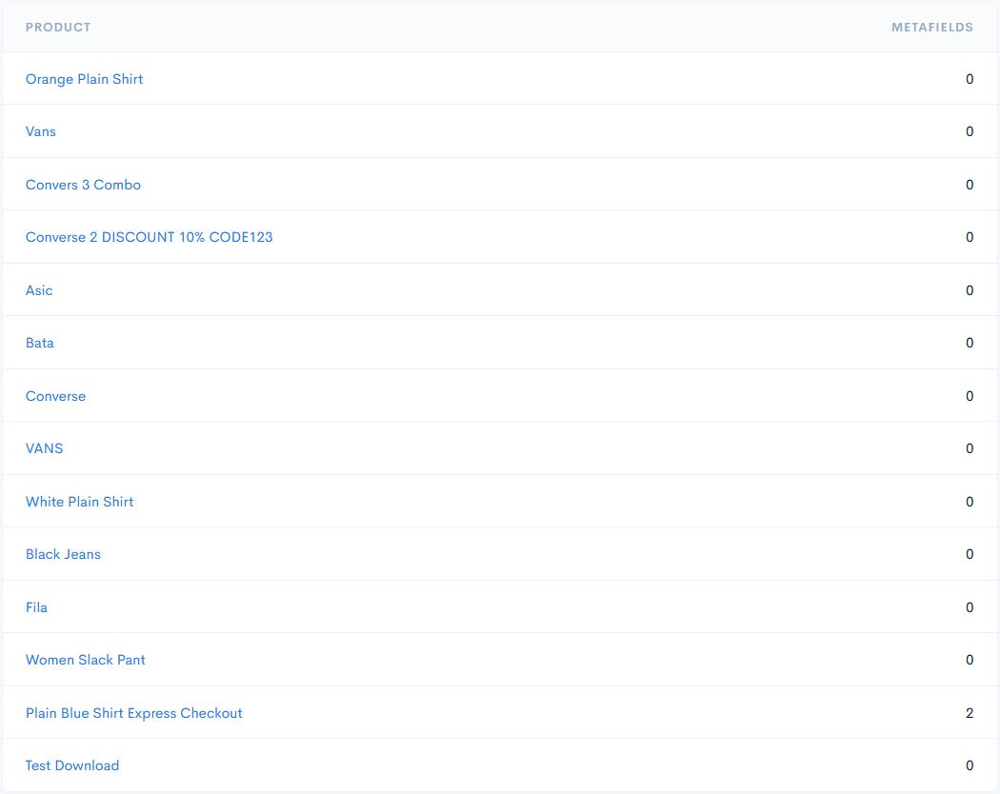
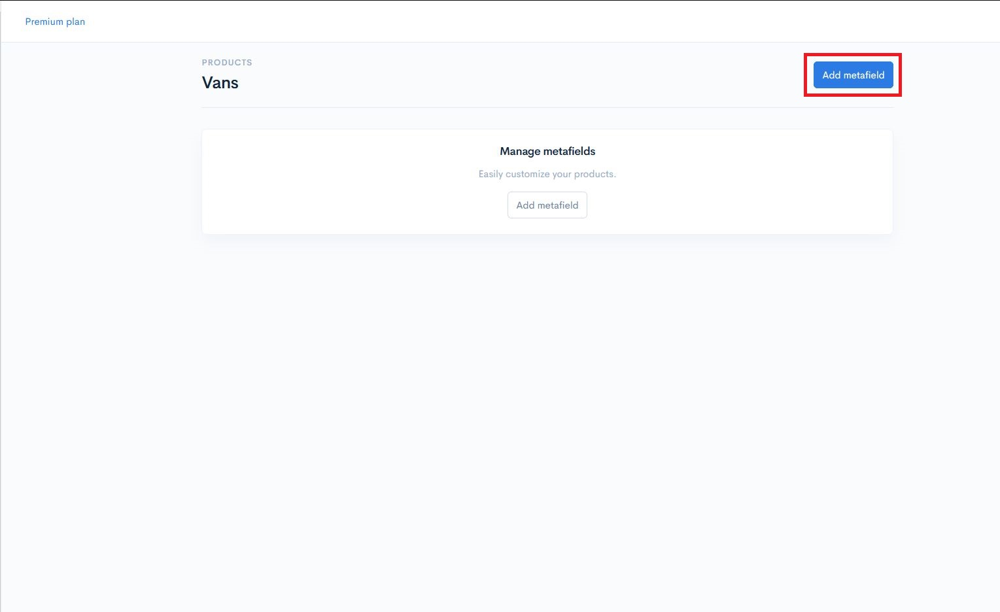
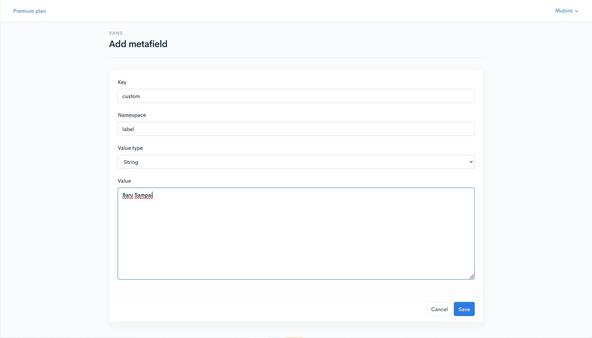
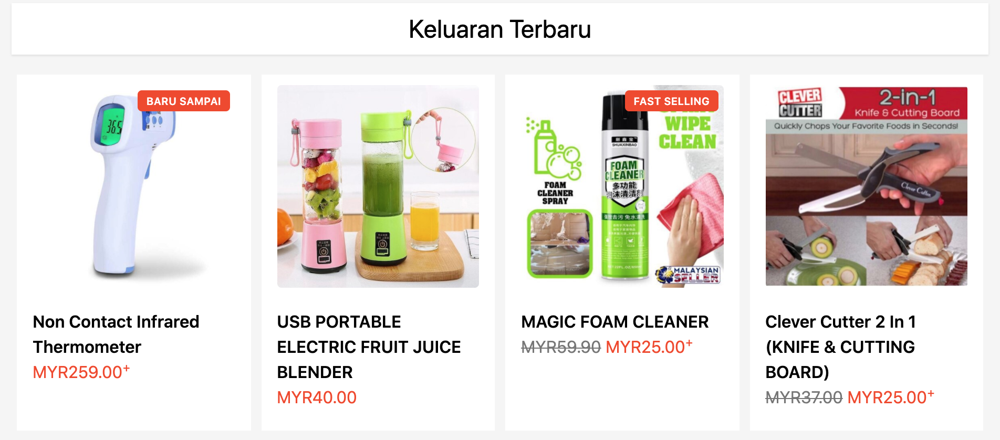
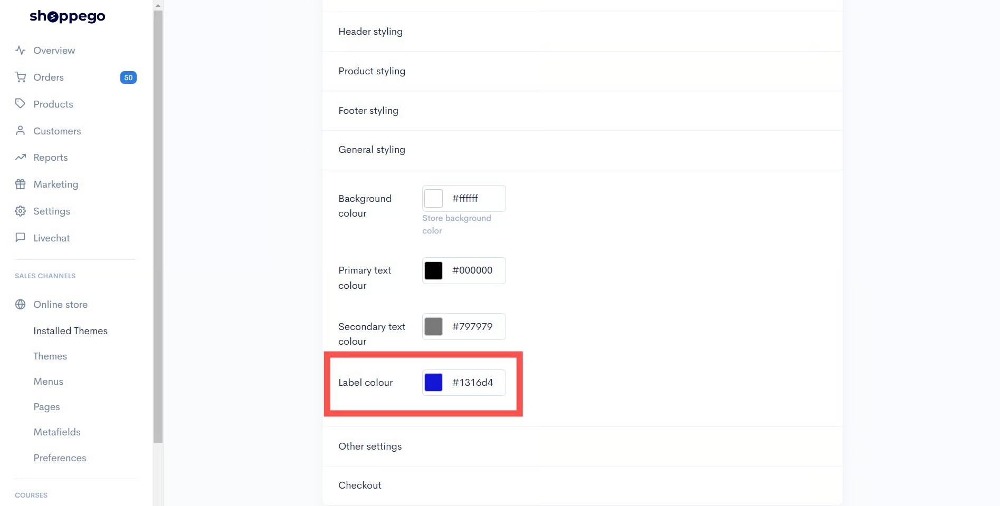
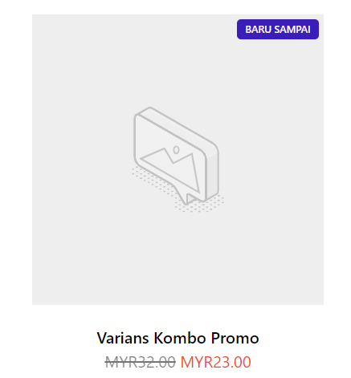

# Product Metafield

Metafield adalah **secebis code** yang mudah untuk menampilkan data yang boleh digunakan pada products dan juga pages. \
\
Perbincangan untuk Metafields adalah panjang, untuk tutorial ini adalah lebih kepada **built in Metafield** yang telah ditanamkan pada :&#x20;

* Theme **Solaris**&#x20;
* Theme **Hartamas**.&#x20;
* Theme **Tampin**.

Lihat contoh untuk built in **Metafield** untuk **custom label.**

Lihat label **"Fast Selling"** berwarna oren tersebut merepakan built in custom label yang boleh digunakan pada kedai online masing-masing.&#x20;

## Penetapan Product Metafield

1. Log masuk ke dashboard Shoppego dan klik pada **Online store.**

2. Kemudian klik pada **Metafields**.

3. Kemudian klik pada **products.**

4. Pilih nama produk yang anda ingin paparkan custom label dan klik pada nama produk tersebut.&#x20;

5. Seterusnya klik butang **Add Metafield**&#x20;

## Tambah Metafield

6. Isikan maklumat pada ruangan Key dan Namespace sama seperti gambar di bawah, iaitu :&#x20;
   * **Key :** custom
   * **Namespace** : label
   * **Value Type** : String
   * **Value** : **Baru Sampai** atau mengikut kreativiti anda.
7. Seterusnya klik butang **Save.**

Kembali pada store front anda dan lihat hasilnya pada homepage, sebuah label **Baru Sampai** akan terpapar pada produk yang anda telah tetapkan.&#x20;

**Custom label** ini boleh digunakan untuk semua produk.&#x20;

## Maklumat Tambahan

* Hanya **satu label sahaja** boleh diletakkan pada **satu produk**.

## Perubahan Warna Label Produk Metafield

Untuk **ubah warna label produk bagi&#x20;**<mark style="color:blue;">**Themes**</mark>, boleh pergi :&#x20;

<mark style="color:blue;">**Solaris**</mark>**:** Dashboard Overview -> Online Stores -> Installed Themes -> Customize -> **Homepage Settings ->Custom Label Color.**

<mark style="color:blue;">**Hartamas**</mark>**&#x20;:** Dashboard Overview -> Online Stores -> Installed Themes -> Customize -> **General Styling -> Label Color.**

<mark style="color:blue;">**Tampin**</mark>**&#x20;:** Dashboard Overview -> Online Stores -> Installed Themes -> Customize -> **Homepage Settings ->Custom Label Color.**


\*\*<mark style="color:red;">**Perhatian**</mark> : Jika perubahan tidak berlaku, anda boleh cuba dengan **clear-kan cache browser** anda dan **restart browser** anda.


<figure><figcaption></figcaption></figure>

Hasilnya adalah seperti dibawah :

<figure><figcaption></figcaption></figure>
