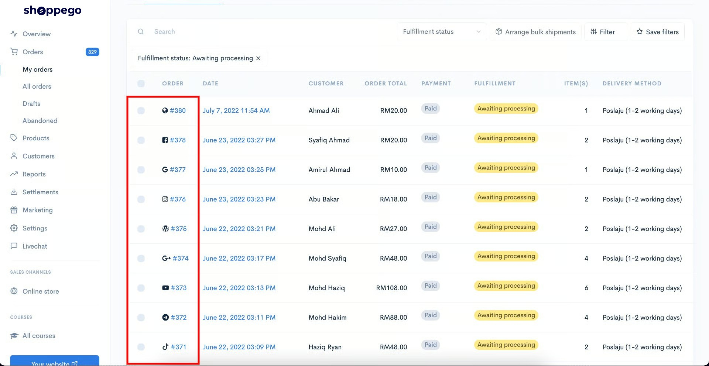
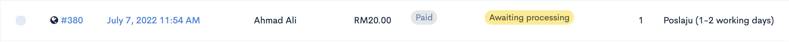
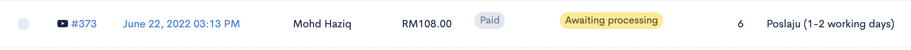
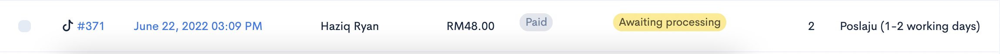
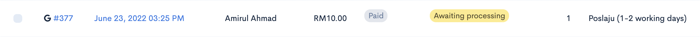
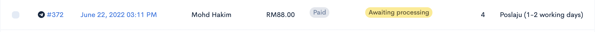
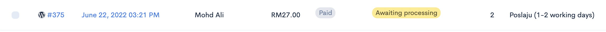

# Orders

Dalam halaman ini anda boleh lakukan pengurusan pesanan daripada pelanggan, dapatkan report jualan dalam bentuk csv dan juga lihat maklumat order pelanggan.

1\. Untuk akses ke halaman ini, anda hanya perlu log masuk kedalam akaun Shoppego anda.

2\. Kemudian, anda boleh klik pada **butang/teks Orders**

## Info Tambahan

Setiap order yang masuk kedalam dashboard pengurusan order Shoppego, anda akan dapat lihat ianya datang daripada mana. Sebagai contoh paparan dibawah menunjukkan order yang datang dari pelbagai platform.

Disini kami sertakan penerangan ringkas bagi setiap logo tersebut:

1\. **Logo Globe** - Order yang mempunyai logo ini selalunya datang dari organik trafik. Ianya bermaksud pelanggan tersebut terus masuk kedalam website anda tanpa melalui mana-mana kempen iklan anda atau platform social media yang lain.

2\. **Logo Youtube** - Order yang mempunyai logo ini datang dari platform Youtube.

3\. **Logo TikTok** - Order yang mempunyai logo ini datang dari platform TikTok.

4\. **Logo Google** - Order yang mempunyai logo ini datang dari carian di platform Google.

5\. **Logo Google Plus** - Order yang mempunyai logo ini datang dari kempen iklan Google Ads anda.

6\. **Logo Telegram** - Order yang mempunyai logo ini datang dari Channel/Group/Personal message Telegram.

7\. **Logo Wordpress** - Order yang mempunyai logo ini datang dari halaman Wordpress.

Untuk pengguna Shoppego yang ingin lakukan manual tracing bagi pembelian yang masuk kedalam website tersendiri, anda boleh lakukan penambahan UTM source pada URL/link website/express checkout anda itu.

Sebagai contoh seperti ini. Disini kami ingin trace kepada platform TikTok supaya di dashboard nanti kami tahu bahawa order itu datang dari platform TikTok dan ikon yang akan dapat dilihat juga akan paparkan logo TikTok:\
**<http://hartamas.myshoppegram.com/cart/2648:1>**<mark style="color:red;">**?utm\_source=tiktok**</mark>

Anda juga boleh trace kepada platform lain yang dibenarkan seperti:

| Platform        | Link UTM Source                              |
| --------------- | -------------------------------------------- |
| **Youtube**     | **?utm\_source=youtube**                     |
| **TikTok**      | **?utm\_source=tiktok**                      |
| **Google**      | **?utm\_source=google**                      |
| **Google Plus** | **?utm\_source=googleads.g.doubleclick.net** |
| **Telegram**    | **?utm\_source=telegram**                    |
| **Whatsapp**    | **?utm\_source=whatsapp**                    |
| **Wordpress**   | **?utm\_source=wordpress**                   |

### Soalan Lazim

1. Sekiranya saya lakukan Cancel order di dashboard Shoppego, adakah Shoppego akan automatik refund pembayaran order tersebut kepada pelanggan itu?\
   Jawapan: Tidak. Proses refund itu anda perlu lakukan secara manual atau melalui dashboard akaun Payment gateway yang anda gunakan itu sendiri(jika ada).
2. Berapa lama baru order itu dikira sebagai order abandoned?\
   Jawapan: Untuk sesebuah order itu dikira sebagai order abandoned, ia akan ambil masa dalam 60 minit dan ia akan dikira sebagai order abandoned jika pelanggan itu juga tidak ada lakukan sebarang pembelian lain didalam website anda itu dalam tempoh tersebut.
3. Boleh ke saya dapatkan data jualan website saya?\
   Jawapan: Ya boleh. Anda akan dapat lihat butang export pada halaman dashboard Orders itu nanti.
4. Boleh ke saya dapatkan data jualan website saya mengikut tarikh-tarikh tertentu?\
   Jawapan: Boleh sahaja.  Anda boleh lakukan penetapan ini:\
   Dari Dashboard Shoppego(Overview) -> Klik pada Orders -> Klik pada tab All -> Kemudian, klik Filter -> Dari situ, anda boleh ubah mengikut tarikh yang anda inginkan -> Setelah, anda tetapkan klik Apply filter -> Kemudian, klik pada butang Export -> Klik pada toggle All orders -> Klik Export to files. Nanti, anda akan terima email dari sistem Shoppego dan email itu akan disertakan sekali dengan fail CSV order anda itu.
