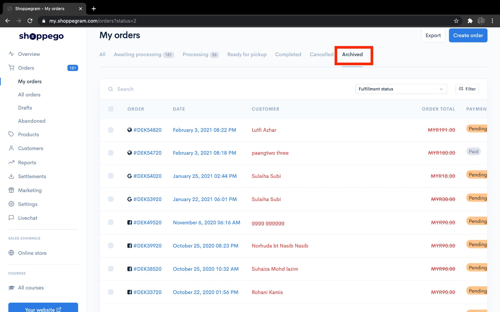
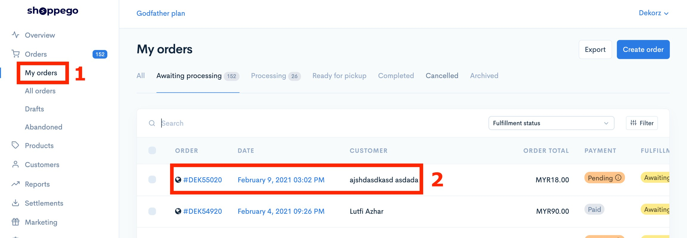
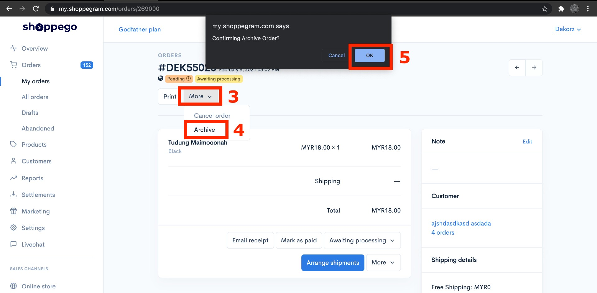
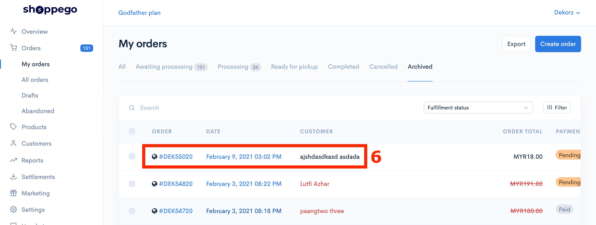

# Archived Orders

## Apa itu Archived Orders?

1. **Pesanan yang diarkibkan atau Archive Orders** adalah pesanan yang telah diselesaikan dan ditutup oleh penjual tanpa perlu memadam orders tersebut.&#x20;
2. Tujuan Archived Orders ini adalah untuk mengarkibkan order yang diterima seperti order dengan maklumat yang salah dari terpapar pada paparan bahagian **All**.&#x20;
3. Mengarkibkan pesanan dalam laman web atau aplikasi membeli-belah dalam talian berbeza daripada hanya memadam pesanan tersebut.&#x20;
4. Mengarkibkan pesanan anda tidak akan memadam pesanan anda secara kekal, tetapi **hanya membuang pesanan anda dari paparan pesanan (All Orders)** dan akan muncul hanya apabila anda mencarinya atau melihat pesanan yang diarkibkan.

## Cara membuat Archived Order dalam Commerce

1\. Dashboard Commerce --> **My Orders** --> **Pilih Order yang ingin di Archivedkan**

&#x20; 2\. Tekan **More** --> **Archive** --> **OK**

**Selesai. Order telah berjaya dimasukkan kedalam Archived dan tidak lagi terpapar pada bahagian All didalam My orders.**

*Produk yang telah anda masukkan kedalam Archived adalah **tidak boleh** untuk di "**unarchive**"kan semula.*&#x20;
