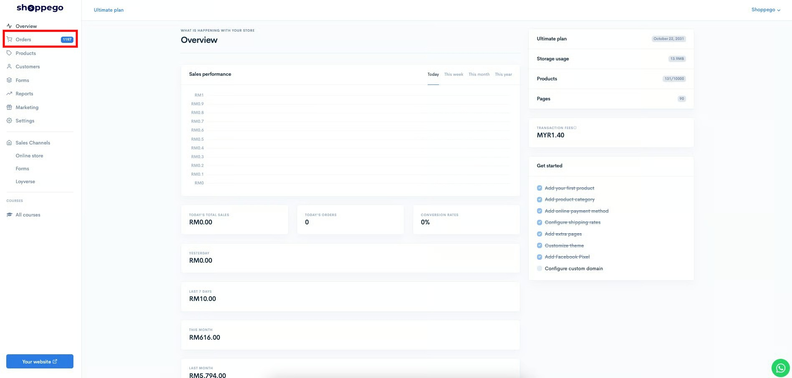
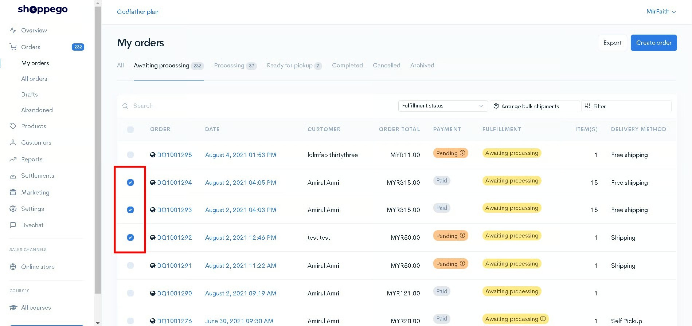
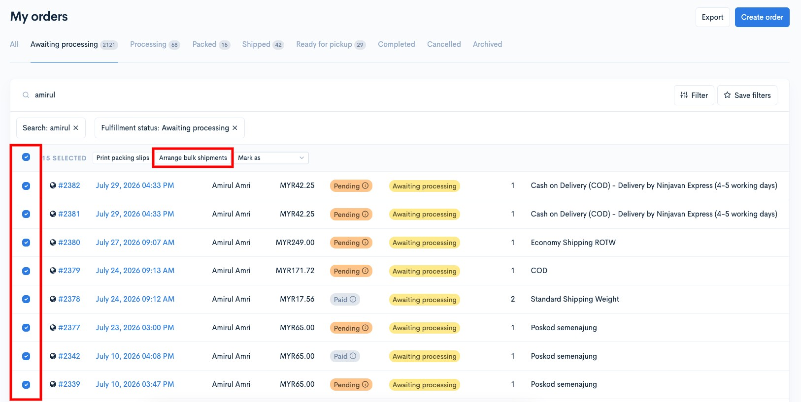
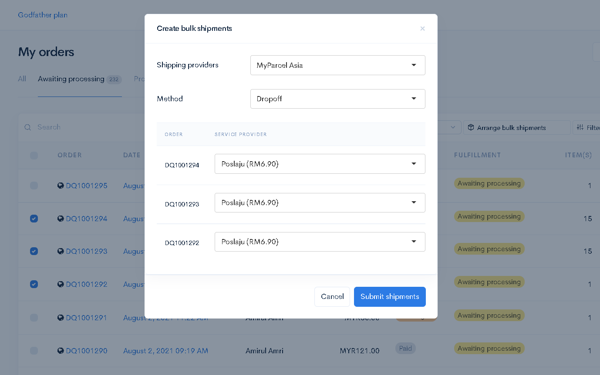
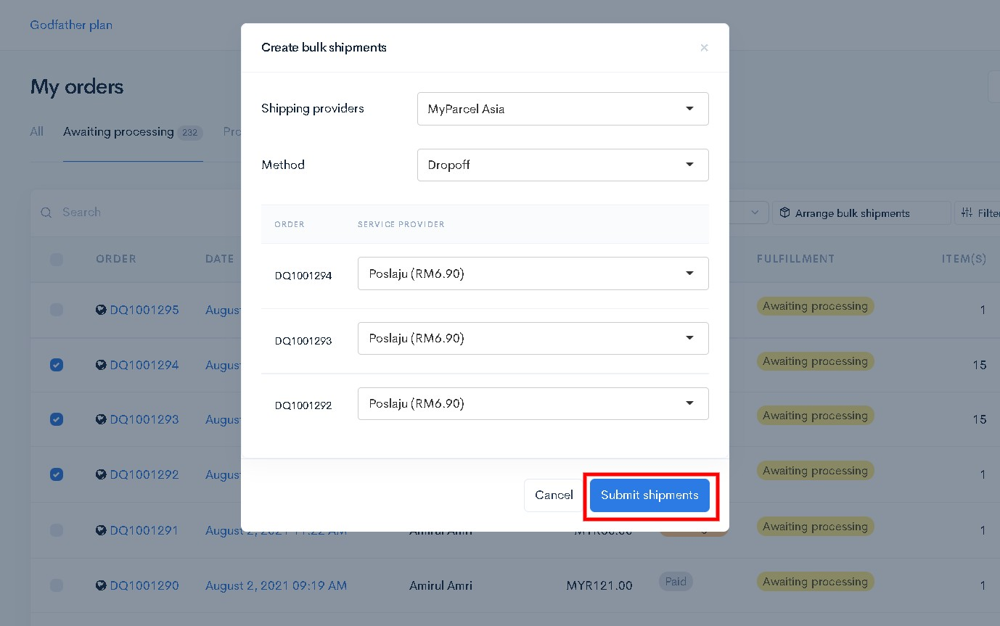
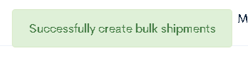
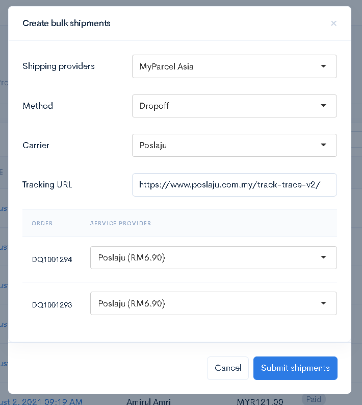

# Bulk Arrange Shipment

Didalam Shoppego anda boleh proses order anda untuk penghantaran secara bulk. Anda **boleh gunakan fungsi ini hanya dengan penggunaan shipping provider seperti DHL Ecommerce**, **Myparcel Asia, Sendparcel dan** **Easyparcel** **sahaja** buat masa sekarang.

**\*\*Features ini hanya terdapat pada plan Ultimate sahaja**


**Perlu diingatkan bahawa anda hanya boleh lakukan bulk shipment ini kurang dari 8 order sahaja dalam 1 masa.**


## **Cara penggunaan**

1\. Log in kedalam Dashboard Shopego anda

2\. Klik pada **Orders**

3\. Didalam page Orders tersebut, anda boleh **tick terlebih dahulu orders yang anda ingin proses secara bulk** untuk penghantaran mereka

4\. Setelah anda tick order tersebut, anda boleh klik pada **Arrange bulk shipments**

5\. Seterusnya akan keluar 1 popup untuk anda pilih shipping provider yang anda ingin gunakan.

6\. Setelah anda setkan penetapan shipping tersebut mengikut apa yang anda inginkan. Anda boleh klik **Submit shipments**

7\. Setelah proses anda berjaya anda akan dapat **pop up success dibawah paparan skrin** anda bewarna hijau.

Setelah anda mendapat pop up tersebut, anda boleh semak akaun shipping provider anda untuk print AWB untuk order tersebut bagi proses pembungkusan dan sebagainya.

## Info Tambahan

* Sekiranya anda aktifkan fungsi **Automatically add tracking** pada penetapan shipping provider anda, paparan pop up bulk shipment anda akan jadi seperti ini.

Pada bahagian Carrier dan Tracking URL ia akan auto generate berdasarkan penetapan [Shipping carriers](../settings/shipping-carriers.md) anda.

* Untuk penggunaan Shipping provider Easyparcel pastikan kredit anda didalam akaun Easyparcel mencukupi untuk menjalankan Bulk shipment tersebut.\
  \
  Sekiranya tidak mencukupi, order anda yang cukup untuk menjalankan proses Bulk shipment tersebut akan tetap diproses manakala untuk order yang tidak dapat diproses akan dimasukkan kedalam Unpaid order didalam akaun Easyparcel anda.
