# Drafts

Didalam Commerce anda boleh masukkan order secara manual kedalam dashboard anda, jika ada pelanggan yang membuat pembelian tidak melalui website anda.

Untuk memudahkan proses draft order ini, anda juga boleh [cipta akaun untuk pelanggan anda](../customers.md) terlebih dahulu. Anda boleh [klik pada link ini untuk penetapan akaun pelanggan anda.](../customers.md)

1\. Log in kedalam dashboard Commerce anda

2\. Klik **Orders**

3\. Klik **Drafts**

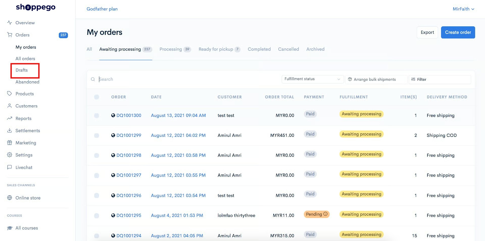

4\. Klik **Create order**

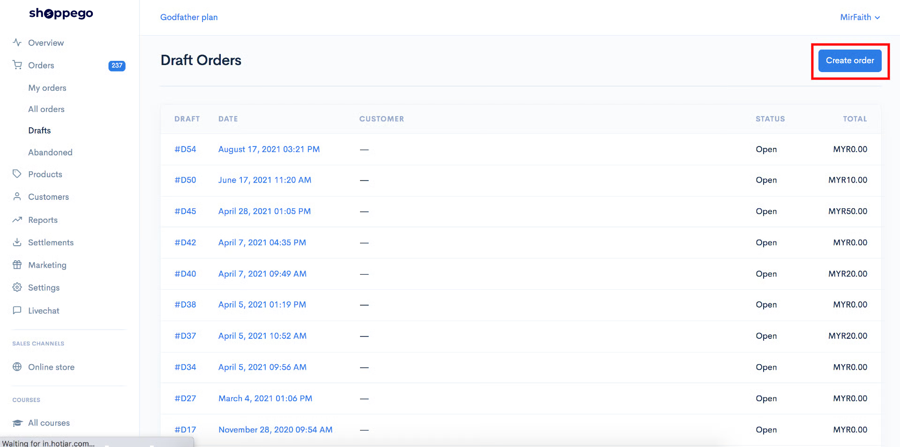

5\. Pilih tarikh anda ingin order tersebut dicipta.

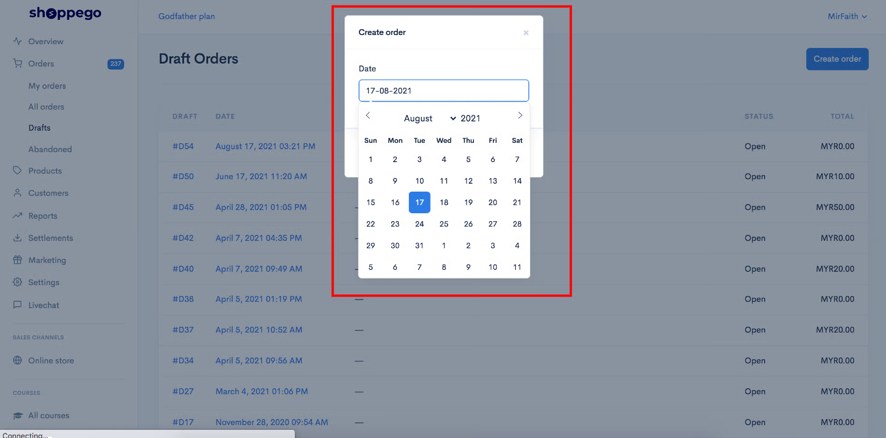

6\. Setelah anda selesai pilih tarikh, anda boleh klik **Save**

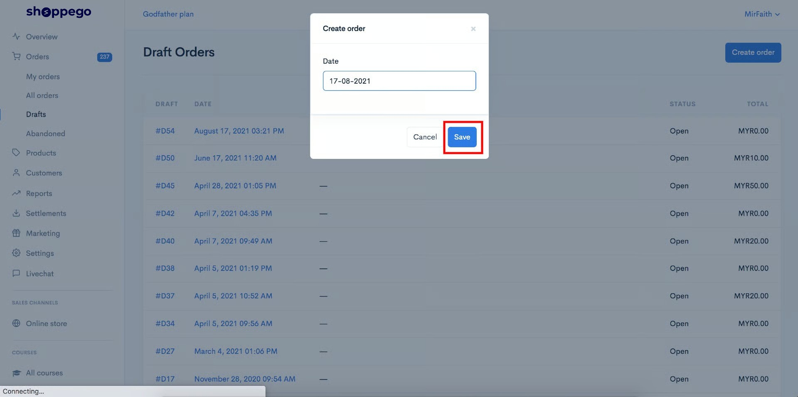

7\. Anda boleh pilih produk sedia ada didalam webiste anda melalui **tab Find products...**

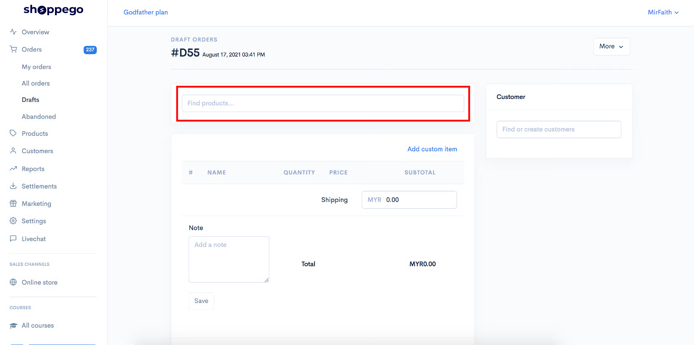

Jika produk ini tiada didalam website anda, anda boleh sahaja masukkan produk khas untuk order ini sahaja melalui **butang/teks Add custom item**

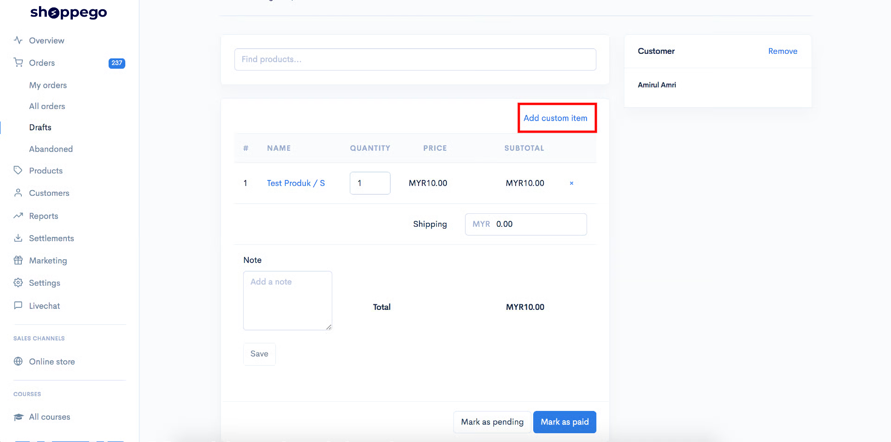

Setelah anda klik butang/teks tersebut anda akan nampak pop up seperti dibawah untuk anda isi maklumat produk anda.

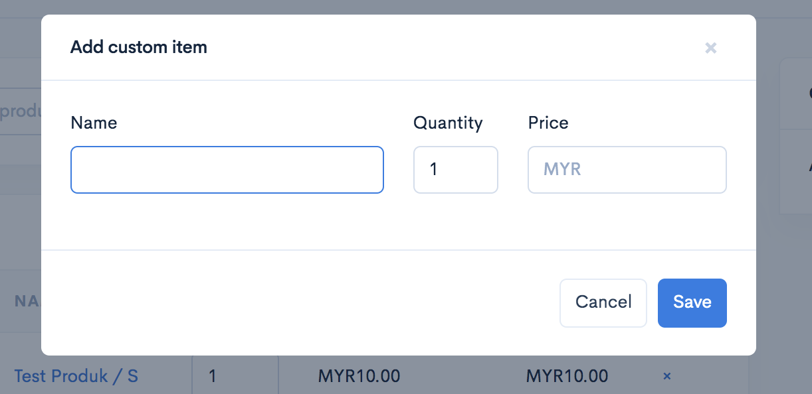

<table><thead><tr><th width="122">Tajuk</th><th>Penerangan</th></tr></thead><tbody><tr><td><strong>Name</strong></td><td>Masukkan nama produk khas anda ini. Pastikan tidak melebihi 50 huruf.</td></tr><tr><td><strong>Quantity</strong></td><td>Anda boleh masukkan jumlah produk yang dibeli oleh pelanggan tersebut</td></tr><tr><td><strong>Price</strong></td><td>Anda boleh masukkan nilai harga untuk produk tersebut</td></tr></tbody></table>

8\. Anda boleh pilih pelanggan sedia ada melalui tab **Find or create customers**

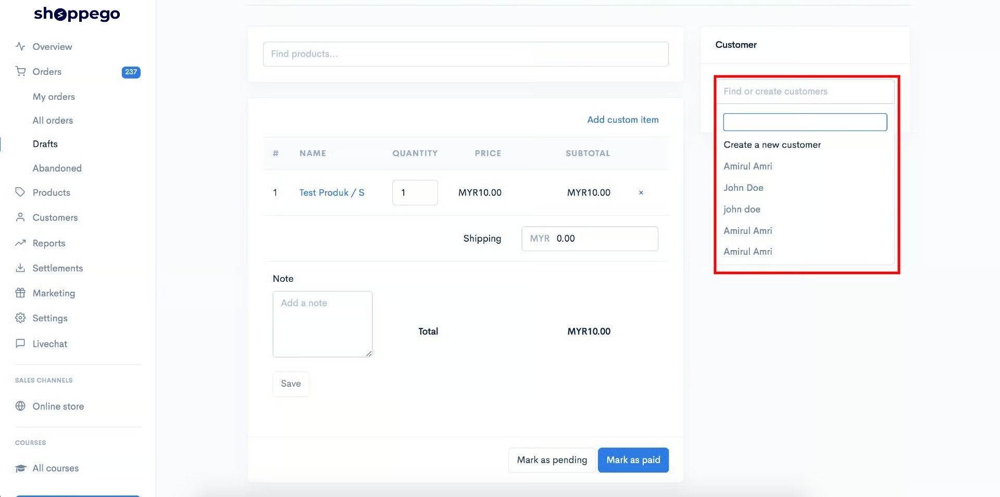

Sekiranya anda masih belum cipta akaun untuk pelanggan anda, pada dropdown tersebut anda boleh klik **Create a new customer** untuk cipta pelanggan anda.

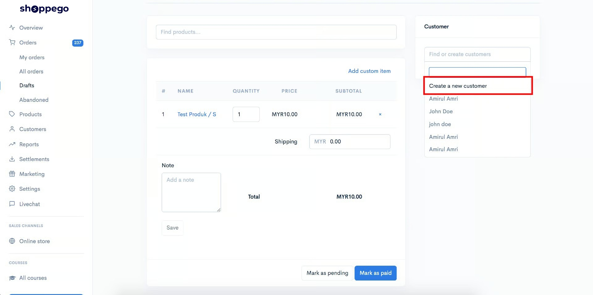

9\. Anda boleh masukkan nilai shipping untuk order ini jika ada pada **ruangan Shipping**

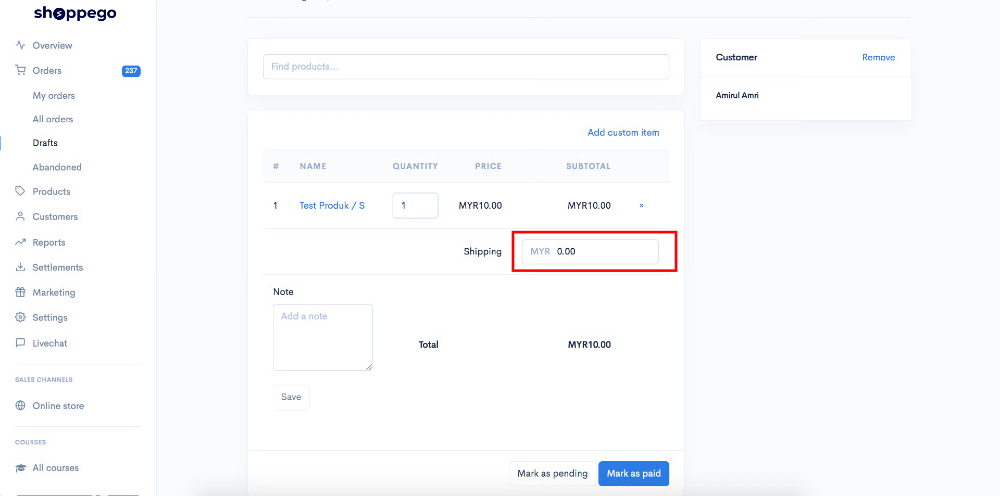

10\. Jika anda ingin masukkan nota untuk order ini sebagai rujukan anda. Anda boleh sahaja masukkan nota anda didalam ruangan Add a note. Setelah selesai pastikan anda klik **Save**

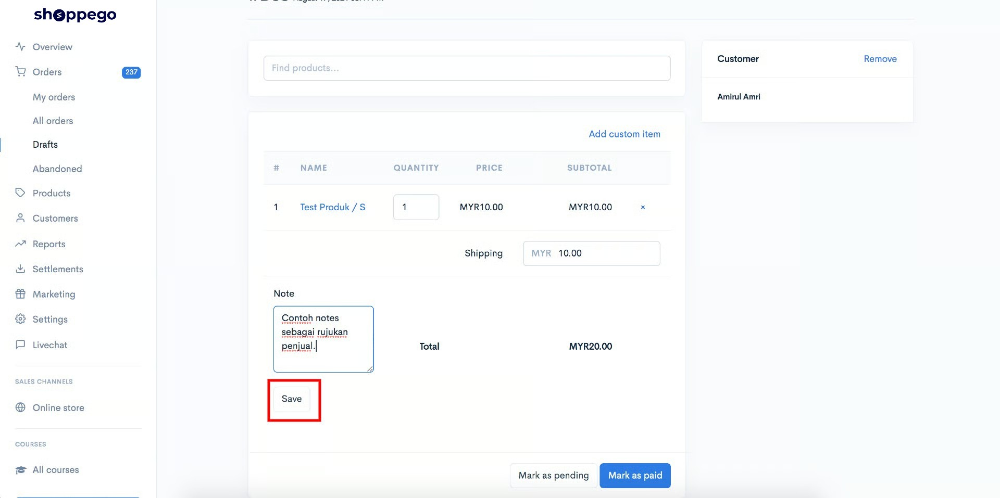

11\. Setelah selesai kesemua penetapan, anda boleh klik **Mark as pending sekiranya pelanggan tersebut masih belum bayar untuk order ini** atau anda boleh klik **Mark as paid sekiranya pelannga tersebut sudah bayar untuk produk ini**

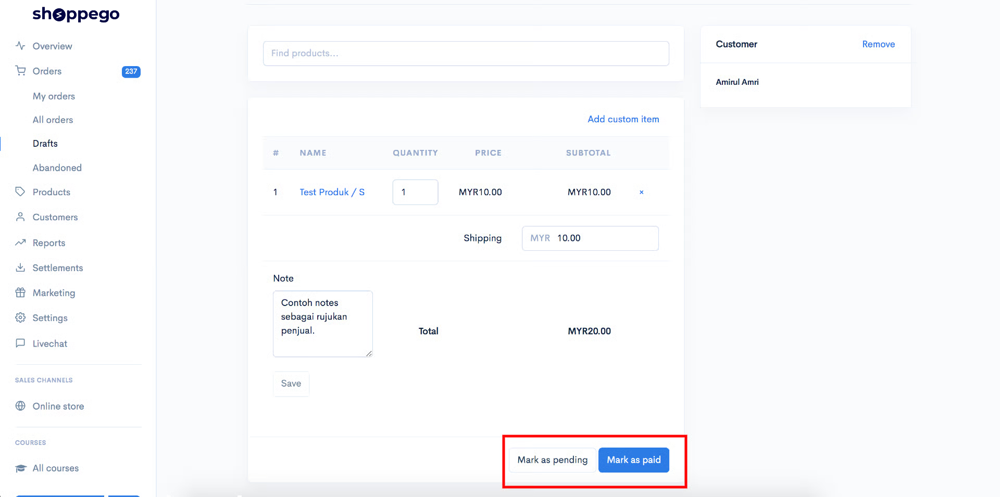

Setelah selesai, anda akan dapat lihat draft order anda.

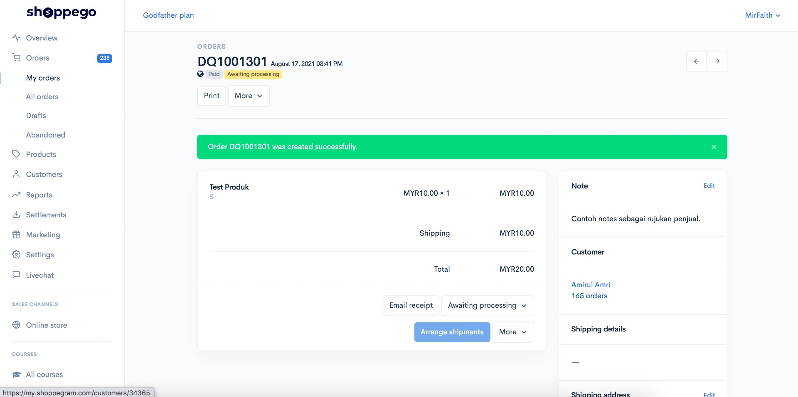

Sekiranya anda ingin proses shipping untuk order ini, anda perlu klik **Edit** pada bahagian Shipping address dan masukkan maklumat penghantaran pelanggan anda untuk order ini.

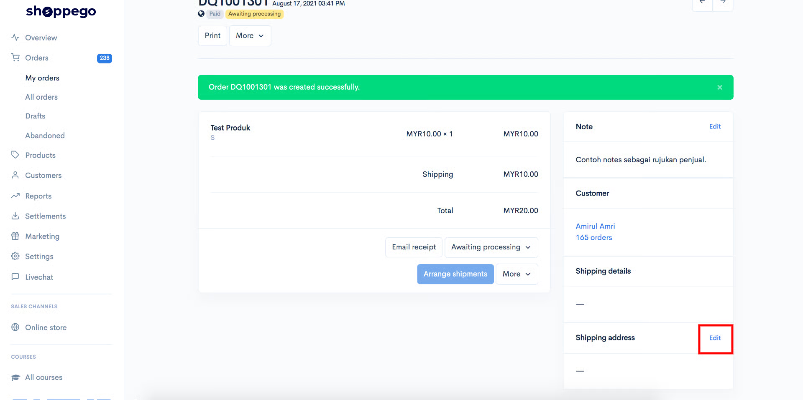
