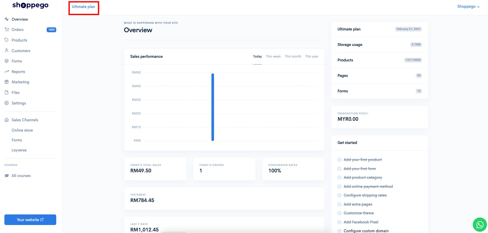
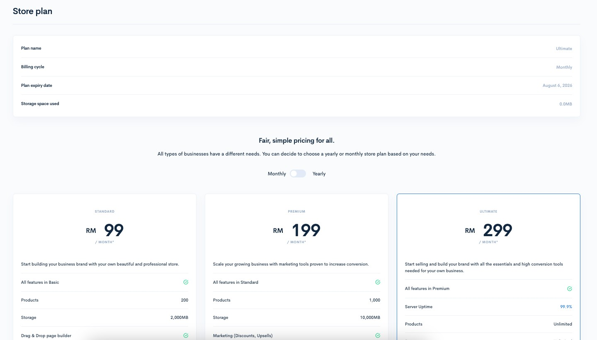
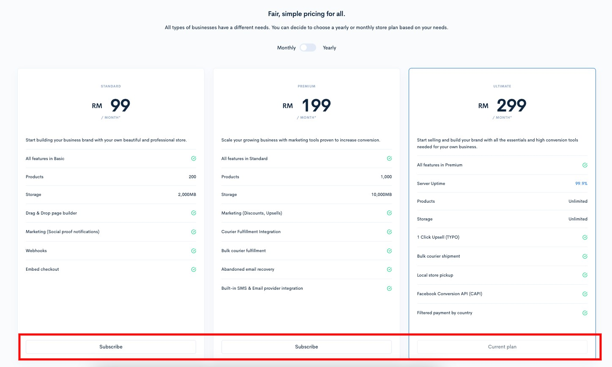
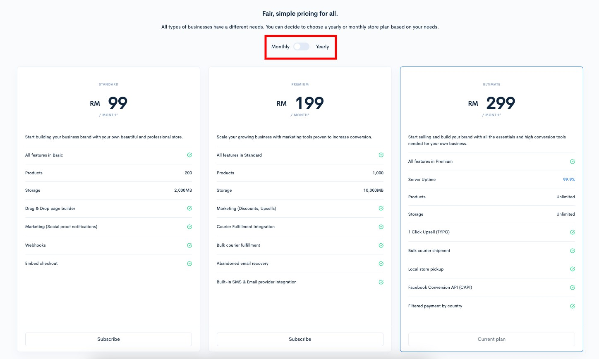
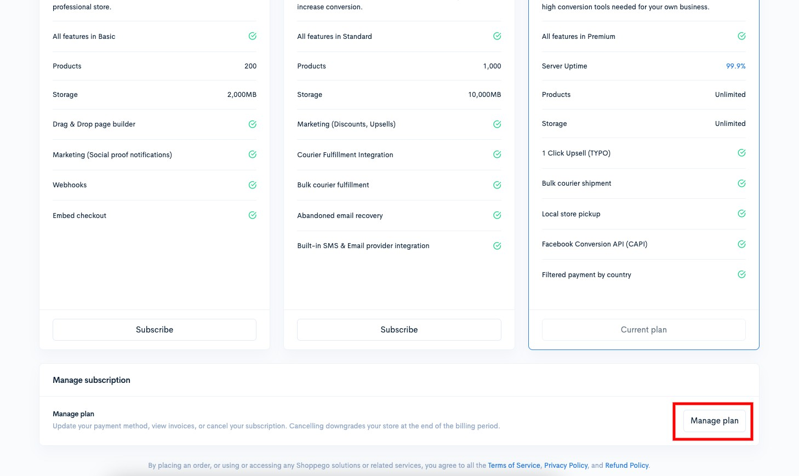
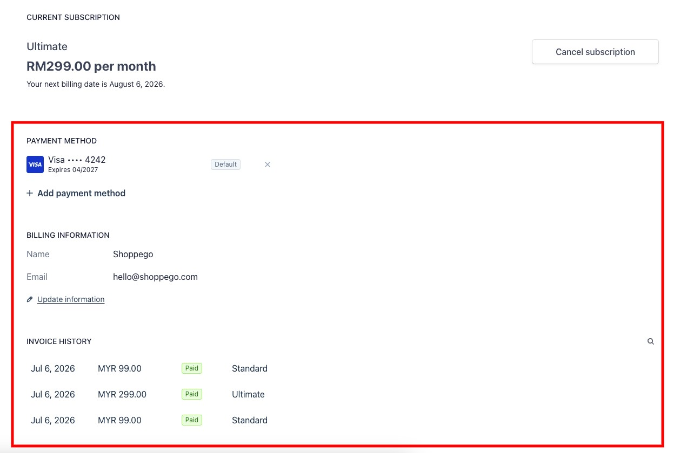
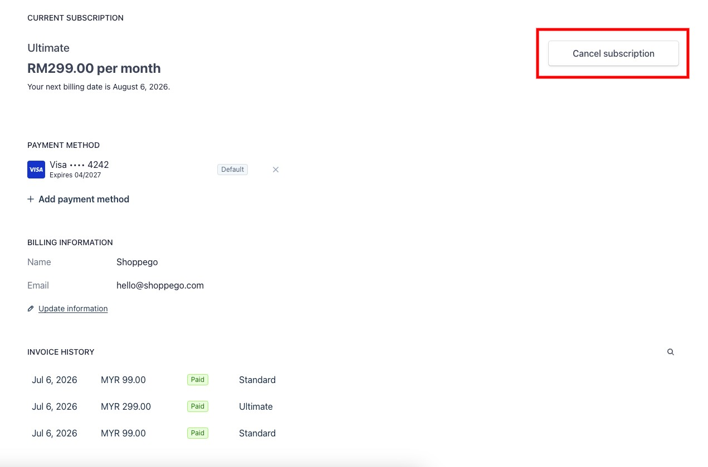
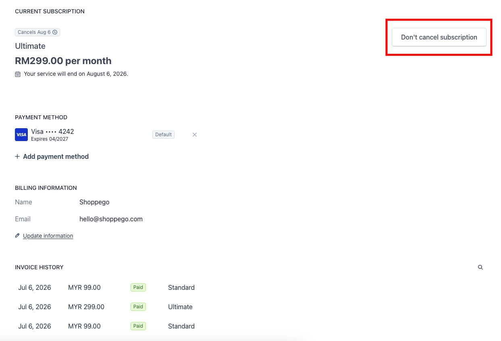

# Penetapan Pembayaran Langganan

Anda boleh menguruskan langganan harga kedai anda untuk menukar plan atau menutup kedai anda sepenuhnya. Plan harga anda menentukan ciri dan fungsi Shoppego yang tersedia untuk kedai anda, serta kos bulanan/tahunan anda.

Untuk lakukan penetapan langganan anda perlu pergi ke halaman pemilihan plan di dashboard Shoppego.

Pada halaman ini:

* [Akses halaman plan](billing-settings.md#akses-halaman-plan)
* [Pilih/Bertukar langganan](billing-settings.md#pilih-atau-bertukar-langganan)
* [Kemaskini maklumat pembayaran](billing-settings.md#kemaskini-maklumat-pembayaran)
* [Batalkan langganan](billing-settings.md#batalkan-langganan)

## Akses Halaman Plan

1\. Log masuk akaun Shoppego

2\. Klik pada **nama plan anda(Di ruangan atas)**

Nanti anda akan lihat maklumat langganan sedia ada serta pemilihan plan-plan yang lain.

Antara maklumat yang anda dapat lihat adalah seperti:

| Parameter              | Penerangan                                           |
| ---------------------- | ---------------------------------------------------- |
| **Plan name**          | Nama langganan plan sedia ada                        |
| **Billing cycle**      | Jenis langganan sedia ada iaitu tahunan atau bulanan |
| **Plan expiry date**   | Tarikh tamat tempoh langganan sedia ada              |
| **Storage space used** | Jumlah storage yang sudah digunakan                  |

<figure><figcaption></figcaption></figure>

## Pilih Atau Bertukar Langganan

Untuk anda langgan atau bertukan langganan, anda boleh terus klik pada mana-mana butang "**Subscribe"** pada plan yang anda inginkan.

Anda juga boleh lakukan pemilihan jenis langganan yang anda inginkan iaitu sama ada langganan bulanan atau tahunan dengan klik pada toggle "**Monthly/Yearly"**

<figure><figcaption></figcaption></figure>

## Kemaskini maklumat pembayaran

1. Untuk kemaskini maklumat pembayaran, anda perlu akses ke dashboard pengurusan Stripe dengan cara klik pada butang "**Manage plan"**(Berada di bawah halaman)

2. Seterusnya, anda boleh lihat penetapan yang anda boleh lakukan seperti **penambahan kad**, **perubahan pembayaran kad**, **perubahan maklumat billing** dan **semakan invoice**.

## Batalkan Langganan

1. Untuk lakukan pembatalan langganan, anda perlu akses ke dashboard pengurusan Stripe dengan cara klik pada butang "**Manage plan"**(Berada di bawah halaman)

2. Seterusnya, anda boleh klik pada butang "**Cancel subscription"**

**Setelah selesai, anda sudah tidak akan dikenakan sebarang penolakan untuk langganan seterusnya.**

Jika anda ingin batalkan penetapan pembatalan langganan itu, anda boleh klik pada butang **Don't cancel subscription** dan anda akan dikenakan penolakan seperti sedia kala.

<figure><figcaption></figcaption></figure>


**Maklumat tambahan**: Kesemua pembayaran yang dilakukan adalah dibawah penggunaan sistem Stripe. Pihak Shoppego tidak ada menyimpan sebarang maklumat pembayaran yang sensitif dan anda juga boleh menguruskan kesemua maklumat anda melalui halaman billing tersebut.

