# Affiliates

Di Shoppego, anda sudah boleh mempunyai akaun affiliate tersendiri untuk anda mempromosikan platform kami.

Untuk pendaftaran akaun affiliate, anda boleh menggunakan pautan dibawah:



Setelah pendaftaran dilakukan, anda akan dapat email berkenaan pendaftaran tersebut. Sekiranya, akaun anda sudah di sahkan, anda akan terima notifikasi melalui email untuk anda log masuk seperti biasa.


Bagi pengguna yang sudah mempunyai akaun Shoppego, anda boleh sahaja terus log masuk kedalam akaun Shoppego anda seperti biasa.


<figure>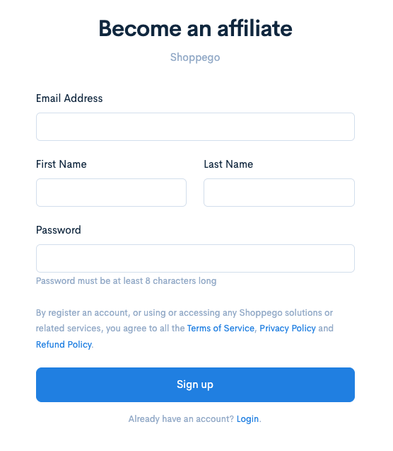<figcaption></figcaption></figure>

1. Seterusnya, anda boleh log masuk seperti biasa kedalam akaun affiliate anda menggunakan pautan ini <https://my.shoppego.com/login>

<figure>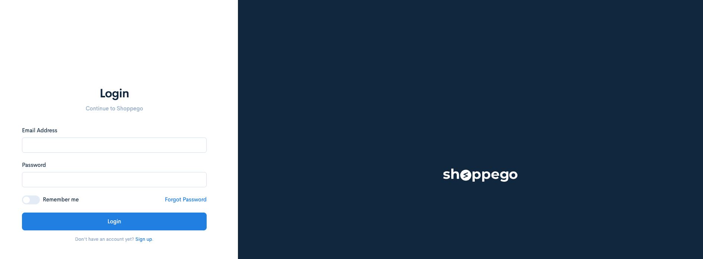<figcaption></figcaption></figure>

2. Untuk pendaftaran kali pertama, anda akan diminta masukkan maklumat bank akaun dan pautan affiliate anda terlebih dahulu untuk tujuan pembayaran komisen dan sebagainya nanti.

<figure>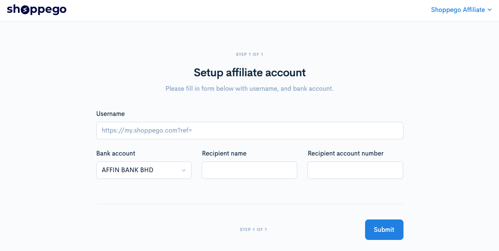<figcaption></figcaption></figure>

3. Setelah selesai, anda sudah boleh gunakan fungsi affiliate seperti biasa dengan cara klik pada menu **Affiliates**.

<figure>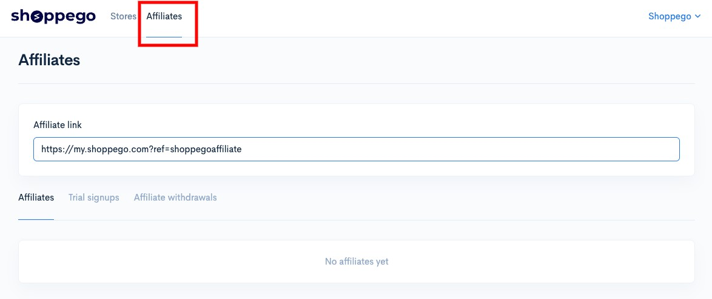<figcaption></figcaption></figure>

#### Affiliate link

Pautan ini anda boleh gunakan untuk anda kongsi di mana-mana platform. Sekiranya pautan itu diklik anda boleh lihat data itu di ruangan yang kami sudah sediakan.

<figure>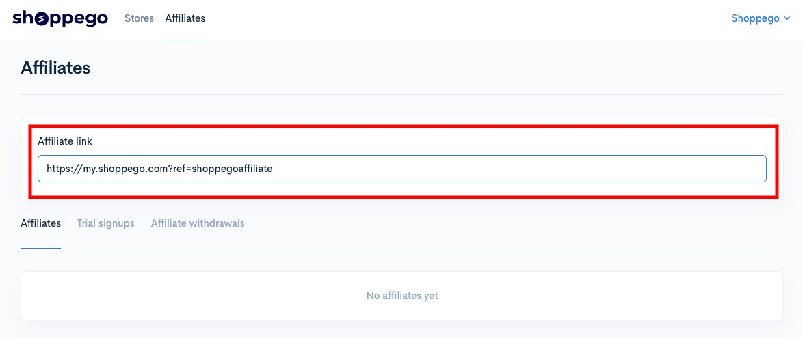<figcaption></figcaption></figure>

#### Affiliates

Ruangan ini akan paparkan kesemua data berkenaan pengguna yang ada klik atau melanggan plan Shoppego melalui link affiliate anda. Disini juga akan dipaparkan berkenaan jumlah komisen yang anda ada terima untuk mana-mana link yang ada lakukan pembayaran langganan plan.

<figure>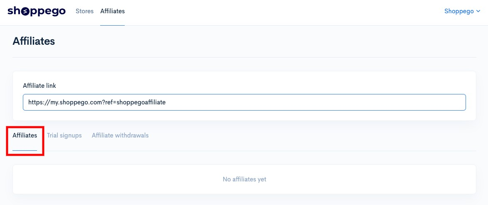<figcaption></figcaption></figure>

#### Trial signup

Ruangan ini akan paparkan kesemua data pengguna yang hanya lakukan pendaftaran akaun Shoppego sahaja tanpa melanggan pada mana-mana plan berbayar Shoppego.

<figure>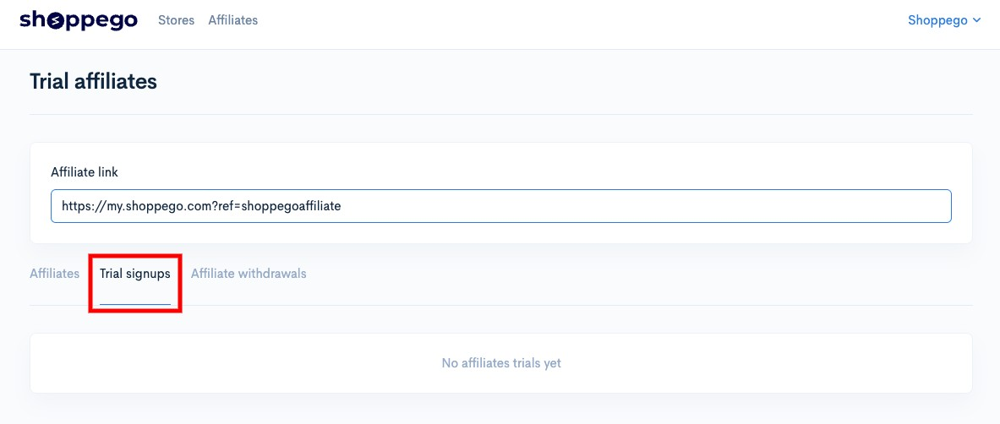<figcaption></figcaption></figure>

#### Affiliate withdrawals

Ruangan ini adalah untuk anda lakukan permohonan pengeluaran komisen yang anda ada terima melalui link affiliate anda. Disini juga akan paparkan status permohonan pengeluaran komisen anda.

<figure>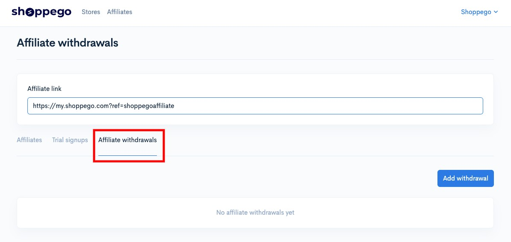<figcaption></figcaption></figure>

1. Untuk anda lakukan permohonan pengeluaran, anda boleh klik pada butang **Add withdrawal**

<figure>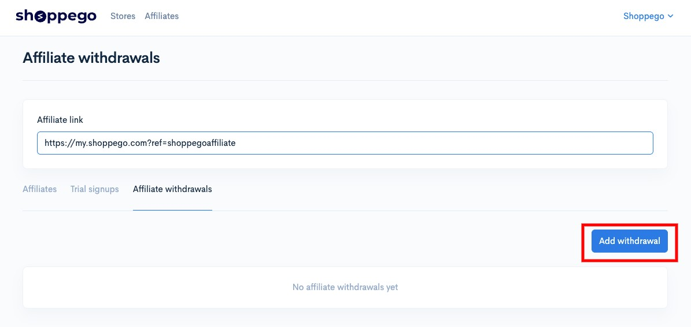<figcaption></figcaption></figure>

2. Kemudian, anda boleh semak kesemua jumlah bayaran yang anda akan terima itu dan klik **Submit**

<figure>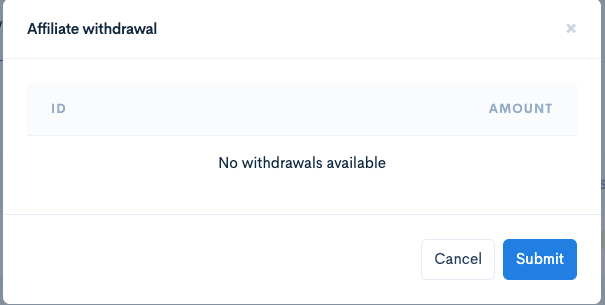<figcaption></figcaption></figure>

3. Setelah berjaya, anda akan dapat lihat status bayaran itu.

<figure>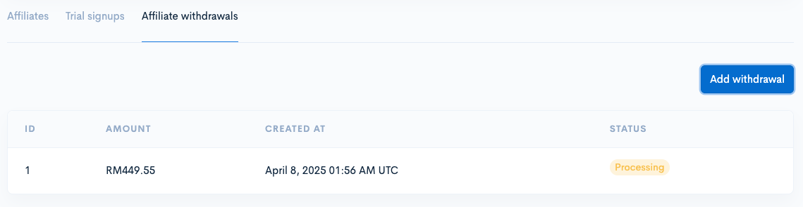<figcaption></figcaption></figure>
